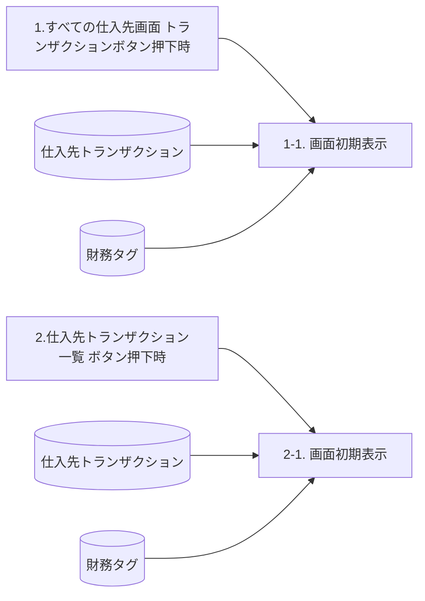

# FO-007 仕入先トランザクション画面 設計書

## 1. はじめに

### 1.1 文書情報・共通ヘッダー

| 項目 | 内容 |
| --- | --- |
| 機能ID | FO-007 |
| 機能名称 | 仕入先トランザクション画面 |
| システム | Dynamics365 for Finance and Operations |
| 機能分類 | 債権・債務 |
| プロジェクト | 会計システム刷新プロジェクト（LIBRA） |
| 宛先 | サンスター株式会社 御中 |
| 版数 | 第1.2版 |
| 文書日付・更新日 | 2024-10-18 |
| 作成日・作成者 | 2024-06-03／JBS井田 |
| 更新者 | JBS井田 |
| 作成会社 | 日本ビジネスシステムズ株式会社 |
| JBS承認日・承認者 | 2024-07-12／JBS加藤 |
| 基本設計部確認日・確認者 | 2024-07-18／サンスター藤田 |

ファイル名は「設計書」、処理概要等の共通ヘッダーは「基本設計書」、オブジェクト一覧・プログラムフロー図のヘッダーは「詳細設計書」。表記を統一せず保持する。[Q01](../../../../../../qa/doc/00_Source/02.Design/20.設計/11.画面Extension/FO-007_設計書_仕入先トランザクション画面.md#q01)。

### 1.2 共通の適用条件

**CR01 法人の範囲**：ログインしている法人の仕入先ごとのトランザクションを出力する。別法人の情報を確認する場合は、法人を切り替えて実行する。

**CR02 財務タグの適用**：システム管理 ＞ ワークスペース ＞ 機能管理で財務タグ機能が有効化されていることを前提とする。初期表示処理は有効化の有無を判定し、無効の場合は情報を取得せず終了する。有効の場合はアクティブな財務タグを動的に追加する。財務タグは一番右側に追加されるため、表示位置はパーソナライズで並び替える。

## 2. 処理概要

### 2.1 開発目的

1. 仕入先トランザクション画面にて、「FO-008_支払方法・支払サイト更新バッチ」で必要な項目を設ける。
2. 業務上必要な項目を網羅した全仕入先のトランザクション一覧画面を用意する。
3. 決済明細の提出で必要なデータをExcelで出力できるようにする。

Excel出力の詳細は[Q02](../../../../../../qa/doc/00_Source/02.Design/20.設計/11.画面Extension/FO-007_設計書_仕入先トランザクション画面.md#q02)。

### 2.2 前提条件

法人の範囲は[CR01](#cr01)、財務タグ機能の有効化は[CR02](#cr02)を適用する。

### 2.3 使用タイミング

随時。

### 2.4 開発内容

メニューパスに応じて仕入先個別画面と仕入先一覧画面を表示し、業務上必要な項目を既定で表示する。仕入先トランザクション（標準画面）に「名前」「支払基準日」「支払方法・支払サイト更新フラグ」「支払サイト」「財務タグ」を追加する。

### 2.5 制限事項

財務タグの追加位置と並び替えは[CR02](#cr02)に従う。

## 3. テーブル一覧

| No. | 種別 | 論理名 | 物理名 | I/O | 備考 |
| --- | --- | --- | --- | --- | --- |
| 1 | テーブル | 仕入先トランザクション | `VendTrans` | I/O | 標準 |
| 2 | テーブル | 財務タグ | `FinTag` | I | 標準 |

名前・主勘定等の参照先一覧の範囲は[Q03](../../../../../../qa/doc/00_Source/02.Design/20.設計/11.画面Extension/FO-007_設計書_仕入先トランザクション画面.md#q03)。

## 4. DFD

### 4.1 呼出元・初期表示・DB参照

原図は各初期表示処理に対して「仕入先トランザクション」「財務タグ」のDB群からの参照を示す。ここではDB群を2本の参照線に展開し、参照順序やSQLを新たに定義しない。財務タグ取得の条件は[CR02](#cr02)および次章に従う。

## 5. イベント説明

### 5.1 すべての仕入先画面のトランザクションボタン押下時

**1-1. 画面表示処理**

**1-1-1. 項目制御**：呼び出し元のメニューアイテムによって表示する項目を制御する。

| 呼び出し元 | 仕入先 | 名前 |
| --- | --- | --- |
| すべての仕入先画面 ＞ トランザクションボタン | 非表示 | 非表示 |
| 仕入先トランザクション一覧画面 | 表示 | 表示 |

**1-1-2. 財務タグの情報取得**

| 有効化の有無 | 処理 |
| --- | --- |
| ≠有効化 | 情報を取得せず処理を終了する。 |
| ＝有効化 | アクティブ化されている財務タグを仕入先トランザクション画面に動的に項目追加する。 |

[財務タグの補足](#sheet-39)を参照する。

### 5.2 仕入先トランザクション一覧ボタン押下時

**2-1. 画面表示処理**：1-1と同様の処理となる。

## 6. 画面項目説明(仕入先トランザクション画面)

### 6.1 ボディ・グリッドの項目

入力欄の〇は入力可、×は入力不可。必須欄の×は任意として表記する。空欄の初期値を指定したものではない。

| 項目名 | 種類 | 入力 | 必須 | 表示内容・制御 | 備考 |
| --- | --- | --- | --- | --- | --- |
| 仕入先 | テキスト | 不可 | 任意 | [仕入先トランザクション.仕入先] | ※仕入先個別画面の場合は、非表示 |
| 名前 | テキスト | 不可 | 任意 | [仕入先トランザクション.仕入先]の名前 | 追加 ※仕入先個別画面の場合は、非表示 Displayメソッドで実装 |
| 伝票 | テキスト | 不可 | 任意 | [仕入先トランザクション.伝票] |  |
| 文書 | テキスト | 不可 | 任意 | [仕入先トランザクション.文書] |  |
| 日付 | 日付 | 不可 | 任意 | [仕入先トランザクション.日付] |  |
| 文書日付 | 日付 | 不可 | 任意 | [仕入先トランザクション.文書日付] | 追加 |
| 集計科目 | テキスト | 不可 | 任意 | [仕入先トランザクション.主勘定(SummaryAccountId)] | 追加 |
| 金額 | 数値 | 不可 | 任意 | [仕入先トランザクション.金額] |  |
| 支払基準日 | 数値 | 可 | 任意 | [仕入先トランザクション.支払基準日] | 新規 支払予定の修正の際に更新を行う。 |
| 支払方法・支払サイト更新フラグ | チェックボックス | 不可 | 任意 | [仕入先トランザクション.支払方法・支払サイト更新フラグ] | 新規 |
| 支払サイト | 数値 | 不可 | 任意 | [仕入先トランザクション.支払サイト] | 新規 |
| 期日 | 日付 | 可 | 任意 | [仕入先トランザクション.期日] | 支払予定の修正の際に更新を行う。 |
| 支払方法 | テキスト | 不可 | 任意 | [仕入先トランザクション.支払方法] | 追加 |
| 請求書支払リリース日 | 日付 | 不可 | 任意 | [仕入先トランザクション.請求書支払リリース日] | 追加 |
| 説明 | テキスト | 不可 | 任意 | [仕入先トランザクション.説明] |  |
| 最終決済伝票 | テキスト | 不可 | 任意 | [仕入先トランザクション.最終決済伝票] | 追加 |
| RefVoucherNum | テキスト | 不可 | 任意 | [財務タグ.Tag02] | 財務タグ「RefVoucherNum」 参照伝票番号 動的に追加 |
| DataClass | テキスト | 不可 | 任意 | [財務タグ.Tag03] | 財務タグ「DataClass」 データ区分 動的に追加 |
| 請求書 | テキスト | 不可 | 任意 | 非表示にする | 変更 |
| トランザクション通貨の金額 | 数値 | 不可 | 任意 | 非表示にする | 変更 |
| トランザクション通貨での残高 | 数値 | 不可 | 任意 | 非表示にする | 変更 |
| 通貨 | テキスト | 不可 | 任意 | 非表示にする | 変更 |
| 残高 | 数値 | 不可 | 任意 | 非表示にする | 変更 |
| レポート通貨金額 | 数値 | 不可 | 任意 | 非表示にする | 変更 |
| レポート通貨での残高 | 数値 | 不可 | 任意 | 非表示にする | 変更 |
| 支払手形ID | テキスト | 不可 | 任意 | 非表示にする | 変更 |
| 順序番号 | 数値 | 不可 | 任意 | 非表示にする | 変更 |
| ステータス | コンボボックス | 不可 | 任意 | 非表示にする | 変更 |
| 送金番号 | テキスト | 不可 | 任意 | 非表示にする | 変更 |
| 登録済伝票 | テキスト | 不可 | 任意 | 非表示にする | 変更 |

**この版で入力可とされるのは、支払基準日と期日の2項目**であり、いずれも支払予定の修正の際に更新する。保存操作の条件は[Q07](../../../../../../qa/doc/00_Source/02.Design/20.設計/11.画面Extension/FO-007_設計書_仕入先トランザクション画面.md#q07)。支払基準日の「数値」と日付表示の対応は[Q04](../../../../../../qa/doc/00_Source/02.Design/20.設計/11.画面Extension/FO-007_設計書_仕入先トランザクション画面.md#q04)、財務タグの対応は[Q05](../../../../../../qa/doc/00_Source/02.Design/20.設計/11.画面Extension/FO-007_設計書_仕入先トランザクション画面.md#q05)、支払サイトの単位は[Q06](../../../../../../qa/doc/00_Source/02.Design/20.設計/11.画面Extension/FO-007_設計書_仕入先トランザクション画面.md#q06)。

「非表示にする」はアプリケーション項目の制御仕様であり、設計書自体の非表示セルとは区別する。上表にある12項目の非表示指定を保持する。

### 6.2 項目に付く注記

<!-- source-note C01 | target=tag-ref-field: 財務タグの登録順で項目名が変わる -->
> **C01**：財務タグの登録順で項目名が変わる

対象：RefVoucherNum／財務タグ.Tag02。

<!-- source-note C02 | target=tag-data-field: 財務タグの登録順で項目名が変わる -->
> **C02**：財務タグの登録順で項目名が変わる

対象：DataClass／財務タグ.Tag03。

## 7. 画面レイアウト(仕入先トランザクション画面)

### 7.1 起動情報

| 区分 | パス | フォーム名 | タブ名 |
| --- | --- | --- | --- |
| 仕入先一覧 | 買掛金管理 ＞ 照会およびレポート ＞ 仕入先トランザクション一覧 | `VendTrans` | リストタブ |
| 仕入先個別 | 買掛金管理 ＞ 仕入先 ＞ すべての仕入先 ＞ 仕入先 ＞ トランザクション ＞ トランザクション | `VendTrans` | リストタブ |

### 7.2 仕入先一覧画面（HTML）

静的な画面例。ボタンや入力部品の無効化はプレビュー用で、実画面の入力不可を追加するものではない。日付・金額・チェック・候補値は登録例であり、初期値や入力制約の指定ではない。

<section id="fo007-design-list" aria-label="仕入先一覧画面" style="border:1px solid #666;max-width:100%;box-sizing:border-box;background:#fff;overflow:hidden">

Finance and Operations　買掛金管理 ＞ 照会およびレポート ＞ 仕入先トランザクション一覧

<form aria-label="fo007-design-list 静的画面例" style="margin:0;padding:12px">

<button type="button" disabled>編集</button><button type="button" disabled>伝票</button><button type="button" disabled>決済を表示する</button><button type="button" disabled>決済</button><button type="button" disabled>小切手で支払済</button><button type="button" disabled>元の文書</button><button type="button" disabled>詳細を開く</button><button type="button" disabled>支払手形</button><button type="button" disabled>取消</button><button type="button" disabled>照会</button><button type="button" disabled>プロジェクト</button><button type="button" disabled>キャッシュフロー予測</button><button type="button" disabled>オプション</button>

<h3 style="font-size:16px;font-weight:normal">仕入先トランザクション</h3>
<h4 style="font-size:24px;margin:8px 0">標準ビュー</h4>

<label>表示 <select id="fo007-design-list-filter" disabled><option>すべて</option></select></label>
<label>日付 <input type="text" value="2024/07/12" disabled></label>
<label><input type="checkbox" disabled>通貨の再評価を非表示にする</label>

リスト一般支払支払手形決済送金履歴財務分析コード

<table id="fo007-design-list-grid" aria-describedby="fo007-design-list-notes" border="1" cellpadding="6" style="border-collapse:collapse;white-space:nowrap;width:100%;font-size:12px"><thead><tr><th scope="col">仕入先</th><th scope="col">名前</th><th scope="col">伝票</th><th scope="col">文書</th><th scope="col">日付</th><th scope="col">RefVoucherNum</th><th scope="col">DataClass</th><th scope="col">文書日付</th><th scope="col">集計勘定</th><th scope="col">金額</th><th scope="col">支払基準日</th><th scope="col">支払方法・支払サイト更新フラグ</th><th scope="col">支払サイト</th><th scope="col">期日</th><th scope="col">支払方法</th><th scope="col">請求書支払リリース日</th><th scope="col">説明</th><th scope="col">最終決済伝票</th></tr></thead><tbody>
<tr><td>1111111</td><td>仕入先A</td><td>APIN000083</td><td>35</td><td>2024/03/15</td><td>VouXXX1</td><td>A01</td><td>2024/03/15</td><td>2030101</td><td>55,000.00</td><td><input type="text" aria-label="1行目の支払基準日" value="2024/04/20" disabled data-spec-editable="true" data-spec-required="false" style="width:95px"></td><td><input type="checkbox" aria-label="1行目の更新フラグ" checked disabled></td><td>60</td><td><input type="text" aria-label="1行目の期日" value="2024/04/20" disabled data-spec-editable="true" data-spec-required="false" style="width:95px"></td><td>電子記録債務</td><td></td><td></td><td>VDRA000004</td></tr>
<tr><td>1111111</td><td>仕入先A</td><td>VDRA000004</td><td>01</td><td>2024/03/15</td><td></td><td></td><td></td><td>2030101</td><td>55,000.00</td><td><input type="text" aria-label="2行目の支払基準日" value="" disabled data-spec-editable="true" data-spec-required="false" style="width:95px"></td><td><input type="checkbox" aria-label="2行目の更新フラグ" disabled></td><td></td><td><input type="text" aria-label="2行目の期日" value="2024/06/20" disabled data-spec-editable="true" data-spec-required="false" style="width:95px"></td><td>電子記録債務</td><td></td><td></td><td>APIN000083</td></tr>
<tr><td>1111111</td><td>仕入先A</td><td>VDRA000004</td><td>01</td><td>2024/03/15</td><td></td><td></td><td></td><td>2030105</td><td>55,000.00</td><td><input type="text" aria-label="3行目の支払基準日" value="" disabled data-spec-editable="true" data-spec-required="false" style="width:95px"></td><td><input type="checkbox" aria-label="3行目の更新フラグ" disabled></td><td></td><td><input type="text" aria-label="3行目の期日" value="2024/06/20" disabled data-spec-editable="true" data-spec-required="false" style="width:95px"></td><td>電子記録債務</td><td></td><td></td><td>APIN000157</td></tr>
<tr><td>1111111</td><td>仕入先A</td><td>APPM000115</td><td>02</td><td>2024/03/20</td><td></td><td></td><td>2024/03/20</td><td>3040101</td><td>44,000.00</td><td><input type="text" aria-label="4行目の支払基準日" value="" disabled data-spec-editable="true" data-spec-required="false" style="width:95px"></td><td><input type="checkbox" aria-label="4行目の更新フラグ" disabled></td><td></td><td><input type="text" aria-label="4行目の期日" value="2024/03/20" disabled data-spec-editable="true" data-spec-required="false" style="width:95px"></td><td>銀行振込</td><td></td><td></td><td>APIN000005</td></tr>
<tr><td>2111111</td><td>仕入先B</td><td>APIN000094</td><td>35</td><td>2024/03/21</td><td>VouXXX2</td><td>A01</td><td>2024/03/21</td><td>2030101</td><td>9,800.00</td><td><input type="text" aria-label="5行目の支払基準日" value="2024/04/20" disabled data-spec-editable="true" data-spec-required="false" style="width:95px"></td><td><input type="checkbox" aria-label="5行目の更新フラグ" checked disabled></td><td>60</td><td><input type="text" aria-label="5行目の期日" value="2024/06/20" disabled data-spec-editable="true" data-spec-required="false" style="width:95px"></td><td>銀行振込</td><td></td><td>仕入先の未払金</td><td>APPM000229</td></tr>
<tr><td>2111111</td><td>仕入先B</td><td>APIN000161</td><td>35</td><td>2024/03/21</td><td>VouXXX3</td><td>A01</td><td>2024/07/02</td><td>2030101</td><td>200,000.00</td><td><input type="text" aria-label="6行目の支払基準日" value="2024/04/20" disabled data-spec-editable="true" data-spec-required="false" style="width:95px"></td><td><input type="checkbox" aria-label="6行目の更新フラグ" checked disabled></td><td>60</td><td><input type="text" aria-label="6行目の期日" value="2024/06/20" disabled data-spec-editable="true" data-spec-required="false" style="width:95px"></td><td>銀行振込</td><td></td><td>ファイナンスリース支...</td><td></td></tr>
<tr><td>2111111</td><td>仕入先B</td><td>APIN000110</td><td>35</td><td>2024/04/08</td><td>VouXXX4</td><td>A01</td><td>2024/04/08</td><td>2030101</td><td>15,100.00</td><td><input type="text" aria-label="7行目の支払基準日" value="2024/04/20" disabled data-spec-editable="true" data-spec-required="false" style="width:95px"></td><td><input type="checkbox" aria-label="7行目の更新フラグ" checked disabled></td><td>60</td><td><input type="text" aria-label="7行目の期日" value="2024/06/20" disabled data-spec-editable="true" data-spec-required="false" style="width:95px"></td><td>海外送金（USD...</td><td></td><td></td><td></td></tr>
</tbody></table>

</form>
</section>

### 7.3 一覧画面の枠外注記

画面上で判読できる7行・18列の例を保持する。省略された説明・名称の続きを補完せず、空欄は原図の空欄として扱う。原図の列名「集計勘定」と、項目説明の「集計科目」は原表記のまま保持する。

<!-- source-note C03 | target=fo007-design-list-grid: 追加項目 -->
> **C03**：追加項目

対象：支払基準日、支払方法・支払サイト更新フラグ、支払サイト。

<!-- source-note C04 | target=fo007-design-list-grid: 財務タグは一番右側にに追加されてしまうため、パーソナライズで並び替え -->
> **C04**：財務タグは一番右側にに追加されてしまうため、パーソナライズで並び替え

対象：RefVoucherNum、DataClass。原文の重複した「に」を保持。

### 7.4 仕入先個別画面（HTML）

<section id="fo007-design-individual" aria-label="仕入先個別画面" style="border:1px solid #666;max-width:100%;box-sizing:border-box;background:#fff;overflow:hidden">

Finance and Operations　買掛金管理 ＞ 仕入先 ＞ すべての仕入先

<form aria-label="fo007-design-individual 静的画面例" style="margin:0;padding:12px">

<button type="button" disabled>編集</button><button type="button" disabled>伝票</button><button type="button" disabled>決済を表示する</button><button type="button" disabled>決済</button><button type="button" disabled>小切手で支払済</button><button type="button" disabled>元の文書</button><button type="button" disabled>詳細を開く</button><button type="button" disabled>支払手形</button><button type="button" disabled>取消</button><button type="button" disabled>照会</button><button type="button" disabled>プロジェクト</button><button type="button" disabled>キャッシュフロー予測</button><button type="button" disabled>オプション</button>

<h3 style="font-size:16px;font-weight:normal">仕入先トランザクション ｜ 11000256：ケアーズ</h3>
<h4 style="font-size:24px;margin:8px 0">標準ビュー</h4>

<label>表示 <select id="fo007-design-individual-filter" disabled><option>すべて</option></select></label>
<label>日付 <input type="text" value="2024/07/12" disabled></label>
<label><input type="checkbox" disabled>通貨の再評価を非表示にする</label>

リスト一般支払支払手形決済送金履歴財務分析コード

<table id="fo007-design-individual-grid" aria-describedby="fo007-design-individual-notes" border="1" cellpadding="6" style="border-collapse:collapse;white-space:nowrap;width:100%;font-size:12px"><thead><tr><th scope="col">伝票</th><th scope="col">文書</th><th scope="col">日付</th><th scope="col">RefVoucherNum</th><th scope="col">DataClass</th><th scope="col">文書日付</th><th scope="col">集計勘定</th><th scope="col">金額</th><th scope="col">支払基準日</th><th scope="col">支払方法・支払サイト更新フラグ</th><th scope="col">支払サイト</th><th scope="col">期日</th><th scope="col">支払方法</th><th scope="col">請求書支払リリース日</th><th scope="col">説明</th><th scope="col">最終決済伝票</th></tr></thead><tbody>
<tr><td>APIN000083</td><td>35</td><td>2024/03/15</td><td>VouXXX1</td><td>A01</td><td>2024/03/15</td><td>2030101</td><td>55,000.00</td><td><input type="text" aria-label="1行目の支払基準日" value="2024/04/20" disabled data-spec-editable="true" data-spec-required="false" style="width:95px"></td><td><input type="checkbox" aria-label="1行目の更新フラグ" checked disabled></td><td>60</td><td><input type="text" aria-label="1行目の期日" value="2024/04/20" disabled data-spec-editable="true" data-spec-required="false" style="width:95px"></td><td>電子記録債務</td><td></td><td></td><td>VDRA000004</td></tr>
<tr><td>VDRA000004</td><td>01</td><td>2024/03/15</td><td></td><td></td><td></td><td>2030101</td><td>55,000.00</td><td><input type="text" aria-label="2行目の支払基準日" value="" disabled data-spec-editable="true" data-spec-required="false" style="width:95px"></td><td><input type="checkbox" aria-label="2行目の更新フラグ" disabled></td><td></td><td><input type="text" aria-label="2行目の期日" value="2024/06/20" disabled data-spec-editable="true" data-spec-required="false" style="width:95px"></td><td>電子記録債務</td><td></td><td></td><td>APIN000083</td></tr>
<tr><td>VDRA000004</td><td>01</td><td>2024/03/15</td><td></td><td></td><td></td><td>2030105</td><td>55,000.00</td><td><input type="text" aria-label="3行目の支払基準日" value="" disabled data-spec-editable="true" data-spec-required="false" style="width:95px"></td><td><input type="checkbox" aria-label="3行目の更新フラグ" disabled></td><td></td><td><input type="text" aria-label="3行目の期日" value="2024/06/20" disabled data-spec-editable="true" data-spec-required="false" style="width:95px"></td><td>電子記録債務</td><td></td><td></td><td>APIN000157</td></tr>
<tr><td>APPM000115</td><td>02</td><td>2024/03/20</td><td></td><td></td><td>2024/03/20</td><td>3040101</td><td>44,000.00</td><td><input type="text" aria-label="4行目の支払基準日" value="" disabled data-spec-editable="true" data-spec-required="false" style="width:95px"></td><td><input type="checkbox" aria-label="4行目の更新フラグ" disabled></td><td></td><td><input type="text" aria-label="4行目の期日" value="2024/03/20" disabled data-spec-editable="true" data-spec-required="false" style="width:95px"></td><td>銀行振込</td><td></td><td></td><td>APIN000005</td></tr>
</tbody></table>

</form>
</section>

### 7.5 個別画面の枠外注記

個別画面では仕入先・名前を非表示にする。原図で見えている4行・16列の例を表す。画像上の11000256：ケアーズ等は例示であり、固定の対象仕入先ではない。

<!-- source-note C05 | target=fo007-design-individual-grid: 追加項目 -->
> **C05**：追加項目

対象：支払基準日、支払方法・支払サイト更新フラグ、支払サイト。

<!-- source-note C06 | target=fo007-design-individual-grid: 財務タグは一番右側にに追加されてしまうため、パーソナライズで並び替え -->
> **C06**：財務タグは一番右側にに追加されてしまうため、パーソナライズで並び替え

対象：RefVoucherNum、DataClass。

<!-- source-note N01 | target=fo007-design-individual-grid: 仕入先、名前は非表示。 -->
> **N01**：仕入先、名前は非表示。

## 8. 補足説明(メニューパス)

### 8.1 仕入先トランザクション一覧への導線（HTML）

<section id="fo007-design-menu-list" aria-label="一覧メニューパス" style="border:1px solid #666;padding:12px;box-sizing:border-box;max-width:100%">

Finance and Operations　買掛金管理

<nav aria-label="起動メニュー"><strong>照会およびレポート</strong>
<button type="button" disabled>仕入先トランザクション一覧</button>
</nav>

<strong>仕入先トランザクション／標準ビュー</strong>
仕入先・名前を含む一覧画面
<a href="#fo007-design-list">画面例へ</a>

</section>

<!-- source-note N02 | target=fo007-design-menu-list: 「仕入先トランザクション一覧」ボタン押下時 -->
> **N02**：「仕入先トランザクション一覧」ボタン押下時

### 8.2 すべての仕入先から個別トランザクションへの導線（HTML）

<section id="fo007-design-menu-individual" aria-label="個別メニューパス" style="border:1px solid #666;padding:12px;box-sizing:border-box;max-width:100%">

買掛金管理 ＞ 仕入先 ＞ すべての仕入先

<strong>仕入先</strong>　トランザクション　<button type="button" disabled>トランザクション</button>

<table border="1" cellpadding="6" style="border-collapse:collapse"><caption>すべての仕入先：原資料の選択例</caption><thead><tr><th>仕入先</th><th>名前</th><th>仕入先保留</th></tr></thead><tbody><tr><td>11000256</td><td>ケアーズ</td><td>いいえ</td></tr></tbody></table>

<a href="#fo007-design-individual">仕入先個別画面へ</a>

</section>

<!-- source-note N03 | target=fo007-design-menu-individual: すべての仕入先画面＞「トランザクション」ボタン押下時 -->
> **N03**：すべての仕入先画面＞「トランザクション」ボタン押下時

<!-- source-note N04 | target=fo007-design-menu-individual: 仕入先、名前を非表示にして出力 -->
> **N04**：仕入先、名前を非表示にして出力

## 9. 補足説明 (財務タグ)

### 9.1 財務タグ画面（HTML）

<section id="fo007-design-tags" aria-label="財務タグ画面" style="border:1px solid #666;max-width:760px;box-sizing:border-box;overflow:hidden;background:white">

一般会計 ＞ 勘定科目表 ＞ 財務タグ ＞ 財務タグ

<form aria-label="財務タグの静的設定例" style="padding:12px;margin:0">

<button type="button" disabled>編集</button><button type="button" disabled>新規</button><button type="button" disabled>タグ値</button><button type="button" disabled>タグのアクティブ化または非アクティブ化</button><button type="button" disabled>オプション</button>

<h3>財務タグ</h3><h4>標準ビュー</h4>
<label>フィルター <input type="search" disabled></label>

<table id="fo007-design-tags-grid" aria-describedby="fo007-design-tags-note" border="1" cellpadding="6" style="border-collapse:collapse;width:100%"><thead><tr><th>財務タグ</th><th>値タイプ</th><th>アクティブ</th><th>使用する値のソース</th></tr></thead><tbody>
<tr><td>Item</td><td>テキスト</td><td><input type="checkbox" checked disabled aria-label="Itemはアクティブ"></td><td></td></tr>
<tr><td>DataClass</td><td>カスタム リスト</td><td><input type="checkbox" checked disabled aria-label="DataClassはアクティブ"></td><td></td></tr>
<tr><td>RefVoucherNum</td><td>テキスト</td><td><input type="checkbox" checked disabled aria-label="RefVoucherNumはアクティブ"></td><td></td></tr>
</tbody></table>

</form>
</section>

### 9.2 枠外注記

上表は原資料の3行の設定例であり、全タグの固定リストや登録上限の定義ではない。

<!-- source-note C07 | target=fo007-design-tags-grid: 「チェック」が付いている＝有効化のものを動的に表示させる。 -->
> **C07**：「チェック」が付いている＝有効化のものを動的に表示させる。

登録順とTag02／Tag03の対応は[Q05](../../../../../../qa/doc/00_Source/02.Design/20.設計/11.画面Extension/FO-007_設計書_仕入先トランザクション画面.md#q05)。機能の有効化と各タグのアクティブ状態は区別し、[CR02](#cr02)を適用する。

## 10. レビュー指摘事項

原資料の指摘・回答・確認記録は[QAのレビュー記録](../../../../../../qa/doc/00_Source/02.Design/20.設計/11.画面Extension/FO-007_設計書_仕入先トランザクション画面.md#review-records)にまとめる。確認済み記録に再回答は求めない。

Req325への対応は、処理概要の開発目的3（決済明細のExcel出力）に反映済みと記録されている。具体的な出力契約は[Q02](../../../../../../qa/doc/00_Source/02.Design/20.設計/11.画面Extension/FO-007_設計書_仕入先トランザクション画面.md#q02)。

## 11. オブジェクト一覧

<!-- source-note C08 | target=objects-placeholder: 詳細設計・開発時に記載 -->
> **C08**：詳細設計・開発時に記載

この版では具体的なオブジェクト名・属性が記入されていない。別版のオブジェクトを追加しない。

## 12. プログラムフロー図

<!-- source-note C09 | target=program-placeholder: 詳細設計・開発時に記載 -->
> **C09**：詳細設計・開発時に記載

この版には具体的なプログラムフローが記入されていない。DFDとは区別し、別版のフローや結合式を持ち込まない。
