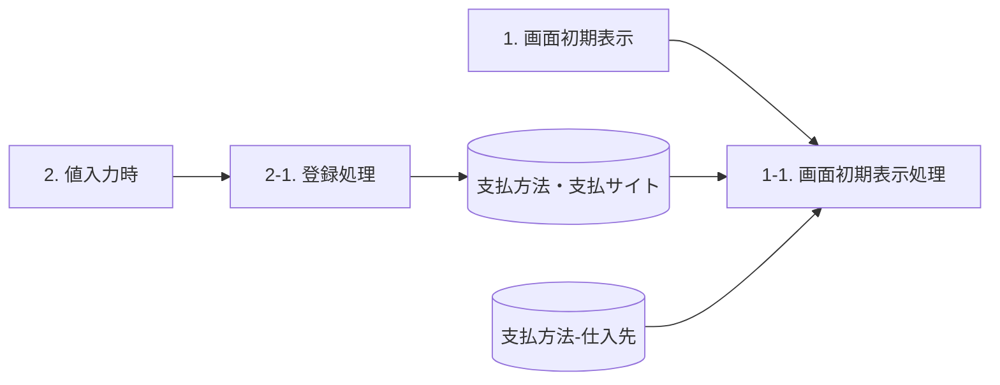
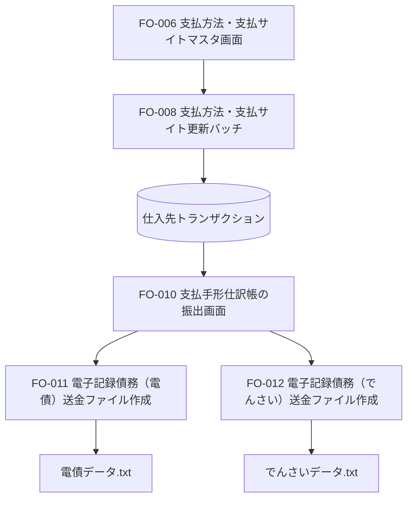

# FO-006 支払方法・支払サイトマスタ画面 詳細設計書

## 1. はじめに

### 1.1 文書・機能情報

| 項目 | 内容 |
|---|---|
| 宛先 | サンスター株式会社 御中 |
| プロジェクト | 会計システム刷新プロジェクト（LIBRA） |
| 文書名 | FO-006_詳細設計書_支払方法・支払サイトマスタ画面 |
| 版数 | 第1.2版 |
| 文書日付 | 2025-03-14 |
| 作成会社 | 日本ビジネスシステムズ株式会社 |
| システム名 | Dynamics365 for Finance and Operations |
| 機能分類 | 債権・債務 |
| 機能ID | FO-006 |
| 機能名称 | 支払方法・支払サイトマスタ画面 |

### 1.2 作成・更新・承認情報

| 区分 | 日付 | 担当 |
|---|---|---|
| 作成 | 2024-06-05 | JBS井田 |
| 更新 | 2025-03-14 | JBS北井 |
| JBS承認 | 2024-07-12 | JBS加藤 |
| 基本設計部確認 | 2024-08-19 | サンスター藤田 |

文書種別の表記差は[Q01](../qa/FO-006_詳細設計書_支払方法・支払サイトマスタ画面.md#q01)を参照。第2～11章の共通ヘッダーは「基本設計書」、表紙と第12～13章は「詳細設計書」。表紙には入力案内「＜機能ID>_＜画面名＞画面を入力」も残っている。

### 1.3 共通事項

#### CR01 同一支払方法・請求金額の重複禁止

同一の支払方法に同一の請求金額を重複登録できない。適用箇所は[処理概要](#sheet-5)、[画面項目説明の請求金額](#sheet-11)、[補足説明](#sheet-36)。補足の複合一意インデックスは支払方法と請求金額の組み合わせを対象とする。

#### CR02 請求金額・支払サイトの負数入力禁止

画面項目説明では両項目のマイナス入力を不可とし、テーブルのプロパティ設定で対応する。[処理概要](#sheet-5)の「正の数字のみ」と0を含む例示の差は[Q02](../qa/FO-006_詳細設計書_支払方法・支払サイトマスタ画面.md#q02)に保持する。0を許可／禁止する追加決定は行わない。

## 2. 処理概要

### 2.1 開発目的・使用タイミング

「FO-008_支払方法・支払サイト更新バッチ」の実行に必要なマスタを管理する。使用タイミングは随時。

### 2.2 前提条件

1. 原文：「請求金額、支払サイトは正の数字のみ登録可能とする。」負数入力の制約は[CR02](#common-rule-02)、0の扱いは[Q02](../qa/FO-006_詳細設計書_支払方法・支払サイトマスタ画面.md#q02)を参照。
2. 同一の支払方法で登録する請求金額は重複不可。[CR01](#common-rule-01)、[補足説明](#sheet-36)を参照。

### 2.3 開発内容・制限事項

支払方法・支払サイトのマスタ管理画面を新規作成し、支払方法、請求金額、支払方法(更新後)、支払サイト、支払条件の5項目を追加する。制限事項欄の記載は「なし」。

## 3. テーブル一覧

| No. | 種別 | 論理名 | 物理名 | I/O |
|---|---|---|---|---|
| 1 | テーブル | 支払方法・支払サイト | `SJ_PaymModePaymSiteTable` | I/O |
| 2 | テーブル | 支払方法 - 仕入先 | `VendPaymModeTable` | I |

## 4. DFD

初期表示では「支払方法・支払サイト」と「支払方法-仕入先」のDB群から画面初期表示処理へデータが渡る。値入力時の登録先は「支払方法・支払サイト」。

## 5. イベント説明

| No. | イベント名 | 処理 | 内容 |
|---|---|---|---|
| 1 | 画面初期表示 | 1-1. 画面初期処理 | 「画面レイアウト」シート通りに表示する。DFDは「画面初期表示処理」と表記。 |
| 2 | 値入力時 | 2-1. 登録処理 | 入力された値を支払方法・支払サイトに登録する。詳細は[テーブル出力仕様](#sheet-19)を参照。 |

保存ボタンと登録タイミングの対応は[Q06](../qa/FO-006_詳細設計書_支払方法・支払サイトマスタ画面.md#q06)。イベント表の種別・メッセージ・ID欄は記載なし。エラーコードやメッセージを補完しない。

## 6. 画面レイアウト

### 6.1 起動情報

| 項目 | 内容 |
|---|---|
| パス | 買掛金管理＞支払の設定＞支払方法・支払サイト |
| フォーム名 | `SJ_PaymModePaymSiteForm` |
| タブ名 | `-` |

Formsオブジェクト名との表記差は[Q04](../qa/FO-006_詳細設計書_支払方法・支払サイトマスタ画面.md#q04)。

### 6.2 画面レイアウト

静的な仕様モックアップ。保存・新規・削除・検索は実行しない。モックアップのdisabled属性は実画面の入力不可要件を意味しない。例示値を初期値や全候補リストとして扱わない。

<section id="fo006-screen-frame" aria-labelledby="fo006-screen-title" style="border:1px solid #777;max-width:1100px;box-sizing:border-box;background:#fff;overflow:hidden">
  
買掛金管理 ＞ 支払の設定 ＞ 支払方法・支払サイト

  <form aria-label="支払方法・支払サイトマスタの静的画面例" style="margin:0;padding:14px">
    

      <button type="button" id="fo006-save" disabled style="color:#2b579a;background:#fff;border:0;padding:4px">保存</button>
      <button type="button" id="fo006-new" disabled style="color:#2b579a;background:#fff;border:0;padding:4px">新規</button>
      <button type="button" id="fo006-delete" disabled style="color:#2b579a;background:#fff;border:0;padding:4px">削除</button>
    

    <h3 id="fo006-screen-title" style="margin:12px 0;font-size:20px;font-weight:normal">支払方法・支払サイト</h3>
    
<strong>標準ビュー</strong>

    
<label for="fo006-filter">クィックフィルター</label>
      <input id="fo006-filter" type="search" placeholder="フィルター" disabled>

    

      <table id="fo006-grid" aria-describedby="fo006-example-note fo006-business-day-note" border="1" cellpadding="5" style="border:1px solid #bbb;border-collapse:collapse;width:100%;text-align:left">
        <thead style="background:#f6f6f6"><tr><th scope="col">支払方法</th><th scope="col">請求金額</th><th scope="col">支払方法(更新後)</th><th scope="col">支払サイト</th><th scope="col">支払条件</th></tr></thead>
        <tbody>
          <tr><td><select aria-label="1行目の支払方法" disabled required><option>TU</option></select></td><td><input aria-label="1行目の請求金額" type="text" inputmode="decimal" value="0.00" size="12" disabled></td><td><select aria-label="1行目の支払方法(更新後)" disabled required><option>T</option></select></td><td><input aria-label="1行目の支払サイト" type="text" inputmode="numeric" value="0" size="5" disabled></td><td><select aria-label="1行目の支払条件" disabled required><option>PTxxx</option></select></td></tr>
          <tr><td>TU</td><td>500,000.00</td><td>W</td><td>95</td><td>PTxxx</td></tr>
          <tr><td>TQ</td><td>0.00</td><td>T</td><td>0</td><td>PTxxx</td></tr>
          <tr><td>TQ</td><td>500,000.00</td><td>W</td><td>60</td><td>PTxxx</td></tr>
          <tr><td>TP</td><td>0.00</td><td>T</td><td>0</td><td>PTxxx</td></tr>
          <tr><td>TP</td><td>500,000.00</td><td>W</td><td>40</td><td>PTxxx</td></tr>
          <tr><td>9T</td><td>0.00</td><td>T</td><td>0</td><td>PTxxx</td></tr>
          <tr><td>9T</td><td>500,000.00</td><td>9-1</td><td>95</td><td>PTxxx</td></tr>
          <tr><td>8T</td><td>0.00</td><td>T</td><td>0</td><td>PTxxx</td></tr>
          <tr><td>8T</td><td>500,000.00</td><td>8-1</td><td>60</td><td>PTxxx</td></tr>
          <tr id="fo006-business-day-group-start"><td>2-1</td><td>0.00</td><td>2-1</td><td>0</td><td>PTxxx</td></tr>
          <tr><td>3-1</td><td>0.00</td><td>3-1</td><td>0</td><td>PTxxx</td></tr>
          <tr><td>3-2</td><td>0.00</td><td>3-2</td><td>0</td><td>PTxxx</td></tr>
          <tr><td>3-3</td><td>0.00</td><td>3-3</td><td>0</td><td>PTxxx</td></tr>
          <tr><td>3-4</td><td>0.00</td><td>3-4</td><td>0</td><td>PTxxx</td></tr>
        </tbody>
      </table>
    

  </form>
</section>

### 6.3 枠外の吹き出し・注記

SSJの登録イメージ。15行は例示である。

2-1、3-1、3-2、3-3、3-4の行：支払日の非営業日の考慮をFO-008で行うため、登録対象。

<!-- callout C-UI01 | target=fo006-grid: SSJの登録イメージ -->
> **C-UI01（一覧全体）**：SSJの登録イメージ。

<!-- callout C-UI02 | target=fo006-business-day-group-start
支払日の非営業日の考慮を
FO-008で行うため、登録対象
-->
> **C-UI02（2-1、3-1、3-2、3-3、3-4の登録例）**：支払日の非営業日の考慮をFO-008で行うため、登録対象。

## 7. 画面項目説明

### 7.1 画面操作

| 区分 | 項目 | 種類 | 入力／必須 | 内容 |
|---|---|---|---|---|
| タイトル | 支払方法・支払サイト | タイトル | ×／× | Caption：支払方法・支払サイト |
| アクションペイン | 保存 | ボタン | ×／× | 保存 |
| アクションペイン | 新規 | ボタン | ×／× | レコードの新規追加 |
| アクションペイン | 削除 | ボタン | ×／× | レコードの削除 |
| カスタムフィルターグループ | クィックフィルター | フィルター | ○／× | 入力可、必須ではない |

### 7.2 ボディの項目

| 項目 | 種類 | 入力 | 必須 | 表示・入力先 | 制約 |
|---|---|---|---|---|---|
| 支払方法 | ListBox | 可 | 必須 | 支払方法・支払サイト.支払方法 | 下記ルックアップ |
| 請求金額 | 数値 | 可 | 任意 | 支払方法・支払サイト.請求金額 | [CR01](#common-rule-01)、[CR02](#common-rule-02)。テーブルプロパティで対応 |
| 支払方法(更新後) | ListBox | 可 | 必須 | 支払方法・支払サイト.支払方法(更新後) | 下記ルックアップ |
| 支払サイト | 数値 | 可 | 任意 | 支払方法・支払サイト.支払サイト | [CR02](#common-rule-02)。テーブルプロパティで対応 |
| 支払条件 | ListBox | 可 | 必須 | 支払方法・支払サイト.支払条件 | 下記ルックアップ |

任意指定は初期値0・空文字の指定ではない。0の扱いは[Q02](../qa/FO-006_詳細設計書_支払方法・支払サイトマスタ画面.md#q02)、支払サイトの単位は[Q07](../qa/FO-006_詳細設計書_支払方法・支払サイトマスタ画面.md#q07)、最大桁数・小数精度は[Q08](../qa/FO-006_詳細設計書_支払方法・支払サイトマスタ画面.md#q08)。

### 7.3 ルックアップ

| 対象 | 参照テーブル（原文） | 表示項目（原文） |
|---|---|---|
| 支払方法 | 支払方法 - 仕入先 | 支払方法、説明(Name) |
| 支払方法(更新後) | 支払方法 - 仕入先 | 支払方法、説明(Name) |
| 支払条件 | 支払条件 - 支払条件 | 支払条件.支払条件、支払条件.説明 |

支払条件の物理参照先とテーブル一覧・DFDとの対応は[Q05](../qa/FO-006_詳細設計書_支払方法・支払サイトマスタ画面.md#q05)。

## 8. テーブル出力仕様

テーブル名：`SJ_PaymModePaymSiteTable`。ラベル：支払方法・支払サイト。拡張名：`-`。

| No. | 論理名 | 物理名（原文） | 設定内容 |
|---|---|---|---|
| 1 | 支払方法 | `PayｍMode` | 入力された[支払方法・支払サイト更新.支払方法]を設定 |
| 2 | 請求金額 | `BillingAmount` | 入力された[支払方法・支払サイト更新.請求金額]を設定 |
| 3 | 支払方法(更新後) | `UpdatedPaymMode` | 入力された[支払方法・支払サイト更新.支払方法(更新後)]を設定 |
| 4 | 支払サイト | `PaymSite` | 入力された[支払方法・支払サイト更新.支払サイト]を設定 |
| 5 | 支払条件 | `PaymTermId` | 入力された[支払方法・支払サイト更新.支払条件]を設定 |

`PayｍMode`のｍは全角。インデックス画像の半角m表記との対応は[Q03](../qa/FO-006_詳細設計書_支払方法・支払サイトマスタ画面.md#q03)。

## 9. 補足説明

### 9.1 同一支払方法と請求金額のチェック

[CR01](#common-rule-01)の根拠として、貼り付けられたテーブル定義画像に次のインデックスが記載されている。外部のテーブル定義書そのものは本テストでは読んでいない。

| インデックス名 | 重複許可 | フィールド |
|---|---|---|
| `SJ_PaymModePaymSiteTableIdx` | No | `PaymMode,BillingAmount` |

参照資料名：`【テーブル定義書】SJ_PaymModePaymSiteTable.xlsx`。

### 9.2 登録例

| 支払方法 | 請求金額 | 支払方法(変更後) | 支払サイト | 支払条件 |
|---|---:|---|---:|---|
| TU | 0 | T | 0 | PTXX |
| TU | 500000 | W | 95 | PTXX |
| TU | 500000 | 原資料は空欄 | 60 | PTXX |
| TQ | 0 | T | 0 | PTXX |
| TQ | 500000 | W | 60 | PTXX |
| 2-1 | 0 | 2-1 | 0 | PTXX |

TU・500000の2行は支払サイトが95と60でも同一キーとなり、重複登録できない。空欄を空文字や入力任意の要件に変換しない。0の扱いは[Q02](../qa/FO-006_詳細設計書_支払方法・支払サイトマスタ画面.md#q02)。

<!-- callout C-DUP01 | target=sheet-36-duplicates
同一の支払方法に
請求金額を重複して登録できません。※詳細はテーブル定義書に記載
-->
> **C-DUP01（重複するTU・500000の例）**：同一の支払方法に請求金額を重複して登録できません。※詳細はテーブル定義書に記載

## 10. 補足説明(機能関連図)

### 10.1 機能関連図

本機能枠はFO-006と「支払方法・支払サイト」マスタを示す。ファイルへの接続はファイル作成機能と成果物の対応であり、処理の追加トリガーを指定するものではない。

### 10.2 注記と対象機能

<!-- source-note N-FO008 | target=FO008: 支払方法、期日サイトを更新する。 -->
> **N-FO008**：支払方法、期日サイトを更新する。

<!-- source-note N-FO010 | target=FO010: 支払方法が更新されたものを対象に支払提案を行う。 -->
> **N-FO010**：支払方法が更新されたものを対象に支払提案を行う。

<!-- source-note N-FO011 | target=FO011: 支払方法が「電債」のデータを対象にファイルを作成。 -->
> **N-FO011**：支払方法が「電債」のデータを対象にファイルを作成。

<!-- source-note N-FO012 | target=FO012: 支払方法が「でんさい」のデータを対象にファイルを作成。 -->
> **N-FO012**：支払方法が「でんさい」のデータを対象にファイルを作成。

## 11. レビュー指摘事項

3件の指摘・対応・確認記録は[QAのレビュー記録](../qa/FO-006_詳細設計書_支払方法・支払サイトマスタ画面.md#review-records)を参照。古い指摘を現行要件として復活させない。

No.2は支払条件をFO-008の期日振込の期日更新、FO-010の電子記録債務の期日更新に使用する旨を記載。No.3は規定払いの支払基準日を「末締翌20日」固定とする。

No.3の対応記録では、海外送金に該当する支払方法も管理対象となるためJPY限定を削除し、支払方法と支払方法(更新後)の同値チェックも削除している。同値チェックの削除は、[CR01](#common-rule-01)の複合キー重複禁止の削除ではない。

## 12. オブジェクト一覧

| No. | オブジェクト名 | 属性 | 概要 |
|---|---|---|---|
| 1 | `SJ_PaymModePaymSiteTable` | Menu Items(Display) | 支払方法・支払サイトマスタ画面起動用のメニューアイテム |
| 2 | `SJ_PaymModePaymSiteTable` | Forms | 支払方法・支払サイトマスタ画面 |
| 3 | `AccountsPayable.SJ_Extension` | Menus | 買掛金管理モジュール |

Forms行と画面レイアウトのフォーム名の不一致は[Q04](../qa/FO-006_詳細設計書_支払方法・支払サイトマスタ画面.md#q04)。原文の名称を推測で修正しない。

## 13. プログラムフロー図

表示時、新規作成時、データ更新時の3系統。原資料の埋め込み画像にある順序を示す。

保存を発火させる具体的な操作条件は[Q06](../qa/FO-006_詳細設計書_支払方法・支払サイトマスタ画面.md#q06)を参照。図にない入力チェック分岐や失敗経路を追加しない。
