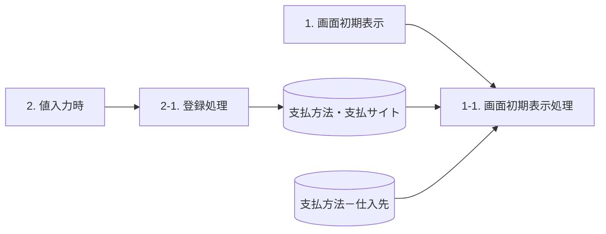
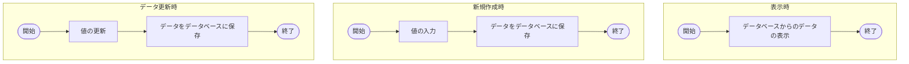
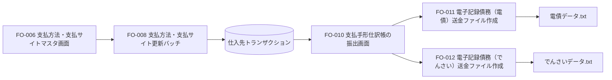

# FO-006 支払方法・支払サイトマスタ画面 詳細設計書

## 文書情報

| 項目 | 内容 |
|---|---|
| 機能ID | FO-006 |
| 機能名称 | 支払方法・支払サイトマスタ画面 |
| システム | Dynamics365 for Finance and Operations |
| 機能分類 | 債権・債務 |
| プロジェクト | 会計システム刷新プロジェクト（LIBRA） |
| 宛先 | サンスター株式会社 御中 |
| 版数 | 第1.2版 |
| 文書日付・更新日 | 2025-03-14 |
| 作成日・作成者 | 2024-06-05／JBS井田 |
| 更新者 | JBS北井 |
| 作成会社 | 日本ビジネスシステムズ株式会社 |
| JBS承認日・承認者 | 2024-07-12／JBS加藤 |
| 基本設計部確認日・確認者 | 2024-08-19／サンスター藤田 |

文書種別の表記確認：[Q01](../qa/FO-006_詳細設計書_支払方法・支払サイトマスタ画面.md#q01)。

## 1. 機能概要

「FO-008_支払方法・支払サイト更新バッチ」の実行に必要なマスタを管理するため、支払方法・支払サイトのマスタ管理画面を新規作成する。使用タイミングは随時。処理概要の「制限事項」欄は「なし」。

管理対象は、支払方法、請求金額、支払方法(更新後)、支払サイト、支払条件の5項目である。同一の支払方法に同一の請求金額を重複登録できない。請求金額・支払サイトのマイナス入力は不可。0の扱いは[Q02](../qa/FO-006_詳細設計書_支払方法・支払サイトマスタ画面.md#q02)を参照。

## 2. 画面と操作

### 2.1 起動情報

| 項目 | 内容 |
|---|---|
| 起動パス | 買掛金管理 ＞ 支払の設定 ＞ 支払方法・支払サイト |
| タイトルのCaption | 支払方法・支払サイト |
| 画面レイアウトに記載されたフォーム名 | `SJ_PaymModePaymSiteForm` |
| タブ名 | `-` |

実装オブジェクトとの名称対応：[Q04](../qa/FO-006_詳細設計書_支払方法・支払サイトマスタ画面.md#q04)。

### 2.2 コントロールと操作内容

| 区分 | 項目 | 種類 | 入力 | 必須 | 内容 |
|---|---|---|---|---|---|
| タイトル | 支払方法・支払サイト | タイトル | 不可 | 対象外 | Captionを表示する。 |
| アクションペイン | 保存 | ボタン | 対象外 | 対象外 | コマンドボタン：保存。 |
| アクションペイン | 新規 | ボタン | 対象外 | 対象外 | コマンドボタン：レコードの新規追加。 |
| アクションペイン | 削除 | ボタン | 対象外 | 対象外 | コマンドボタン：レコードの削除。 |
| カスタムフィルターグループ | クィックフィルター | フィルター | 可 | 任意 | 原資料の入力欄は○、必須欄は×。 |

### 2.3 ボディの項目定義

| 項目名 | 種類 | 入力 | 必須 | 表示・入力先 | 制約・参照 |
|---|---|---|---|---|---|
| 支払方法 | ListBox | 可 | 必須 | 支払方法・支払サイト.支払方法 | 支払方法－仕入先をルックアップ。 |
| 請求金額 | 数値 | 可 | 任意 | 支払方法・支払サイト.請求金額 | マイナス入力不可。同一支払方法内の請求金額は重複不可。いずれもテーブルのプロパティ設定で対応。 |
| 支払方法(更新後) | ListBox | 可 | 必須 | 支払方法・支払サイト.支払方法(更新後) | 支払方法－仕入先をルックアップ。 |
| 支払サイト | 数値 | 可 | 任意 | 支払方法・支払サイト.支払サイト | マイナス入力不可。テーブルのプロパティ設定で対応。 |
| 支払条件 | ListBox | 可 | 必須 | 支払方法・支払サイト.支払条件 | 支払条件をルックアップ。 |

数値2項目の0の扱いは[Q02](../qa/FO-006_詳細設計書_支払方法・支払サイトマスタ画面.md#q02)、支払サイトの単位は[Q07](../qa/FO-006_詳細設計書_支払方法・支払サイトマスタ画面.md#q07)、桁数・小数精度は[Q08](../qa/FO-006_詳細設計書_支払方法・支払サイトマスタ画面.md#q08)。任意指定を、空文字や0という初期値の指定とは解釈しない。

### 2.4 ルックアップ

| 対象項目 | 参照テーブル（原資料の表記） | 表示項目 |
|---|---|---|
| 支払方法 | 支払方法 - 仕入先 | 支払方法、説明(Name) |
| 支払方法(更新後) | 支払方法 - 仕入先 | 支払方法、説明(Name) |
| 支払条件 | 支払条件 - 支払条件 | 支払条件.支払条件、支払条件.説明 |

支払条件の物理テーブル・一覧との対応：[Q05](../qa/FO-006_詳細設計書_支払方法・支払サイトマスタ画面.md#q05)。

### 2.5 画面レイアウト（HTML）

以下は静的な仕様モックアップであり、実際の保存・新規・削除・検索は実行しない。入力部品の無効化は、このモックアップを実行しないための措置であり、実画面の入力不可要件ではない。`TU`、`T`、`PTxxx`等は原資料の例示値であり、候補値の全件リストではない。

<section aria-labelledby="fo006-screen-title">
  <h3 id="fo006-screen-title">支払方法・支払サイト</h3>
  
買掛金管理 ＞ 支払の設定 ＞ 支払方法・支払サイト

  <form aria-label="支払方法・支払サイトマスタの静的画面例">
    

      <button type="button" id="fo006-save" disabled>保存</button>
      <button type="button" id="fo006-new" disabled>新規</button>
      <button type="button" id="fo006-delete" disabled>削除</button>
    

    
<strong>標準ビュー</strong>

    
<label for="fo006-filter">クィックフィルター</label>
      <input id="fo006-filter" type="search" placeholder="フィルター" disabled>

    
SSJの登録イメージ。以下の15行は例示であり、初期値・登録済みデータの指定ではない。

    

      <table id="fo006-grid" aria-describedby="fo006-example-note fo006-business-day-note" style="border-collapse:collapse;width:100%">
        <thead><tr><th scope="col">支払方法</th><th scope="col">請求金額</th><th scope="col">支払方法(更新後)</th><th scope="col">支払サイト</th><th scope="col">支払条件</th></tr></thead>
        <tbody>
          <tr><td><select aria-label="1行目の支払方法" disabled required><option>TU</option></select></td><td><input aria-label="1行目の請求金額" type="text" inputmode="decimal" value="0.00" size="12" disabled></td><td><select aria-label="1行目の支払方法(更新後)" disabled required><option>T</option></select></td><td><input aria-label="1行目の支払サイト" type="text" inputmode="numeric" value="0" size="5" disabled></td><td><select aria-label="1行目の支払条件" disabled required><option>PTxxx</option></select></td></tr>
          <tr><td>TU</td><td>500,000.00</td><td>W</td><td>95</td><td>PTxxx</td></tr>
          <tr><td>TQ</td><td>0.00</td><td>T</td><td>0</td><td>PTxxx</td></tr>
          <tr><td>TQ</td><td>500,000.00</td><td>W</td><td>60</td><td>PTxxx</td></tr>
          <tr><td>TP</td><td>0.00</td><td>T</td><td>0</td><td>PTxxx</td></tr>
          <tr><td>TP</td><td>500,000.00</td><td>W</td><td>40</td><td>PTxxx</td></tr>
          <tr><td>9T</td><td>0.00</td><td>T</td><td>0</td><td>PTxxx</td></tr>
          <tr><td>9T</td><td>500,000.00</td><td>9-1</td><td>95</td><td>PTxxx</td></tr>
          <tr><td>8T</td><td>0.00</td><td>T</td><td>0</td><td>PTxxx</td></tr>
          <tr><td>8T</td><td>500,000.00</td><td>8-1</td><td>60</td><td>PTxxx</td></tr>
          <tr id="fo006-business-day-group-start"><td>2-1</td><td>0.00</td><td>2-1</td><td>0</td><td>PTxxx</td></tr>
          <tr><td>3-1</td><td>0.00</td><td>3-1</td><td>0</td><td>PTxxx</td></tr>
          <tr><td>3-2</td><td>0.00</td><td>3-2</td><td>0</td><td>PTxxx</td></tr>
          <tr><td>3-3</td><td>0.00</td><td>3-3</td><td>0</td><td>PTxxx</td></tr>
          <tr><td>3-4</td><td>0.00</td><td>3-4</td><td>0</td><td>PTxxx</td></tr>
        </tbody>
      </table>
    

    
2-1、3-1、3-2、3-3、3-4の行：支払日の非営業日の考慮をFO-008で行うため、登録対象。

  </form>
</section>

<!-- callout C-UI01 | target=fo006-grid: SSJの登録イメージ -->
> **C-UI01（一覧全体）**：SSJの登録イメージ。

<!-- callout C-UI02 | target=fo006-business-day-group-start
支払日の非営業日の考慮を
FO-008で行うため、登録対象
-->
> **C-UI02（2-1、3-1、3-2、3-3、3-4の登録例）**：支払日の非営業日の考慮をFO-008で行うため、登録対象。

## 3. イベントとデータフロー

### 3.1 イベント定義

| No. | イベント | 処理 | 処理内容 |
|---|---|---|---|
| 1 | 画面初期表示 | 1-1. 画面初期処理 | 画面レイアウトに従って表示する。DFDの処理名は「1-1. 画面初期表示処理」。 |
| 2 | 値入力時 | 2-1. 登録処理 | 入力された値を「支払方法・支払サイト」に登録する。項目設定はテーブル出力仕様に従う。 |

永続化のタイミングと保存ボタンの関係：[Q06](../qa/FO-006_詳細設計書_支払方法・支払サイトマスタ画面.md#q06)。

### 3.2 DFD

初期表示の参照元は「支払方法・支払サイト」と「支払方法－仕入先」のDB群であり、登録処理の出力先は「支払方法・支払サイト」である。

### 3.3 プログラムフロー

表示時、新規作成時、データ更新時の3系統である。

## 4. テーブルとデータ設定

### 4.1 使用テーブル

| No. | 種別 | 論理名 | 物理名 | I/O |
|---|---|---|---|---|
| 1 | テーブル | 支払方法・支払サイト | `SJ_PaymModePaymSiteTable` | I/O |
| 2 | テーブル | 支払方法 - 仕入先 | `VendPaymModeTable` | I |

### 4.2 テーブル出力仕様

テーブル名は`SJ_PaymModePaymSiteTable`、ラベルは「支払方法・支払サイト」、拡張名は`-`。

| No. | 論理名 | 物理名（原資料の表記） | 設定内容 |
|---|---|---|---|
| 1 | 支払方法 | `PayｍMode` | 入力された[支払方法・支払サイト更新.支払方法]を設定する。 |
| 2 | 請求金額 | `BillingAmount` | 入力された[支払方法・支払サイト更新.請求金額]を設定する。 |
| 3 | 支払方法(更新後) | `UpdatedPaymMode` | 入力された[支払方法・支払サイト更新.支払方法(更新後)]を設定する。 |
| 4 | 支払サイト | `PaymSite` | 入力された[支払方法・支払サイト更新.支払サイト]を設定する。 |
| 5 | 支払条件 | `PaymTermId` | 入力された[支払方法・支払サイト更新.支払条件]を設定する。 |

`PayｍMode`の文字種・インデックスとの対応：[Q03](../qa/FO-006_詳細設計書_支払方法・支払サイトマスタ画面.md#q03)。

### 4.3 同一支払方法・請求金額の重複チェック

重複判定の組み合わせは、支払方法と請求金額である。支払方法(更新後)や支払サイトが異なっても、この組み合わせを重複登録できない。

| インデックス名 | 重複許可 | フィールド |
|---|---|---|
| `SJ_PaymModePaymSiteTableIdx` | No | `PaymMode,BillingAmount` |

上表は補足説明に貼り付けられたテーブル定義の抜粋に基づく。参照先の名称は`【テーブル定義書】SJ_PaymModePaymSiteTable.xlsx`。

#### 補足説明の登録例

| 支払方法 | 請求金額 | 支払方法(変更後) | 支払サイト | 支払条件 | 位置付け |
|---|---:|---|---:|---|---|
| TU | 0 | T | 0 | PTXX | 原資料の例示。0の扱いはQ02。 |
| TU | 500000 | W | 95 | PTXX | 次の行と支払方法・請求金額が重複。 |
| TU | 500000 | 原資料は空欄 | 60 | PTXX | 上の行との重複登録が不可。 |
| TQ | 0 | T | 0 | PTXX | 原資料の例示。0の扱いはQ02。 |
| TQ | 500000 | W | 60 | PTXX | 原資料の例示。 |
| 2-1 | 0 | 2-1 | 0 | PTXX | 更新前後が同じ登録例。0の扱いはQ02。 |

<!-- callout C-DUP01 | target=section-4-3
同一の支払方法に
請求金額を重複して登録できません。※詳細はテーブル定義書に記載
-->
> **C-DUP01（重複チェック）**：同一の支払方法に請求金額を重複して登録できません。※詳細はテーブル定義書に記載

## 5. 関連機能との関係

### 5.1 機能関連図

FO-006の管理対象は「支払方法・支払サイト」。機能関連図の本機能枠にこのマスタが示される。ファイルへの矢印は、対応するファイル作成機能と成果物の関係を表す。

### 5.2 関連図の注記

<!-- source-note N-FO008 | target=FO008: 支払方法、期日サイトを更新する。 -->
> **N-FO008**：支払方法、期日サイトを更新する。

<!-- source-note N-FO010 | target=FO010: 支払方法が更新されたものを対象に支払提案を行う。 -->
> **N-FO010**：支払方法が更新されたものを対象に支払提案を行う。

<!-- source-note N-FO011 | target=FO011: 支払方法が「電債」のデータを対象にファイルを作成。 -->
> **N-FO011**：支払方法が「電債」のデータを対象にファイルを作成。

<!-- source-note N-FO012 | target=FO012: 支払方法が「でんさい」のデータを対象にファイルを作成。 -->
> **N-FO012**：支払方法が「でんさい」のデータを対象にファイルを作成。

### 5.3 支払条件の利用

レビュー事項No.2に、支払条件をFO-008の期日振込の期日更新、およびFO-010の電子記録債務の期日更新で使用する旨が記載されている。No.3では、規定払いの支払基準日は「末締翌20日」固定とされる。

同No.3の対応内容では、海外送金に該当する支払方法も管理対象となるため「JPYのみ登録する」という制限を削除し、支払方法と支払方法(更新後)の同値チェックも削除している。レビュー原文と対応状況は[QAのレビュー事項](../qa/FO-006_詳細設計書_支払方法・支払サイトマスタ画面.md#review-records)に分離している。

## 6. 実装オブジェクト

| No. | オブジェクト名 | 属性 | 概要 |
|---|---|---|---|
| 1 | `SJ_PaymModePaymSiteTable` | Menu Items(Display) | 支払方法・支払サイトマスタ画面起動用のメニューアイテム。 |
| 2 | `SJ_PaymModePaymSiteTable` | Forms | 支払方法・支払サイトマスタ画面。 |
| 3 | `AccountsPayable.SJ_Extension` | Menus | 買掛金管理モジュール。 |

画面レイアウトのフォーム名との対応は[Q04](../qa/FO-006_詳細設計書_支払方法・支払サイトマスタ画面.md#q04)。
