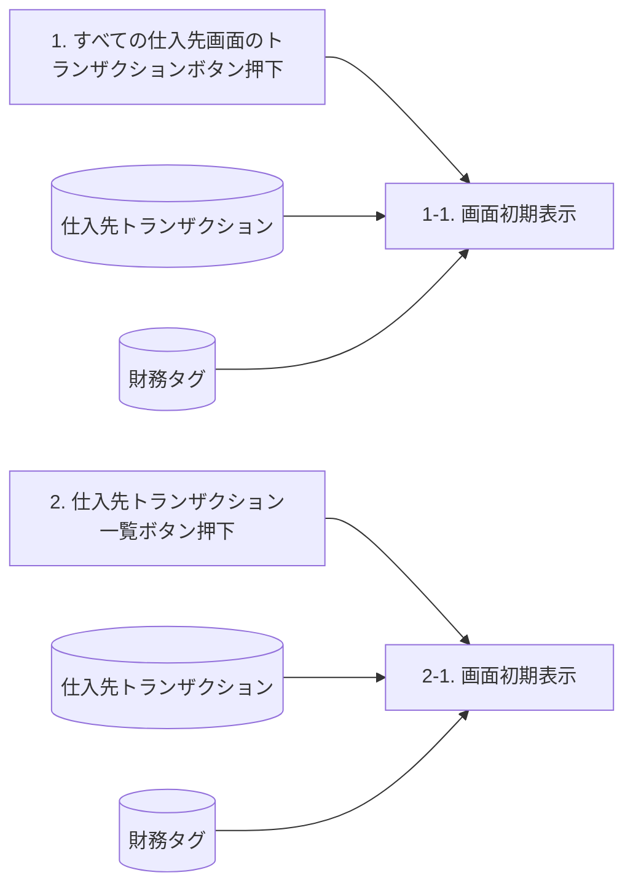
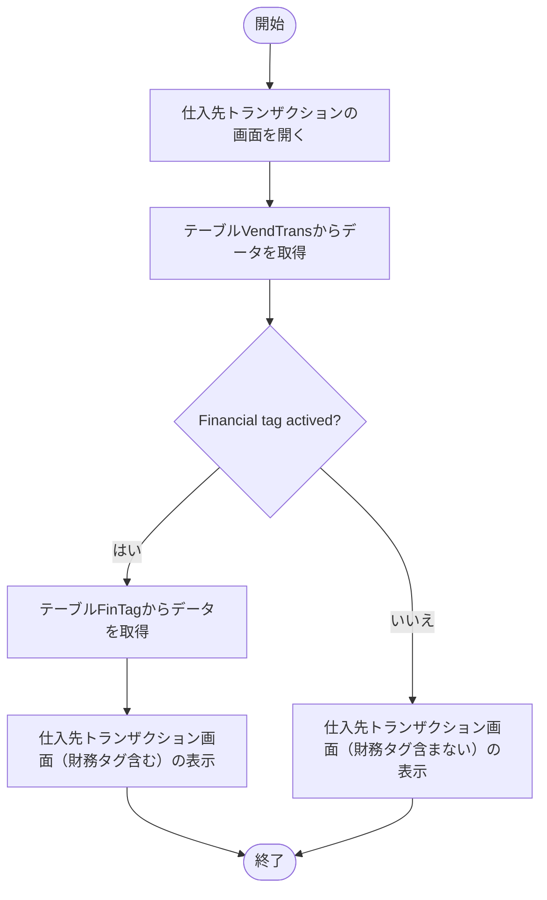

# FO-007 仕入先トランザクション画面 詳細設計書

<a id="sheet-21"></a>
## 1. はじめに

### 1.1 文書情報・共通ヘッダー

| 項目 | 内容 |
|---|---|
| 機能ID | FO-007 |
| 機能名称 | 仕入先トランザクション画面 |
| プロジェクト | 会計システム刷新プロジェクト（LIBRA） |
| システム | Dynamics365 for Finance and Operations |
| 機能分類 | 債権・債務 |
| 宛先 | サンスター株式会社 御中 |
| 版数 | 第1.9版 |
| 文書日付・更新日 | 2025-03-14 |
| 作成日・作成者 | 2024-06-03／JBS井田 |
| 更新者 | JBS井田 |
| 作成会社 | 日本ビジネスシステムズ株式会社 |
| JBS承認日・承認者 | 2024-07-12／JBS加藤 |
| 基本設計部確認日・確認者 | 2024-07-18／サンスター藤田 |

共通ヘッダーの「基本設計書」とファイル名等の「詳細設計書」の表記差：[Q01](../qa/FO-007_詳細設計書_仕入先トランザクション画面.md#q01)。

### 1.2 共通の適用条件

<a id="common-company"></a>
**CR01：法人の範囲。** ログインしている法人の仕入先ごとのトランザクションを表示する。別法人の情報は、法人を切り替えて実行する。出典：処理概要。

<a id="common-edit"></a>
**CR02：画面ごとの更新可否。** 仕入先トランザクション画面では各定義項目を表示のみとする。支払基準日、支払方法・支払サイト更新フラグ、支払サイト、期日は、トランザクションの決済画面でのみ更新可能。期日の更新は標準機能。出典：両画面の項目説明、補足説明 (トランザクションの決済画面)。

<a id="common-tags"></a>
**CR03：財務タグ。** 機能管理で財務タグを有効化し、アクティブ化された財務タグを動的に表示する。原資料の上限は20個。右端に追加され、任意位置への並び替えはパーソナライズで行う。タグ名・登録順を固定しない。機能が有効でない場合の分岐も、イベント説明に従って保持する。出典：処理概要、イベント説明、画面項目説明、補足説明 (財務タグ)。

<a id="sheet-5"></a>
## 2. 処理概要

### 2.1 開発目的

1. 仕入先トランザクション画面に「FO-008_支払方法・支払サイト更新バッチ」で必要な項目を設ける。
2. 業務上必要な項目を網羅した、全仕入先のトランザクション一覧画面を設ける。
3. 決済明細の提出に必要なデータをExcelへ出力できるようにする。

### 2.2 前提条件・使用タイミング

法人の適用範囲は[CR01](#common-company)に従う。財務タグの有効化パスは「システム管理 ＞ ワークスペース ＞ 機能管理」。使用タイミングは随時。

### 2.3 開発内容

メニューパスに応じて仕入先個別画面／一覧画面を表示し、業務上必要な項目を既定で表示する。標準画面への追加対象は、名前、支払基準日、支払方法・支払サイト更新フラグ、支払サイト、財務タグ。

### 2.4 制限事項

財務タグの配置・個数・運用は[CR03](#common-tags)に従う。

Excel出力の様式・機能範囲：[Q07](../qa/FO-007_詳細設計書_仕入先トランザクション画面.md#q07)。

<a id="sheet-23"></a>
## 3. テーブル一覧

| No. | 種別 | 論理名 | 物理名 | I/O | 備考 |
|---|---|---|---|---|---|
| 1 | テーブル | 仕入先トランザクション | VendTrans | I/O | 標準 |
| 2 | テーブル | 財務タグ | FinTag | I | 標準 |

プログラムフロー図に現れる追加参照先との対応：[Q06](../qa/FO-007_詳細設計書_仕入先トランザクション画面.md#q06)。

<a id="sheet-4"></a>
## 4. DFD

2つの起動イベントから初期表示処理を呼び出し、各処理は仕入先トランザクションと財務タグを参照する。DB群から処理へ向かう矢印を、各参照元に分けて表す。参照順や新しい更新処理は定義しない。



財務タグの参照を行う条件は第5章に従う。DFDの矢印だけを根拠に、無効時にもタグを取得するとは解釈しない。

<a id="sheet-8"></a>
## 5. イベント説明

### 5.1 起動イベント

| No. | イベント | 処理 |
|---|---|---|
| 1 | すべての仕入先画面のトランザクションボタン押下時 | 1-1. 画面表示処理 |
| 2 | 仕入先トランザクション一覧ボタン押下時 | 2-1. 画面表示処理。1-1と同様の処理。 |

### 5.2 呼出し元による項目制御

| 呼出し元 | 仕入先 | 名前 |
|---|---|---|
| すべての仕入先画面 ＞ トランザクションボタン | 非表示 | 非表示 |
| 仕入先トランザクション一覧画面 | 表示 | 表示 |

### 5.3 財務タグの情報取得

| 機能有効化の状態 | 処理 |
|---|---|
| ≠有効化 | 情報を取得せず処理を終了する。 |
| ＝有効化 | アクティブ化されている財務タグを仕入先トランザクション画面に動的に項目追加する。 |

ここで終了するのは財務タグの取得処理である。プログラムフロー図の無効側では、財務タグを含まないトランザクション画面を表示する。[CR03](#common-tags)も参照。

<a id="sheet-44"></a>
## 6. 画面レイアウト(仕入先トランザクション画面)

### 6.1 起動情報

| 画面 | パス | フォーム名 | タブ名 |
|---|---|---|---|
| 仕入先一覧画面 | 買掛金管理 ＞ 照会およびレポート ＞ 仕入先トランザクション一覧 | VendTrans | リストタブ |
| 仕入先個別画面 | [買掛金管理]>[仕入先]>[すべての仕入先]]>[仕入先]>[トランザクション]>[トランザクション] | VendTrans | リストタブ |

個別画面のパスの余分な `]` は原資料の表記。メニューの関係は第10章を参照。

### 6.2 仕入先一覧画面

<section id="fo007-list" aria-labelledby="fo007-list-title" style="border:1px solid #777;max-width:100%;box-sizing:border-box;background:white;overflow:hidden;margin:12px 0">
<h4 id="fo007-list-title" style="margin:0;padding:10px 14px;background:#171717;color:white">仕入先トランザクション：一覧画面</h4>
<form aria-label="仕入先トランザクション：一覧画面の静的画面例" style="padding:12px;margin:0">
<div role="toolbar" style="display:flex;flex-wrap:wrap;gap:10px;border-bottom:1px solid #ddd;padding-bottom:8px"><button type="button" disabled>編集</button><button type="button" disabled>伝票</button><button type="button" disabled>決済を表示する</button><button type="button" disabled>決済</button><button type="button" disabled>小切手で支払済</button><button type="button" disabled>元の文書</button><button type="button" disabled>詳細を開く</button><button type="button" disabled>支払手形</button><button type="button" disabled>取消</button><button type="button" disabled>照会</button><button type="button" disabled>プロジェクト</button><button type="button" disabled>キャッシュ フロー予測</button><button type="button" disabled>オプション</button></div><p><strong>標準ビュー</strong></p><p><label for="fo007-list-show">表示</label> <select id="fo007-list-show" disabled><option>未処理</option></select> <label for="fo007-list-date">日付</label> <input id="fo007-list-date" type="text" value="2025/02/19" disabled> <label><input type="checkbox" disabled>通貨の再評価を非表示にする</label></p><p>リスト　一般　支払　支払手形　決済　送金　履歴　財務分析コード</p><div style="overflow-x:auto;max-width:100%"><table id="fo007-list-grid" border="1" cellpadding="5" style="border-collapse:collapse;white-space:nowrap;width:100%"><thead><tr><th scope="col">仕入先</th><th scope="col">名前</th><th scope="col">伝票</th><th scope="col">日付</th><th scope="col">Item</th><th scope="col">DataClass</th><th scope="col">RefVoucherNum</th><th scope="col">ApprovalDocumentNumber</th><th scope="col">CustNumber</th><th scope="col">文書日付</th><th scope="col">集計勘定</th><th scope="col">金額</th><th scope="col">残高</th><th scope="col">支払基準日</th><th scope="col">支払方法・支払サイト更新フラグ</th><th scope="col">支払サイト</th><th scope="col">期日</th><th scope="col">支払方法</th><th scope="col">請求書支払リリース日</th><th scope="col">説明</th><th scope="col">最終決済伝票</th></tr></thead><tbody>
<tr><td>1100332</td><td>パルシステ...</td><td>APINIF0000000013</td><td>2025/06/12</td><td>I010</td><td>A00</td><td>D010</td><td>A010</td><td>10</td><td>2025/06/12</td><td>2070116</td><td>5,000.00</td><td>0.00</td><td>2025/08/08</td><td></td><td>0</td><td>2025/08/20</td><td>2-3</td><td></td><td>ITa_1-4-3-1_債務計上⑦ 支払方法_...</td><td></td></tr>
<tr><td>1187815</td><td>（株）武...</td><td>APINIF0000000027</td><td>2025/06/12</td><td>I010</td><td>A00</td><td>D010</td><td>A010</td><td>10</td><td>2025/06/12</td><td>2070116</td><td>5,000.00</td><td>0.00</td><td>2025/08/08</td><td></td><td>0</td><td>2025/08/08</td><td>2-3</td><td></td><td>【再】ITa_1-4-3-1_債務計上⑦ 支払...</td><td></td></tr>
<tr><td>2100060</td><td>サレーヌ大橋</td><td>APINIF0000000003</td><td>2025/06/17</td><td>I002</td><td>E02</td><td>D002</td><td>A002</td><td>02</td><td>2025/06/17</td><td>2030101</td><td>500,000.00</td><td>0.00</td><td>2025/07/20</td><td>✓</td><td>0</td><td>2025/07/20</td><td>2-1</td><td></td><td>ITa_1-4-3-1_債務計上① 支払方法_...</td><td></td></tr>
<tr><td>2100167</td><td>エイチアール...</td><td>APINIF0000000004</td><td>2025/06/03</td><td>I003</td><td>E03</td><td>D003</td><td>A003</td><td>03</td><td>2025/06/03</td><td>2030101</td><td>300,000.00</td><td>0.00</td><td>2025/07/20</td><td></td><td>0</td><td>2025/07/20</td><td>9T</td><td></td><td>ITa_1-4-3-1_債務計上②-1 支払方...</td><td></td></tr>
<tr><td>2100167</td><td>エイチアール...</td><td>APINIF0000000005</td><td>2025/06/04</td><td>I004</td><td>F00</td><td>D004</td><td>A004</td><td>04</td><td>2025/06/04</td><td>2070101</td><td>300,000.00</td><td>0.00</td><td>2025/07/20</td><td></td><td>0</td><td>2025/07/20</td><td>9T</td><td></td><td>ITa_1-4-3-1_債務計上②-2 支払方...</td><td></td></tr>
<tr><td>2101767</td><td>日精エー・...</td><td>APINIF0000000008</td><td>2025/06/03</td><td>I008</td><td>H03</td><td>D008</td><td>A008</td><td>08</td><td>2025/06/03</td><td>2070201</td><td>300,000.00</td><td>0.00</td><td>2025/07/20</td><td>✓</td><td>95</td><td>2025/10/25</td><td>W</td><td></td><td>ITa_1-4-3-1_債務計上④-1 支払方...</td><td></td></tr>
<tr><td>2101767</td><td>日精エー・...</td><td>APINIF0000000009</td><td>2025/06/04</td><td>I009</td><td>H04</td><td>D009</td><td>A009</td><td>09</td><td>2025/06/04</td><td>2070201</td><td>450,000.00</td><td>0.00</td><td>2025/07/20</td><td>✓</td><td>95</td><td>2025/10/25</td><td>W</td><td></td><td>ITa_1-4-3-1_債務計上④-1 支払方...</td><td></td></tr>
<tr><td>2106319</td><td>東京硝子...</td><td>APINIF0000000006</td><td>2025/06/03</td><td>I003</td><td>E03</td><td>D003</td><td>A003</td><td>03</td><td>2025/06/03</td><td>2070108</td><td>300,000.00</td><td>0.00</td><td>2025/07/20</td><td>✓</td><td>0</td><td>2025/07/20</td><td>T</td><td></td><td>ITa_1-4-3-1_債務計上③-1 支払方...</td><td></td></tr>
<tr><td>2106319</td><td>東京硝子...</td><td>APINIF0000000007</td><td>2025/06/04</td><td>I004</td><td>F00</td><td>D004</td><td>A004</td><td>04</td><td>2025/06/04</td><td>2070108</td><td>150,000.00</td><td>0.00</td><td>2025/07/20</td><td>✓</td><td>0</td><td>2025/07/20</td><td>T</td><td></td><td>ITa_1-4-3-1_債務計上③-2 支払方...</td><td></td></tr>
<tr><td>2116659</td><td>ＳＵＮＳ...</td><td>APINIF0000000011</td><td>2025/06/12</td><td>I010</td><td>A00</td><td>D010</td><td>A010</td><td>10</td><td>2025/06/12</td><td>2030101</td><td>614,560.00</td><td>0.00</td><td>2025/07/17</td><td></td><td>0</td><td>2025/07/17</td><td>3-3</td><td></td><td>ITa_1-4-3-1_債務計上⑥ 支払方法_...</td><td></td></tr>
<tr><td>2120346</td><td>高槻地区...</td><td>APINIF0000000017</td><td>2025/06/17</td><td>I002</td><td>E02</td><td>D002</td><td>A002</td><td>02</td><td>2025/06/17</td><td>2030101</td><td>500,000.00</td><td>0.00</td><td>2025/07/20</td><td>✓</td><td>0</td><td>2025/07/22</td><td>2-1</td><td></td><td>【再】ITa_1-4-3-1_債務計上① 支払...</td><td></td></tr>
<tr><td>2120567</td><td>ＳＨＵＭ...</td><td>APINIF0000000010</td><td>2025/06/12</td><td>I010</td><td>A00</td><td>D010</td><td>A010</td><td>10</td><td>2025/06/12</td><td>2030101</td><td>460,920.00</td><td>0.00</td><td>2025/07/11</td><td></td><td>0</td><td>2025/07/11</td><td>3-1</td><td></td><td>ITa_1-4-3-1_債務計上⑤ 支払方法_...</td><td></td></tr>
<tr><td>2120575</td><td>ＫＩＳＣ...</td><td>APINIF0000000022</td><td>2025/06/03</td><td>I008</td><td>H03</td><td>D008</td><td>A008</td><td>08</td><td>2025/06/03</td><td>2070201</td><td>300,000.00</td><td>0.00</td><td>2025/07/20</td><td>✓</td><td>95</td><td>2025/10/27</td><td>W</td><td></td><td>【再】ITa_1-4-3-1_債務計上④-1 支...</td><td></td></tr>
<tr><td>2120575</td><td>ＫＩＳＣ...</td><td>APINIF0000000023</td><td>2025/06/04</td><td>I009</td><td>H04</td><td>D009</td><td>A009</td><td>09</td><td>2025/06/04</td><td>2070201</td><td>450,000.00</td><td>0.00</td><td>2025/07/20</td><td>✓</td><td>95</td><td>2025/10/27</td><td>W</td><td></td><td>【再】ITa_1-4-3-1_債務計上④-2 支...</td><td></td></tr>
<tr><td>2120583</td><td>紀州技研...</td><td>APINIF0000000018</td><td>2025/06/03</td><td>I003</td><td>E03</td><td>D003</td><td>A003</td><td>03</td><td>2025/06/03</td><td>2030101</td><td>300,000.00</td><td>0.00</td><td>2025/07/20</td><td>✓</td><td>95</td><td>2025/07/22</td><td>9-1</td><td></td><td>【再】ITa_1-4-3-1_債務計上②-1 支...</td><td></td></tr>
<tr><td>2120583</td><td>紀州技研...</td><td>APINIF0000000019</td><td>2025/06/04</td><td>I004</td><td>F00</td><td>D004</td><td>A004</td><td>04</td><td>2025/06/04</td><td>2070101</td><td>300,000.00</td><td>0.00</td><td>2025/07/20</td><td>✓</td><td>95</td><td>2025/07/22</td><td>9-1</td><td></td><td>【再】ITa_1-4-3-1_債務計上②-2 支...</td><td></td></tr>
<tr><td>2120648</td><td>アスカカンパ...</td><td>APINIF0000000020</td><td>2025/06/03</td><td>I003</td><td>E03</td><td>D003</td><td>A003</td><td>03</td><td>2025/06/03</td><td>2070108</td><td>300,000.00</td><td>0.00</td><td>2025/07/20</td><td>✓</td><td>0</td><td>2025/07/22</td><td>T</td><td></td><td>【再】ITa_1-4-3-1_債務計上③-1 支...</td><td></td></tr>
<tr><td>2120648</td><td>アスカカンパ...</td><td>APINIF0000000021</td><td>2025/06/04</td><td>I004</td><td>F00</td><td>D004</td><td>A004</td><td>04</td><td>2025/06/04</td><td>2070108</td><td>150,000.00</td><td>0.00</td><td>2025/07/20</td><td>✓</td><td>0</td><td>2025/07/22</td><td>T</td><td></td><td>【再】ITa_1-4-3-1_債務計上③-2 支...</td><td></td></tr>
<tr><td>2125909</td><td>ＷＥＩＭ...</td><td>APINIF0000000024</td><td>2025/06/12</td><td>I010</td><td>A00</td><td>D010</td><td>A010</td><td>10</td><td>2025/06/12</td><td>2030101</td><td>460,920.00</td><td>0.00</td><td>2025/07/11</td><td></td><td>0</td><td>2025/07/11</td><td>3-1</td><td></td><td>【再】ITa_1-4-3-1_債務計上⑤ 支払...</td><td></td></tr>
<tr><td>2127863</td><td>ＳＵＮＳ...</td><td>APINIF0000000012</td><td>2025/06/12</td><td>I010</td><td>A00</td><td>D010</td><td>A010</td><td>10</td><td>2025/06/12</td><td>2070116</td><td>768,200.00</td><td>0.00</td><td>2025/08/08</td><td></td><td>0</td><td>2025/08/08</td><td>3-4</td><td></td><td>ITa_1-4-3-1_債務計上⑦ 支払方法_...</td><td></td></tr>
<tr><td>2140827</td><td>ＳＵＮＳ...</td><td>APINIF0000000026</td><td>2025/06/12</td><td>I010</td><td>A00</td><td>D010</td><td>A010</td><td>10</td><td>2025/06/12</td><td>2030101</td><td>768,200.00</td><td>0.00</td><td>2025/07/17</td><td></td><td>0</td><td>2025/07/17</td><td>3-4</td><td></td><td>【再】ITa_1-4-3-1_債務計上⑦ 支払...</td><td></td></tr>
<tr><td>2146175</td><td>ＳＵＮＳ...</td><td>APINIF0000000025</td><td>2025/06/12</td><td>I010</td><td>A00</td><td>D010</td><td>A010</td><td>10</td><td>2025/06/12</td><td>2030101</td><td>614,560.00</td><td>0.00</td><td>2025/07/25</td><td></td><td>0</td><td>2025/07/25</td><td>3-3</td><td></td><td>【再】ITa_1-4-3-1_債務計上⑥ 支払...</td><td></td></tr>
<tr><td>999991</td><td>ITa_1-4-5-...</td><td>APINIF0000000028</td><td>2025/01/10</td><td>I02</td><td>C00</td><td>D02</td><td>A02</td><td>02</td><td>2025/01/10</td><td>2030101</td><td>350,000.00</td><td>0.00</td><td>2025/02/20</td><td>✓</td><td>0</td><td>2025/02/20</td><td>T</td><td></td><td>ITa_1-4-5-1_債務計上①_2-1</td><td></td></tr>
<tr><td>999991</td><td>ITa_1-4-5-...</td><td>APINIF0000000029</td><td>2025/01/15</td><td>I02</td><td>C00</td><td>D02</td><td>A02</td><td>02</td><td>2025/01/15</td><td>2030101</td><td>100,000.00</td><td>0.00</td><td>2025/02/20</td><td>✓</td><td>0</td><td>2025/02/20</td><td>T</td><td></td><td>ITa_1-4-5-1_債務計上②_TU</td><td></td></tr>
</tbody></table></div>
</form>
</section>


### 6.3 仕入先個別画面

<section id="fo007-individual" aria-labelledby="fo007-individual-title" style="border:1px solid #777;max-width:100%;box-sizing:border-box;background:white;overflow:hidden;margin:12px 0">
<h4 id="fo007-individual-title" style="margin:0;padding:10px 14px;background:#171717;color:white">仕入先トランザクション：個別画面</h4>
<form aria-label="仕入先トランザクション：個別画面の静的画面例" style="padding:12px;margin:0">
<div role="toolbar" style="display:flex;flex-wrap:wrap;gap:10px;border-bottom:1px solid #ddd;padding-bottom:8px"><button type="button" disabled>編集</button><button type="button" disabled>伝票</button><button type="button" disabled>決済を表示する</button><button type="button" disabled>決済</button><button type="button" disabled>小切手で支払済</button><button type="button" disabled>元の文書</button><button type="button" disabled>詳細を開く</button><button type="button" disabled>支払手形</button><button type="button" disabled>取消</button><button type="button" disabled>照会</button><button type="button" disabled>プロジェクト</button><button type="button" disabled>キャッシュ フロー予測</button><button type="button" disabled>オプション</button></div><p><strong>標準ビュー</strong></p><p><label for="fo007-individual-show">表示</label> <select id="fo007-individual-show" disabled><option>未処理</option></select> <label for="fo007-individual-date">日付</label> <input id="fo007-individual-date" type="text" value="2025/02/19" disabled> <label><input type="checkbox" disabled>通貨の再評価を非表示にする</label></p><p>リスト　一般　支払　支払手形　決済　送金　履歴　財務分析コード</p><div style="overflow-x:auto;max-width:100%"><table id="fo007-individual-grid" border="1" cellpadding="5" style="border-collapse:collapse;white-space:nowrap;width:100%"><thead><tr><th scope="col">伝票</th><th scope="col">日付</th><th scope="col">Item</th><th scope="col">DataClass</th><th scope="col">RefVoucherNum</th><th scope="col">ApprovalDocumentNumber</th><th scope="col">CustNumber</th><th scope="col">文書日付</th><th scope="col">集計勘定</th><th scope="col">金額</th><th scope="col">残高</th><th scope="col">支払基準日</th><th scope="col">支払方法・支払サイト更新フラグ</th><th scope="col">支払サイト</th><th scope="col">期日</th><th scope="col">支払方法</th><th scope="col">請求書支払リリース日</th><th scope="col">説明</th><th scope="col">最終決済伝票</th></tr></thead><tbody>
<tr><td>APINIF0000000013</td><td>2025/06/12</td><td>I010</td><td>A00</td><td>D010</td><td>A010</td><td>10</td><td>2025/06/12</td><td>2070116</td><td>5,000.00</td><td>0.00</td><td>2025/08/08</td><td></td><td>0</td><td>2025/08/20</td><td>2-3</td><td></td><td>ITa_1-4-3-1_債務計上⑦ 支払方法_...</td><td></td></tr>
<tr><td>APINIF0000000027</td><td>2025/06/12</td><td>I010</td><td>A00</td><td>D010</td><td>A010</td><td>10</td><td>2025/06/12</td><td>2070116</td><td>5,000.00</td><td>0.00</td><td>2025/08/08</td><td></td><td>0</td><td>2025/08/08</td><td>2-3</td><td></td><td>【再】ITa_1-4-3-1_債務計上⑦ 支払...</td><td></td></tr>
<tr><td>APINIF0000000003</td><td>2025/06/17</td><td>I002</td><td>E02</td><td>D002</td><td>A002</td><td>02</td><td>2025/06/17</td><td>2030101</td><td>500,000.00</td><td>0.00</td><td>2025/07/20</td><td>✓</td><td>0</td><td>2025/07/20</td><td>2-1</td><td></td><td>ITa_1-4-3-1_債務計上① 支払方法_...</td><td></td></tr>
</tbody></table></div>
</form>
</section>


### 6.4 画面外の注記

一覧には画面例の読める24行を保持した。個別画面の画像にも同じ明細例が使われているため、同一値の二重転記を避けて先頭3行を抜粋した。これは実データの抽出件数制限ではない。上記は原資料の画面例を整理した静的HTMLであり、検索・保存・更新は実行しない。無効化した部品はモックアップの安全措置で、実画面の可否は第7・8章に従う。日付・仕入先・金額・タグ値・チェック状態は例示であって、初期値・処理条件ではない。元画像内で名前や説明が省略されている部分は `...` のまま保持し、未表示の文字を補完しない。財務タグの画面例での配置を、全利用者の固定配置と解釈しない。

<!-- callout C-L01 | target=fo007-list-grid: 追加項目。原図は財務タグ列群、および支払基準日・更新フラグ・支払サイトの追加箇所を枠で示す。 -->

> **C-L01**：追加項目。原図は財務タグ列群、および支払基準日・更新フラグ・支払サイトの追加箇所を枠で示す。
<!-- callout C-L02 | target=fo007-individual-grid: 追加項目。 -->

> **C-L02**：追加項目。
<!-- callout C-L03 | target=fo007-individual-grid: 仕入先、名前は非表示。 -->

> **C-L03**：仕入先、名前は非表示。

<a id="sheet-38"></a>
## 7. 画面項目説明(仕入先トランザクション画面)

### 7.1 グリッド項目

原資料で定義された以下の27項目はすべて入力×・必須×。アプリケーション画面の「非表示にする」という仕様も、表示された設計書の記述なので保持する。[CR02](#common-edit)を参照。

| 項目名 | 種類 | 入力 | 必須 | 表示内容・動作 | 備考（原表記） |
|---|---|---|---|---|---|
| 仕入先 | テキスト | 不可 | 任意 | [仕入先トランザクション.仕入先] | ※仕入先個別画面の場合は、非表示 |
| 名前 | テキスト | 不可 | 任意 | [仕入先トランザクション.仕入先]の名前 | 追加。※仕入先個別画面の場合は、非表示。Displayメソッドで実装 |
| Item | テキスト | 不可 | 任意 | [財務タグ.Tag01] | 財務タグ「RefVoucherNum」。参照伝票番号。動的に追加 |
| DataClass | テキスト | 不可 | 任意 | [財務タグ.Tag02] | 財務タグ「DataClass」。データ区分。動的に追加 |
| RefVoucherNum | テキスト | 不可 | 任意 | [財務タグ.Tag03] | 財務タグ「RefVoucherNum」。参照伝票番号。動的に追加 |
| ApprovalDocumentNumber | テキスト | 不可 | 任意 | [財務タグ.Tag04] | 財務タグ「DataClass」。データ区分。動的に追加 |
| CustNumber | テキスト | 不可 | 任意 | [財務タグ.Tag05] | 財務タグ「DataClass」。データ区分。動的に追加 |
| 請求書 | テキスト | 不可 | 任意 | 非表示にする | 変更 |
| トランザクション通貨の金額 | 数値 | 不可 | 任意 | 非表示にする | 変更 |
| トランザクション通貨での残高 | 数値 | 不可 | 任意 | 非表示にする | 変更 |
| 通貨 | テキスト | 不可 | 任意 | 非表示にする | 変更 |
| 文書日付 | 日付 | 不可 | 任意 | [仕入先トランザクション.文書日付] | 追加 |
| 集計勘定 | テキスト | 不可 | 任意 | [仕入先トランザクション.主勘定(SummaryAccountId)] | 追加 |
| レポート通貨金額 | 数値 | 不可 | 任意 | 非表示にする | 変更 |
| レポート通貨での残高 | 数値 | 不可 | 任意 | 非表示にする | 変更 |
| 支払手形ID | テキスト | 不可 | 任意 | 非表示にする | 変更 |
| 順序番号 | 数値 | 不可 | 任意 | 非表示にする | 変更 |
| ステータス | コンボボックス | 不可 | 任意 | 非表示にする | 変更 |
| 送金番号 | テキスト | 不可 | 任意 | 非表示にする | 変更 |
| 登録済伝票 | テキスト | 不可 | 任意 | 非表示にする | 変更 |
| 支払基準日 | 数値 | 不可 | 任意 | [仕入先トランザクション.支払基準日] | 新規 |
| 支払方法・支払サイト更新フラグ | チェックボックス | 不可 | 任意 | [仕入先トランザクション.支払方法・支払サイト更新フラグ] | 新規 |
| 支払サイト | 数値 | 不可 | 任意 | [仕入先トランザクション.支払サイト] | 新規 |
| 期日 | 日付 | 不可 | 任意 | [仕入先トランザクション.期日] | 追加 |
| 支払方法 | テキスト | 不可 | 任意 | [仕入先トランザクション.支払方法] | 追加 |
| 請求書支払リリース日 | 日付 | 不可 | 任意 | [仕入先トランザクション.請求書支払リリース日] | 追加 |
| 最終決済伝票 | テキスト | 不可 | 任意 | [仕入先トランザクション.最終決済伝票] | 追加 |

財務タグの項目名・参照スロット・備考の相違：[Q02](../qa/FO-007_詳細設計書_仕入先トランザクション画面.md#q02)。支払基準日の数値／日付の相違：[Q04](../qa/FO-007_詳細設計書_仕入先トランザクション画面.md#q04)。支払サイトの単位：[Q08](../qa/FO-007_詳細設計書_仕入先トランザクション画面.md#q08)。

### 7.2 項目外の吹き出し

<!-- callout C-T01 | target=Item: 財務タグの登録順で項目名が変わる -->

> **C-T01**：財務タグの登録順で項目名が変わる
<!-- callout C-T02 | target=DataClass: 財務タグの登録順で項目名が変わる -->

> **C-T02**：財務タグの登録順で項目名が変わる
<!-- callout C-T03 | target=RefVoucherNum: 財務タグの登録順で項目名が変わる -->

> **C-T03**：財務タグの登録順で項目名が変わる
<!-- callout C-T04 | target=ApprovalDocumentNumber: 財務タグの登録順で項目名が変わる -->

> **C-T04**：財務タグの登録順で項目名が変わる
<!-- callout C-T05 | target=CustNumber: 財務タグの登録順で項目名が変わる -->

> **C-T05**：財務タグの登録順で項目名が変わる
<!-- callout C-T06 | target=財務タグの列群: 財務タグが増えれば動的に追加される。 -->

> **C-T06**：財務タグが増えれば動的に追加される。

<a id="sheet-45"></a>
## 8. 画面項目説明(トランザクションの決済画面)

| 項目名 | 種類 | 入力 | 必須 | 表示・更新先 | 区分 |
|---|---|---|---|---|---|
| 支払基準日 | 数値 | 可 | 任意 | [仕入先トランザクション.支払基準日] | 新規 |
| 支払方法・支払サイト更新フラグ | チェックボックス | 可 | 任意 | [仕入先トランザクション.支払方法・支払サイト更新フラグ] | 新規 |
| 支払サイト | 数値 | 可 | 任意 | [仕入先トランザクション.支払サイト] | 新規 |
| 期日 | 日付 | 可 | 任意 | [未処理の仕入先トランザクション.期日] | 標準機能 |

4項目は本画面で更新可能であり、仕入先トランザクション画面では更新不可。[CR02](#common-edit)および第12章を参照。

<a id="sheet-19"></a>
## 9. テーブル出力仕様

テーブル名：`VendTrans`。ラベル：仕入先トランザクション。拡張名欄は原資料では空欄。

| No. | 論理名 | 物理名 | 更新時の設定内容（原文） |
|---|---|---|---|
| 1 | 支払基準日 | `SJ_PaymtBaseDate` | トランザクションの決済画面で更新した場合、[画面.支払基準日（VendTrans.SJ_PaymtBaseDate)] |
| 2 | 支払方法・支払サイト更新フラグ | `SJ_PaymModePaymSiteUpdatedFlag` | トランザクションの決済画面で更新した場合、[画面.支払方法・支払サイト更新フラグ(VendTrans.SJ_PaymModePaymSiteUpdatedFlag)] |
| 3 | 支払サイト | `SJ_PaymSite` | トランザクションの決済画面で更新した場合、[画面.支払サイト（VendTrans.SJ_PaymSite)] |

支払基準日の物理名に関する相違：[Q03](../qa/FO-007_詳細設計書_仕入先トランザクション画面.md#q03)。期日は第8章の標準機能であり、この追加3項目の出力表へ勝手に追加しない。

<a id="sheet-17"></a>
## 10. 補足説明(メニューパス)

### 10.1 起動経路の画面表現

<section id="fo007-menu-frame" style="border:1px solid #777;padding:12px;box-sizing:border-box;max-width:100%">
<h4>買掛金管理</h4>
<div style="display:flex;gap:20px;flex-wrap:wrap">
<article><h5>一覧の起動</h5><p>照会およびレポート</p><button type="button" disabled>仕入先トランザクション一覧</button><p>→ 一覧の仕入先トランザクション画面</p></article>
<article><h5>個別の起動</h5><p>仕入先 ＞ すべての仕入先</p><p>仕入先タブ ＞ トランザクション</p><button type="button" disabled>トランザクション</button><p>→ 選択した仕入先のトランザクション画面</p></article>
</div>
</section>

### 10.2 画面外の注記

<!-- callout C-M01 | target=fo007-menu-frame: 「仕入先トランザクション一覧」ボタン押下時 -->

> **C-M01**：「仕入先トランザクション一覧」ボタン押下時
<!-- callout C-M02 | target=fo007-menu-frame: すべての仕入先画面＞「トランザクション」ボタン押下時 -->

> **C-M02**：すべての仕入先画面＞「トランザクション」ボタン押下時
<!-- callout C-M03 | target=fo007-individual-grid: 仕入先、名前を非表示にして出力 -->

> **C-M03**：仕入先、名前を非表示にして出力

元画面の個別表示に重ねられた「ケアーズ」は画面例の名称であり、対象をこの仕入先に限定する指定ではない。起動後の表示差は第5章の項目制御に従う。

<a id="sheet-39"></a>
## 11. 補足説明 (財務タグ)

### 11.1 財務タグ画面

<section id="fo007-tags" aria-labelledby="fo007-tags-title" style="border:1px solid #777;max-width:100%;box-sizing:border-box;background:white;overflow:hidden;margin:12px 0">
<h4 id="fo007-tags-title" style="margin:0;padding:10px 14px;background:#171717;color:white">一般会計 ＞ 勘定科目表 ＞ 財務タグ ＞ 財務タグ</h4>
<form aria-label="一般会計 ＞ 勘定科目表 ＞ 財務タグ ＞ 財務タグの静的画面例" style="padding:12px;margin:0">
<div role="toolbar" style="display:flex;flex-wrap:wrap;gap:10px;border-bottom:1px solid #ddd;padding-bottom:8px"><button type="button" disabled>編集</button><button type="button" disabled>新規</button><button type="button" disabled>タグ値</button><button type="button" disabled>タグのアクティブ化または非アクティブ化</button><button type="button" disabled>オプション</button></div><p><strong>標準ビュー</strong></p><p><label for="fo007-tag-filter">フィルター</label> <input id="fo007-tag-filter" type="search" disabled></p><div style="overflow-x:auto;max-width:100%"><table id="fo007-tag-grid" border="1" cellpadding="5" style="border-collapse:collapse;white-space:nowrap;width:100%"><thead><tr><th scope="col">財務タグ</th><th scope="col">値タイプ</th><th scope="col">アクティブ</th><th scope="col">使用する値のソース</th></tr></thead><tbody>
<tr><td>Item</td><td>テキスト</td><td>✓</td><td></td></tr>
<tr><td>DataClass</td><td>カスタム リスト</td><td>✓</td><td></td></tr>
<tr><td>RefVoucherNum</td><td>テキスト</td><td>✓</td><td></td></tr>
</tbody></table></div>
</form>
</section>

### 11.2 画面外の注記

<!-- callout C-A01 | target=fo007-tag-grid: 「チェック」が付いている＝有効化のものを動的に表示させる。 -->

> **C-A01**：「チェック」が付いている＝有効化のものを動的に表示させる。

タグの3行は設定例。表示対象をこの3件だけに固定せず、アクティブなタグに従う。機能全体の有効化と、各タグのアクティブ状態は区別する。[CR03](#common-tags)。

<a id="sheet-46"></a>
## 12. 補足説明 (トランザクションの決済画面)

### 12.1 起動操作

仕入先トランザクション画面より「決済 ＞ トランザクションの決済」を押下する。

<section id="fo007-settlement-open" aria-labelledby="fo007-settlement-open-title" style="border:1px solid #777;max-width:100%;box-sizing:border-box;background:white;overflow:hidden;margin:12px 0">
<h4 id="fo007-settlement-open-title" style="margin:0;padding:10px 14px;background:#171717;color:white">仕入先トランザクション：決済メニュー</h4>
<form aria-label="仕入先トランザクション：決済メニューの静的画面例" style="padding:12px;margin:0">
<div role="toolbar" style="display:flex;flex-wrap:wrap;gap:10px;border-bottom:1px solid #ddd;padding-bottom:8px"><button type="button" disabled>編集</button><button type="button" disabled>伝票</button><button type="button" disabled>決済を表示する</button><button type="button" disabled>決済</button></div><fieldset><legend>決済</legend><button type="button" disabled>トランザクションの決済</button></fieldset>
</form>
</section>

### 12.2 決済画面

<section id="fo007-settlement" aria-labelledby="fo007-settlement-title" style="border:1px solid #777;max-width:100%;box-sizing:border-box;background:white;overflow:hidden;margin:12px 0">
<h4 id="fo007-settlement-title" style="margin:0;padding:10px 14px;background:#171717;color:white">ITa_1-4-5-1_テスト のトランザクションの決済</h4>
<form aria-label="ITa_1-4-5-1_テスト のトランザクションの決済の静的画面例" style="padding:12px;margin:0">
<p>標準ビュー</p><p><label for="fo007-set-date">決済の転記日付</label> <select id="fo007-set-date" disabled><option>最新の日付</option></select> <label for="fo007-discount-date">割引を計算するのに使用する日付</label> <select id="fo007-discount-date" disabled><option>トランザクション日付</option></select></p><p>概要　一般　支払　決済　送金　現金割引　財務分析コード</p><div role="toolbar" style="display:flex;flex-wrap:wrap;gap:10px;border-bottom:1px solid #ddd;padding-bottom:8px"><button type="button" disabled>選択項目をマークする</button><button type="button" disabled>すべてのマークを解除</button><button type="button" disabled>マークされているトランザクションを表示する</button><button type="button" disabled>支払スケジュール</button><button type="button" disabled>照会</button><button type="button" disabled>支払を基本支払としてマーク</button></div><div style="overflow-x:auto;max-width:100%"><table id="fo007-set-grid" border="1" cellpadding="5" style="border-collapse:collapse;white-space:nowrap;width:100%"><thead><tr><th scope="col">マーク</th><th scope="col">請求書</th><th scope="col">期日</th><th scope="col">現金割引日</th><th scope="col">金額</th><th scope="col">通貨</th><th scope="col">決済金額</th><th scope="col">クロス レート</th></tr></thead><tbody>
<tr><td>□</td><td>AP_1-4-5-1①</td><td>2025/02/20</td><td>2025/02/20</td><td>350,000.00</td><td>JPY</td><td>-350,000.00</td><td></td></tr>
<tr><td>□</td><td>AP_1-4-5-1②</td><td>2025/02/20</td><td>2025/02/20</td><td>100,000.00</td><td>JPY</td><td>-100,000.00</td><td></td></tr>
<tr><td>□</td><td>AP_1-4-5-1③</td><td>2025/02/20</td><td>2025/02/20</td><td>100,000.00</td><td>JPY</td><td>-100,000.00</td><td></td></tr>
</tbody></table></div><fieldset><legend>明細行の詳細：現金割引</legend><p>トランザクション通貨：JPY</p><p>金額 0.00 ／ 差し引き済み 0.00 ／ 差し引き 0.00 ／ 全額決済 0.00</p></fieldset><fieldset><legend>請求書</legend><p>日付：2025/01/18 ／ 会社：ssj ／ 伝票：APINIF0000000030 ／ 説明：ITa_1-4-5-1_債務計...</p></fieldset><fieldset><legend>合計</legend><p>会計通貨：JPY ／ 決済残高：0.00 ／ 見積現金割引：0.00 ／ 仕入先残高：-550,000.00</p><p>仕入先通貨：JPY ／ 決済残高：0.00 ／ 見積現金割引：0.00</p></fieldset><div role="toolbar" style="display:flex;flex-wrap:wrap;gap:10px;border-bottom:1px solid #ddd;padding-bottom:8px"><button type="button" disabled>転記</button><button type="button" disabled>キャンセル</button></div>
</form>
</section>

### 12.3 画面外の注記

この画面でのみ、支払基準日、支払方法・支払サイト更新フラグ、支払サイト、期日を更新できる。仕入先トランザクション画面上では更新不可。[CR02](#common-edit)。

画像は標準画面の参照例であり、新規3項目の最終配置は図示されていない。項目定義は第8章に保持し、図示されていない部品の位置を補作しない。配置に関する確認：[Q09](../qa/FO-007_詳細設計書_仕入先トランザクション画面.md#q09)。数値・日付・会社・請求書は画像の例示であり、初期値や登録条件ではない。

<a id="sheet-31"></a>
## 13. レビュー指摘事項

レビュー記録No.1は、QA回答によるReq325の対応を本機能に含め、処理概要の開発目的3に反映した旨の記録。指摘・対応・確認記録は[QAのレビュー記録](../qa/FO-007_詳細設計書_仕入先トランザクション画面.md#review-records)を参照。対応済みの記録を未回答の質問に戻さない。

<a id="sheet-43"></a>
## 14. オブジェクト一覧

| No. | オブジェクト名 | 属性 | 概要 |
|---|---|---|---|
| 1 | `SJ_PaymModePaymSiteUpdatedFlag` | Enum | 原資料は空欄 |
| 2 | `SJ_HelperClass` | Class | 必要な関数を格納するヘルパークラス |
| 3 | `VendtransSJ_Extension` | Form Class | 動作を設定するためのフォーム拡張クラス |
| 4 | `VendtransSJ_Ds_Extension` | Form Class | 動作を設定するためのフォームデータソース拡張クラス |
| 5 | `SJ_VendorTransList` | Menu Items(Display) | フォームを含むメニュー項目を表示 |
| 6 | `SJ_PaymtBaseDate` | EDT | 原資料は空欄 |
| 7 | `VendTrans.SJ_Extension` | Table | カスタムフィールドを追加するための拡張テーブル |
| 8 | `AccountsPayable.SJ_Extension` | Menus | SJ_VendorTransListメニュー項目を含む拡張メニュー |
| 9 | `VendTrans.SJ_Extension` | Forms | 位置フィールドをカストマイズするための拡張フォーム |
| 10 | `FinTagSJ_DS_Extension` | Form Class | 動作を設定するためのフォーム拡張クラス |
| 11 | `LedgerJournalTransSJ_Ds_Extension` | Form Class | 動作を設定するためのフォームデータソース拡張クラス |

属性が異なる同名のTable／Formsを別行として保持する。`Vendtrans`等の大文字・小文字や命名は原資料を維持する。

<a id="sheet-42"></a>
## 15. プログラムフロー図

### 15.1 表示処理



判定文は原図の英語表記を保持。取得対象の詳細注記は図の外に置く。機能管理の有効化・個別タグのアクティブ条件は第5・11章を参照する。

### 15.2 VendTrans等の取得項目

| 項目 | 参照先（原図表記） | 条件・注記 |
|---|---|---|
| 仕入先 | VendTrans.AccountNum | 一覧画面のみ |
| 名前 | VendTable.Name | 一覧画面のみ |
| 伝票 | VendTrans.Voucher |  |
| 文書 | VendTrans.DocumentNum |  |
| 日付 | VendTrans.TransDate |  |
| 文書日付 | VendTrans.DocumentDate |  |
| 集計勘定 | VendTrans.SummaryAccountId |  |
| 金額 | VendTrans.AmountMST |  |
| 支払基準日 | VendTrans.SJ_PaymBaseDate | テーブル出力仕様とは綴りが異なる。Q03 |
| 支払方法・支払サイト更新フラグ | VendTrans.SJ_PaymModePaymSiteUpdatedFlag |  |
| 支払サイト | VendTrans.SJ_PaymSite |  |
| 期日 | VendTrans.DueDate |  |
| 支払方法 | VendTrans.PaymMode |  |
| 請求書支払リリース日 | VendTrans.InvoiceReleaseDate |  |
| 説明 | VendTrans.Txt |  |
| 最終決済伝票 | VendTrans.LastSettleVoucher |  |

### 15.3 財務タグの取得注記

| 原図の項目名 | 原図の参照先 |
|---|---|
| RefVoucherNum | FinTag.Tag02 |
| DataClass | FinTag.Tag03 |

原図の結合条件（表記を保持）：

```text
VendTrans.RecId = LedgerJournalTrans.VendTransId
And FinTagRecId. = LedgerJournalTrans.FinTag
```

画面項目説明とのタグ対応の相違：[Q02](../qa/FO-007_詳細設計書_仕入先トランザクション画面.md#q02)。`FinTagRecId.`の正式な結合記述：[Q05](../qa/FO-007_詳細設計書_仕入先トランザクション画面.md#q05)。参照テーブル一覧の範囲：[Q06](../qa/FO-007_詳細設計書_仕入先トランザクション画面.md#q06)。原図の別表記を黙って修正しない。
