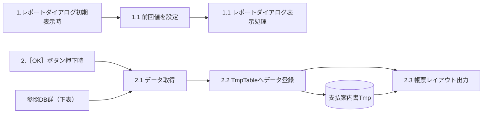
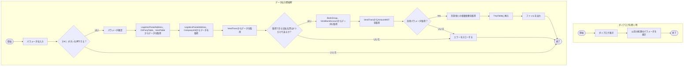

# FO-014 支払案内書 詳細設計書

<a id="sheet-29"></a>
## 1. はじめに

### 1.1 文書情報・共通ヘッダー

| 項目 | 内容 |
| --- | --- |
| 機能ID | FO-014 |
| 機能名称 | 支払案内書 |
| 文書名 | FO-014_詳細設計書_支払案内書 |
| プロジェクト | 会計システム刷新プロジェクト（LIBRA） |
| 宛先 | サンスター株式会社　御中 |
| システム | Dynamics365 for Finance and Operations |
| 機能分類 | 債権・債務 |
| 版数 | 第1.13版 |
| 文書日付・更新日 | 2025-05-23 |
| 作成日・作成者 | 2024-06-03／JBS秋信 |
| 更新者 | JBS秋信 |
| 作成会社 | 日本ビジネスシステムズ株式会社 |
| JBS承認日・承認者 | 2024-06-06／JBS加藤 |
| 基本設計部確認日・確認者 | 2024-07-29／サンスター藤田 |

表紙・オブジェクト一覧・プログラムフロー図は「詳細設計書」、その他の共通ヘッダーは「基本設計書」。表記の確認は[Q01](../qa/FO-014_詳細設計書_支払案内書.md#q01)。

### 1.2 共通前提・適用範囲

<a id="common-payment-scope"></a>
**CR01 対象支払**：規定支払「当月計上翌月20日払」の銀行振込、および期日振込。仕入先支払仕訳帳で転記済みのものを対象とする。レビューNo.11では「1件の振込に対し、1支払案内書を発行」と回答されている。

<a id="common-master"></a>
**CR02 仕入先マスタの運用**：1仕入先に登録する口座情報は1つ、住所情報は1つ。出力対象の仕入先には住所が登録されていること。

<a id="common-currency"></a>
**CR03 通貨**：表示通貨はJPY固定。本帳票とその金額表示へ適用する。他の機能や仕入先マスタ全体の通貨制限には拡大しない。

共通前提の出典は[処理概要](#sheet-20)。1件の振込と帳票の対応については[レビュー指摘事項](#sheet-39)およびQAの確認済みレビューR11を参照する。

<a id="sheet-20"></a>
## 2. 処理概要

### 2.1 開発目的

標準機能で支払案内書に対応できる機能がないため、本機能を開発する。対象支払は[CR01](#common-payment-scope)に示す2種類。

### 2.2 前提条件

転記済みの支払を対象とし、仕入先の口座・住所は各1つとする。[CR01](#common-payment-scope)・[CR02](#common-master)を適用する。

### 2.3 使用タイミング

月次。

### 2.4 開発内容

1. 仕入先への振込金額の通知のための帳票を作成する。
2. 同じ内容をCSVで出力する。CSVの詳細な出力契約は[Q11](../qa/FO-014_詳細設計書_支払案内書.md#q11)。

### 2.5 制限事項

[CR03](#common-currency)のJPY固定と、[CR02](#common-master)の住所登録済み条件を適用する。

<a id="sheet-33"></a>
## 3. テーブル一覧

### 3.1 使用テーブル

| No. | 種別 | 論理名 | 物理名 | I/O | 備考 |
| --- | --- | --- | --- | --- | --- |
| 1 | テーブル | 支払案内書Tmp | `SJ_PaymentNotificationTmp` | I/O | アドオン |
| 2 | テーブル | 仕入先 | `VendTable` | I |  |
| 3 | テーブル | 住所 | `LogisticsPostalAddress` | I |  |
| 4 | テーブル | グローバルアドレス帳 | `DirPartyAddress` | I |  |
| 5 | テーブル | 法人 | `CompanyInfo` | I |  |
| 6 | テーブル | 通信の詳細 | `LogisticsElectronicAddress` | I |  |
| 7 | テーブル | 仕入先の銀行口座 | `VendBankAccount` | I |  |
| 8 | テーブル | 関係者と場所の関係 | `DirPartyLocation` | I |  |
| 9 | テーブル | 銀行グループ | `BankGroup` | I |  |
| 10 | テーブル | 仕入先トランザクション | `VendTrans` | I |  |
| 11 | テーブル | 一般仕訳入力 | `GeneralJournalEntry` | I |  |
| 12 | テーブル | 一般仕訳帳勘定項目 | `GeneralJournalAccountEntry` | I |  |
| 13 | テーブル | 汎用パラメータ | `SJ_GeneralParameter` | I | アドオン |
| 14 | テーブル | 支払仕訳帳手数料 | `CustVendPaymJournalFee` | I |  |
| 15 | テーブル | 仕訳帳明細行 | `LedgerJournalTrans` | I |  |

テーブル一覧の`DirPartyAddress`とイベント説明の`DirPartyTable`、一覧にない`MainAccount`等の対応は[Q03](../qa/FO-014_詳細設計書_支払案内書.md#q03)。取得元を推測して置き換えない。

<a id="sheet-21"></a>
## 4. DFD

### 4.1 イベント・機能・DBの関係



原図でまとめられた参照DB群は、仕入先、住所、グローバルアドレス帳、法人、通信の詳細、仕入先の銀行口座、関係者と場所の関係、銀行グループ、仕入先トランザクション、一般仕訳入力、一般仕訳帳勘定科目、汎用パラメータ、支払仕訳帳手数料、仕訳帳明細行である。

原図の2つの「支払案内書Tmp」表示は、同じ論理テーブルの登録先・帳票の参照元として上図に表した。参照DB群からの接続はデータ取得への参照関係であり、個々のテーブルを読み込む順序を新設していない。

DFDの「1.1 レポートダイアログ表示処理」は原表記を保持。イベント説明との処理番号の対応は[Q10](../qa/FO-014_詳細設計書_支払案内書.md#q10)。

<a id="sheet-32"></a>
## 5. イベント説明

### 5.1 レポートダイアログ初期表示

**1-1. 前回値を設定**：イベント説明では、支払年月日・仕入先・支払方法の前回入力値をダイアログへ設定すると記載されている。

ただし「画面項目説明」と確認済みレビューR09では、支払年月日の初期値を空欄とする。日付欄を前回値で固定する要件としては扱わず、この記載差を保持する。仕入先・支払方法の前回設定値は法人ごとに保持する。

**1-2. レポートダイアログ表示処理**。

### 5.2 ［OK］ボタン押下時

**2-1. データ取得**：仕入先・支払方法ごとにデータを取得する。一件も取得できない場合はSJ00343を表示して処理を終了する。

原資料の反復範囲は「2-1-1～2-1-5」。その後に記載される「2-1-6 支払情報」の範囲との関係は[Q10](../qa/FO-014_詳細設計書_支払案内書.md#q10)で確認する。以下では原資料の全取得処理を掲載し、2-1-6を脱落させない。

#### 2-1-1. 支払先（仕入先）情報

**取得項目**

- [住所.郵便番号(ZipCode)]
- [住所.都道府県(State)]
- [住所.市町村(City)]
- [住所.住所(Street)]
- [住所.建物名 (補足)(BuildingCompliment)]
- [グローバルアドレス帳.名前(Name)]
- [仕入先.仕入先(AccountNum)]

**取得テーブル**：`LogisticsPostalAddress`、`DirPartyTable`、`VendTable`。

**結合条件**

| 結合 | 条件 |
| --- | --- |
| Inner | LogisticsPostalAddress.Location = DirPartyTable.PrimaryAddressLocation |
| Inner | DirPartyTable.RecId = VendTable.Party |

**抽出条件（AND）**

| 対象 | 条件 |
| --- | --- |
| VendTable.AccountNum | 画面.仕入先と一致 |

テーブル一覧との物理名差は[Q03](../qa/FO-014_詳細設計書_支払案内書.md#q03)。複数入力・範囲指定との対応は第6章に従う。

#### 2-1-2-1. 支払元（法人）の住所・会社名

**取得項目**

- [住所.郵便番号(ZipCode)]
- [住所.住所(Street)]
- [法人.名前(Name)]

**取得テーブル**：`LogisticsPostalAddress`、`CompanyInfo`（結合に`DirPartyLocation`を使用）。

**結合条件**

| 結合 | 条件 |
| --- | --- |
| Inner | LogisticsPostalAddress.Location = DirPartyLocation.Location |
| Inner | DirPartyLocation.Party = CompanyInfo.RecId |

**抽出条件（AND）**

| 対象 | 条件 |
| --- | --- |
| DirPartyLocation.IsPrimary | True |
| CompanyInfo.DataArea | ログインしている法人のCompanyInfo.DataArea |

取得項目はCompanyInfo.Nameだが、後続の出力仕様にはDirPartyTable.Nameとも記載される。[Q03](../qa/FO-014_詳細設計書_支払案内書.md#q03)。

#### 2-1-2-2. 支払元の連絡先

**取得項目**

- [連絡先の電話番号/住所(Locator)]
- [説明(Description)]
- [連絡先の電話番号/住所(Locator)]

**取得テーブル**：`LogisticsElectronicAddress`（`DirPartyLocation`と結合）。

**結合条件**

| 結合 | 条件 |
| --- | --- |
| 原資料は結合種別空欄 | LogisticsElectronicAddress.Location = DirPartyLocation.Location |

**抽出条件（AND）**

| 対象 | 条件 |
| --- | --- |
| LogisticsElectronicAddress.IsPostalAddress | NoYes::No（0：いいえ） |
| DirPartyLocation.Party | ログイン法人のCompanyInfo.RecId |
| LogisticsElectronicAddress.ElectronicAddressRoles | like "%支払案内書%" |

電話：Type = LogisticsElectronicAddressMethodType::Phone。Locatorを電話番号、Descriptionを問合せ先部署名として取得する。

FAX：Type = LogisticsElectronicAddressMethodType::Fax。Locatorを取得する。目的は完全一致ではなく「支払案内書」を含む条件。補足説明のFAXの「説明」という記載差は[Q08](../qa/FO-014_詳細設計書_支払案内書.md#q08)。

#### 2-1-3. 支払伝票の取得

**取得項目**

- [伝票(Voucher)]
- [最終決済伝票(LastSettleVoucher)]

**取得テーブル**：`VendTrans`（`GeneralJournalEntry`、`GeneralJournalAccountEntry`と結合）。

**結合条件**

| 結合 | 条件 |
| --- | --- |
| Inner | VendTrans.Voucher = GeneralJournalEntry.SubledgerVoucher |
| Outer | GeneralJournalEntry.RecId = GeneralJournalAccountEntry.GeneralJournalEntry |

**抽出条件（AND）**

| 対象 | 条件 |
| --- | --- |
| GeneralJournalEntry.SubledgerVoucherDataAreaId | ログイン法人のCompanyInfo.DataArea |
| GeneralJournalAccountEntry.PostingType | LedgerPostingType::Bank（銀行） |
| VendTrans.TransType | LedgerTransType::Payment（支払） |
| VendTrans.PaymMode | 画面.支払方法 |
| VendTrans.TransDate | 画面.支払年月日 |
| VendTrans.AccountNum | 画面.仕入先 |

転記タイプ「銀行」で計上された伝票を取得する。複数取得した場合はSJ00353を表示して処理を終了する。

元の取得項目で取り消し線が付いた支払基準日の直接取得は、現行の取得項目に含めない。支払基準日は次の2-1-4で、最終決済伝票に紐づく債務から取得する。補足説明にある「ステータス：請求済」の適用は[Q06](../qa/FO-014_詳細設計書_支払案内書.md#q06)。

#### 2-1-4. 債務の支払基準日

**取得項目**

- [支払基準日(SJ_PaymtBaseDate)]

**取得テーブル**：`VendTrans`。

**抽出条件（AND）**

| 対象 | 条件 |
| --- | --- |
| VendTrans.Voucher | 2-1-3で取得したLastSettleVoucher（最終決済伝票） |
| VendTrans.dataAreaId | ログイン法人のCompanyInfo.DataArea |

2-1-3で取得した支払伝票に紐づく、債務の支払基準日（SJ_PaymtBaseDate）を取得する。

#### 2-1-5. 支払先銀行情報

**取得項目**

- [銀行グループ.銀行名(カナ)(NameKana_JP)]
- [銀行グループ.支店名(カナ)(BranchNameKana_JP)]
- [仕入先の銀行口座.銀行トランザクションタイプ(TransType_JP)]
- [仕入先の銀行口座.銀行口座番号(AccountNum)]
- [仕入先の銀行口座.銀行口座(カナ)(BankAccountNameKana_JP)]

**取得テーブル**：`BankGroup`、`VendBankAccount`（`VendTrans`と結合）。

**結合条件**

| 結合 | 条件 |
| --- | --- |
| Inner | BankGroup.BankGroupId = VendBankAccount.BankGroupId |
| Inner | VendBankAccount.VendAccount = VendTrans.AccountNum AND VendBankAccount.AccountID = VendTrans.ThirdPartyBankAccountId |

**抽出条件（AND）**

| 対象 | 条件 |
| --- | --- |
| VendTrans.Voucher | 2-1-3で取得した伝票 |

現在の仕入先マスタの口座を無条件に再選択するのではなく、支払伝票のThirdPartyBankAccountIdで口座を結び付ける。

#### 2-1-6-1. 支払金額

**取得項目**

- [金額(AmountMST)]

**取得テーブル**：`VendTrans`。

**抽出条件（AND）**

| 対象 | 条件 |
| --- | --- |
| VendTrans.Voucher | 2-1-3で取得した伝票 |

取得する値はAmountMST。帳票の最終支払金額はテーブル出力仕様の手数料控除式で設定する。

#### 2-1-6-2. 未収入金との相殺金額

**取得項目**

- Sum[金額(AmountMST)]

**取得テーブル**：`VendTrans`。

**抽出条件（AND）**

| 対象 | 条件 |
| --- | --- |
| VendTrans.TransType | LedgerTransType::CustVendNetting（相殺決済） |
| MONTH(VendTrans.TransDate) | MONTH(2-1-4で取得した支払基準日) |

取得額はSum[AmountMST]。この抽出欄に仕入先・法人・年の絞り込みは明記されていない。追加条件を推測せず、[Q04](../qa/FO-014_詳細設計書_支払案内書.md#q04)・[Q05](../qa/FO-014_詳細設計書_支払案内書.md#q05)へ分離する。

#### 2-1-6-3①. 預かり売掛金の主勘定コード

**取得項目**

- [値(Value)]

**取得テーブル**：`SJ_GeneralParameter`。

**抽出条件（AND）**

| 対象 | 条件 |
| --- | --- |
| SJ_GeneralParameter.FunctionId | SJ_FunctionIdEnum::COMMON（共通） |
| SJ_GeneralParameter.ItemId | MAINACCOUNT |
| SJ_GeneralParameter.Key | 1 |

取得できない場合はSJ00224を表示し処理を終了する。設定例のValueは2090144（預り（売掛金））。コードをプログラムへ固定する指示ではない。メッセージ%1の原表記は[Q09](../qa/FO-014_詳細設計書_支払案内書.md#q09)。

#### 2-1-6-3②. 預かり売掛金との相殺金額

**取得項目**

- Sum[金額(AmountMST)]

**取得テーブル**：`VendTrans`（`GeneralJournalEntry`、`GeneralJournalAccountEntry`、`MainAccount`と結合）。

**結合条件**

| 結合 | 条件 |
| --- | --- |
| Inner | VendTrans.Voucher = GeneralJournalEntry.SubledgerVoucher |
| Outer | GeneralJournalEntry.RecId = GeneralJournalAccountEntry.GeneralJournalEntry |
| Inner | GeneralJournalAccountEntry.MainAccount = MainAccount.RecId |

**抽出条件（AND）**

| 対象 | 条件 |
| --- | --- |
| GeneralJournalEntry.SubledgerVoucherDataAreaId | ログイン法人のCompanyInfo.DataArea |
| GeneralJournalAccountEntry.PostingType | LedgerPostingType::LedgerJournal（仕訳元帳） |
| MainAccount.MainAccountId | 原表記：2-1-5-3①で取得した[値] |
| VendTrans.TransType | LedgerTransType::Payment（支払） |
| VendTrans.PromissoryNoteStatus | CustVendNegInstStatus::Invoiced（請求済） |
| MONTH(VendTrans.TransDate) | MONTH(2-1-4で取得した支払基準日) |

取得額はSum[AmountMST]。主勘定参照の処理番号は[Q10](../qa/FO-014_詳細設計書_支払案内書.md#q10)。仕入先の範囲は[Q04](../qa/FO-014_詳細設計書_支払案内書.md#q04)、年を含む期間条件は[Q05](../qa/FO-014_詳細設計書_支払案内書.md#q05)。

#### 2-1-6-4. 銀行手数料金額

**取得項目**

- [手数料金額(FeeValue)]

**取得テーブル**：`CustVendPaymJournalFee`（`LedgerJournalTrans`と結合）。

**結合条件**

| 結合 | 条件 |
| --- | --- |
| Inner | CustVendPaymJournalFee.RefRecId = LedgerJournalTrans.RecId |

**抽出条件（AND）**

| 対象 | 条件 |
| --- | --- |
| LedgerJournalTrans.Voucher | 2-1-3で取得した伝票 |
| LedgerJournalTrans.dataAreaId | ログイン法人のCompanyInfo.DataArea |

FeeValueを取得する。帳票出力仕様のGeneralJournalAccountEntry.AccountingCurrencyAmount、補足説明の旧取得表現とは区別して保持する。[Q07](../qa/FO-014_詳細設計書_支払案内書.md#q07)。

### 5.3 一時テーブル登録と帳票出力

**2-2. TmpTableへデータ登録**：2-1で取得したデータをSJ_PaymentNotificationTmpへ登録する。項目設定は第11章「テーブル出力仕様」。

**2-3. 帳票レイアウト出力**：帳票を出力する。出力値・書式は第10章「帳票出力仕様」。

### 5.4 メッセージ

| ID | 種別 | 発生条件 | メッセージ | 置換値 |
| --- | --- | --- | --- | --- |
| SJ00343 | 情報ログ／Warning | 対象データ0件 | 入力されたパラメーターでは%1の対象となるデータは存在しません。 | %1：支払案内書（ラベルSJ00701） |
| SJ00353 | 情報ログ／Warning | 支払伝票を複数取得 | 仕入先：%1にて、<br>複数支払伝票を取得しました。<br>(支払年月日：%2,支払方法：%3) | %1：処理中の仕入先、%2：画面.支払年月日、%3：画面.支払方法 |
| SJ00224 | 情報ログ／Error | 汎用パラメータを取得不可 | 汎用パラメータに該当データが存在しません。<br>機能ID 「%1」、項目ID 「%2」、Key 「%3」 | %1：原資料にFO-014とCOMMONの併記（Q09）、%2：MAINACCOUNT、%3：1 |

<a id="sheet-41"></a>
## 6. 画面項目説明

### 6.1 画面項目

| 項目 | 種類 | 入力 | 必須（項目説明） | 初期値（項目説明） | 入力方法・補足 |
| --- | --- | --- | --- | --- | --- |
| タイトル | タイトル | 不可 | 対象外 | 支払案内書 | Caption：支払案内書 |
| 支払年月日 | 日付 | 可 | 必須 | 空欄 | YYYY/MM/DD |
| 仕入先 | テキスト | 可 | 必須 | 前回設定値 | 仕入先コードでルックアップ。「,」で複数入力、「..」で範囲指定。前回設定値は法人ごとに保持。 |
| 支払方法 | テキスト | 可 | 必須 | 前回設定値 | 支払方法でルックアップ。「,」で複数入力。前回設定値は法人ごとに保持。 |

支払年月日の空欄初期値は確認済みレビューR09にも明記される。イベント説明の前回値設定とは記載差を残す。支払方法の必須欄○と、レビューR11の「任意」の関係は[Q02](../qa/FO-014_詳細設計書_支払案内書.md#q02)。

仕入先の「..」は範囲指定である。支払方法にも範囲指定があるとは記載されていないため、適用を拡張しない。レビューR07の「10件くらい」は要望文であり、入力上限10件の確定仕様にはしない。

<a id="sheet-13"></a>
## 7. 帳票レイアウト

### 7.1 帳票属性

| 項目 | 指定 |
| --- | --- |
| 帳票タイトル | 支払案内書 |
| 帳票タイプ | SSRS |
| 用紙サイズ・向き | A4・縦 |
| フォント | ＭＳ ゴシック |
| 自動サイズ調整 | 原資料空欄 |
| 余白（cm） | 左・右・上・下とも原資料空欄 |
| テーブルソート設定 | 原資料空欄 |

未指定の印刷属性は[Q12](../qa/FO-014_詳細設計書_支払案内書.md#q12)。

### 7.2 帳票レイアウト（HTML）

<section id="fo014-report" aria-label="お支払案内書" style="border:1px solid #777;box-sizing:border-box;max-width:860px;overflow:hidden;background:#fff;padding:16px;margin:12px 0">
<article style="font-family:'ＭＳ ゴシック','MS Gothic',sans-serif;font-size:10pt;line-height:1.6;overflow-wrap:anywhere">
  <div style="display:grid;grid-template-columns:minmax(0,3fr) minmax(0,2fr);gap:22px">
    <div style="border:1px solid #aaa;padding:12px;align-self:start"><span id="fo014-report-zip" style="background:#fff0cb;border:1px solid #bbb;padding:3px 6px">〒 [支払先郵便番号]</span><p><span id="fo014-report-addr" style="background:#fff0cb;border:1px solid #bbb;padding:3px 6px">[支払先住所]</span></p><p><span id="fo014-report-vendor" style="background:#fff0cb;border:1px solid #bbb;padding:3px 6px">[支払先会社名]</span>　様</p></div>
    <div><p style="text-align:right"><span id="fo014-report-issue" style="background:#fff0cb;border:1px solid #bbb;padding:3px 6px">[発行日]</span></p><p>お取引先コード：<span id="fo014-report-code" style="background:#fff0cb;border:1px solid #bbb;padding:3px 6px">[支払先コード]</span></p><p><span id="fo014-report-companyzip" style="background:#fff0cb;border:1px solid #bbb;padding:3px 6px">〒 [支払元郵便番号]</span><br><span id="fo014-report-companyaddr" style="background:#fff0cb;border:1px solid #bbb;padding:3px 6px">[支払元住所]</span><br><span id="fo014-report-company" style="background:#fff0cb;border:1px solid #bbb;padding:3px 6px">[支払元会社名]</span></p></div>
    <div><h4 style="font-size:14pt;margin:12px 0">お支払案内書</h4><p>拝啓　貴社益々ご隆盛のこととお喜び申しあげます。<br>平素は格別のお引き立てにあずかり厚くお礼申しあげます。<br>さて、弊社の納入代金を下記の通りお支払いしますので<br>ご案内します。<br><br>今後ともご支援のほどよろしくお願い申しあげます。</p><p style="text-align:right">敬具</p></div>
    <div style="align-self:center">お問合せ部署<br><span id="fo014-report-dept" style="background:#fff0cb;border:1px solid #bbb;padding:3px 6px">[問合せ先部署名]</span><br>TEL：<span id="fo014-report-tel" style="background:#fff0cb;border:1px solid #bbb;padding:3px 6px">[問合せ先TEL]</span><br>FAX：<span id="fo014-report-fax" style="background:#fff0cb;border:1px solid #bbb;padding:3px 6px">[問合せ先FAX]</span></div>
  </div>
  <p style="text-align:center;margin:18px 0">ー　記　ー</p>
  <p>１．弊社仕入月度　<span id="fo014-report-month" style="background:#fff0cb;border:1px solid #bbb;padding:3px 6px">[仕入月度]</span></p>
  <p>２．お支払金額　　<span id="fo014-report-amount" style="background:#fff0cb;border:1px solid #bbb;padding:3px 6px">[支払金額]</span> 円</p>
  <p>３．振込日　　　　<span id="fo014-report-transfer" style="background:#fff0cb;border:1px solid #bbb;padding:3px 6px">[振込日]</span></p>
  <p>４．振込銀行</p>
  <div style="overflow-x:auto"><table border="1" cellpadding="6" style="border-collapse:collapse;width:100%"><tbody>
    <tr><th>振込先</th><td colspan="3"><span id="fo014-report-bank" style="background:#fff0cb;border:1px solid #bbb;padding:3px 6px">[振込先]</span></td></tr>
    <tr><th>預金種別</th><td><span id="fo014-report-type" style="background:#fff0cb;border:1px solid #bbb;padding:3px 6px">[預金種別]</span></td><th>口座番号</th><td><span id="fo014-report-account" style="background:#fff0cb;border:1px solid #bbb;padding:3px 6px">[口座番号]</span></td></tr>
    <tr><th>口座名称</th><td colspan="3"><span id="fo014-report-accountname" style="background:#fff0cb;border:1px solid #bbb;padding:3px 6px">[口座名称]</span></td></tr>
  </tbody></table></div>
  <p>５．お支払金額の内訳</p>
  <table border="1" cellpadding="6" style="border-collapse:collapse;max-width:100%;min-width:65%"><tbody>
    <tr><th colspan="2">納入金額</th><td style="text-align:right"><span id="fo014-report-delivery" style="background:#fff0cb;border:1px solid #bbb;padding:3px 6px">[納入金額]</span> 円</td></tr>
    <tr><th rowspan="2" style="writing-mode:vertical-rl">相殺</th><th>物品代金</th><td style="text-align:right"><span id="fo014-report-goods" style="background:#fff0cb;border:1px solid #bbb;padding:3px 6px">[物品代金]</span> 円</td></tr>
    <tr><th>振込手数料</th><td style="text-align:right"><span id="fo014-report-fee" style="background:#fff0cb;border:1px solid #bbb;padding:3px 6px">[振込手数料]</span> 円</td></tr>
    <tr><th colspan="2">差引支払金額</th><td style="text-align:right">[差引支払金額] 円</td></tr>
  </tbody></table>
</article>
</section>

### 7.3 枠外の説明

角括弧は原資料の差し込み項目。上記は静的な仕様レイアウトで、実行時の値ではない。A4縦の構成と項目の対応を保持し、実印刷の余白やページ分割は[Q12](../qa/FO-014_詳細設計書_支払案内書.md#q12)に残す。出力値・書式は第10章を参照。

<a id="sheet-40"></a>
## 8. 画面レイアウト

### 8.1 起動情報

| 項目 | 内容 |
| --- | --- |
| パス | 買掛金管理 ＞ 照会およびレポート ＞ 支払案内書 |
| フォーム名 | 原資料空欄 |
| タブ名 | 原資料空欄 |

### 8.2 ダイアログ（HTML）

<section id="fo014-dialog" aria-label="支払案内書ダイアログ" style="border:1px solid #777;box-sizing:border-box;max-width:780px;overflow:hidden;background:#fff;padding:16px;margin:12px 0">
<form aria-label="支払案内書の静的ダイアログ例" style="min-height:480px;display:flex;flex-direction:column;margin:0">
  <h3 style="font-size:24px;margin:6px 0 24px">支払案内書</h3>
  <fieldset style="border:0;border-top:1px solid #bbb;margin:0;padding:12px 0"><legend style="font-size:20px;font-weight:bold">パラメーター</legend>
    <div style="display:grid;grid-template-columns:minmax(0,1fr) minmax(0,1fr);gap:20px">
      <div><label for="fo014-date">支払年月日</label><br><input id="fo014-date" type="text" value="2024/08/20" size="14" required disabled style="max-width:90%"></div>
      <div><label for="fo014-vendor">仕入先</label><br><input id="fo014-vendor" type="text" value="1111111" size="14" required disabled style="max-width:90%"></div>
      <div><label for="fo014-mode">支払方法</label><br><input id="fo014-mode" type="text" value="T" size="14" required disabled style="max-width:90%"></div>
    </div>
  </fieldset>
  <div style="margin-top:auto;text-align:right;padding-top:30px"><button type="button" disabled style="background:#2465d8;color:#fff;padding:8px 22px">OK</button> <button type="button" disabled style="padding:8px 18px">キャンセル</button></div>
</form>
</section>

### 8.3 枠外の説明

2024/08/20、1111111、Tは画面画像の例示。支払年月日の実際の初期値は第6章の空欄指定と区別する。入力部品・ボタンの無効化は仕様モックアップを実行しないためであり、実画面が入力不可という要件ではない。3項目の必須表現は項目説明に従った仮表示で、支払方法の確認事項は[Q02](../qa/FO-014_詳細設計書_支払案内書.md#q02)。

レビューで削除された「自社／他社」「仕入先From／To」「バックグラウンドの実行」は再追加しない。仕入先の複数指定は単一入力欄のカンマ、範囲は「..」で指定する。

<a id="sheet-48"></a>
## 9. 帳票レイアウト（サンプル）

### 9.1 文字幅・配置のサンプル

<section id="fo014-sample" aria-label="お支払案内書" style="border:1px solid #777;box-sizing:border-box;max-width:860px;overflow:hidden;background:#fff;padding:16px;margin:12px 0">
<article style="font-family:'ＭＳ ゴシック','MS Gothic',sans-serif;font-size:10pt;line-height:1.6;overflow-wrap:anywhere">
  <div style="display:grid;grid-template-columns:minmax(0,3fr) minmax(0,2fr);gap:22px">
    <div style="border:1px solid #aaa;padding:12px;align-self:start"><span id="fo014-sample-zip" style="padding:2px">〒XXX-XXXX</span><p><span id="fo014-sample-addr" style="padding:2px">全全全全全全全全全全全全全全全全全全全全全全全全全<br>全全全全全全全全全全全全全全全全全全全全全全全全全<br>全全全全全全全全全全全全全全全全全全全全全全全全全<br>全全全全全全全全全全全全全全全全全全全全全全全全全<br>全全全全全全全全全全全全全全全全全全全全全全全全全</span></p><p><span id="fo014-sample-vendor" style="padding:2px">全全全全全全全全全全全全全全全全全全全全全全全全全</span>　様</p></div>
    <div><p style="text-align:right"><span id="fo014-sample-issue" style="padding:2px">XXXX年XX月XX日</span></p><p>お取引先コード：<span id="fo014-sample-code" style="padding:2px">全全全全全全全全全全</span></p><p><span id="fo014-sample-companyzip" style="padding:2px">〒XXX-XXXX</span><br><span id="fo014-sample-companyaddr" style="padding:2px">全全全全全全全全全全全全全全全全全全<br>全全全全全全全全全全全全全全全全全全<br>全全全全全全全全全全全全全全全全全全</span><br><span id="fo014-sample-company" style="padding:2px">全全全全全全全全全全全全全全全全全全</span></p></div>
    <div><h4 style="font-size:14pt;margin:12px 0">お支払案内書</h4><p>拝啓　貴社益々ご隆盛のこととお喜び申しあげます。<br>平素は格別のお引き立てにあずかり厚くお礼申しあげます。<br>さて、弊社の納入代金を下記の通りお支払いしますので<br>ご案内します。<br><br>今後ともご支援のほどよろしくお願い申しあげます。</p><p style="text-align:right">敬具</p></div>
    <div style="align-self:center">お問合せ部署<br><span id="fo014-sample-dept" style="padding:2px">全全全全全全全全全全全全全全全</span><br>TEL：<span id="fo014-sample-tel" style="padding:2px">XXX-XXXX-XXXX</span><br>FAX：<span id="fo014-sample-fax" style="padding:2px">XXX-XXXX-XXXX</span></div>
  </div>
  <p style="text-align:center;margin:18px 0">ー　記　ー</p>
  <p>１．弊社仕入月度　<span id="fo014-sample-month" style="padding:2px">XXXX年XX月</span></p>
  <p>２．お支払金額　　<span id="fo014-sample-amount" style="padding:2px">###,###,###</span> 円</p>
  <p>３．振込日　　　　<span id="fo014-sample-transfer" style="padding:2px">XXXX年XX月XX日</span></p>
  <p>４．振込銀行</p>
  <div style="overflow-x:auto"><table border="1" cellpadding="6" style="border-collapse:collapse;width:100%"><tbody>
    <tr><th>振込先</th><td colspan="3"><span id="fo014-sample-bank" style="padding:2px">XXXXXXXXXXXXXXXXXXXXXXXXX XXXXXXXXXXXXXXXXXXXXXXXXX</span></td></tr>
    <tr><th>預金種別</th><td><span id="fo014-sample-type" style="padding:2px">全全全全全全全全全全</span></td><th>口座番号</th><td><span id="fo014-sample-account" style="padding:2px">XXXXXXXXXX</span></td></tr>
    <tr><th>口座名称</th><td colspan="3"><span id="fo014-sample-accountname" style="padding:2px">XXXXXXXXXXXXXXXXXXXXXXXXXXXXXXXXXXXXXXXX</span></td></tr>
  </tbody></table></div>
  <p>５．お支払金額の内訳</p>
  <table border="1" cellpadding="6" style="border-collapse:collapse;max-width:100%;min-width:65%"><tbody>
    <tr><th colspan="2">納入金額</th><td style="text-align:right"><span id="fo014-sample-delivery" style="padding:2px">###,###,###</span> 円</td></tr>
    <tr><th rowspan="2" style="writing-mode:vertical-rl">相殺</th><th>物品代金</th><td style="text-align:right"><span id="fo014-sample-goods" style="padding:2px">###,###,###</span> 円</td></tr>
    <tr><th>振込手数料</th><td style="text-align:right"><span id="fo014-sample-fee" style="padding:2px">###,###,###</span> 円</td></tr>
    <tr><th colspan="2">差引支払金額</th><td style="text-align:right">###,###,### 円</td></tr>
  </tbody></table>
</article>
</section>

### 9.2 枠外の説明

「全」「X」「###,###,###」は原資料の項目幅・書式のサンプルであり、実データや入力の初期値ではない。宛先住所の複数行、会社名と敬称、右側の支払元・問い合わせ、銀行欄と相殺内訳を保持した。最大項目長はサンプル文字数から推測せず第10章の定義を参照する。

<a id="sheet-35"></a>
## 10. 帳票出力仕様

### 10.1 共通書式

全47項目の文字サイズ欄は10。フォントは第7章のＭＳ ゴシック。折り返して全体を表示する欄はすべて「ー」であり、有効／無効を補完しない。最大項目長（項目幅）は出力側の指定で、入力許容桁数ではない。「原資料空欄」と「-」「ー」を区別する。

### 10.2 出力値と取得元

#### ヘッダー（No.1～13）

| No. | 項目名 | 出力値 | 取得元テーブル.フィールド | TmpTable.フィールド | 備考 |
| --- | --- | --- | --- | --- | --- |
| 1 | 発行日 | システム日付 | ー.ー | ー.ー |  |
| 2 | 支払先郵便番号 | 固定値「〒」＋[支払案内書Tmp].[支払先郵便番号] | LogisticsPostalAddress.ZipCode | SJ_PaymentNotificationTmp.VendZipCode |  |
| 3 | 支払先住所 | [支払案内書Tmp].[支払先住所] | LogisticsPostalAddress.Street | SJ_PaymentNotificationTmp.VendStreet | 仕入先に登録する住所は、1つ。 |
| 4 | 支払先会社名 | [支払案内書Tmp].[仕入先名] | DirPartyTable.Name | SJ_PaymentNotificationTmp.VendName |  |
| 5 | 支払先敬称 | 固定値「様」 | ー.ー | ー.ー |  |
| 6 | 支払先コード | 固定値「お取引先コード：」＋[支払案内書Tmp].[仕入先] | VendTable.AccountNum | SJ_PaymentNotificationTmp.VendAccount |  |
| 7 | 支払元郵便番号 | 固定値「〒」＋[支払案内書Tmp].[法人郵便番号] | LogisticsPostalAddress.ZipCode | SJ_PaymentNotificationTmp.CompanyZipCode |  |
| 8 | 支払元住所 | [支払案内書Tmp].[法人住所] | LogisticsPostalAddress.Street | SJ_PaymentNotificationTmp.CompanyStreet |  |
| 9 | 支払元会社名 | [支払案内書Tmp].[法人会社名] | DirPartyTable.Name | SJ_PaymentNotificationTmp.CompanyName |  |
| 10 | 問合せ先部署 | 固定値「お問合せ部署」	 | ー.ー | ー.ー |  |
| 11 | 問合せ先部署名 | [支払案内書Tmp].[法人部署名］ | LogisticsElectronicAddress.Description | SJ_PaymentNotificationTmp.CompanyDepartmentName | タイプ：電話　目的：支払案内書 |
| 12 | 問合せ先TEL | 固定値「TEL：」＋[支払案内書Tmp].[法人TEL] | LogisticsElectronicAddress.Locator | SJ_PaymentNotificationTmp.CompanyTEL | タイプ：電話　目的：支払案内書 |
| 13 | 問合せ先FAX | 固定値「FAX：」＋[支払案内書Tmp].[法人FAX] | LogisticsElectronicAddress.Locator | SJ_PaymentNotificationTmp.CompanyFAX | タイプ：FAX　目的：支払案内書 |

#### 明細の固定文言（No.14～31）

| No. | 項目名 | 出力値 | 取得元テーブル.フィールド | TmpTable.フィールド | 備考 |
| --- | --- | --- | --- | --- | --- |
| 14 | お支払案内書 | 固定値「お支払案内書」 | ー.ー | ー.ー |  |
| 15 | 固定文言 | 固定値<br>「 拝啓　 貴社益々ご隆盛のこととお喜び申しあげます。<br>平素は格別のお引き立てにあずかり厚くお礼申しあげます。<br>さて、弊社の納入代金を下記の通りお支払いしますので<br>ご案内します。<br><br>今後ともご支援のほどよろしくお願い申しあげます。」 | ー.ー | ー.ー |  |
| 16 | 敬具 | 固定値「敬具」 | ー.ー | ー.ー |  |
| 17 | 記 | 固定値「ー　記　ー」 | ー.ー | ー.ー |  |
| 18 | セクション１ | 固定値「１．弊社仕入月度」 | ー.ー | ー.ー |  |
| 19 | セクション２ | 固定値「２．お支払金額」 | ー.ー | ー.ー |  |
| 20 | セクション３ | 固定値「３．振込日」 | ー.ー | ー.ー |  |
| 21 | セクション４ | 固定値「４．振込銀行」 | ー.ー | ー.ー |  |
| 22 | 振込先 | 固定値「振込先」 | ー.ー | ー.ー |  |
| 23 | 預金種別 | 固定値「預金種別」 | ー.ー | ー.ー |  |
| 24 | 口座番号 | 固定値「口座番号」 | ー.ー | ー.ー |  |
| 25 | 口座名称 | 固定値「口座名称」 | ー.ー | ー.ー |  |
| 26 | セクション５ | 固定値「５．お支払金額の内訳」 | ー.ー | ー.ー |  |
| 27 | 納入金額 | 固定値「納入金額」 | ー.ー | ー.ー |  |
| 28 | 相殺 | 固定値「相殺」 | ー.ー | ー.ー | 縦書き |
| 29 | 物品代金 | 固定値「物品代金」 | ー.ー | ー.ー |  |
| 30 | 振込手数料 | 固定値「振込手数料」 | ー.ー | ー.ー |  |
| 31 | 差引支払金額 | 固定値「差引支払金額」 | ー.ー | ー.ー |  |

#### 明細のデータ・通貨（No.32～47）

| No. | 項目名 | 出力値 | 取得元テーブル.フィールド | TmpTable.フィールド | 備考 |
| --- | --- | --- | --- | --- | --- |
| 32 | 仕入月度 | [支払案内書Tmp].[仕入月度]をYYYY年MM月で表示 | ー.ー | SJ_PaymentNotificationTmp.PurchaseMonth |  |
| 33 | 支払金額 | [支払案内書Tmp].[支払金額] | VendTrans.AmountMST | SJ_PaymentNotificationTmp.AmountOfPayment |  |
| 34 | 支払金額（通貨） | 固定値「円」 | ー.ー | ー.ー |  |
| 35 | 振込日 | [画面].[支払年月日] | ー.ー | ー.ー |  |
| 36 | 振込先 | [支払案内書Tmp].[仕入先銀行名(カナ)] + 「 」(半角空欄)<br>+[支払案内書Tmp].[仕入先銀行支店名(カナ)] | ー.ー | ー.ー |  |
| 37 | 預金種別 | [支払案内書Tmp].[仕入先銀行銀行トランザクションタイプ] | VendBankAccount.TransType_JP | SJ_PaymentNotificationTmp.VendBankTransType |  |
| 38 | 口座番号 | [支払案内書Tmp].[仕入先銀行銀行口座番号] | VendBankAccount.AccountNum | SJ_PaymentNotificationTmp.VendBankAccountNum |  |
| 39 | 口座名称 | [支払案内書Tmp].[仕入先銀行銀行口座(カナ)] | VendBankAccount.BankAccountNameKana_JP | SJ_PaymentNotificationTmp.VendBankAccountNameKana |  |
| 40 | 納入金額 | [支払案内書Tmp].[納入金額] | ー.ー | SJ_PaymentNotificationTmp.DeliveryPaymentAmount |  |
| 41 | 納入金額（通貨） | 固定値「円」 | ー.ー | ー.ー |  |
| 42 | 物品代金 | [支払案内書Tmp].[物品代金相殺金額] | VendTrans.AmountMST | SJ_PaymentNotificationTmp.OffsetAmountForGoods | 対象データは、未収入金および預かり売掛金との相殺金額 |
| 43 | 物品代金（通貨） | 固定値「円」 | ー.ー | ー.ー |  |
| 44 | 振込手数料 | [支払案内書Tmp].[銀行振込手数料金額] | GeneralJournalAccountEntry.AccountingCurrencyAmount | SJ_PaymentNotificationTmp.BankTransferFeeAmount |  |
| 45 | 振込手数料（通貨） | 固定値「円」 | ー.ー | ー.ー |  |
| 46 | 差引支払金額 | [支払案内書Tmp].[支払金額] | VendTrans.AmountMST | SJ_PaymentNotificationTmp.AmountOfPayment |  |
| 47 | 差引支払金額（通貨） | 固定値「円」 | ー.ー | ー.ー |  |

### 10.3 項目別書式・配置

| No. | 項目名 | 書式 | フォーマット | 横位置 | 縦位置 | 最大項目長（項目幅） |
| --- | --- | --- | --- | --- | --- | --- |
| 1 | 発行日 | 日付 | YYYY年MM月DD日 | 右詰 | 下詰 | - |
| 2 | 支払先郵便番号 | テキスト | - | 左詰 | 下詰 | 10 |
| 3 | 支払先住所 | テキスト | - | 左詰 | 上詰 | 100 |
| 4 | 支払先会社名 | テキスト | - | 左詰 | 下詰 | 50 |
| 5 | 支払先敬称 | テキスト | - | 左詰 | 下詰 | - |
| 6 | 支払先コード | テキスト | - | 左詰 | 下詰 | 20 |
| 7 | 支払元郵便番号 | テキスト | - | 左詰 | 下詰 | 11 |
| 8 | 支払元住所 | テキスト | - | 左詰 | 上詰 | 36 |
| 9 | 支払元会社名 | テキスト | - | 左詰 | 下詰 | 36 |
| 10 | 問合せ先部署 | テキスト | - | 左詰 | 下詰 | - |
| 11 | 問合せ先部署名 | テキスト | - | 左詰 | 下詰 | 15 |
| 12 | 問合せ先TEL | テキスト | - | 左詰 | 下詰 | 20 |
| 13 | 問合せ先FAX | テキスト | - | 左詰 | 下詰 | 20 |
| 14 | お支払案内書 | テキスト | 原資料空欄 | 左詰 | 下詰 | - |
| 15 | 固定文言 | テキスト | 原資料空欄 | 左詰 | 上詰 | - |
| 16 | 敬具 | テキスト | 原資料空欄 | 右詰 | 下詰 | - |
| 17 | 記 | テキスト | 原資料空欄 | 中央詰 | 下詰 | - |
| 18 | セクション１ | テキスト | 原資料空欄 | 左詰 | 下詰 | - |
| 19 | セクション２ | テキスト | 原資料空欄 | 左詰 | 下詰 | - |
| 20 | セクション３ | テキスト | 原資料空欄 | 左詰 | 下詰 | - |
| 21 | セクション４ | テキスト | 原資料空欄 | 左詰 | 下詰 | - |
| 22 | 振込先 | テキスト | 原資料空欄 | 左詰 | 下詰 | - |
| 23 | 預金種別 | テキスト | 原資料空欄 | 左詰 | 下詰 | - |
| 24 | 口座番号 | テキスト | 原資料空欄 | 左詰 | 下詰 | - |
| 25 | 口座名称 | テキスト | 原資料空欄 | 左詰 | 下詰 | - |
| 26 | セクション５ | テキスト | 原資料空欄 | 左詰 | 下詰 | - |
| 27 | 納入金額 | テキスト | 原資料空欄 | 左詰 | 下詰 | - |
| 28 | 相殺 | テキスト | 原資料空欄 | 左詰 | 下詰 | - |
| 29 | 物品代金 | テキスト | 原資料空欄 | 左詰 | 下詰 | - |
| 30 | 振込手数料 | テキスト | 原資料空欄 | 左詰 | 下詰 | - |
| 31 | 差引支払金額 | テキスト | 原資料空欄 | 左詰 | 下詰 | - |
| 32 | 仕入月度 | 日付 | YYYY年MM月 | 左詰 | 下詰 | - |
| 33 | 支払金額 | テキスト | ###,###,### | 右詰 | 下詰 | 11 |
| 34 | 支払金額（通貨） | テキスト | 原資料空欄 | 左詰 | 下詰 | - |
| 35 | 振込日 | 日付 | YYYY年MM月DD日 | 左詰 | 下詰 | - |
| 36 | 振込先 | テキスト | 原資料空欄 | 左詰 | 下詰 | 51 |
| 37 | 預金種別 | テキスト | 原資料空欄 | 左詰 | 下詰 | 10 |
| 38 | 口座番号 | テキスト | 原資料空欄 | 左詰 | 下詰 | 10 |
| 39 | 口座名称 | テキスト | 原資料空欄 | 左詰 | 下詰 | 40 |
| 40 | 納入金額 | テキスト | ###,###,### | 右詰 | 下詰 | 11 |
| 41 | 納入金額（通貨） | テキスト | 原資料空欄 | 左詰 | 下詰 | - |
| 42 | 物品代金 | テキスト | ###,###,### | 右詰 | 下詰 | 11 |
| 43 | 物品代金（通貨） | テキスト | 原資料空欄 | 左詰 | 下詰 | - |
| 44 | 振込手数料 | テキスト | ###,###,### | 右詰 | 下詰 | 11 |
| 45 | 振込手数料（通貨） | テキスト | 原資料空欄 | 左詰 | 下詰 | - |
| 46 | 差引支払金額 | テキスト | ###,###,### | 右詰 | 下詰 | 11 |
| 47 | 差引支払金額（通貨） | テキスト | 原資料空欄 | 左詰 | 下詰 | - |

### 10.4 関連する記載差

法人会社名の取得元は[Q03](../qa/FO-014_詳細設計書_支払案内書.md#q03)、手数料の取得元は[Q07](../qa/FO-014_詳細設計書_支払案内書.md#q07)。TmpのVendStreetは第11章で都道府県＋市町村＋住所＋建物名と設定されるが、本シートの取得元欄はLogisticsPostalAddress.Streetと記載されているため、両者を残す。

「振込先」は銀行名（カナ）と支店名（カナ）の間に半角空白を挿入する。仕入月度はYYYY年MM月、発行日と振込日はYYYY年MM月DD日、金額は###,###,###で表示する。発行日はシステム日付、振込日は画面の支払年月日であり、同一日とはしない。

<a id="sheet-44"></a>
## 11. テーブル出力仕様

### 11.1 出力テーブル

テーブル名：`SJ_PaymentNotificationTmp`。ラベル・拡張名欄は原資料空欄。

### 11.2 項目設定

| No. | 論理名 | 物理名 | 設定内容 | 備考 |
| --- | --- | --- | --- | --- |
| 1 | 仕入先郵便番号 | `VendZipCode` | 2-1-1 で取得した、仕入先の[住所].[郵便番号] |  |
| 2 | 仕入先住所 | `VendStreet` | 2-1-1 で取得した、仕入先の[住所].[都道府県]<br>+2-1-1 で取得した、仕入先の[住所].[市町村]<br>+2-1-1 で取得した、仕入先の[住所].[住所]<br>+2-1-1 で取得した、仕入先の[住所].[建物名 (補足)] |  |
| 3 | 仕入先名 | `VendName` | 2-1-1 で取得した、仕入先の[グローバルアドレス帳].[名前] |  |
| 4 | 仕入先 | `VendAccount` | 2-1-1 で取得した、仕入先の[仕入先].[仕入先] |  |
| 5 | 法人郵便番号 | `CompanyZipCode` | 2-1-2 で取得した、支払元（法人）の[住所].[郵便番号] |  |
| 6 | 法人住所 | `CompanyStreet` | 2-1-2 で取得した、支払元（法人）の[住所].[住所] |  |
| 7 | 法人会社名 | `CompanyName` | 2-1-2 で取得した、支払元（法人）の[グローバルアドレス帳].[名前] |  |
| 8 | 法人部署名 | `CompanyDepartmentName` | 2-1-2 で取得した、支払元（法人）の[通信の詳細].[説明] | タイプ：電話　目的：支払案内書 |
| 9 | 法人TEL | `CompanyTEL` | 2-1-2 で取得した、支払元（法人）の[通信の詳細].[連絡先の電話番号/住所] | タイプ：電話　目的：支払案内書 |
| 10 | 法人FAX | `CompanyFAX` | 2-1-2 で取得した、支払元（法人）の[通信の詳細].[連絡先の電話番号/住所] | タイプ：FAX　目的：支払案内書 |
| 11 | 仕入月度 | `PurchaseMonth` | 2-1-4で取得した、[仕入先トランザクション].[支払基準日]- 1月 |  |
| 12 | 仕入先銀行名(カナ) | `VendBankNameKana` | 2-1-5 で取得した、[銀行グループ].[銀行名(カナ)] |  |
| 13 | 仕入先銀行支店名(カナ) | `VendBankBranchNameKana` | 2-1-5 で取得した、[銀行グループ].[支店名(カナ)] |  |
| 14 | 仕入先銀行トランザクションタイプ | `VendBankTransType` | 2-1-5 で取得した、[仕入先の銀行口座].[銀行トランザクションタイプ] |  |
| 15 | 仕入先銀行口座番号 | `VendBankAccountNum` | 2-1-5 で取得した、[仕入先の銀行口座].[銀行口座番号] |  |
| 16 | 仕入先銀行口座(カナ) | `VendBankAccountNameKana` | 2-1-5 で取得した、[仕入先の銀行口座].[銀行口座(カナ)] |  |
| 17 | 納入金額 | `DeliveryPaymentAmount` | No.20：支払金額 + No.18：物品代金相殺金額 + No.19：銀行手数料金額 |  |
| 18 | 物品代金相殺金額 | `OffsetAmountForGoods` | 2-1-6-2で取得した[仕入先トランザクション].[金額]<br>+ 2-1-6-3で取得した[仕入先トランザクション].[金額] | 未収入金および預かり売掛金との相殺金額 |
| 19 | 銀行手数料金額 | `BankTransferFeeAmount` | 2-1-6-4で取得した[支払仕訳帳手数料].[手数料金額] |  |
| 20 | 支払金額 | `AmountOfPayment` | (2-1-6-1で取得した[仕入先トランザクション].[金額]<br>-2-1-6-4で取得した[支払仕訳帳手数料].[手数料金額] | 例：支払額50000円、手数料660円の場合、<br>支払額(処理2-1-5-1)<br>：50000、<br>手数料(処理2-1-5-4)<br>：660、<br>⇒50000-660<br>　＝49340 |

### 11.3 金額と仕入月度の対応

```text
PurchaseMonth = 債務の支払基準日 − 1か月
OffsetAmountForGoods = 未収入金相殺額 + 預かり売掛金相殺額
BankTransferFeeAmount = 2-1-6-4で取得したFeeValue
AmountOfPayment = 2-1-6-1で取得したAmountMST − BankTransferFeeAmount
DeliveryPaymentAmount = AmountOfPayment + OffsetAmountForGoods + BankTransferFeeAmount
```

上記は原表の式を項目名で整理したもので、符号反転や絶対値変換を新設していない。原資料の例は50,000 − 660 = **49,340**。原文のNo.20には閉じ括弧の欠落があるが、元の設定内容も上表に保持した。例の参照番号「2-1-5-1／2-1-5-4」は[Q10](../qa/FO-014_詳細設計書_支払案内書.md#q10)。

口座番号はテキストとして保持し、先頭ゼロを数値変換で落とさない。

<a id="sheet-49"></a>
## 12. 補足説明 (汎用パラメータ)

### 12.1 事前設定

本機能で使用する次の汎用パラメータを事前に設定する。

| 機能ID(FunctionId) | 項目ID(ItemId) | Key(Key) | 値(Value) | 説明(Description) |
| --- | --- | --- | --- | --- |
| COMMON | MAINACCOUNT | 1 | 2090144 | 預り（売掛金） |

預り（売掛金）のコードはこの設定から取得する。2090144をプログラムに固定する指示ではない。汎用パラメータがない場合のエラーは第5章を参照。

<a id="sheet-17"></a>
## 13. 補足説明

### 13.1 問合せ先部署名・TEL・FAX

法人の「連絡先情報」を使用する。問合せ先部署名はDescription、TELは電話のLocator。条件はタイプ＝電話、目的に支払案内書を含む。FAXはイベント説明・出力仕様ではFaxのLocatorだが、補足本文は「説明」と記載されている。[Q08](../qa/FO-014_詳細設計書_支払案内書.md#q08)。


<section id="fo014-contact-phone" aria-label="法人・連絡先情報の編集（電話）" style="border:1px solid #777;box-sizing:border-box;max-width:960px;overflow:hidden;background:#fff;padding:16px;margin:12px 0">
<div style="display:grid;grid-template-columns:minmax(0,3fr) minmax(0,2fr);gap:16px">
 <div><p>組織管理 ＞ 組織 ＞ 法人</p><h4>法人　サンスター株式会社（SSJ）</h4><p>連絡先情報</p><div style="overflow-x:auto"><table border="1" cellpadding="5" style="border-collapse:collapse;width:100%;text-align:left"><thead><tr><th scope="col">説明</th><th scope="col">タイプ</th><th scope="col">連絡先の電話番号／住所</th></tr></thead><tbody><tr><td>事務管理グループ</td><td>電話</td><td>111-111-1111</td></tr><tr><td>事務管理グループ</td><td>FAX</td><td>222-222-2222</td></tr></tbody></table></div></div>
 <form aria-label="電話連絡先の静的参照例"><h4>連絡先情報の編集</h4><p><label for="fo014-contact-phone-desc">説明</label><br><input id="fo014-contact-phone-desc" value="事務管理グループ" disabled style="max-width:90%"></p><p>タイプ：電話</p><p><label for="fo014-contact-phone-number">電話</label><br><input id="fo014-contact-phone-number" value="111-111-1111" disabled style="max-width:90%"></p><p>目的：支払案内書</p><p>主要：いいえ</p><button type="button" disabled>OK</button> <button type="button" disabled>キャンセル</button></form>
</div>
</section>

<section id="fo014-contact-fax" aria-label="法人・連絡先情報の編集（FAX）" style="border:1px solid #777;box-sizing:border-box;max-width:960px;overflow:hidden;background:#fff;padding:16px;margin:12px 0">
<div style="display:grid;grid-template-columns:minmax(0,3fr) minmax(0,2fr);gap:16px">
 <div><p>組織管理 ＞ 組織 ＞ 法人</p><h4>法人　サンスター株式会社（SSJ）</h4><p>連絡先情報</p><div style="overflow-x:auto"><table border="1" cellpadding="5" style="border-collapse:collapse;width:100%;text-align:left"><thead><tr><th scope="col">説明</th><th scope="col">タイプ</th><th scope="col">連絡先の電話番号／住所</th></tr></thead><tbody><tr><td>事務管理グループ</td><td>電話</td><td>111-111-1111</td></tr><tr><td>事務管理グループ</td><td>FAX</td><td>222-222-2222</td></tr></tbody></table></div></div>
 <form aria-label="FAX連絡先の静的参照例"><h4>連絡先情報の編集</h4><p><label for="fo014-contact-fax-desc">説明</label><br><input id="fo014-contact-fax-desc" value="事務管理グループ" disabled style="max-width:90%"></p><p>タイプ：FAX</p><p><label for="fo014-contact-fax-number">FAX</label><br><input id="fo014-contact-fax-number" value="222-222-2222" disabled style="max-width:90%"></p><p>目的：支払案内書</p><p>主要：いいえ</p><button type="button" disabled>OK</button> <button type="button" disabled>キャンセル</button></form>
</div>
</section>


<!-- callout C01 | target=fo014-contact-phone-desc: 問合せ先部署名 -->
> **C01（電話レコードの説明）**：問合せ先部署名。

<!-- callout C02 | target=fo014-contact-phone-number: 問合せ先TEL -->
> **C02（電話番号）**：問合せ先TEL。

<!-- callout C03 | target=fo014-contact-phone: 条件 タイプ：電話 目的：支払案内書 -->
> **C03（電話レコードの条件）**：タイプ：電話、目的：支払案内書。

<!-- callout C04 | target=fo014-contact-fax-number: 問合せ先FAX -->
> **C04（FAX番号）**：問合せ先FAX。

<!-- callout C05 | target=fo014-contact-fax: 条件 タイプ：FAX 目的：支払案内書 -->
> **C05（FAXレコードの条件）**：タイプ：FAX、目的：支払案内書。

事務管理グループ、電話・FAX番号、SSJは画面例の値。問合せ部署を固定値にする指示ではない。


### 13.2 目的の設定

組織管理 ＞ グローバルアドレス帳 ＞ 住所と連絡先情報の目的、で設定する。

<section id="fo014-purpose" aria-label="住所と連絡先情報の目的" style="border:1px solid #777;box-sizing:border-box;max-width:1000px;overflow:hidden;background:#fff;padding:16px;margin:12px 0">
<h4>住所と連絡先情報の目的</h4><div style="overflow-x:auto"><table border="1" cellpadding="5" style="border-collapse:collapse;width:100%;text-align:left"><thead><tr><th scope="col">目的</th><th scope="col">説明</th><th scope="col">配送先住所</th><th scope="col">連絡先情報</th></tr></thead><tbody><tr><td>支払案内書</td><td>原画像は空欄</td><td>未チェック</td><td>チェック</td></tr></tbody></table></div>
</section>
画面例のチェック状態を保持。連絡先情報の用途を示すもので、任意の住所を配送先住所へ変更する指示ではない。


### 13.3 支払伝票と手数料

仕入先トランザクションのステータス＝請求済、トランザクションタイプ＝支払の伝票について、伝票トランザクションの転記タイプ＝銀行を取得する、と補足説明に記載されている。イベント2-1-3への請求済条件の適用は[Q06](../qa/FO-014_詳細設計書_支払案内書.md#q06)。

銀行手数料については、補足本文では「転記タイプ：仕訳元帳、トランザクションタイプ：手数料」。イベント2-1-6-4のFeeValue取得との関係は[Q07](../qa/FO-014_詳細設計書_支払案内書.md#q07)。

<section id="fo014-payment-voucher" aria-label="伝票トランザクションの参照例：APPM000152／2024/04/20" style="border:1px solid #777;box-sizing:border-box;max-width:1000px;overflow:hidden;background:#fff;padding:16px;margin:12px 0">
<h4>伝票トランザクションの参照例：APPM000152／2024/04/20</h4><div style="overflow-x:auto"><table border="1" cellpadding="5" style="border-collapse:collapse;width:100%;text-align:left"><thead><tr><th scope="col">勘定科目（画面表示）</th><th scope="col">勘定科目名</th><th scope="col">転記タイプ</th><th scope="col">トランザクションタイプ</th><th scope="col">通貨</th><th scope="col">金額（表示列）</th></tr></thead><tbody><tr><td>1020103-------</td><td>当座／三菱Ｕ／大阪回</td><td>銀行</td><td>空欄</td><td>JPY</td><td>110.00</td></tr><tr><td>1020103-------</td><td>当座／三菱Ｕ／大阪回</td><td>銀行</td><td>空欄</td><td>JPY</td><td>200.00</td></tr><tr><td>5420101-------</td><td>雑費（諸手数料）</td><td>仕訳元帳</td><td>手数料</td><td>JPY</td><td>110.00</td></tr><tr><td>2030101-1100332-------</td><td>買掛金</td><td>仕入先残高</td><td>空欄</td><td>JPY</td><td>200.00</td></tr></tbody></table></div>
</section>
仕訳帳番号の画面例はSSJ-000274。表示された複数明細を合計して帳票額とする条件は、この画像だけから追加しない。


### 13.4 支払先銀行口座

支払伝票の「支払」タブ ＞ 銀行 ＞ 仕入先、から取得する。仕入先マスタの「支払」＞「銀行口座」に設定している仕入先の銀行口座が設定されるという注記がある。

<section id="fo014-vendor-bank" aria-label="仕入先銀行口座の参照例" style="border:1px solid #777;box-sizing:border-box;max-width:1000px;overflow:hidden;background:#fff;padding:16px;margin:12px 0">
<h4>仕入先銀行口座の参照例</h4><div style="overflow-x:auto"><table border="1" cellpadding="5" style="border-collapse:collapse;width:100%;text-align:left"><thead><tr><th scope="col">参照画面</th><th scope="col">項目</th><th scope="col">例示値</th></tr></thead><tbody><tr><td>仕入先トランザクション／支払タブ</td><td>仕入先の銀行口座</td><td>1100332-1</td></tr><tr><td>仕入先マスタ／支払</td><td>銀行口座</td><td>1100332-1</td></tr><tr><td>仕入先マスタ／支払</td><td>支払条件</td><td>末日締翌月20日払</td></tr><tr><td>仕入先マスタ／支払</td><td>支払方法</td><td>銀行振込</td></tr><tr><td>仕入先マスタ／支払</td><td>既定の通貨</td><td>JPY</td></tr><tr><td>仕入先マスタ／支払</td><td>銀行口座番号</td><td>1234567</td></tr></tbody></table></div>
</section>
取得条件は第5章のThirdPartyBankAccountIdとの結合を保持し、参照画像の銀行口座や通貨を固定値にしない。


### 13.5 未収入金の相殺伝票

仕入先トランザクションのトランザクションタイプ＝相殺決済を取得する。

<section id="fo014-netting" aria-label="相殺決済の参照箇所" style="border:1px solid #777;box-sizing:border-box;max-width:1000px;overflow:hidden;background:#fff;padding:16px;margin:12px 0">
<h4>相殺決済の参照箇所</h4><div style="overflow-x:auto"><table border="1" cellpadding="5" style="border-collapse:collapse;width:100%;text-align:left"><thead><tr><th scope="col">画面</th><th scope="col">抽出の着眼点</th></tr></thead><tbody><tr><td>仕入先トランザクション</td><td>トランザクションタイプ：相殺決済</td></tr><tr><td>該当額</td><td>第5章2-1-6-2のSum[AmountMST]</td></tr></tbody></table></div>
</section>
参照画面では相殺決済行が選択されている。画面で周囲に見える仕入・支払行を相殺金額へ混入させない。


### 13.6 預かり売掛金の相殺伝票

仕入先トランザクションのステータス＝請求済、トランザクションタイプ＝支払の伝票について、伝票トランザクションの転記タイプ＝仕訳元帳、主勘定＝2090144（預かり売掛金）を取得する。

<section id="fo014-deposit" aria-label="預かり売掛金の参照例" style="border:1px solid #777;box-sizing:border-box;max-width:1000px;overflow:hidden;background:#fff;padding:16px;margin:12px 0">
<h4>預かり売掛金の参照例</h4><div style="overflow-x:auto"><table border="1" cellpadding="5" style="border-collapse:collapse;width:100%;text-align:left"><thead><tr><th scope="col">項目</th><th scope="col">画面・本文の値</th></tr></thead><tbody><tr><td>ステータス</td><td>請求済</td></tr><tr><td>トランザクションタイプ</td><td>支払</td></tr><tr><td>転記タイプ</td><td>仕訳元帳</td></tr><tr><td>主勘定</td><td>2090144</td></tr><tr><td>取得方法</td><td>COMMON／MAINACCOUNT／1のValueを参照</td></tr></tbody></table></div>
</section>
主勘定コードは第12章の事前設定を参照する。補足図の値をハードコードしない。


### 13.7 現行帳票の参照例

<section id="fo014-legacy" aria-label="お支払案内" style="border:1px solid #777;box-sizing:border-box;max-width:860px;overflow:hidden;background:#fff;padding:16px;margin:12px 0">
<article style="font-family:'ＭＳ ゴシック','MS Gothic',sans-serif;font-size:10pt;line-height:1.6;overflow-wrap:anywhere">
  <div style="display:grid;grid-template-columns:minmax(0,3fr) minmax(0,2fr);gap:22px">
    <div style="border:1px solid #aaa;padding:12px;align-self:start"><span id="fo014-legacy-zip" style="padding:2px">〒542-0081</span><p><span id="fo014-legacy-addr" style="padding:2px">大阪府大阪市 中央区<br>南船場1丁目15－14</span></p><p><span id="fo014-legacy-vendor" style="padding:2px">稲畑産業（株）</span>　様</p></div>
    <div><p style="text-align:right"><span id="fo014-legacy-issue" style="padding:2px">2024年01月18日</span></p><p>お取引先コード：<span id="fo014-legacy-code" style="padding:2px">2120184</span></p><p><span id="fo014-legacy-companyzip" style="padding:2px">〒569-1133</span><br><span id="fo014-legacy-companyaddr" style="padding:2px">高槻市川西町1-35-10</span><br><span id="fo014-legacy-company" style="padding:2px">サンスター株式会社</span></p></div>
    <div><h4 style="font-size:14pt;margin:12px 0">お支払案内</h4><p>拝啓　貴社益々ご隆盛のこととお喜び申しあげます。<br>平素は格別のお引き立てにあずかり厚くお礼申しあげます。<br>さて、弊社の納入代金を下記の通りお支払いしますので<br>ご案内します。<br><br>今後ともご支援のほどよろしくお願い申しあげます。</p><p style="text-align:right">敬具</p></div>
    <div style="align-self:center">お問合せ部署<br><span id="fo014-legacy-dept" style="padding:2px">製品管理チーム</span><br>TEL：<span id="fo014-legacy-tel" style="padding:2px">072-682-5619</span><br>FAX：<span id="fo014-legacy-fax" style="padding:2px">072-682-5607</span></div>
  </div>
  <p style="text-align:center;margin:18px 0">ー　記　ー</p>
  <p>１．弊社仕入月度　<span id="fo014-legacy-month" style="padding:2px">2023年12月</span></p>
  <p>２．お支払金額　　<span id="fo014-legacy-amount" style="padding:2px">29,179,992</span> 円</p>
  <p>３．振込日　　　　<span id="fo014-legacy-transfer" style="padding:2px">2024年04月25日</span></p>
  <p>４．振込銀行</p>
  <div style="overflow-x:auto"><table border="1" cellpadding="6" style="border-collapse:collapse;width:100%"><tbody>
    <tr><th>振込先</th><td colspan="3"><span id="fo014-legacy-bank" style="padding:2px">ﾐｽﾞﾎ ﾐﾅﾐｾﾝﾊﾞ</span></td></tr>
    <tr><th>預金種目</th><td><span id="fo014-legacy-type" style="padding:2px">ﾄｳｻﾞ</span></td><th>口座番号</th><td><span id="fo014-legacy-account" style="padding:2px">0100486</span></td></tr>
    <tr><th>口座名称</th><td colspan="3"><span id="fo014-legacy-accountname" style="padding:2px">ｲﾅﾊﾞﾀｻﾝｷﾞﾖｳ(ｶ</span></td></tr>
  </tbody></table></div>
  <p>５．お支払金額の内訳</p>
  <table border="1" cellpadding="6" style="border-collapse:collapse;max-width:100%;min-width:65%"><tbody>
    <tr><th colspan="2">納入金額</th><td style="text-align:right"><span id="fo014-legacy-delivery" style="padding:2px">29,180,322</span> 円</td></tr>
    <tr><th rowspan="3" style="writing-mode:vertical-rl">相殺</th><th>物品代金</th><td style="text-align:right"><span id="fo014-legacy-goods" style="padding:2px">0</span> 円</td></tr>
    <tr><th>VAN立替金</th><td style="text-align:right">0 円</td></tr>
    <tr><th>振込手数料</th><td style="text-align:right"><span id="fo014-legacy-fee" style="padding:2px">330</span> 円</td></tr>
    <tr><th colspan="2">差引支払金額</th><td style="text-align:right">29,179,992 円</td></tr>
  </tbody></table>
</article>
</section>

**枠外の説明**：上図は「現行帳票」として貼り付けられた参照例であり、新帳票の初期値ではない。旧帳票のVAN立替金は0円の表示を保持したが、第7・10章の新帳票へ追加していない。納入金額29,180,322円 − 振込手数料330円 ＝ 差引支払金額29,179,992円。発行日2024年01月18日、仕入月度2023年12月、振込日2024年04月25日は画像のままであり、日付の整合性を推測して修正しない。

<a id="sheet-39"></a>
## 14. レビュー指摘事項

このシートの13件の指摘・回答・対応・確認記録は、[QAのレビュー記録](../qa/FO-014_詳細設計書_支払案内書.md#review-records)に保持した。変更履歴ではなく、原資料の仕様判断の記録である。

仕入先のFrom／To、自社／他社、バックグラウンド実行の削除、問い合わせ部署の動的取得、支払年月日の空欄初期値、カンマによる複数指定などの確認済み事項は、対応する元シートの章から参照できる。対応済みのレビューに再回答を求めず、現在の記載と矛盾が残るものだけを選択式QAに分離する。

<a id="sheet-31"></a>
## 15. オブジェクト一覧

### 15.1 実装オブジェクト

| No. | オブジェクト名 | 属性（原表記） | 概要 |
| --- | --- | --- | --- |
| 1 | `SJ_PaymentGuideBookContract` | Class | コントラクタクラス |
| 2 | `SJ_PaymentGuideBookController` | Class | コントローラークラス |
| 3 | `SJ_PaymentGuideBookRDP` | Class | データプロバイダークラス |
| 4 | `SJ_PaymentGuideBookUIBuilder` | Class | ビルダークラス |
| 5 | `AccountsPayable.SJ_Extension` | Menus | 買掛金管理モジュール |
| 6 | `SJ_PaymentGuideBook` | Menu Items(Output) | 支払案内書ダイアログ起動用メニューアイテム |
| 7 | `SJ_PaymentGuideBookReport` | Repoters | 帳票デザイン |

No.7の属性「Repoters」とNo.1の「コントラクタクラス」は原表記を保持する。型名の修正・新しいクラスの追加は行わない。

<a id="sheet-37"></a>
## 16. プログラムフロー図

### 16.1 保存済みフロー画像の処理順



### 16.2 図の補足

上図は原画像の2系統と3つの判断分岐を保持する。原図のYes／はい／いいえは分岐の意味を変えず残す。「以前の処理のパラメータを表示」と支払年月日の空欄初期値は第5・6章の記載差を参照する。

原画像は各SQL条件、2-1-4の債務支払基準日、銀行手数料取得等を個別ノードに展開していない。第5章の詳細処理を削除したという意味ではない。SJ00343、SJ00353、SJ00224の個別発生条件は第5.4節に保持し、図の一般的な「エラー」を使って区別を消さない。
