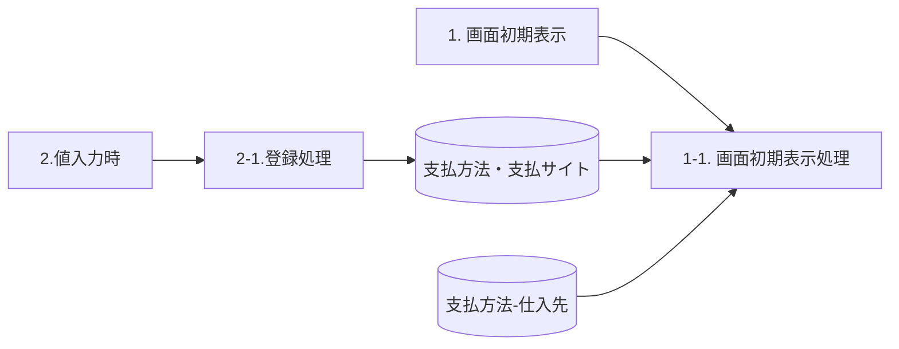
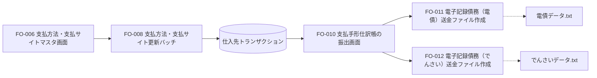

# FO-006 支払方法・支払サイトマスタ画面 設計書

## 1. はじめに

### 1.1 文書情報・共通ヘッダー

| 項目 | 内容 |
| --- | --- |
| 文書名 | FO-006_設計書_支払方法・支払サイトマスタ画面 |
| 機能ID | FO-006 |
| 機能名称 | 支払方法・支払サイトマスタ画面 |
| システム | Dynamics365 for Finance and Operations |
| 機能分類 | 債権・債務 |
| プロジェクト | 会計システム刷新プロジェクト（LIBRA） |
| 宛先 | サンスター株式会社　御中 |
| 版数（原表記） | 第版 |
| 文書日付 | 2024-10-24 |
| 作成日・作成者 | 2024-06-05／JBS井田 |
| 更新日・更新者 | 2024-10-24／JBS井田 |
| 作成会社 | 日本ビジネスシステムズ株式会社 |
| JBS承認日・承認者 | 2024-07-12／JBS加藤 |
| 基本設計部確認日・確認者 | 2024-08-19／サンスター藤田 |

表紙は「設計書」、共通ヘッダーの大半は「基本設計書」、オブジェクト一覧・プログラムフロー図のヘッダーは「詳細設計書」と記載されている。表記の統一は[Q01](../../../../../../qa/doc/00_Source/02.Design/20.設計/10.画面Addon/FO-006_設計書_支払方法・支払サイトマスタ画面.md#q01)、版数の数値がない「第版」の扱いは[Q08](../../../../../../qa/doc/00_Source/02.Design/20.設計/10.画面Addon/FO-006_設計書_支払方法・支払サイトマスタ画面.md#q08)を参照。

### 1.2 共通の入力条件

**CR01：請求金額・支払サイトの数値制約。** 処理概要の原文は「請求金額、支払サイトは正の数字のみ登録可能とする。」。画面項目説明は「マイナス入力不可」で、画面・補足の例には0もある。マイナス入力不可は保持し、0を含むかは[Q02](../../../../../../qa/doc/00_Source/02.Design/20.設計/10.画面Addon/FO-006_設計書_支払方法・支払サイトマスタ画面.md#q02)の回答前に統一しない。適用対象は本画面の請求金額と支払サイト。

**CR02：支払方法・請求金額の重複禁止。** 同一の支払方法で同一の請求金額を重複登録できない。処理概要、画面項目説明、補足説明の共通条件である。支払方法(更新後)や支払サイトが違っても、この組み合わせは一意とする。インデックスの詳細は[第9章](#sheet-36)。

CR02は、更新前後の支払方法を同値にしてはいけないという制約ではない。後者のチェックはレビューNo.3で削除済みと記録されている。

## 2. 処理概要

### 2.1 開発目的

「FO-008_支払方法・支払サイト更新バッチ」を実行するあたり、必要なマスタを管理するため。

### 2.2 前提条件

請求金額・支払サイトの数値制約は[CR01](#cr01)、同一支払方法内の請求金額の重複禁止は[CR02](#cr02)。補足説明で重複例とインデックスを示す。

### 2.3 使用タイミング

随時。

### 2.4 開発内容

支払方法・支払サイトを管理するマスタ画面を新規作成する。追加項目は「支払方法」「請求金額」「支払方法(更新後)」「支払サイト」「支払条件」。

### 2.5 制限事項

なし。

## 3. テーブル一覧

| No. | 種別 | 論理名 | 物理名 | I/O |
| --- | --- | --- | --- | --- |
| 1 | テーブル | 支払方法・支払サイト | `SJ_PaymModePaymSiteTable` | I/O |
| 2 | テーブル | 支払方法 - 仕入先 | `VendPaymModeTable` | I |

## 4. DFD

初期表示は「支払方法・支払サイト」と「支払方法-仕入先」のDB群を参照する。値入力時の登録処理は「支払方法・支払サイト」へ出力する。

## 5. イベント説明

| No. | イベント | 処理 | 処理内容 |
| --- | --- | --- | --- |
| 1 | 画面初期表示 | 1-1. 画面初期処理 | 「画面レイアウト」シート通りに表示する。 |
| 2 | 値入力時 | 2-1. 登録処理 | 入力された値を[支払方法・支払サイト]に登録する。詳細はテーブル出力仕様を参照。 |

値入力時の登録と保存ボタンの関係は[Q05](../../../../../../qa/doc/00_Source/02.Design/20.設計/10.画面Addon/FO-006_設計書_支払方法・支払サイトマスタ画面.md#q05)。

## 6. 画面レイアウト

### 6.1 起動情報

| 項目 | 内容 |
| --- | --- |
| パス（原資料） | [買掛金管理] > [支払の設定]  |
| フォーム名 | `SJ_PaymModePaymSiteForm` |
| タブ名 | 原資料は空欄 |

### 6.2 画面レイアウト（HTML）

画面の登録イメージを示す。15行は原資料の例示であり、初期値・実データ・候補値の全件一覧ではない。HTMLは静的なモックアップで、無効化は実処理を行わないための表示上の措置である。実画面の入力可否は第7章に従う。

<section id="fo006d-screen-frame" aria-labelledby="fo006d-title" style="border:1px solid #777;max-width:1100px;box-sizing:border-box;background:#fff;overflow:hidden">
  
買掛金管理 ＞ 支払の設定

  <form aria-label="支払方法・支払サイトの静的画面例" style="margin:0;padding:14px">
    

      <button id="fo006d-save" type="button" disabled>保存</button>
      <button id="fo006d-new" type="button" disabled>新規</button>
      <button id="fo006d-delete" type="button" disabled>削除</button>
    

    <h3 id="fo006d-title" style="margin:12px 0;font-size:20px;font-weight:normal">支払方法・支払サイト</h3>
    
<strong>標準ビュー</strong>

    
<label for="fo006d-filter">クィックフィルター</label> <input id="fo006d-filter" type="search" placeholder="フィルター" disabled>

    

      <table id="fo006d-grid" aria-describedby="fo006d-example-note fo006d-business-day-note" border="1" cellpadding="5" style="border-collapse:collapse;width:100%;text-align:left">
        <thead style="background:#f6f6f6"><tr><th scope="col">支払方法</th><th scope="col">請求金額</th><th scope="col">支払方法(更新後)</th><th scope="col">支払サイト</th><th scope="col">支払条件</th></tr></thead>
        <tbody>
          <tr><td><select aria-label="1行目の支払方法" required disabled><option>TU</option></select></td><td><input aria-label="1行目の請求金額" type="text" inputmode="decimal" value="0.00" size="12" disabled></td><td><select aria-label="1行目の支払方法(更新後)" required disabled><option>T</option></select></td><td><input aria-label="1行目の支払サイト" type="text" inputmode="numeric" value="0" size="5" disabled></td><td><select aria-label="1行目の支払条件" required disabled><option>PTxxx</option></select></td></tr>
          <tr><td>TU</td><td>500,000.00</td><td>W</td><td>95</td><td>PTxxx</td></tr>
          <tr><td>TQ</td><td>0.00</td><td>T</td><td>0</td><td>PTxxx</td></tr>
          <tr><td>TQ</td><td>500,000.00</td><td>W</td><td>60</td><td>PTxxx</td></tr>
          <tr><td>TP</td><td>0.00</td><td>T</td><td>0</td><td>PTxxx</td></tr>
          <tr><td>TP</td><td>500,000.00</td><td>W</td><td>40</td><td>PTxxx</td></tr>
          <tr><td>9T</td><td>0.00</td><td>T</td><td>0</td><td>PTxxx</td></tr>
          <tr><td>9T</td><td>500,000.00</td><td>9-1</td><td>95</td><td>PTxxx</td></tr>
          <tr><td>8T</td><td>0.00</td><td>T</td><td>0</td><td>PTxxx</td></tr>
          <tr><td>8T</td><td>500,000.00</td><td>8-1</td><td>60</td><td>PTxxx</td></tr>
          <tr id="fo006d-business-day-start"><td>2-1</td><td>0.00</td><td>2-1</td><td>0</td><td>PTxxx</td></tr>
          <tr><td>3-1</td><td>0.00</td><td>3-1</td><td>0</td><td>PTxxx</td></tr>
          <tr><td>3-2</td><td>0.00</td><td>3-2</td><td>0</td><td>PTxxx</td></tr>
          <tr><td>3-3</td><td>0.00</td><td>3-3</td><td>0</td><td>PTxxx</td></tr>
          <tr><td>3-4</td><td>0.00</td><td>3-4</td><td>0</td><td>PTxxx</td></tr>
        </tbody>
      </table>
    

  </form>
</section>

### 6.3 画面外の注記

<!-- callout C-UI01 | target=fo006d-grid: SSJの登録イメージ -->

<strong>C-UI01（一覧全体）</strong>：SSJの登録イメージ。

<!-- callout C-UI02 | target=fo006d-business-day-start: 支払日の非営業日の考慮を FO-008で行うため、登録対象 -->

<strong>C-UI02（2-1、3-1、3-2、3-3、3-4の5行）</strong>：支払日の非営業日の考慮をFO-008で行うため、登録対象。

## 7. 画面項目説明

### 7.1 画面操作

| 区分 | 項目 | 種類 | 入力 | 必須 | 説明 |
| --- | --- | --- | --- | --- | --- |
| タイトル | 支払方法・支払サイト | タイトル | 不可 | 対象外 | Captionを表示。 |
| アクションペイン | 保存 | ボタン | 不可 | 対象外 | コマンドボタン：保存 |
| アクションペイン | 新規 | ボタン | 不可 | 対象外 | コマンドボタン：レコードの新規追加 |
| アクションペイン | 削除 | ボタン | 不可 | 対象外 | コマンドボタン：レコードの削除 |
| カスタムフィルターグループ | クィックフィルター | フィルター | 可 | 任意 | 原資料の入力欄は○、必須欄は×。 |

ボタンの入力欄の「×」は値入力の可否欄の記載であり、ボタン押下不可という指定に読み替えない。

### 7.2 ボディの項目定義

| 項目名 | 種類 | 入力 | 必須 | 表示・入力先 | 制約・参照 |
| --- | --- | --- | --- | --- | --- |
| 支払方法 | ListBox | 可 | 必須 | 支払方法・支払サイト.支払方法 | 支払方法 - 仕入先をルックアップ。 |
| 請求金額 | 数値 | 可 | 任意 | 支払方法・支払サイト.請求金額 | マイナス入力不可。同一支払方法の請求金額は重複不可。テーブルのプロパティ設定で対応。 |
| 支払方法(更新後) | ListBox | 可 | 必須 | 支払方法・支払サイト.支払方法(更新後) | 支払方法 - 仕入先をルックアップ。 |
| 支払サイト | 数値 | 可 | 任意 | 支払方法・支払サイト.支払サイト | マイナス入力不可。テーブルのプロパティ設定で対応。 |
| 支払条件 | ListBox | 可 | 必須 | 支払方法・支払サイト.支払条件 | 支払条件をルックアップ。 |

共通制約は[CR01](#cr01)・[CR02](#cr02)。0の扱いは[Q02](../../../../../../qa/doc/00_Source/02.Design/20.設計/10.画面Addon/FO-006_設計書_支払方法・支払サイトマスタ画面.md#q02)、支払サイトの単位は[Q06](../../../../../../qa/doc/00_Source/02.Design/20.設計/10.画面Addon/FO-006_設計書_支払方法・支払サイトマスタ画面.md#q06)、桁数・小数精度は[Q07](../../../../../../qa/doc/00_Source/02.Design/20.設計/10.画面Addon/FO-006_設計書_支払方法・支払サイトマスタ画面.md#q07)。原資料の空欄や任意指定を、空文字・0の初期値指定とはみなさない。

### 7.3 ルックアップ

| 対象項目 | 参照テーブル（原表記） | 表示項目 |
| --- | --- | --- |
| 支払方法 | 支払方法 - 仕入先 | 支払方法 - 仕入先.支払方法／支払方法 - 仕入先.説明(Name) |
| 支払方法(更新後) | 支払方法 - 仕入先 | 支払方法 - 仕入先.支払方法／支払方法 - 仕入先.説明(Name) |
| 支払条件 | 支払条件 - 支払条件 | 支払条件.支払条件／支払条件.説明 |

支払条件の物理参照先と第3章の対応は[Q04](../../../../../../qa/doc/00_Source/02.Design/20.設計/10.画面Addon/FO-006_設計書_支払方法・支払サイトマスタ画面.md#q04)。

## 8. テーブル出力仕様

| 項目 | 内容 |
| --- | --- |
| テーブル名 | `SJ_PaymModePaymSiteTable` |
| ラベル | 支払方法・支払サイト |
| 拡張名 | 原資料は空欄 |

| No. | 論理名 | 物理名（原表記） | 設定内容 |
| --- | --- | --- | --- |
| 1 | 支払方法 | `PayｍMode` | 入力された[支払方法・支払サイト更新.支払方法]を設定 |
| 2 | 請求金額 | `BillingAmount` | 入力された[支払方法・支払サイト更新.請求金額]を設定 |
| 3 | 支払方法(更新後) | `UpdatedPaymMode` | 入力された[支払方法・支払サイト更新.支払方法(更新後)]を設定 |
| 4 | 支払サイト | `PaymSite` | 入力された[支払方法・支払サイト更新.支払サイト]を設定 |
| 5 | 支払条件 | `PaymTermId` | 入力された[支払方法・支払サイト更新.支払条件]を設定 |

`PayｍMode`のｍは全角である。補足説明のインデックス画像の`PaymMode`と勝手に統一しない。[Q03](../../../../../../qa/doc/00_Source/02.Design/20.設計/10.画面Addon/FO-006_設計書_支払方法・支払サイトマスタ画面.md#q03)を参照。

## 9. 補足説明

### 9.1 同一支払方法・請求金額の重複チェック

[CR02](#cr02)の重複禁止は、支払方法と請求金額の組み合わせで判定する。

| 支払方法 | 請求金額 | 支払方法(変更後) | 支払サイト | 支払条件 |
| --- | --- | --- | --- | --- |
| TU | 0 | T | 0 | PTXX |
| TU | 500000 | W | 95 | PTXX |
| TU | 500000 | 原資料は空欄 | 60 | PTXX |
| TQ | 0 | T | 0 | PTXX |
| TQ | 500000 | W | 60 | PTXX |
| 2-1 | 0 | 2-1 | 0 | PTXX |

上表は補足説明にある例示である。TU・500000の2行は支払サイトが95と60で異なるが、支払方法・請求金額の組み合わせが重複するため登録できない。

<!-- callout C-DUP01 | target=fo006d-dup-example: 同一の支払方法に 請求金額を重複して登録できません。※詳細はテーブル定義書に記載 -->
> **C-DUP01（TU・500000の重複例）**：同一の支払方法に請求金額を重複して登録できません。※詳細はテーブル定義書に記載

### 9.2 インデックス定義の抜粋

原資料の参照名：`【テーブル定義書】SJ_PaymModePaymSiteTable.xlsx`。貼り付けられた抜粋画像に記載された定義は次のとおり。

| インデックス名 | 重複許可 | フィールド |
| --- | --- | --- |
| SJ_PaymModePaymSiteTableIdx | No | PaymMode,BillingAmount |

## 10. 補足説明(機能関連図)

本機能FO-006の管理対象は「支払方法・支払サイト」。点線は、原図で各ファイル作成機能に対応して配置された出力ファイルとの関係を示す。新しい処理順を追加するものではない。

### 10.1 関連機能の注記

<!-- source-note N-FO008 | target=FO008: 支払方法、期日サイトを更新する。 -->
> **N-FO008**：支払方法、期日サイトを更新する。

<!-- source-note N-FO010 | target=FO010: 支払方法が更新されたものを対象に支払提案を行う。 -->
> **N-FO010**：支払方法が更新されたものを対象に支払提案を行う。

<!-- source-note N-FO011 | target=FO011: 支払方法が「電債」のデータを対象にファイルを作成。 -->
> **N-FO011**：支払方法が「電債」のデータを対象にファイルを作成。

<!-- source-note N-FO012 | target=FO012: 支払方法が「でんさい」のデータを対象にファイルを作成。 -->
> **N-FO012**：支払方法が「でんさい」のデータを対象にファイルを作成。

## 11. レビュー指摘事項

レビュー3件の指摘・対応・確認記録は、[QAのレビュー記録](../../../../../../qa/doc/00_Source/02.Design/20.設計/10.画面Addon/FO-006_設計書_支払方法・支払サイトマスタ画面.md#review-records)を参照。

No.3では、「JPYのみ登録する」と、支払方法／支払方法(更新後)の同値チェックが削除されている。これらを現行の制約として復活させない。同一支払方法内の請求金額の重複禁止[CR02](#cr02)とは別である。

No.2では、追加した支払条件をFO-008の期日振込の期日更新と、FO-010の電子記録債務の期日更新で使用する。No.3では、規定払いの支払基準日を末締翌20日固定とする方針が記録されている。

## 12. オブジェクト一覧

原資料の表示：**「詳細設計・開発時に記載」**。

オブジェクト名・属性・概要の具体的な行は記載されていない。第6章のフォーム名`SJ_PaymModePaymSiteForm`は保持するが、この一覧を推測して補完しない。

## 13. プログラムフロー図

原資料の表示：**「詳細設計・開発時に記載」**。

この版には具体的なプログラムフローがまだ記載されていない。別版のフローや、イベント説明から推測した図を、この章の原資料として追加しない。
