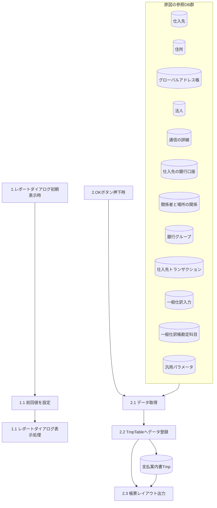

# FO-014 設計書 支払案内書

## 1. はじめに

### 1.1 文書情報・共通ヘッダー

| 項目 | 内容 |
| --- | --- |
| 機能ID | FO-014 |
| 機能名称 | 支払案内書 |
| 表紙の文書名 | FO-014_支払案内書 |
| システム | Dynamics365 for Finance and Operations |
| 機能分類 | 債権・債務 |
| プロジェクト | 会計システム刷新プロジェクト（LIBRA） |
| 宛先 | サンスター株式会社　御中 |
| 版数 | 第1.1版 |
| 文書日付 | 2024-10-17 |
| 作成日・作成者 | 2024-06-03／JBS秋信 |
| 更新日・更新者 | 2024-10-17／JBS秋信 |
| 作成会社 | 日本ビジネスシステムズ株式会社 |
| JBS承認日・承認者 | 2024-06-06／JBS加藤 |
| 基本設計部確認日・確認者 | 2024-07-29／サンスター藤田 |

表紙と共通ヘッダーをここに集約する。共通ヘッダーの「基本設計書」と後半の「詳細設計書」は表記を統一しない。[Q01](../../../../../../qa/doc/00_Source/02.Design/20.設計/12.帳票/FO-014_設計書_支払案内書.md#q01)。

### 1.2 共通条件

**CR01 対象・通貨**：規定支払「当月計上翌月20日払」の銀行振込と期日振込を対象とする。転記済みの仕入先支払仕訳帳に基づく。表示通貨はJPY固定。

**CR02 仕入先の登録運用**：1仕入先に登録する口座情報・住所情報は、それぞれ1つとする。

### 1.3 共通ヘッダーの適用範囲・差異

| 適用シート | 文書種別 | 作成日／者 | 更新日／者 |
| --- | --- | --- | --- |
| 処理概要、テーブル一覧、DFD、イベント説明、画面レイアウト、画面項目説明、帳票レイアウト、帳票出力仕様、テーブル出力仕様、補足説明 (汎用パラメータ)、補足説明、レビュー指摘事項 | 基本設計書 | 2024-06-03／JBS秋信 | 2024-10-17／JBS秋信 |
| オブジェクト一覧、プログラムフロー図 | 詳細設計書 | 2024-06-03／JBS秋信 | 2024-10-17／JBS秋信 |

同じ組合せは集約した。日付・更新者が異なるシートは区別する。

## 2. 処理概要

### 開発目的

標準機能で支払案内書に対応できる機能がないため、仕入先への振込金額を通知する帳票を作成する。

### 前提条件

[CR01](#cr01)の転記済み条件と[CR02](#cr02)の登録運用を適用する。

### 使用タイミング

月次。

### 開発内容

仕入先への振込金額の通知のための帳票を作成する。

### 制限事項

[CR01](#cr01)に従い表示通貨はJPY固定とする。

## 3. テーブル一覧

| No. | 種別 | 論理名 | 物理名 | I/O | 備考 |
| --- | --- | --- | --- | --- | --- |
| 1 | テーブル | 支払案内書Tmp | SJ_PaymentNotificationTmp | I/O | アドオン |
| 2 | テーブル | 仕入先 | VendTable | I |  |
| 3 | テーブル | 住所 | LogisticsPostalAddress | I |  |
| 4 | テーブル | グローバルアドレス帳 | DirPartyAddress | I |  |
| 5 | テーブル | 法人 | CompanyInfo | I |  |
| 6 | テーブル | 通信の詳細 | LogisticsElectronicAddress | I |  |
| 7 | テーブル | 仕入先の銀行口座 | VendBankAccount | I |  |
| 8 | テーブル | 関係者と場所の関係 | DirPartyLocation | I |  |
| 9 | テーブル | 銀行グループ | BankGroup | I |  |
| 10 | テーブル | 仕入先トランザクション | VendTrans | I |  |
| 11 | テーブル | 一般仕訳入力 | GeneralJournalEntry | I |  |
| 12 | テーブル | 一般仕訳帳勘定項目 | GeneralJournalAccountEntry | I |  |
| 13 | テーブル | 汎用パラメータ | SJ_GeneralParameter | I | アドオン |

取得元の対応は[Q10](../../../../../../qa/doc/00_Source/02.Design/20.設計/12.帳票/FO-014_設計書_支払案内書.md#q10)。

## 4. DFD

原図のDB群と参照関係を表す。DBの読み込み順序や新しい結合条件は定義しない。「1.1」の重複は原図のまま保持する。

## 5. イベント説明

### 1. レポートダイアログ初期表示

### 1-1. 前回値を設定

下記の前回入力値をダイアログに設定する。

支払年月日

仕入先

支払方法

### 1-2.レポートダイアログ表示処理

### 2. [OK]ボタン押下時

### 2-1. データ取得

以下の条件で仕入先、支払方法ごとにデータを取得する。

一件も取得できなかった場合は、メッセージを表示し処理を終了する。

**メッセージ（この処理に対応する原資料の記載）**

情報ログ ／ 対象データが存在しません。 ／ SJ00181 Info

取得した仕入先、支払方法ごとに2-1-1~2-1-5をループして処理を行う。

#### 2-1-1. 支払先（仕入先）情報を取得

**項目**

- [住所.郵便番号(ZipCode)]

- [住所.住所(Street)]

- [グローバルアドレス帳.名前(Name)]

- [仕入先.仕入先(AccountNum)]

**取得テーブル**

- [住所(LogisticsPostalAddress)]

- [グローバルアドレス帳(DirPartyTable)]

- [仕入先(VendTable)]

**結合条件**

- Inner [住所.場所(Location)] = [グローバルアドレス帳.場所(PrimaryAddressLocation)]

- Inner [グローバルアドレス帳.レコードID(RecId)] = [仕入先(VendTable).名前(Party)]

**抽出条件**

- [仕入先.仕入先(AccountNum)] = [画面.仕入先]

#### 2-1-2. 支払元情報（法人）を取得

2-1-2-1.住所情報,会社名

**項目**

- [住所.郵便番号(ZipCode)]

- [住所.住所(Street)]

- [法人.名前(Name)]

**取得テーブル**

- [住所(LogisticsPostalAddress)]

- [法人(CompanyInfo)]

**結合条件**

- Inner [住所.場所(Location)] = [関係者と場所の関係(DirPartyLocation).場所(Location)]

- Inner [関係者と場所の関係.名前(Party)] = [法人.レコードID(RecId)]

- Inner [法人.会社(DataArea)] = [仕入先(VendTable).会社(DataAreaId)]

**抽出条件**

- [関係者と場所の関係.主要(IsPrimary)] = True

- [仕入先.仕入先(AccountNum)] = [画面.仕入先]

2-1-2-2.連絡先情報

**① 法人の通信の詳細.場所を取得**

**項目**

- [場所(Location)]

**取得テーブル**

- [通信の詳細(LogisticsElectronicAddress)]

**結合条件**

- Inner [通信の詳細.レコードID(RecId)] = [グローバルアドレス帳(DirPartyTable).電話(PrimaryContactPhone)]

- Inner [グローバルアドレス帳.レコードID(RecId)] = [法人(CompanyInfo).レコードID(RecId)]

- Inner [法人.会社(DataArea)] = [仕入先(VendTable).会社(DataAreaId)]

**抽出条件**

- [仕入先.仕入先(AccountNum)] = [画面.仕入先]

**② ①で取得した通信の詳細.場所で、目的に「支払案内書」を含む電話番号、説明を取得する。**

**項目**

- [連絡先の電話番号/住所(Locator)]

- [説明(Description)]

**取得テーブル**

- [通信の詳細(LogisticsElectronicAddress)]

**抽出条件**

- [通信の詳細.場所(Location)] = 2-1-2-2 ①で取得した[場所]

- [通信の詳細.タイプ(Type)] = LogisticsElectronicAddressMethodType::Phone(電話)

- [通信の詳細.目的(ElectronicAddressRoles)] like ”%支払案内書%”

**③ ①で取得した通信の詳細.場所で、目的に「支払案内書」を含むFAXを取得する。**

**項目**

- [連絡先の電話番号/住所(Locator)]

**取得テーブル**

- [通信の詳細(LogisticsElectronicAddress)]

**抽出条件**

- [通信の詳細.場所(Location)] = 2-1-2-2 ①で取得した[場所]

- [通信の詳細.タイプ(Type)] = LogisticsElectronicAddressMethodType::Fax(FAX)

- [通信の詳細.目的(ElectronicAddressRoles)] like ”%支払案内書%”

#### 2-1-3. 支払伝票の取得

転記タイプ：銀行　で計上された伝票を取得する。

**項目**

- [伝票(Voucher)]

- [支払基準日(SJ_PaymtBaseDate)]

**取得テーブル**

- [仕入先トランザクション(VendTrans)]

**結合条件**

- Inner [仕入先トランザクション.伝票] = [一般仕訳入力(GeneralJournalEntry).伝票(SubledgerVoucher)]

- Outer [一般仕訳入力.レコードID(RecId)] = [一般仕訳帳勘定項目(GeneralJournalAccountEntry]).参照(GeneralJournalEntry)]

**抽出条件**

- [一般仕訳帳勘定項目.転記タイプ(PostingType)] = LedgerPostingType::Bank (銀行)

- [仕入先トランザクション.トランザクションタイプ(TransType) = LedgerTransType::Payment (支払)

- [仕入先トランザクション.支払方法(PaymMode)] = [画面].[支払方法]

- [仕入先トランザクション.日付(TransDate)] = [画面].[支払年月日]

- [仕入先トランザクション.仕入先(AccountNum)] = [画面].[仕入先]

複数データを取得した場合は、メッセージを出力し処理を終了する。

**メッセージ（この処理に対応する原資料の記載）**

情報ログ ／ 仕入先：%1にて、 ／ SJ00353 Warning ／ 複数支払伝票を取得しました。 (支払年月日：%2,支払方法：%3) %1：処理中の仕入先 %2：[画面].[支払年月日] %3：[画面].[支払方法]

#### 2-1-4. 支払先銀行情報を取得

2-1-3で取得した伝票から、支払先（仕入先の）の銀行情報を取得する。

**項目**

- [銀行グループ.銀行名(カナ)(NameKana_JP)]

- [銀行グループ.支店名(カナ)(BranchNameKana_JP)]

- [仕入先の銀行口座.銀行トランザクションタイプ(TransType_JP)]

- [仕入先の銀行口座.銀行口座番号(AccountNum)]

- [仕入先の銀行口座.銀行口座(カナ)(BankAccountNameKana_JP)]

**取得テーブル**

- [銀行グループ(BankGroup)]

- [仕入先の銀行口座(VendBankAccount)]

**結合条件**

- Inner [銀行グループ.銀行グループ(BankGroupId)] = [仕入先の銀行口座.銀行グループ(BankGroupId)]

- Inner ([仕入先の銀行口座.仕入先(VendAccount)] = [仕入先トランザクション(VendTrans).仕入先(AccountNum)]

- [仕入先の銀行口座.銀行口座(AccountID)] = [仕入先トランザクション.仕入先の銀行口座(ThirdPartyBankAccountId)])

**抽出条件**

- [仕入先トランザクション.伝票(Voucher)] = 2-1-3で取得した[伝票]

#### 2-1-5. 支払情報を取得

2-1-5-1. 支払金額の取得

転記タイプ：銀行　で計上された伝票を取得する。

**項目**

- [金額(AmountMST)]

**取得テーブル**

- [仕入先トランザクション(VendTrans)]

**抽出条件**

- [仕入先トランザクション.伝票(Voucher)] = 2-1-3で取得した[伝票]

2-1-5-2. 未収入金との相殺金額の取得

トランザクションタイプ：相殺決済　で計上された伝票を取得する。

**項目**

- Sum[金額(AmountMST)]

**取得テーブル**

- [仕入先トランザクション(VendTrans)]

**抽出条件**

- [仕入先トランザクション.トランザクションタイプ(TransType)] ＝ LedgerTransType::CustVendNetting (相殺決済)

- MONTH([仕入先トランザクション.日付(TransDate)]) = MONTH(2-1-3.で取得した[支払基準日])

2-1-5-3. 預かり売掛金との相殺金額の取得

**① 預かり売掛金に該当する勘定科目コードを取得する。**

**メッセージ（この処理に対応する原資料の記載）**

情報ログ ／ 汎用パラメータに該当データが存在しません。 ／ SJ00224 Error ／ 機能ID 「%1」、項目ID 「%2」、Key 「%3」 ％1：”FO-014” ／ ”COMMON” ％2：”MAINACCOUNT” ％3：”1”

取得できなかった場合、メッセージを表示し処理を終了する。

**項目**

- [値(Value)]

**取得テーブル**

- [汎用パラメータ(SJ_GeneralParameter)]

**抽出条件**

- [汎用パラメータ.機能ID(FunctionId)] ＝ SJ_FunctionIdEnum::COMMON(共通)

- [汎用パラメータ.項目ID(ItemId)] = ”MAINACCOUNT”

- [汎用パラメータ.Key(Key)] = ”1”

**② 転記タイプ：仕訳元帳、主勘定：2-1-5-3 ①で取得した値（預かり売掛金）で計上された伝票を取得する。**

**項目**

- Sum[金額(AmountMST)]

**取得テーブル**

- [仕入先トランザクション(VendTrans)]

**結合条件**

- Inner [仕入先トランザクション.伝票(Voucher)] = [一般仕訳入力(GeneralJournalEntry).伝票(SubledgerVoucher)]

- Outer [一般仕訳入力.レコードID(RecId)] = [一般仕訳帳勘定項目(GeneralJournalAccountEntry).参照(GeneralJournalEntry)]

- Inner [一般仕訳帳勘定項目.主勘定(MainAccount)] = [主勘定(MainAccount).レコードID(RecId)]

**抽出条件**

- [一般仕訳帳勘定項目.転記タイプ(PostingType)] = LedgerPostingType::LedgerJournal (仕訳元帳)

- [主勘定.主勘定(MainAccountId)] = 2-1-5-3 ①で取得した[値]

- [仕入先トランザクション.トランザクションタイプ(TransType)] = LedgerTransType::Payment (支払)

- [仕入先トランザクション.ステータス(PromissoryNoteStatus) = CustVendNegInstStatus::Invoiced (請求済)

- MONTH([仕入先トランザクション.日付(TransDate)]) = MONTH(2-1-3.で取得した[支払基準日])

2-1-5-4. 銀行手数料の取得

2-1-3で取得した伝票の転記タイプ：仕訳元帳、トランザクションタイプ：手数料　で計上された金額を取得する。

**項目**

- [金額(AccountingCurrencyAmount)]

**取得テーブル**

- [一般仕訳帳勘定項目(GeneralJournalAccountEntry)]

**結合条件**

- Inner [一般仕訳帳勘定項目.参照(GeneralJournalEntry)] = [一般仕訳入力(GeneralJournalEntry).レコードID(RecId)]

**抽出条件**

- [一般仕訳帳勘定項目.転記タイプ(PostingType)] = LedgerPostingType::LedgerJournal (仕訳元帳)

- [一般仕訳帳勘定項目.トランザクションタイプ(AssetLeaseTransactionType)] = LedgerTransType::Fee (手数料)

- [一般仕訳入力.伝票(SubledgerVoucher)] = 2-1-3で取得した[伝票]

※ 取得した金額が、プラス（借方）の場合は、マイナスに変換し2-2.TmpTableへデータ登録 を行う。

（ここでキーとなる科目は手数料になるため、支払伝票の仕入先負担の手数料は貸方になるため）

### 2-2. TmpTableへデータ登録

2-1.で取得したデータを支払案内書Tmpテーブルへ登録する。

詳細は、「テーブル出力仕様」シートを参照

### 2-3. 帳票レイアウト出力

帳票出力する。

詳細は、「帳票出力仕様」シートを参照

### 表記・条件の確認

日付初期値は[Q02](../../../../../../qa/doc/00_Source/02.Design/20.設計/12.帳票/FO-014_設計書_支払案内書.md#q02)、請求済条件は[Q04](../../../../../../qa/doc/00_Source/02.Design/20.設計/12.帳票/FO-014_設計書_支払案内書.md#q04)、相殺の対象範囲は[Q05](../../../../../../qa/doc/00_Source/02.Design/20.設計/12.帳票/FO-014_設計書_支払案内書.md#q05)、月次条件の年は[Q06](../../../../../../qa/doc/00_Source/02.Design/20.設計/12.帳票/FO-014_設計書_支払案内書.md#q06)、エラーメッセージの機能IDは[Q07](../../../../../../qa/doc/00_Source/02.Design/20.設計/12.帳票/FO-014_設計書_支払案内書.md#q07)、取得番号の対応は[Q09](../../../../../../qa/doc/00_Source/02.Design/20.設計/12.帳票/FO-014_設計書_支払案内書.md#q09)。同一区画の抽出式は原資料のAND条件として読み、条件を追加しない。

## 6. 画面レイアウト

### 起動情報

| 項目 | 原資料 |
| --- | --- |
| パス | 空欄 |
| フォーム名 | 空欄 |
| タブ名 | 空欄 |

### ダイアログ（HTML）

<section id="fo014-design-dialog" aria-label="支払案内書" style="border:1px solid #666;box-sizing:border-box;width:100%;max-width:620px;overflow:hidden;padding:16px;margin:12px 0;background:white">
<h3>支払案内書</h3><form aria-label="支払案内書の静的ダイアログ">
<fieldset><legend>パラメーター</legend>
<label for="p014-date">支払年月日</label> <input id="p014-date" type="text" value="2024/08/20" disabled required>

<label for="p014-vendor">仕入先</label> <input id="p014-vendor" value="1111111" disabled required>

<label for="p014-mode">支払方法</label> <input id="p014-mode" value="T" disabled aria-describedby="p014-required-note" data-source-required="true">
</fieldset>
<fieldset><legend>出力先</legend>
画面
</fieldset>
<button type="button" disabled>OK</button> <button type="button" disabled>キャンセル</button>
</form>
</section>

### 枠外の説明

登録例の2024/08/20、1111111、Tは初期値の指定ではない。支払方法の必須／任意はQAで確認する。無効化は静的プレビュー用で、実画面の入力不可を意味しない。

レビューで削除された自社／他社、仕入先From／To、バックグラウンド実行は台紙から復活させない。

## 7. 画面項目説明

| 項目 | 種類 | 入力 | 必須（項目説明） | 初期値（項目説明） | 入力方式・補足 |
| --- | --- | --- | --- | --- | --- |
| タイトル | タイトル | 不可 | 対象外 | 支払案内書 | Caption：支払案内書 |
| 支払年月日 | 日付 | 可 | 必須 | 空欄 | YYYY/MM/DD |
| 仕入先 | テキスト | 可 | 必須 | 前回設定値 | 仕入先コードでルックアップ。「,」複数、「..」範囲。前回値は法人ごと。 |
| 支払方法 | テキスト | 可 | 必須 | 前回設定値 | 支払方法でルックアップ。「,」で複数。前回値は法人ごと。 |

日付の初期値は確認済みレビューにも「空欄」。イベントの前回値と[Q02](../../../../../../qa/doc/00_Source/02.Design/20.設計/12.帳票/FO-014_設計書_支払案内書.md#q02)で確認する。支払方法の必須欄○とレビューの任意は[Q03](../../../../../../qa/doc/00_Source/02.Design/20.設計/12.帳票/FO-014_設計書_支払案内書.md#q03)。仕入先の範囲指定を支払方法へ拡張しない。

## 8. 帳票レイアウト

### 帳票属性

| 項目 | 指定 |
| --- | --- |
| タイトル | 支払案内書 |
| 帳票タイプ | SSRS |
| 用紙 | A4・縦 |
| フォント | ＭＳ ゴシック |
| 自動サイズ調整 | 原資料空欄 |
| 余白（cm） | 左・右・上・下とも原資料空欄 |
| テーブルソート設定 | 原資料空欄 |

### 帳票レイアウト（HTML）

<section id="fo014-design-report" aria-label="お支払案内書" style="border:1px solid #666;box-sizing:border-box;width:100%;max-width:860px;overflow:hidden;padding:16px;margin:12px 0;background:white">
<article style="font-family:'ＭＳ ゴシック','MS Gothic',sans-serif;font-size:10pt;line-height:1.6;overflow-wrap:anywhere">
  

    
〒 [支払先郵便番号]
[支払先住所]

[支払先会社名]　様

    

[発行日]

お取引先コード：[支払先コード]

〒 [支払元郵便番号] [支払元住所] [支払元会社名]

    
<h4 style="font-size:10pt;margin:12px 0">お支払案内書</h4>
拝啓　貴社益々ご隆盛のこととお喜び申しあげます。 平素は格別のお引き立てにあずかり厚くお礼申しあげます。 さて、弊社の納入代金を下記の通りお支払いしますので ご案内します。  今後ともご支援のほどよろしくお願い申しあげます。

敬具

    
お問合せ部署 [問合せ先部署名] TEL：[問合せ先TEL] FAX：[問合せ先FAX]

  

  
ー　記　ー

  
１．弊社仕入月度　[仕入月度]

  
２．お支払金額　　[支払金額] 円

  
３．振込日　　　　[振込日]

  
４．振込銀行

  
<table border="1" cellpadding="6" style="border-collapse:collapse;width:100%"><tbody>
    <tr><th>振込先</th><td colspan="3">[振込先]</td></tr>
    <tr><th>預金種別</th><td>[預金種別]</td><th>口座番号</th><td>[口座番号]</td></tr>
    <tr><th>口座名称</th><td colspan="3">[口座名称]</td></tr>
  </tbody></table>

  
５．お支払金額の内訳

  <table border="1" cellpadding="6" style="border-collapse:collapse;max-width:100%;min-width:65%"><tbody>
    <tr><th colspan="2">納入金額</th><td style="text-align:right">[納入金額] 円</td></tr>
    <tr><th rowspan="2" style="writing-mode:vertical-rl">相殺</th><th>物品代金</th><td style="text-align:right">[物品代金] 円</td></tr>
    <tr><th>振込手数料</th><td style="text-align:right">[振込手数料] 円</td></tr>
    <tr><th colspan="2">差引支払金額</th><td style="text-align:right">[差引支払金額] 円</td></tr>
  </tbody></table>
</article>
</section>

### 枠外の説明

角括弧は差し込み項目を表す。入力値や新しい固定値ではない。原資料の帳票順序・外枠・10ポイント指定を保ち、未指定の印刷属性は[Q11](../../../../../../qa/doc/00_Source/02.Design/20.設計/12.帳票/FO-014_設計書_支払案内書.md#q11)に残す。

## 9. 帳票レイアウト（サンプル）

<section id="fo014-design-sample" aria-label="お支払案内書" style="border:1px solid #666;box-sizing:border-box;width:100%;max-width:860px;overflow:hidden;padding:16px;margin:12px 0;background:white">
<article style="font-family:'ＭＳ ゴシック','MS Gothic',sans-serif;font-size:10pt;line-height:1.6;overflow-wrap:anywhere">
  

    
〒XXX-XXXX
全全全全全全全全全全全全全全全全全全全全全全全全全 全全全全全全全全全全全全全全全全全全全全全全全全全 全全全全全全全全全全全全全全全全全全全全全全全全全 全全全全全全全全全全全全全全全全全全全全全全全全全 全全全全全全全全全全全全全全全全全全全全全全全全全

全全全全全全全全全全全全全全全全全全全全全全全全全　様

    

XXXX年XX月XX日

お取引先コード：全全全全全全全全全全

〒XXX-XXXX 全全全全全全全全全全全全全全全全全全 全全全全全全全全全全全全全全全全全全 全全全全全全全全全全全全全全全全全全 全全全全全全全全全全全全全全全全全全

    
<h4 style="font-size:10pt;margin:12px 0">お支払案内書</h4>
拝啓　貴社益々ご隆盛のこととお喜び申しあげます。 平素は格別のお引き立てにあずかり厚くお礼申しあげます。 さて、弊社の納入代金を下記の通りお支払いしますので ご案内します。  今後ともご支援のほどよろしくお願い申しあげます。

敬具

    
お問合せ部署 全全全全全全全全全全全全全全全 TEL：XXX-XXXX-XXXX FAX：XXX-XXXX-XXXX

  

  
ー　記　ー

  
１．弊社仕入月度　XXXX年XX月

  
２．お支払金額　　###,###,### 円

  
３．振込日　　　　XXXX年XX月XX日

  
４．振込銀行

  
<table border="1" cellpadding="6" style="border-collapse:collapse;width:100%"><tbody>
    <tr><th>振込先</th><td colspan="3">XXXXXXXXXXXXXXXXXXXXXXXXX XXXXXXXXXXXXXXXXXXXXXXXXX</td></tr>
    <tr><th>預金種別</th><td>全全全全全全全全全全</td><th>口座番号</th><td>XXXXXXXXXX</td></tr>
    <tr><th>口座名称</th><td colspan="3">XXXXXXXXXXXXXXXXXXXXXXXXXXXXXXXXXXXXXXXX</td></tr>
  </tbody></table>

  
５．お支払金額の内訳

  <table border="1" cellpadding="6" style="border-collapse:collapse;max-width:100%;min-width:65%"><tbody>
    <tr><th colspan="2">納入金額</th><td style="text-align:right">###,###,### 円</td></tr>
    <tr><th rowspan="2" style="writing-mode:vertical-rl">相殺</th><th>物品代金</th><td style="text-align:right">###,###,### 円</td></tr>
    <tr><th>振込手数料</th><td style="text-align:right">###,###,### 円</td></tr>
    <tr><th colspan="2">差引支払金額</th><td style="text-align:right">###,###,### 円</td></tr>
  </tbody></table>
</article>
</section>

### 枠外の説明

全角文字・X・#の繰り返しは、原資料の文字幅確認用サンプルである。実在の宛先や最大入力値の追加定義ではない。

## 10. 帳票出力仕様

項目番号1～47をキーに、出力元と書式を分けて示す。No.1～13はヘッダー、14～31は明細の項目名、32～47は明細データ。空欄・「-」・「ー」を原資料のまま区別する。

### 出力値・取得元・Tmp対応

| No. | 項目名 | 出力値 | 取得元テーブル | 取得元フィールド | TmpTable | Tmpフィールド |
| --- | --- | --- | --- | --- | --- | --- |
| 1 | 発行日 | システム日付 | ー | ー | ー | ー |
| 2 | 支払先郵便番号 | 固定値「〒」＋[支払案内書Tmp].[支払先郵便番号] | LogisticsPostalAddress | ZipCode | SJ_PaymentNotificationTmp | VendZipCode |
| 3 | 支払先住所 | [支払案内書Tmp].[支払先住所] | LogisticsPostalAddress | Street | SJ_PaymentNotificationTmp | VendStreet |
| 4 | 支払先会社名 | [支払案内書Tmp].[仕入先名] | DirPartyTable | Name | SJ_PaymentNotificationTmp | VendName |
| 5 | 支払先敬称 | 固定値「様」 | ー | ー | ー | ー |
| 6 | 支払先コード | 固定値「お取引先コード：」＋[支払案内書Tmp].[仕入先] | VendTable | AccountNum | SJ_PaymentNotificationTmp | VendAccount |
| 7 | 支払元郵便番号 | 固定値「〒」＋[支払案内書Tmp].[法人郵便番号] | LogisticsPostalAddress | ZipCode | SJ_PaymentNotificationTmp | CompanyZipCode |
| 8 | 支払元住所 | [支払案内書Tmp].[法人住所] | LogisticsPostalAddress | Street | SJ_PaymentNotificationTmp | CompanyStreet |
| 9 | 支払元会社名 | [支払案内書Tmp].[法人会社名] | DirPartyTable | Name | SJ_PaymentNotificationTmp | CompanyName |
| 10 | 問合せ先部署 | 固定値「お問合せ部署」	 | ー | ー | ー | ー |
| 11 | 問合せ先部署名 | [支払案内書Tmp].[法人部署名］ | LogisticsElectronicAddress | Description | SJ_PaymentNotificationTmp | CompanyDepartmentName |
| 12 | 問合せ先TEL | 固定値「TEL：」＋[支払案内書Tmp].[法人TEL] | LogisticsElectronicAddress | Locator | SJ_PaymentNotificationTmp | CompanyTEL |
| 13 | 問合せ先FAX | 固定値「FAX：」＋[支払案内書Tmp].[法人FAX] | LogisticsElectronicAddress | Locator | SJ_PaymentNotificationTmp | CompanyFAX |
| 14 | お支払案内書 | 固定値「お支払案内書」 | ー | ー | ー | ー |
| 15 | 固定文言 | 固定値 「 拝啓　 貴社益々ご隆盛のこととお喜び申しあげます。 平素は格別のお引き立てにあずかり厚くお礼申しあげます。 さて、弊社の納入代金を下記の通りお支払いしますので ご案内します。  今後ともご支援のほどよろしくお願い申しあげます。」 | ー | ー | ー | ー |
| 16 | 敬具 | 固定値「敬具」 | ー | ー | ー | ー |
| 17 | 記 | 固定値「ー　記　ー」 | ー | ー | ー | ー |
| 18 | セクション１ | 固定値「１．弊社仕入月度」 | ー | ー | ー | ー |
| 19 | セクション２ | 固定値「２．お支払金額」 | ー | ー | ー | ー |
| 20 | セクション３ | 固定値「３．振込日」 | ー | ー | ー | ー |
| 21 | セクション４ | 固定値「４．振込銀行」 | ー | ー | ー | ー |
| 22 | 振込先 | 固定値「振込先」 | ー | ー | ー | ー |
| 23 | 預金種別 | 固定値「預金種別」 | ー | ー | ー | ー |
| 24 | 口座番号 | 固定値「口座番号」 | ー | ー | ー | ー |
| 25 | 口座名称 | 固定値「口座名称」 | ー | ー | ー | ー |
| 26 | セクション５ | 固定値「５．お支払金額の内訳」 | ー | ー | ー | ー |
| 27 | 納入金額 | 固定値「納入金額」 | ー | ー | ー | ー |
| 28 | 相殺 | 固定値「相殺」 | ー | ー | ー | ー |
| 29 | 物品代金 | 固定値「物品代金」 | ー | ー | ー | ー |
| 30 | 振込手数料 | 固定値「振込手数料」 | ー | ー | ー | ー |
| 31 | 差引支払金額 | 固定値「差引支払金額」 | ー | ー | ー | ー |
| 32 | 仕入月度 | [支払案内書Tmp].[仕入月度]をYYYY年MM月で表示 | ー | ー | SJ_PaymentNotificationTmp | PurchaseMonth |
| 33 | 支払金額 | [支払案内書Tmp].[支払金額] | VendTrans | AmountMST | SJ_PaymentNotificationTmp | AmountOfPayment |
| 34 | 支払金額（通貨） | 固定値「円」 | ー | ー | ー | ー |
| 35 | 振込日 | [画面].[支払年月日] | ー | ー | ー | ー |
| 36 | 振込先 | [支払案内書Tmp].[仕入先銀行名(カナ)] + 「 」(半角空欄) +[支払案内書Tmp].[仕入先銀行支店名(カナ)] | ー | ー | ー | ー |
| 37 | 預金種別 | [支払案内書Tmp].[仕入先銀行銀行トランザクションタイプ] | VendBankAccount | TransType_JP | SJ_PaymentNotificationTmp | VendBankTransType |
| 38 | 口座番号 | [支払案内書Tmp].[仕入先銀行銀行口座番号] | VendBankAccount | AccountNum | SJ_PaymentNotificationTmp | VendBankAccountNum |
| 39 | 口座名称 | [支払案内書Tmp].[仕入先銀行銀行口座(カナ)] | VendBankAccount | BankAccountNameKana_JP | SJ_PaymentNotificationTmp | VendBankAccountNameKana |
| 40 | 納入金額 | [支払案内書Tmp].[納入金額] | ー | ー | SJ_PaymentNotificationTmp | DeliveryPaymentAmount |
| 41 | 納入金額（通貨） | 固定値「円」 | ー | ー | ー | ー |
| 42 | 物品代金 | [支払案内書Tmp].[物品代金相殺金額] | VendTrans | AmountMST | SJ_PaymentNotificationTmp | OffsetAmountForGoods |
| 43 | 物品代金（通貨） | 固定値「円」 | ー | ー | ー | ー |
| 44 | 振込手数料 | [支払案内書Tmp].[銀行振込手数料金額] | GeneralJournalAccountEntry | AccountingCurrencyAmount | SJ_PaymentNotificationTmp | BankTransferFeeAmount |
| 45 | 振込手数料（通貨） | 固定値「円」 | ー | ー | ー | ー |
| 46 | 差引支払金額 | [支払案内書Tmp].[支払金額] | VendTrans | AmountMST | SJ_PaymentNotificationTmp | AmountOfPayment |
| 47 | 差引支払金額（通貨） | 固定値「円」 | ー | ー | ー | ー |

### 書式・配置

| No. | 書式／フォーマット | 横／縦位置 | サイズ | 最大項目長（幅） | 折り返し | 備考 |
| --- | --- | --- | --- | --- | --- | --- |
| 1 | 日付／YYYY年MM月DD日 | 右詰／下詰 | 10 | - | ー |  |
| 2 | テキスト／- | 左詰／下詰 | 10 | 10 | ー |  |
| 3 | テキスト／- | 左詰／上詰 | 10 | 100 | ー | 仕入先に登録する住所は、1つ。 |
| 4 | テキスト／- | 左詰／下詰 | 10 | 50 | ー |  |
| 5 | テキスト／- | 左詰／下詰 | 10 | - | ー |  |
| 6 | テキスト／- | 左詰／下詰 | 10 | 20 | ー |  |
| 7 | テキスト／- | 左詰／下詰 | 10 | 11 | ー |  |
| 8 | テキスト／- | 左詰／上詰 | 10 | 36 | ー |  |
| 9 | テキスト／- | 左詰／下詰 | 10 | 36 | ー |  |
| 10 | テキスト／- | 左詰／下詰 | 10 | - | ー |  |
| 11 | テキスト／- | 左詰／下詰 | 10 | 15 | ー | タイプ：電話　目的：支払案内書 |
| 12 | テキスト／- | 左詰／下詰 | 10 | 20 | ー | タイプ：電話　目的：支払案内書 |
| 13 | テキスト／- | 左詰／下詰 | 10 | 20 | ー | タイプ：FAX　目的：支払案内書 |
| 14 | テキスト／ | 左詰／下詰 | 10 | - | ー |  |
| 15 | テキスト／ | 左詰／上詰 | 10 | - | ー |  |
| 16 | テキスト／ | 右詰／下詰 | 10 | - | ー |  |
| 17 | テキスト／ | 中央詰／下詰 | 10 | - | ー |  |
| 18 | テキスト／ | 左詰／下詰 | 10 | - | ー |  |
| 19 | テキスト／ | 左詰／下詰 | 10 | - | ー |  |
| 20 | テキスト／ | 左詰／下詰 | 10 | - | ー |  |
| 21 | テキスト／ | 左詰／下詰 | 10 | - | ー |  |
| 22 | テキスト／ | 左詰／下詰 | 10 | - | ー |  |
| 23 | テキスト／ | 左詰／下詰 | 10 | - | ー |  |
| 24 | テキスト／ | 左詰／下詰 | 10 | - | ー |  |
| 25 | テキスト／ | 左詰／下詰 | 10 | - | ー |  |
| 26 | テキスト／ | 左詰／下詰 | 10 | - | ー |  |
| 27 | テキスト／ | 左詰／下詰 | 10 | - | ー |  |
| 28 | テキスト／ | 左詰／下詰 | 10 | - | ー | 縦書き |
| 29 | テキスト／ | 左詰／下詰 | 10 | - | ー |  |
| 30 | テキスト／ | 左詰／下詰 | 10 | - | ー |  |
| 31 | テキスト／ | 左詰／下詰 | 10 | - | ー |  |
| 32 | 日付／YYYY年MM月 | 左詰／下詰 | 10 | - | ー |  |
| 33 | テキスト／###,###,### | 右詰／下詰 | 10 | 11 | ー |  |
| 34 | テキスト／ | 左詰／下詰 | 10 | - | ー |  |
| 35 | 日付／YYYY年MM月DD日 | 左詰／下詰 | 10 | - | ー |  |
| 36 | テキスト／ | 左詰／下詰 | 10 | 51 | ー |  |
| 37 | テキスト／ | 左詰／下詰 | 10 | 10 | ー |  |
| 38 | テキスト／ | 左詰／下詰 | 10 | 10 | ー |  |
| 39 | テキスト／ | 左詰／下詰 | 10 | 40 | ー |  |
| 40 | テキスト／###,###,### | 右詰／下詰 | 10 | 11 | ー |  |
| 41 | テキスト／ | 左詰／下詰 | 10 | - | ー |  |
| 42 | テキスト／###,###,### | 右詰／下詰 | 10 | 11 | ー | 対象データは、未収入金および預かり売掛金との相殺金額 |
| 43 | テキスト／ | 左詰／下詰 | 10 | - | ー |  |
| 44 | テキスト／###,###,### | 右詰／下詰 | 10 | 11 | ー |  |
| 45 | テキスト／ | 左詰／下詰 | 10 | - | ー |  |
| 46 | テキスト／###,###,### | 右詰／下詰 | 10 | 11 | ー |  |
| 47 | テキスト／ | 左詰／下詰 | 10 | - | ー |  |

住所の取得元はこの版ではStreet。別版のState/City等との連結式へ置換しない。FAX取得フィールドの表記差は[Q08](../../../../../../qa/doc/00_Source/02.Design/20.設計/12.帳票/FO-014_設計書_支払案内書.md#q08)。

## 11. テーブル出力仕様

テーブル名：`SJ_PaymentNotificationTmp`。ラベル：原資料空欄。拡張名：原資料空欄。

| No. | 論理名 | 物理名 | 説明 | 備考 |
| --- | --- | --- | --- | --- |
| 1 | 仕入先郵便番号 | VendZipCode | 2-1-1 で取得した、仕入先の[住所].[郵便番号] | 原資料空欄 |
| 2 | 仕入先住所 | VendStreet | 2-1-1 で取得した、仕入先の[住所].[住所] | 原資料空欄 |
| 3 | 仕入先名 | VendName | 2-1-1 で取得した、仕入先の[グローバルアドレス帳].[名前] | 原資料空欄 |
| 4 | 仕入先 | VendAccount | 2-1-1 で取得した、仕入先の[仕入先].[仕入先] | 原資料空欄 |
| 5 | 法人郵便番号 | CompanyZipCode | 2-1-2 で取得した、支払元（法人）の[住所].[郵便番号] | 原資料空欄 |
| 6 | 法人住所 | CompanyStreet | 2-1-2 で取得した、支払元（法人）の[住所].[住所] | 原資料空欄 |
| 7 | 法人会社名 | CompanyName | 2-1-2 で取得した、支払元（法人）の[グローバルアドレス帳].[名前] | 原資料空欄 |
| 8 | 法人部署名 | CompanyDepartmentName | 2-1-2 で取得した、支払元（法人）の[通信の詳細].[説明] | タイプ：電話　目的：支払案内書 |
| 9 | 法人TEL | CompanyTEL | 2-1-2 で取得した、支払元（法人）の[通信の詳細].[連絡先の電話番号/住所] | タイプ：電話　目的：支払案内書 |
| 10 | 法人FAX | CompanyFAX | 2-1-2 で取得した、支払元（法人）の[通信の詳細].[連絡先の電話番号/住所] | タイプ：FAX　目的：支払案内書 |
| 11 | 仕入月度 | PurchaseMonth | 2-1-3で取得した、[仕入先トランザクション].[支払基準日]- 1月 | 原資料空欄 |
| 12 | 仕入先銀行名(カナ) | VendBankNameKana | 2-1-4 で取得した、[銀行グループ].[銀行名(カナ)] | 原資料空欄 |
| 13 | 仕入先銀行支店名(カナ) | VendBankBranchNameKana | 2-1-4 で取得した、[銀行グループ].[支店名(カナ)] | 原資料空欄 |
| 14 | 仕入先銀行トランザクションタイプ | VendBankTransType | 2-1-4 で取得した、[仕入先の銀行口座].[銀行トランザクションタイプ] | 原資料空欄 |
| 15 | 仕入先銀行口座番号 | VendBankAccountNum | 2-1-4 で取得した、[仕入先の銀行口座].[銀行口座番号] | 原資料空欄 |
| 16 | 仕入先銀行口座(カナ) | VendBankAccountNameKana | 2-1-4 で取得した、[仕入先の銀行口座].[銀行口座(カナ)] | 原資料空欄 |
| 17 | 納入金額 | DeliveryPaymentAmount | No.20：支払金額 + No.18：物品代金相殺金額 + No.19：銀行手数料金額 | 原資料空欄 |
| 18 | 物品代金相殺金額 | OffsetAmountForGoods | 2-1-5-2で取得した[仕入先トランザクション].[金額] + 2-1-5-3で取得した[仕入先トランザクション].[金額] | 未収入金および預かり売掛金との相殺金額 |
| 19 | 銀行手数料金額 | BankTransferFeeAmount | 2-1-5-4で取得した[一般仕訳帳勘定項目].[金額] | 原資料空欄 |
| 20 | 支払金額 | AmountOfPayment | 2-1-5-1で取得した[仕入先トランザクション].[金額]の符号をプラスに変換し設定 | 原資料空欄 |

「-」と原資料空欄は区別し、初期値・更新指示を補わない。

## 12. 補足説明 (汎用パラメータ)

事前に本機能で使用する汎用パラメータを設定する。

| 機能ID | 項目ID | Key | 値 | 説明 |
| --- | --- | --- | --- | --- |
| COMMON | MAINACCOUNT | 1 | 2090144 | 預り（売掛金） |

## 13. 補足説明

### 問合せ先部署名・TEL・FAX

問合せ先部署名：「法人」の「連絡先情報」の「説明」（条件：タイプ：電話、目的：支払案内書）

問合せ先TEL：「法人」の「連絡先情報」の「電話」（条件：タイプ：電話、目的：支払案内書）

問合せ先FAX：「法人」の「連絡先情報」の「説明」（条件：タイプ：FAX、目的：支払案内書）

補足本文のFAX「説明」とイベント・出力仕様のLocatorは[Q08](../../../../../../qa/doc/00_Source/02.Design/20.設計/12.帳票/FO-014_設計書_支払案内書.md#q08)で確認する。

<section id="contact-phone" aria-label="法人・連絡先情報（電話）" style="border:1px solid #666;box-sizing:border-box;width:100%;max-width:960px;overflow:hidden;padding:16px;margin:12px 0;background:white">

<h4>法人 サンスター株式会社（SSJ）</h4>
<table border="1" cellpadding="5" style="border-collapse:collapse;width:100%"><thead><tr><th scope="col">説明</th><th scope="col">タイプ</th><th scope="col">連絡先</th></tr></thead><tbody><tr><td>事務管理グループ</td><td>電話</td><td>111-111-1111</td></tr><tr><td>事務管理グループ</td><td>FAX</td><td>222-222-2222</td></tr></tbody></table>

<form style="flex:1" aria-label="電話連絡先の静的参照例"><h4>連絡先情報の編集</h4>
<label>説明 <input id="contact-phone-desc" value="事務管理グループ" disabled></label>

タイプ：電話

<label>電話 <input id="contact-phone-number" value="111-111-1111" disabled></label>

目的：支払案内書

主要：いいえ
<button type="button" disabled>OK</button> <button type="button" disabled>キャンセル</button></form>

</section>

<section id="contact-fax" aria-label="法人・連絡先情報（FAX）" style="border:1px solid #666;box-sizing:border-box;width:100%;max-width:960px;overflow:hidden;padding:16px;margin:12px 0;background:white">

<h4>法人 サンスター株式会社（SSJ）</h4>
<table border="1" cellpadding="5" style="border-collapse:collapse;width:100%"><thead><tr><th scope="col">説明</th><th scope="col">タイプ</th><th scope="col">連絡先</th></tr></thead><tbody><tr><td>事務管理グループ</td><td>電話</td><td>111-111-1111</td></tr><tr><td>事務管理グループ</td><td>FAX</td><td>222-222-2222</td></tr></tbody></table>

<form style="flex:1" aria-label="FAX連絡先の静的参照例"><h4>連絡先情報の編集</h4>
<label>説明 <input id="contact-fax-desc" value="事務管理グループ" disabled></label>

タイプ：FAX

<label>FAX <input id="contact-fax-number" value="222-222-2222" disabled></label>

目的：支払案内書

主要：いいえ
<button type="button" disabled>OK</button> <button type="button" disabled>キャンセル</button></form>

</section>

<!-- source-note C01 | target=contact-phone-desc: 問合せ先部署名 -->
> **C01**：問合せ先部署名

<!-- source-note C02 | target=contact-phone-number: 問合せ先TEL -->
> **C02**：問合せ先TEL

<!-- source-note C03 | target=contact-phone: 条件
タイプ：電話
目的：支払案内書 -->
> **C03**：条件 タイプ：電話 目的：支払案内書

<!-- source-note C04 | target=contact-fax-number: 問合せ先FAX -->
> **C04**：問合せ先FAX

<!-- source-note C05 | target=contact-fax: 条件
タイプ：FAX
目的：支払案内書 -->
> **C05**：条件 タイプ：FAX 目的：支払案内書

画面の法人名・部署名・電話番号は原画像の設定例であり、固定値要件ではない。

### 目的の設定

組織管理＞グローバルアドレス帳＞住所と連絡先情報の目的　で設定

<section id="p014-purpose" aria-label="住所と連絡先情報の目的" style="border:1px solid #666;box-sizing:border-box;width:100%;max-width:980px;overflow:hidden;padding:16px;margin:12px 0;background:white">
<h4>住所と連絡先情報の目的</h4>
<table border="1" cellpadding="5" style="border-collapse:collapse;width:100%"><thead><tr><th scope="col">目的</th><th scope="col">説明</th><th scope="col">配送先住所</th><th scope="col">連絡先情報</th></tr></thead><tbody><tr><td>支払案内書</td><td>空欄</td><td>未チェック</td><td>チェック</td></tr></tbody></table>

</section>

### 支払伝票・銀行手数料

仕入先トランザクションで、ステータス：請求済、トランザクションタイプ：支払　の伝票の伝票トランザクションが、転記タイプ：銀行　を取得。

（銀行手数料金額は、転記タイプ：仕訳元帳、トランザクションタイプ：手数料　を取得。）

イベントの請求済条件は[Q04](../../../../../../qa/doc/00_Source/02.Design/20.設計/12.帳票/FO-014_設計書_支払案内書.md#q04)。手数料はこの版のGeneralJournalAccountEntry.AccountingCurrencyAmountを取得し、イベントの符号変換に従う。

<section id="p014-voucher" aria-label="伝票トランザクションの参照例：APPM000152／2024/04/20" style="border:1px solid #666;box-sizing:border-box;width:100%;max-width:980px;overflow:hidden;padding:16px;margin:12px 0;background:white">
<h4>伝票トランザクションの参照例：APPM000152／2024/04/20</h4>
<table border="1" cellpadding="5" style="border-collapse:collapse;width:100%"><thead><tr><th scope="col">勘定科目（表示）</th><th scope="col">勘定科目名</th><th scope="col">転記タイプ</th><th scope="col">トランザクションタイプ</th><th scope="col">通貨</th><th scope="col">金額</th></tr></thead><tbody><tr><td>1020103-------</td><td>当座／三菱Ｕ／大阪回</td><td>銀行</td><td>空欄</td><td>JPY</td><td>110.00</td></tr><tr><td>1020103-------</td><td>当座／三菱Ｕ／大阪回</td><td>銀行</td><td>空欄</td><td>JPY</td><td>200.00</td></tr><tr><td>5420101-------</td><td>雑費（諸手数料）</td><td>仕訳元帳</td><td>手数料</td><td>JPY</td><td>110.00</td></tr><tr><td>2030101-1100332-------</td><td>買掛金</td><td>仕入先残高</td><td>空欄</td><td>JPY</td><td>200.00</td></tr></tbody></table>

</section>

周囲に表示される明細を、条件を無視して合算する指示ではない。

### 支払先銀行口座

仕入先トランザクションで、支払伝票の支払タブ＞銀行＞仕入先　から取得

仕入先マスタの支払＞銀行口座　に設定している仕入先の銀行口座が設定されています。

<section id="p014-bank" aria-label="銀行口座の参照箇所" style="border:1px solid #666;box-sizing:border-box;width:100%;max-width:980px;overflow:hidden;padding:16px;margin:12px 0;background:white">
<h4>銀行口座の参照箇所</h4>
<table border="1" cellpadding="5" style="border-collapse:collapse;width:100%"><thead><tr><th scope="col">画面</th><th scope="col">項目</th><th scope="col">例示</th></tr></thead><tbody><tr><td>仕入先トランザクション／支払タブ</td><td>銀行／仕入先</td><td>1100332-1</td></tr><tr><td>仕入先マスタ／支払</td><td>銀行口座</td><td>1100332-1</td></tr><tr><td>仕入先マスタ／支払</td><td>銀行口座番号</td><td>1234567</td></tr><tr><td>仕入先マスタ／支払</td><td>支払条件</td><td>末日締翌月20日払</td></tr><tr><td>仕入先マスタ／支払</td><td>支払方法</td><td>銀行振込</td></tr></tbody></table>

</section>

### 未収入金の相殺伝票

仕入先トランザクションで、トランザクションタイプ：相殺決済　を取得

<section id="p014-netting" aria-label="相殺伝票の参照箇所" style="border:1px solid #666;box-sizing:border-box;width:100%;max-width:980px;overflow:hidden;padding:16px;margin:12px 0;background:white">
<h4>相殺伝票の参照箇所</h4>
<table border="1" cellpadding="5" style="border-collapse:collapse;width:100%"><thead><tr><th scope="col">画面</th><th scope="col">対象</th></tr></thead><tbody><tr><td>仕入先トランザクション</td><td>トランザクションタイプ：相殺決済</td></tr></tbody></table>

</section>

### 預かり売掛金の相殺伝票

仕入先トランザクションで、ステータス：請求済、トランザクションタイプ：支払　の伝票の伝票トランザクションが、転記タイプ：仕訳元帳、主勘定：2090144（預かり売掛金）　を取得。

<section id="p014-prepaid" aria-label="預かり売掛金の参照箇所" style="border:1px solid #666;box-sizing:border-box;width:100%;max-width:980px;overflow:hidden;padding:16px;margin:12px 0;background:white">
<h4>預かり売掛金の参照箇所</h4>
<table border="1" cellpadding="5" style="border-collapse:collapse;width:100%"><thead><tr><th scope="col">項目</th><th scope="col">原資料の値</th></tr></thead><tbody><tr><td>ステータス</td><td>請求済</td></tr><tr><td>トランザクションタイプ</td><td>支払</td></tr><tr><td>転記タイプ</td><td>仕訳元帳</td></tr><tr><td>主勘定</td><td>2090144（預かり売掛金）</td></tr></tbody></table>

</section>

### 現行帳票の参照例

<section id="fo014-design-legacy" aria-label="お支払案内" style="border:1px solid #666;box-sizing:border-box;width:100%;max-width:860px;overflow:hidden;padding:16px;margin:12px 0;background:white">
<article style="font-family:'ＭＳ ゴシック','MS Gothic',sans-serif;font-size:10pt;line-height:1.6;overflow-wrap:anywhere">
  

    
〒542-0081
大阪府大阪市 中央区 南船場1丁目15－14

稲畑産業（株）　様

    

2024年01月18日

お取引先コード：2120184

〒569-1133 高槻市川西町1-35-10 サンスター株式会社

    
<h4 style="font-size:10pt;margin:12px 0">お支払案内</h4>
拝啓　貴社益々ご隆盛のこととお喜び申しあげます。 平素は格別のお引き立てにあずかり厚くお礼申しあげます。 さて、弊社の納入代金を下記の通りお支払いしますので ご案内します。  今後ともご支援のほどよろしくお願い申しあげます。

敬具

    
お問合せ部署 製品管理チーム TEL：072-682-5619 FAX：072-682-5607

  

  
ー　記　ー

  
１．弊社仕入月度　2023年12月

  
２．お支払金額　　29,179,992 円

  
３．振込日　　　　2024年04月25日

  
４．振込銀行

  
<table border="1" cellpadding="6" style="border-collapse:collapse;width:100%"><tbody>
    <tr><th>振込先</th><td colspan="3">ﾐｽﾞﾎ ﾐﾅﾐｾﾝﾊﾞ</td></tr>
    <tr><th>預金種目</th><td>ﾄｳｻﾞ</td><th>口座番号</th><td>0100486</td></tr>
    <tr><th>口座名称</th><td colspan="3">ｲﾅﾊﾞﾀｻﾝｷﾞﾖｳ(ｶ</td></tr>
  </tbody></table>

  
５．お支払金額の内訳

  <table border="1" cellpadding="6" style="border-collapse:collapse;max-width:100%;min-width:65%"><tbody>
    <tr><th colspan="2">納入金額</th><td style="text-align:right">29,180,322 円</td></tr>
    <tr><th rowspan="3" style="writing-mode:vertical-rl">相殺</th><th>物品代金</th><td style="text-align:right">0 円</td></tr>
    <tr><th>VAN立替金</th><td style="text-align:right">0 円</td></tr>
    <tr><th>振込手数料</th><td style="text-align:right">330 円</td></tr>
    <tr><th colspan="2">差引支払金額</th><td style="text-align:right">29,179,992 円</td></tr>
  </tbody></table>
</article>
</section>

**枠外の説明**：現行（旧）帳票を新帳票とは区別する。VAN立替金0円の表示は参照例だけに保持し、新帳票へ追加しない。納入金額29,180,322円、物品代金0円、振込手数料330円、差引支払金額29,179,992円は画像の例示。取得条件は第5章、正式な設定式は第11章を参照。

## 14. レビュー指摘事項

原資料の13件の指摘・対応・確認記録は[QAのレビュー記録](../../../../../../qa/doc/00_Source/02.Design/20.設計/12.帳票/FO-014_設計書_支払案内書.md#review-records)に保持する。対応済みの記録に再回答を求めない。後続の確定回答と撤回された案を区別する。

## 15. オブジェクト一覧

<!-- source-note P-sheet-31 | target=sheet-31: 詳細設計・開発時に記載 -->
> **P-sheet-31**：詳細設計・開発時に記載

この版の可視資料は記載予定を示している。具体的な実装・フローを別版から追加しない。

## 16. プログラムフロー図

<!-- source-note P-sheet-37 | target=sheet-37: 詳細設計・開発時に記載 -->
> **P-sheet-37**：詳細設計・開発時に記載

この版の可視資料は記載予定を示している。具体的な実装・フローを別版から追加しない。
