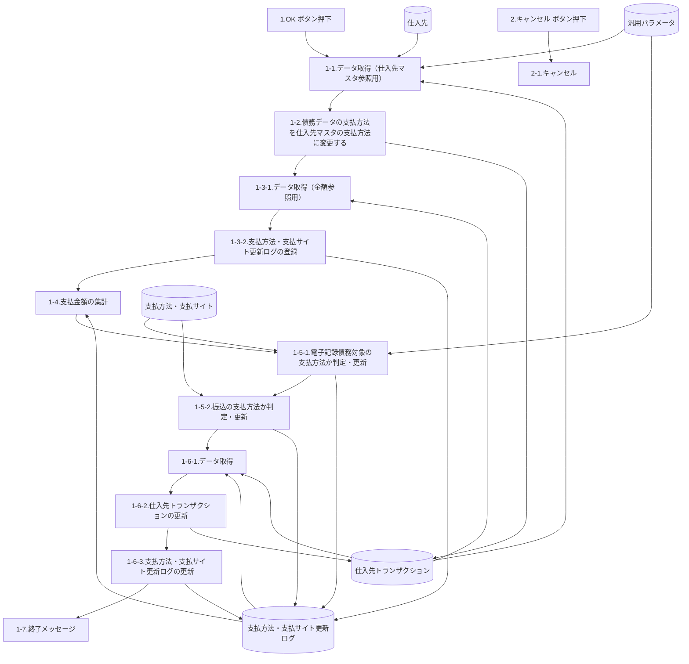
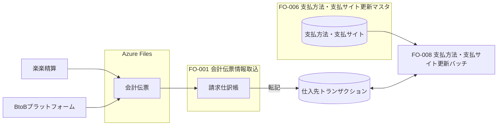

# FO-008 設計書 支払方法・支払サイト更新バッチ

## 1. はじめに

### 1.1 文書情報・共通ヘッダー

| 項目 | 内容 |
| --- | --- |
| 機能ID | FO-008 |
| 機能名称 | 支払方法・支払サイト更新バッチ |
| 表紙の文書名 | FO-008_支払方法・支払サイト更新バッチ |
| システム | Dynamics365 for Finance and Operations |
| 機能分類 | 債権・債務 |
| プロジェクト | 会計システム刷新プロジェクト（LIBRA） |
| 宛先 | サンスター株式会社　御中 |
| 版数 | 第1.0版 |
| 文書日付 | 2024-07-04 |
| 作成日・作成者 | 2024-07-04／JBS 秋信 |
| 更新日・更新者 | 2024-07-04／JBS 秋信 |
| 作成会社 | 日本ビジネスシステムズ株式会社 |
| JBS承認日・承認者 | 2024-07-11／JBS加藤 |
| 基本設計部確認日・確認者 | 2024-08-26／サンスター藤田 |

表紙と共通ヘッダーをここに集約する。共通ヘッダーの「基本設計書」と後半の「詳細設計書」は表記を統一しない。[Q01](../../../../../../qa/doc/00_Source/02.Design/20.設計/13.バッチ/FO-008_設計書_支払方法・支払サイト更新バッチ.md#q01)。

### 1.2 共通条件

**CR01 対象・実行時期**：通貨JPYの債務データを対象とする。月次、支払予定の修正後（支払月6日ごろ）に手動実行する。規定外等で使用する支払方法「2」は対象外。

**CR02 再実行・マスタ変更の順序**：再実行時は、期日、支払方法・支払サイト更新フラグ、支払サイトを仕入先トランザクション画面で手動修正してからバッチを実行する。支払予定と仕入先支払方法が変わる場合は、仕入先マスタ変更前にバッチを実行し、バッチ終了後にマスタを変更する。

### 1.3 共通ヘッダーの適用範囲・差異

| 適用シート | 文書種別 | 作成日／者 | 更新日／者 |
| --- | --- | --- | --- |
| 処理概要、テーブル一覧、DFD、イベント説明、画面レイアウト、画面項目説明、テーブル出力仕様（支払方法・支払サイト更新ログ_仕入先参照）、テーブル出力仕様（支払方法・支払サイト更新ログ_金額参照）、テーブル出力仕様（仕入先トランザクション）、補足説明、補足説明 (汎用パラメータ)、補足説明 (支払方法マスタ)、補足説明 (処理イメージ)、レビュー指摘事項 | 基本設計書 | 2024-07-04／JBS 秋信 | 2024-07-04／JBS 秋信 |
| オブジェクト一覧、プログラムフロー図 | 詳細設計書 | 2024-07-04／JBS 秋信 | 2024-07-04／JBS 秋信 |

同じ組合せは集約した。日付・更新者が異なるシートは区別する。

## 2. 処理概要

### 開発目的

支払合計金額に応じて、銀行振込、または期日振込・電子記録債務を判定し、支払処理を行う必要があるため。

銀行振込：支払基準日に支払を実施する振込。

期日振込：支払基準日に支払サイトを加算し、支払を実施する振込。

仕入先の支払方法の変更は月2~3件発生するが、変更前に作成された債務データも新しい支払方法で支払を行う必要があるため。

### 前提条件

基本的に実行は、支払予定の修正後とする。（支払月6日ごろ、手動実行）

再実行が必要な場合は、本機能で更新対象となる項目（期日、支払方法・支払サイト更新フラグ、支払サイト）を仕入先トランザクション画面にて手動で修正し、バッチ（本機能）を実行すること。

支払予定と仕入先の支払方法に変更が発生した場合は、仕入先マスタの支払方法を変更する前にバッチ（本機能）を手動実行し、バッチが終了してから仕入先マスタの支払方法の変更を行うこと。

例） 7月計上8月払から適用される仕入先マスタの支払方法の変更は、7月分支払のバッチ（本機能）を実施後に仕入先マスタの支払方法の変更を行う。

期日振込/電子記録債務からの支払方法の変更・規定外支払で使用する支払方法「2」は、処理の対象外とする。

### 使用タイミング

月次

### 開発内容

仕入先トランザクション（債務データ）の支払方法を仕入先マスタに登録されている支払方法に変更する。

ただし、支払方法「2」が設定されているデータは除外する。

FO-006（支払方法・支払サイトマスタ画面）に登録されている支払方法の債務データを対象に、

仕入先ごとの債務データの合計金額に応じて、仕入先トランザクションの更新を行う。

・振込（銀行振込、期日振込）の場合：仕入先トランザクションの「期日」「支払方法」「支払サイト」の更新を行う。

・電子記録債務の場合：仕入先トランザクションの「支払方法」「支払サイト」の更新を行う。

電子記録債務の場合は、支払手形仕訳帳の振出時にFO-010（支払手形仕訳帳の振出画面）にて「期日」の更新を行う。

### 制限事項

更新対象の通貨は、JPYとする。

共通の対象・実行条件は[CR01](#cr01)、再実行とマスタ変更順は[CR02](#cr02)。電子記録債務の期日更新の分担は[Q02](../../../../../../qa/doc/00_Source/02.Design/20.設計/13.バッチ/FO-008_設計書_支払方法・支払サイト更新バッチ.md#q02)。

## 3. テーブル一覧

| No. | 種別 | 論理名 | 物理名 | I/O | 備考 |
| --- | --- | --- | --- | --- | --- |
| 1 | テーブル | 仕入先トランザクション | VendTrans | I/O |  |
| 2 | テーブル | 支払方法・支払サイト | SJ_PaymModePaymSiteTable | I | アドオン |
| 3 | テーブル | 支払方法・支払サイト更新ログ | SJ_PaymModePaymSiteUpdatedLog | I/O | アドオン |
| 4 | テーブル | 汎用パラメータ | SJ_GeneralParameter | I | アドオン |

## 4. DFD

原図の概略処理順とDB入出力を示す。1-5-1から1-5-2への線は原図の接続を保持したもので、全レコードに両方の更新を強制する意味ではない。取得の成否・除外・次レコードへの分岐はイベント説明に従う。DB群を個別参照へ展開したが、新しい取得順・SQLは定義しない。

## 5. イベント説明

### 1. OK ボタン押下

### 1-1.データ取得（仕入先マスタ参照用）

#### 1-1-1. 汎用パラメータの取得（処理対象外の支払方法の取得）

処理対象外の支払方法の取得する。

（取得に失敗した場合、エラー出力は不要。）

**項目**

- [値(Value)]

**取得テーブル**

- [汎用パラメータ(SJ_GeneralParameter)]

**抽出条件**

- [汎用パラメータ.機能ID(FunctionId)] = SJ_FunctionIdEnum::FO-008(FO-008)

- [汎用パラメータ.項目ID(ItemId)] = ”002”

- [汎用パラメータ.Key(Key)] = ”1”

#### 1-1-2. 汎用パラメータの取得（電子記録債務対象の支払方法を取得）

電子記録債務対象の支払方法を取得する。

取得できなかった場合、メッセージを表示し処理を終了する。

**メッセージ（この処理に対応する原資料の記載）**

情報ログ ／ 汎用パラメータに該当データが存在しません。 ／ SJ00224 Error ／ 機能ID 「%1」、項目ID 「%2」、Key 「%3」 ％1：”FO-014” ／ ”COMMON” ％2：”ElectronicallyRecorded” %3："-" ／ (空欄)

**項目**

- [値(Value)]

**取得テーブル**

- [汎用パラメータ(SJ_GeneralParameter)]

**抽出条件**

- [汎用パラメータ.機能ID(FunctionId)] = SJ_FunctionIdEnum::COMMON(共通)

- [汎用パラメータ.項目ID(ItemId)] = ”ElectronicallyRecorded”

#### 1-1-3. 仕入先トランザクションの取得

仕入先トランザクション(未処理)で、仕入先マスタに登録されている支払方法と異なるデータを取得する。

一件も取得できなかった場合は、1-3.の処理を実施する。

**項目**

- [仕入先トランザクション.支払方法(PaymMode)]

- [仕入先トランザクション.仕入先(AccountNum)]

- [仕入先トランザクション.支払サイト(SJ_PaymSite)]

- [仕入先トランザクション.期日(DueDate)]

- [仕入先トランザクション.支払基準日(SJ_PaymtBaseDate)]

- [仕入先トランザクション.レコードID(RecId)]

- [仕入先.支払方法(PaymMode)]

**取得テーブル**

- [仕入先トランザクション(VendTrans)]

- [仕入先(VendTable)]

**結合条件**

- Inner [仕入先トランザクション.仕入先(AccountNum)] = [仕入先.仕入先(AccountNum)]

**抽出条件**

- [仕入先トランザクション.支払方法(PaymMode)] != [仕入先.支払方法(PaymMode)]

- [仕入先トランザクション.トランザクションタイプ(TransType)] = LedgerTransType::Vend(仕入先)

- [仕入先トランザクション.請求書支払リリース日(InvoiceReleaseDate)] &lt;= システム日付

- [仕入先トランザクション.最終決済(LastSettleDate)] = NULL

- [仕入先トランザクション.支払方法(PaymMode)] != 1-1-1.で取得した[汎用パラメータ.値]

- MONTH[仕入先トランザクション.日付(TransDate)] != MONTH[画面].[支払基準日]

- [仕入先トランザクション.支払方法・支払サイト更新フラグ(SJ_PaymModePaymSiteUpdatedFlag)] = NoYes::No

- [仕入先トランザクション.仕入先(AccountNum)] = [画面].[仕入先]

- [仕入先トランザクション.支払基準日(SJ_PaymtBaseDate)] =[画面].[支払基準日]

取得したデータから、支払方法・支払サイト更新ログ　の登録を行う。

詳細は、シート「テーブル出力仕様（支払方法・支払サイト更新ログ_仕入先参照）」参照

### 1-2.債務データの支払方法を仕入先マスタの支払方法に変更する

1-1-3.で取得した[仕入先トランザクション.支払方法]を[仕入先.支払方法]に更新を行う。

詳細は、シート「テーブル出力仕様（仕入先トランザクション）」の列「説明（仕入先参照時）」参照

### 1-3.データ取得（金額参照用）

#### 1-3-1.データ取得

取得できなかった場合、メッセージを表示し処理を終了する。

**メッセージ（この処理に対応する原資料の記載）**

情報ログ ／ 対象データが存在しません。 ／ SJ00181 Info

**項目**

- [仕入先トランザクション.支払方法(PaymMode)]

- [仕入先トランザクション.仕入先(AccountNum)]

- [仕入先トランザクション.支払サイト(SJ_PaymSite)]

- [仕入先トランザクション.期日(DueDate)]

- [仕入先トランザクション.支払基準日(SJ_PaymtBaseDate)]

- [仕入先トランザクション.レコードID(RecId)]

- [仕入先トランザクション.金額(AmountMST)]

**取得テーブル**

- [仕入先トランザクション(VendTrans)]

**抽出条件**

- [仕入先トランザクション.トランザクションタイプ(TransType)] = LedgerTransType::Vend(仕入先)

- [仕入先トランザクション.請求書支払リリース日(InvoiceReleaseDate)] &lt;= システム日付

- [仕入先トランザクション.最終決済(LastSettleDate)] = NULL

- [仕入先トランザクション.支払方法(PaymMode)] != 1-1-1.で取得した[汎用パラメータ.値]

- MONTH[仕入先トランザクション.日付(TransDate)] != MONTH[画面].[支払基準日]

- [仕入先トランザクション.支払方法・支払サイト更新フラグ(SJ_PaymModePaymSiteUpdatedFlag)] = NoYes::No

- [仕入先トランザクション.仕入先(AccountNum)] = [画面].[仕入先]

- [仕入先トランザクション.支払基準日(SJ_PaymtBaseDate)] = [画面].[支払基準日]

#### 1-3-2.支払方法・支払サイト更新ログの登録

1-3-1.で取得したデータを　支払方法・支払サイト更新ログ　に登録する。

詳細は、シート「テーブル出力仕様（支払方法・支払サイト更新ログ_金額参照）」の

列「説明（登録時）」参照

### 1-4.支払金額の集計

1-3-2.で登録した 支払方法・支払サイト更新ログ　を、1-4.~1-5.をループして処理を行う。

**項目**

- Sum([金額(AmountMST)])

- [仕入先(AccountNum)]

- [支払方法(PaymMode)]

**取得テーブル**

- [支払方法・支払サイト更新ログ(SJ_PaymModePaymSiteUpdatedLog)]

**抽出条件**

- [支払方法・支払サイト更新ログ.集計ステータス(AggregationStatus)] = SJ_AggregationStatusEnum::Pre-Aggregation(集計前)

- [支払方法・支払サイト更新ログ.仕入先(AccountNum)] = 処理中の[支払方法・支払サイト更新ログ.仕入先(AccountNum)]

- [支払方法・支払サイト更新ログ.支払方法(PaymMode)] = 処理中の[支払方法・支払サイト更新ログ.支払方法(PaymMode)]

**集約条件**

- [支払方法・支払サイト更新ログ.仕入先(AccountNum)]

- [支払方法・支払サイト更新ログ.支払方法(PaymMode)]

取得したSum([金額(AmountMST)])を[支払方法・支払サイト更新ログ.集計金額]　に設定する。

詳細は、シート「テーブル出力仕様（支払方法・支払サイト更新ログ_金額参照）」の

列「説明（更新時）」参照

### 1-5.集計した支払金額に応じて、支払方法・支払サイト更新ログを更新

#### 1-5-1. 電子記録債務対象の支払方法か判定・更新

**① 電子記録債務対象の支払方法か判定する。**

以下条件で取得された１件目のデータを取得する。取得できなかった場合は、1-5-2の処理を実施する。

**取得項目**

- [支払方法(更新後)(UpdatedPaymMode)]

- [支払サイト(PaymSite)]

**取得テーブル**

- [支払方法・支払サイト(SJ_PaymModePaymSiteTable)]

**抽出条件**

- [支払方法・支払サイト.請求金額(BillingAmount)] =&lt; 処理中の[支払方法・支払サイト更新ログ.集計金額]

- [支払方法・支払サイト.支払方法(PayｍMode)] = 処理中の[支払方法・支払サイト更新ログ.支払方法]

- [支払方法・支払サイト.支払方法(更新後)(UpdatedPaymMode)] = 1-1-2.で取得した[汎用パラメータ.値]

**ソート条件**

- [支払方法・支払サイト.支払方法(PayｍMode)] asc

- [支払方法・支払サイト.請求金額(BillingAmount)] desc

**② 以下条件で支払条件を取得する。**

取得できなかった場合、メッセージを表示し処理を終了する。

※ 汎用パラメータに、電子記録債務の振出日の計算のための支払条件を設定しておく。

**メッセージ（この処理に対応する原資料の記載）**

情報ログ ／ 汎用パラメータに該当データが存在しません。 ／ SJ00224 Error ／ 機能ID 「%1」、項目ID 「%2」、Key 「%3」 ％1：”FO-014” ／ ”FO-008” ％2：”001” ％3：”1”

支払方法・支払サイト　に登録されている支払条件は決済日の計算で使用する。

**項目**

- [汎用パラメータ.値(Value)]

**取得テーブル**

- [汎用パラメータ(SJ_GeneralParameter)]

**抽出条件**

- [汎用パラメータ.機能ID(FunctionId)] = SJ_FunctionIdEnum::FO-008(FO-008)

- [汎用パラメータ.項目ID(ItemId)] = ”001”

- [汎用パラメータ.Key(Key)] = ”1”

**③ 支払方法・支払サイト更新ログ　を更新**

以下内容で　支払方法・支払サイト更新ログ　を更新する。

| 項目名(論理名) | 項目名(物理名) | 更新内容 |
| --- | --- | --- |
| 支払方法(更新後) | UpdatePayｍMode | 1-5-1. ①で取得した[支払方法・支払サイト.支払方法(更新後)] |
| 支払サイト(更新後) | UpdatePaymSite | 1-5-1. ①で取得した[支払方法・支払サイト.支払サイト] |
| 期日(更新後) | UpdateDueDate | 処理中の[支払方法・支払サイト更新ログ.支払基準日]と 1-5-1. ②で取得した[汎用パラメータ.値]（支払条件）をもとに期日を算出し設定 |

詳細は、シート「テーブル出力仕様（支払方法・支払サイト更新ログ_金額参照）」の

列「説明（更新時）」参照

更新後、次のレコードの処理を行う。

#### 1-5-2. 振込（銀行振込、期日振込）の支払方法か判定・更新

**① 振込（銀行振込、期日振込）対象の支払方法か判定する。**

以下条件で取得された１件目のデータを取得する。

取得できなかった場合は、

[支払方法・支払サイト更新ログ.集計ステータス] = SJ_AggregationStatusEnum::Excluded(対象外)

を設定し、次のレコードの処理を行う。

詳細は、シート「テーブル出力仕様（支払方法・支払サイト更新ログ_金額参照）」の

列「説明（更新時）」参照

**取得項目**

- [支払方法(更新後)(UpdatedPaymMode)]

- [支払サイト(PaymSite)]

- [支払条件(PaymTermId)]

**取得テーブル**

- [支払方法・支払サイト(SJ_PaymModePaymSiteTable)]

**抽出条件**

- [支払方法・支払サイト.請求金額(BillingAmount)] =&lt; 処理中の[支払方法・支払サイト更新ログ.集計金額]

- [支払方法・支払サイト.支払方法(PayｍMode)] = 処理中の[支払方法・支払サイト更新ログ.支払方法]

**ソート条件**

- [支払方法・支払サイト.支払方法(PayｍMode)] asc

- [支払方法・支払サイト.請求金額(BillingAmount)] desc

**② 支払方法・支払サイト更新ログ　を更新**

以下内容で支払方法・支払サイト更新ログ　を更新する。

| 項目名(論理名) | 項目名(物理名) | 更新内容 |
| --- | --- | --- |
| 支払方法(更新後) | UpdatePayｍMode | 1-5-2. ①で取得した[支払方法・支払サイト.支払方法(更新後)] |
| 支払サイト(更新後) | UpdatePaymSite | 1-5-2. ①で取得した[支払方法・支払サイト.支払サイト] |
| 期日(更新後) | UpdateDueDate | 処理中の[支払方法・支払サイト更新ログ.支払基準日]と 1-5-2. ①で取得した[支払方法・支払サイト.支払条件]をもとに期日を算出し設定 |

詳細は、シート「テーブル出力仕様（支払方法・支払サイト更新ログ_金額参照）」の

列「説明（更新時）」参照

### 1-6.仕入先トランザクションの更新

#### 1-6-1.データ取得

**項目**

- [支払方法・支払サイト更新ログ.支払方法(更新後)(UpdatePayｍMode)]

- [支払方法・支払サイト更新ログ.支払サイト(更新後)(UpdatePaymSite)]

- [支払方法・支払サイト更新ログ.期日(更新後)(UpdateDueDate)]

- [支払方法・支払サイト更新ログ.参照(VendTransRecId)]

**取得テーブル**

- [仕入先トランザクション(VendTrans)]

- [支払方法・支払サイト更新ログ(SJ_PaymModePaymSiteUpdatedLog)]

**結合条件**

- Inner [仕入先トランザクション.レコードID(RecId)] = [支払方法・支払サイト更新ログ.参照(VendTransRecId)]

**抽出条件**

- [支払方法・支払サイト更新ログ.集計ステータス(AggregationStatus)] = SJ_AggregationStatusEnum::Pre-Aggregation(集計前)

#### 1-6-2.仕入先トランザクションの更新

以下内容で仕入先トランザクション　を更新する。

| 項目名(論理名) | 項目名(物理名) | 更新内容 |
| --- | --- | --- |
| 支払方法 | PaymMode | 1-6-1.で取得した[支払方法・支払サイト更新ログ.支払方法(更新後)(UpdatePayｍMode)] |
| 支払サイト | SJ_PaymSite | 1-6-1.で取得した[支払方法・支払サイト更新ログ.支払サイト(更新後)(UpdatePaymSite)] |
| 期日 | DueDate | 1-6-1.で取得した[支払方法・支払サイト更新ログ.期日(更新後)(UpdateDueDate)] |
| 支払方法・支払サイト更新フラグ | SJ_PaymModePaymSiteUpdatedFlag | NoYes::Yes |

詳細は、シート「テーブル出力仕様（仕入先トランザクション）」の列「説明（金額参照時）」参照

#### 1-6-3.支払方法・支払サイト更新ログの更新

以下条件でデータの取得する。

**項目**

- [支払方法・支払サイト更新ログ.集計ステータス(AggregationStatus)]

**取得テーブル**

- [支払方法・支払サイト更新ログ(SJ_PaymModePaymSiteUpdatedLog)]

**抽出条件**

- [支払方法・支払サイト更新ログ.集計ステータス(AggregationStatus)] = SJ_AggregationStatusEnum::Pre-Aggregation(集計前)

取得した[支払方法・支払サイト更新ログ.集計ステータス]を

SJ_AggregationStatusEnum::Post-Aggregation(集計済)　に更新する。

詳細は、シート「テーブル出力仕様（支払方法・支払サイト更新ログ_金額参照）」の

列「説明（更新時）」参照

### 1-7.終了メッセージ

終了メッセージを出力する。

・正常終了した場合、メッセージを出力する。

**メッセージ（この処理に対応する原資料の記載）**

情報ログ ／ %1処理が正常に終了しました。 ／ SJ00185 Info ／ %1：支払方法・支払サイト更新バッチ ／ SJ00412

・異常終了した場合、エラーメッセージを出力する。

**メッセージ（この処理に対応する原資料の記載）**

情報ログ ／ %1処理が異常終了しました。 ／ SJ00186 Error ／ %1：支払方法・支払サイト更新バッチ ／ SJ00412

### 2. キャンセル ボタン押下

### 2-1.キャンセル

処理をキャンセルする。（※FO 標準処理）

### 条件・表記の確認

同一区画の抽出式は原資料のAND条件として読む。仕入先未指定は[Q03](../../../../../../qa/doc/00_Source/02.Design/20.設計/13.バッチ/FO-008_設計書_支払方法・支払サイト更新バッチ.md#q03)、同月の年と範囲は[Q04](../../../../../../qa/doc/00_Source/02.Design/20.設計/13.バッチ/FO-008_設計書_支払方法・支払サイト更新バッチ.md#q04)、実行単位のログ分離は[Q05](../../../../../../qa/doc/00_Source/02.Design/20.設計/13.バッチ/FO-008_設計書_支払方法・支払サイト更新バッチ.md#q05)、物理名表記は[Q06](../../../../../../qa/doc/00_Source/02.Design/20.設計/13.バッチ/FO-008_設計書_支払方法・支払サイト更新バッチ.md#q06)、メッセージ機能IDは[Q07](../../../../../../qa/doc/00_Source/02.Design/20.設計/13.バッチ/FO-008_設計書_支払方法・支払サイト更新バッチ.md#q07)、SLJのパラメータは[Q10](../../../../../../qa/doc/00_Source/02.Design/20.設計/13.バッチ/FO-008_設計書_支払方法・支払サイト更新バッチ.md#q10)を参照。

## 6. 画面レイアウト

### 起動情報

| 項目 | 原資料の指定 |
| --- | --- |
| パス | 空欄 |
| フォーム名 | 空欄 |
| タブ名 | 空欄 |

### ダイアログ（HTML）

<section id="p008-screen" aria-label="支払方法・支払サイト更新" style="border:1px solid #666;box-sizing:border-box;width:100%;max-width:640px;overflow:hidden;padding:16px;margin:12px 0;background:white">
<h3>支払方法・支払サイト更新</h3><form aria-label="支払方法・支払サイト更新の静的ダイアログ"><fieldset><legend>パラメーター</legend>
<label for="p008-date">支払基準日</label> <input id="p008-date" value="2024/07/20" disabled required>

<label for="p008-vendor">仕入先</label> <input id="p008-vendor" value="1111111" disabled>
</fieldset>
バックグラウンドで実行 ▸

<button type="button" disabled>OK</button> <button type="button" disabled>キャンセル</button>
</form>
</section>

### 枠外の説明

2024/07/20と1111111は図形に記載された入力例であり、初期値ではない。部品の無効化は静的プレビューの措置。元の台紙に重ねて置換された別レポートの項目を復活させない。折り畳まれたバックグラウンド内の項目は推測して追加しない。

## 7. 画面項目説明

| 項目 | 種類 | 入力 | 必須 | 初期値 | 内容 |
| --- | --- | --- | --- | --- | --- |
| タイトル | 文字列 | 不可 | 対象外 | 支払方法・支払サイト更新 | Caption |
| 支払基準日 | 日付 | 可 | 必須 | 空欄 | YYYY/MM/DD |
| 仕入先 | テキスト | 可 | 任意 | 空欄 | 仕入先コードでルックアップ。「,」複数、「..」範囲指定。 |
| OK | ボタン | 対象外 | 対象外 | 対象外 | 処理後に画面を閉じる |
| キャンセル | ボタン | 対象外 | 対象外 | 対象外 | 処理後に画面を閉じる |

仕入先未指定の抽出範囲は[Q03](../../../../../../qa/doc/00_Source/02.Design/20.設計/13.バッチ/FO-008_設計書_支払方法・支払サイト更新バッチ.md#q03)。From/To方式を復活させない。

## 8. テーブル出力仕様（支払方法・支払サイト更新ログ_仕入先参照）

テーブル名：`SJ_PaymModePaymSiteUpdatedLog`。ラベル：支払方法・支払サイト更新ログ。拡張名：原資料空欄。

| No. | 論理名 | 物理名 | 説明 | 備考 |
| --- | --- | --- | --- | --- |
| 1 | 仕入先 | AccountNum | 1-1-3.で取得した[仕入先トランザクション].[仕入先]を設定 | 原資料空欄 |
| 2 | 金額 | AmountMST | - | 原資料空欄 |
| 3 | 集計金額 | TotalAmount | - | 原資料空欄 |
| 4 | 支払方法 | PaymMode | 1-1-3.で取得した[仕入先トランザクション].[支払方法]を設定 | 原資料空欄 |
| 5 | 支払方法(更新後) | UpdatePayｍMode | 1-1-3.で取得した[仕入先].[支払方法]を設定 | 原資料空欄 |
| 6 | 支払サイト | PaymSite | - | 原資料空欄 |
| 7 | 支払サイト(更新後) | UpdatePaymSite | - | 原資料空欄 |
| 8 | 期日 | DueDate | - | 原資料空欄 |
| 9 | 期日(更新後) | UpdateDueDate | - | 原資料空欄 |
| 10 | 支払基準日 | PaymBaseDate | 1-1-3.で取得した[仕入先トランザクション].[支払基準日]を設定 | 原資料空欄 |
| 11 | 参照 | VendTransRecId | 1-1-3.で取得した[仕入先トランザクション].[レコードID]を設定 | 原資料空欄 |
| 12 | 集計ステータス | AggregationStatus | SJ_AggregationStatusEnum::Excluded(対象外)　を設定 | 原資料空欄 |

「-」と原資料空欄は区別し、初期値・更新指示を補わない。

## 9. テーブル出力仕様（支払方法・支払サイト更新ログ_金額参照）

テーブル名：`SJ_PaymModePaymSiteUpdatedLog`。ラベル：支払方法・支払サイト更新ログ。拡張名：原資料空欄。

| No. | 論理名 | 物理名 | 説明（登録時） | 説明（更新時） | 備考 |
| --- | --- | --- | --- | --- | --- |
| 1 | 仕入先 | AccountNum | 1-3-1.で取得した[仕入先トランザクション].[仕入先]を設定 | - | 原資料空欄 |
| 2 | 金額 | AmountMST | 1-3-1.で取得した[仕入先トランザクション].[金額]を設定 | - | 原資料空欄 |
| 3 | 集計金額 | TotalAmount | - | 1-4.で取得したSum([支払方法・支払サイト更新ログ].[金額])を設定 | 原資料空欄 |
| 4 | 支払方法 | PaymMode | 1-3-1.で取得した[仕入先トランザクション].[支払方法]を設定 | - | 原資料空欄 |
| 5 | 支払方法(更新後) | UpdatePayｍMode | - | 振込（銀行振込、期日振込）の場合： 1-5-2. ①で取得した[支払方法・支払サイト.支払方法(更新後)]  電子記録債務の場合： 1-5-1. ①で取得した[支払方法・支払サイト.支払方法(更新後)]  上記以外の場合： 設定なし | 原資料空欄 |
| 6 | 支払サイト | PaymSite | 1-3-1.で取得した[仕入先トランザクション].[支払サイト]を設定 | - | 原資料空欄 |
| 7 | 支払サイト(更新後) | UpdatePaymSite | - | 振込（銀行振込、期日振込）の場合： 1-5-2. ①で取得した[支払方法・支払サイト.支払サイト]  電子記録債務の場合： 1-5-1. ①で取得した[支払方法・支払サイト.支払サイト]  上記以外の場合： 設定なし | 原資料空欄 |
| 8 | 期日 | DueDate | 1-3-1.で取得した[仕入先トランザクション].[期日]を設定 | - | 原資料空欄 |
| 9 | 期日(更新後) | UpdateDueDate | - | 振込（銀行振込、期日振込）の場合： 処理中の[支払方法・支払サイト更新ログ.支払基準日]と 1-5-2. ①で取得した[支払方法・支払サイト.支払条件]をもとに期日を算出し設定  電子記録債務の場合： 処理中の[支払方法・支払サイト更新ログ.支払基準日]と 1-5-1. ②で取得した[汎用パラメータ.値]（支払条件）をもとに期日を算出し設定  上記以外の場合： 設定なし | 原資料空欄 |
| 10 | 支払基準日 | PaymBaseDate | 1-3-1.で取得した[仕入先トランザクション].[支払基準日]を設定 | - | 原資料空欄 |
| 11 | 参照 | VendTransRecId | 1-3-1.で取得した[仕入先トランザクション].[レコードID]を設定 | - | 原資料空欄 |
| 12 | 集計ステータス | AggregationStatus | SJ_AggregationStatusEnum::Pre-Aggregation(集計前)　を設定 | SJ_AggregationStatusEnum::Post-Aggregation(集計済)　を設定 | 原資料空欄 |

「-」と原資料空欄は区別し、初期値・更新指示を補わない。

## 10. テーブル出力仕様（仕入先トランザクション）

テーブル名：`VendTrans`。ラベル：仕入先トランザクション。拡張名：原資料空欄。

| No. | 論理名 | 物理名 | 説明（仕入先参照時） | 説明（金額参照時） | 備考 |
| --- | --- | --- | --- | --- | --- |
| 1 | 支払方法 | PaymMode | 1-1-3.で取得した[仕入先].[支払方法]を設定 | 1-6-1.で取得した[支払方法・支払サイト更新ログ.支払方法(更新後)(UpdatePayｍMode)] | 原資料空欄 |
| 2 | 支払サイト | SJ_PaymSite | - | 1-6-1.で取得した[支払方法・支払サイト更新ログ.支払サイト(更新後)(UpdatePaymSite)] | 原資料空欄 |
| 3 | 期日 | DueDate | - | 1-6-1.で取得した[支払方法・支払サイト更新ログ.期日(更新後)(UpdateDueDate)] | 原資料空欄 |
| 4 | 支払方法・支払サイト更新フラグ | SJ_PaymModePaymSiteUpdatedFlag | - | NoYes::Yes | 原資料空欄 |

「-」と原資料空欄は区別し、初期値・更新指示を補わない。

## 11. 補足説明

関連機能・データの関係を示す。本機能と仕入先トランザクションの双方向線は取得・更新を表す。ここから外部インターフェースの未記載契約を追加しない。

## 12. 補足説明 (汎用パラメータ)

事前に本機能で使用する汎用パラメータを設定する。下表は原資料の法人別設定例で、別法人へ拡張しない。

### SSJの場合

| 機能ID | 項目ID | Key | 値 | 説明 |
| --- | --- | --- | --- | --- |
| COMMON | ElectronicallyRecorded | 1 | 9-1 | 支払方法：でんさい(三井住友/95) |
| COMMON | ElectronicallyRecorded | 2 | 8-1 | 支払方法：でんさい(三井住友/60) |
| FO-008 | 001 | 1 | PTXX | 支払条件：【システム利用】非営業日考慮用 |
| FO-008 | 002 | 1 | 2 | 処理対象外の支払方法 |

### SEJの場合

| 機能ID | 項目ID | Key | 値 | 説明 |
| --- | --- | --- | --- | --- |
| COMMON | ElectronicallyRecorded | 1 | 9-2 | 支払方法：電債95(三菱UFJ/95) |
| COMMON | ElectronicallyRecorded | 2 | 8-2 | 支払方法：電債(三菱UFJ/60) |
| FO-008 | 001 | 1 | PTXX | 支払条件：【システム利用】非営業日考慮用 |
| FO-008 | 002 | 1 | 2 | 処理対象外の支払方法 |

### SLJの場合

| 機能ID | 項目ID | Key | 値 | 説明 |
| --- | --- | --- | --- | --- |
| FO-008 | 001 | 1 | PTXX | 支払条件：【システム利用】非営業日考慮用 |
| FO-008 | 002 | 1 | 2 | 処理対象外の支払方法 |

SLJの表に電子記録債務の行はない。取得必須条件との関係は[Q10](../../../../../../qa/doc/00_Source/02.Design/20.設計/13.バッチ/FO-008_設計書_支払方法・支払サイト更新バッチ.md#q10)。

## 13. 補足説明 (支払方法マスタ)

### SSJの支払方法マスタ参照

貼付表のコード・説明・口座・設定先を分けて記述する。これはSSJの参照表で、各法人への適用や通貨の限定を拡張しない。

| コード | 説明（意味を保持した整形） | 支払勘定／銀行口座 | 仕入先マスタ設定 | 支払条件（マスタ） | 支払基準日 |
| --- | --- | --- | --- | --- | --- |
| TU | 50万円以上は期日振込(95)、50万円未満は振込 | - | Yes（21～） | 末締翌20日（土日考慮なし） | 20日 |
| TQ | 50万円以上は期日振込(60)、50万円未満は振込 | - | Yes（21～） | 末締翌20日（土日考慮なし） | 20日 |
| TP | 50万円以上は期日振込(40)、50万円未満は振込 | - | Yes（21～） | 末締翌20日（土日考慮なし） | 20日 |
| 9T | 50万円以上はでんさい(95)、50万円未満は振込 | - | Yes（21～） | 末締翌20日（土日考慮なし） | 20日 |
| 8T | 50万円以上はでんさい(60)、50万円未満は振込 | - | Yes（21～） | 末締翌20日（土日考慮なし） | 20日 |
| T | 国内銀行振込／三菱UFJ | 1020101 | No | 空欄 | 空欄 |
| W | 国内期日振込／三井住友 | 1020111 | No | 空欄 | 空欄 |
| 9-1 | でんさい（三井住友／95） | 1020111 | No | 空欄 | 空欄 |
| 8-1 | でんさい（三井住友／60） | 1020111 | No | 空欄 | 空欄 |
| 2-1 | 銀行振込（上限なし）／三菱UFJ（仕入先マスタ用） | 1020101 | Yes（21～） | 末締翌20日（土日考慮なし） | 20日 |
| 2 | 全額銀行振込（上限なし）／三菱UFJ | 1020101 | No | - | 支払基準日 |
| 2-3 | 全額銀行振込（上限なし）／みずほ | 1020109 | Yes（11～） | - | 支払基準日 |
| 1 | 社員経費／三菱UFJ | 1020131 | Yes（31～） | - | 空欄 |
| 3-1 | 海外送金／三菱UFJ | 1020101 | Yes（21～） | 末締翌20日（土日考慮なし） | 20日 |
| 3-2 | 海外送金／三菱UFJ／USD | 1025101 | Yes（21～） | 末締翌20日（土日考慮なし） | 20日 |
| 3-3 | 海外送金／三井住友 | 1020111 | Yes（21～） | 末締翌20日（土日考慮なし） | 20日 |
| 3-4 | 海外送金／みずほ | 1020109 | Yes（21～） | 末締翌20日（土日考慮なし） | 20日 |
| C | 小切手・郵便振込 | 空欄 | Yes? | 空欄 | 空欄 |
| D | 自動引落 | 空欄 | Yes? | 空欄 | 空欄 |

### 全額振込への変更と参照注記

| コード群 | 規定の全額振込へ（翌20日） | 規定外の全額振込へ（当月計上当月払い） | 備考 |
| --- | --- | --- | --- |
| TU/TQ/TP/9T/8T | Yes：全額銀行振込／三菱U | Yes：全額銀行振込／三菱U＋日付＋支払基準日で判断 | 50万円判定でT/W/9-1/8-1へ |
| 2-1 | No | Yes：日付＋支払基準日で判断 | 支払方法は同じ |
| 2 | 原資料空欄 | 原資料空欄 | FO008の対象外 |
| 2-3 | No | Yes：日付＋支払基準日で判断 | IF支払条件は確認中 |
| 1 | No | No | IF：10日締め20日払／末日翌月10日払 |
| 3-1/3-2/3-3/3-4 | No | Yes：日付＋支払基準日で判断 | 支払方法は同じ |
| C/D | No | No | その他の欄は空欄 |

### 原画像の質問

原図上部に「10日払い、前月末締め」、C・Dの設定欄に「Yes?」とある。IFの全額銀行振込／三菱Uの扱い、販促費・リベートの判断、C・Dの設定可否等は[Q09](../../../../../../qa/doc/00_Source/02.Design/20.設計/13.バッチ/FO-008_設計書_支払方法・支払サイト更新バッチ.md#q09)。原画像で未確定の表記を正式な入力規則にしない。

## 14. 補足説明 (処理イメージ)

### 支払方法・支払サイトの設定例

| 支払方法 | 請求金額 | 支払方法（更新後） | 支払サイト | 支払条件 |
| --- | --- | --- | --- | --- |
| 9T | 0 | T | 0 | 【システム利用】非営業日考慮用 |
| 9T | 500000 | 9-1 | 95 | 【システム使用】サイト95日 |
| TU | 0 | T | 0 | 【システム利用】非営業日考慮用 |
| TU | 500000 | W | 95 | 【システム使用】サイト95日 |
| 2-1 | 0 | 2-1 | 0 | 【システム利用】非営業日考慮用 |

支払方法：2 ⇒期日振込/電子記録債務からの全額振込の変更、規定外の全額振込　に該当（仕入先に設定しない、本機能の更新対象外）

支払方法：T ⇒本機能で設定される支払方法（銀行振込、仕入先には設定しない。）

支払方法：W ⇒本機能で設定される支払方法（期日振込、仕入先には設定しない。）

支払方法：2-1 ⇒仕入先に設定する支払方法

### 例１：仕入先の支払方法を6/15に「9T」（電子記録債務（支払サイト：95））⇒「2-1」（全額振込）に変更

#### 変更前

| 日付 | 支払方法 | 支払基準日 | 期日 | 支払サイト |
| --- | --- | --- | --- | --- |
| 2024/6/1 | 9T | 2024/7/20 | 2024/7/20 | 0 |
| 2024/6/1 | 9T | 2024/7/20 | 2024/7/20 | 0 |
| 2024/6/1 | 2 | 2024/6/20 | 2024/6/20 | 0 |
| 2024/6/1 | 9T | 2024/7/20 | 2024/7/20 | 0 |
| 2024/6/15 | 2-1 | 2024/7/20 | 2024/7/20 | 0 |
| 2024/6/15 | 2-1 | 2024/7/20 | 2024/7/20 | 0 |
| 2024/6/15 | 2-1 | 2024/7/20 | 2024/7/20 | 0 |

#### 7/6：処理①（仕入先マスタ参照）後

| 日付 | 支払方法 | 支払基準日 | 期日 | 支払サイト |
| --- | --- | --- | --- | --- |
| 2024/6/1 | 2-1 | 2024/7/20 | 2024/7/20 | 0 |
| 2024/6/1 | 2-1 | 2024/7/20 | 2024/7/20 | 0 |
| 2024/6/1 | 2 | 2024/6/20 | 2024/6/20 | 0 |
| 2024/6/1 | 2-1 | 2024/7/20 | 2024/7/20 | 0 |
| 2024/6/15 | 2-1 | 2024/7/20 | 2024/7/20 | 0 |
| 2024/6/15 | 2-1 | 2024/7/20 | 2024/7/20 | 0 |
| 2024/6/15 | 2-1 | 2024/7/20 | 2024/7/20 | 0 |

#### 処理②（金額判定）後

| 日付 | 支払方法 | 支払基準日 | 期日 | 支払サイト |
| --- | --- | --- | --- | --- |
| 2024/6/1 | 2-1 | 2024/7/20 | 2024/7/22 | 0 |
| 2024/6/1 | 2-1 | 2024/7/20 | 2024/7/22 | 0 |
| 2024/6/1 | 2 | 2024/6/20 | 2024/9/20 | 0 |
| 2024/6/1 | 2-1 | 2024/7/20 | 2024/7/22 | 0 |
| 2024/6/15 | 2-1 | 2024/7/20 | 2024/7/22 | 0 |
| 2024/6/15 | 2-1 | 2024/7/20 | 2024/7/22 | 0 |
| 2024/6/15 | 2-1 | 2024/7/20 | 2024/7/22 | 0 |

### 例２：仕入先の支払方法を6/15に「9T」⇒「TU」（期日振込（支払サイト：95））に変更／①支払の合計金額が、50万以上の場合

#### 変更前

| 日付 | 支払方法 | 支払基準日 | 期日 | 支払サイト |
| --- | --- | --- | --- | --- |
| 2024/6/1 | 9T | 2024/7/20 | 2024/7/20 | 0 |
| 2024/6/1 | 9T | 2024/7/20 | 2024/7/20 | 0 |
| 2024/6/1 | 2 | 2024/6/20 | 2024/6/20 | 0 |
| 2024/6/1 | 9T | 2024/7/20 | 2024/7/20 | 0 |
| 2024/6/15 | TU | 2024/7/20 | 2024/7/20 | 0 |
| 2024/6/15 | TU | 2024/7/20 | 2024/7/20 | 0 |
| 2024/6/15 | TU | 2024/7/20 | 2024/7/20 | 0 |

#### 7/6：処理①後

| 日付 | 支払方法 | 支払基準日 | 期日 | 支払サイト |
| --- | --- | --- | --- | --- |
| 2024/6/1 | TU | 2024/7/20 | 2024/7/20 | 0 |
| 2024/6/1 | TU | 2024/7/20 | 2024/7/20 | 0 |
| 2024/6/1 | 2 | 2024/6/20 | 2024/6/20 | 0 |
| 2024/6/1 | TU | 2024/7/20 | 2024/7/20 | 0 |
| 2024/6/15 | TU | 2024/7/20 | 2024/7/20 | 0 |
| 2024/6/15 | TU | 2024/7/20 | 2024/7/20 | 0 |
| 2024/6/15 | TU | 2024/7/20 | 2024/7/20 | 0 |

#### 処理②後

| 日付 | 支払方法 | 支払基準日 | 期日 | 支払サイト |
| --- | --- | --- | --- | --- |
| 2024/6/1 | W | 2024/7/20 | 2024/10/20 | 95 |
| 2024/6/1 | W | 2024/7/20 | 2024/10/20 | 95 |
| 2024/6/1 | 2 | 2024/6/20 | 2024/9/20 | 0 |
| 2024/6/1 | W | 2024/7/20 | 2024/10/20 | 95 |
| 2024/6/15 | W | 2024/7/20 | 2024/10/20 | 95 |
| 2024/6/15 | W | 2024/7/20 | 2024/10/20 | 95 |
| 2024/6/15 | W | 2024/7/20 | 2024/10/20 | 95 |

### 例２：仕入先の支払方法を6/15に「9T」⇒「TU」（期日振込（支払サイト：95））に変更／②支払の合計金額が、50万未満の場合

#### 変更前

| 日付 | 支払方法 | 支払基準日 | 期日 | 支払サイト |
| --- | --- | --- | --- | --- |
| 2024/6/1 | 9T | 2024/7/20 | 2024/7/20 | 0 |
| 2024/6/1 | 9T | 2024/7/20 | 2024/7/20 | 0 |
| 2024/6/1 | 2 | 2024/6/20 | 2024/6/20 | 0 |
| 2024/6/1 | 9T | 2024/7/20 | 2024/7/20 | 0 |
| 2024/6/15 | TU | 2024/7/20 | 2024/7/20 | 0 |
| 2024/6/15 | TU | 2024/7/20 | 2024/7/20 | 0 |
| 2024/6/15 | TU | 2024/7/20 | 2024/7/20 | 0 |

#### 7/6：処理①後

| 日付 | 支払方法 | 支払基準日 | 期日 | 支払サイト |
| --- | --- | --- | --- | --- |
| 2024/6/1 | TU | 2024/7/20 | 2024/7/20 | 0 |
| 2024/6/1 | TU | 2024/7/20 | 2024/7/20 | 0 |
| 2024/6/1 | 2 | 2024/6/20 | 2024/6/20 | 0 |
| 2024/6/1 | TU | 2024/7/20 | 2024/7/20 | 0 |
| 2024/6/15 | TU | 2024/7/20 | 2024/7/20 | 0 |
| 2024/6/15 | TU | 2024/7/20 | 2024/7/20 | 0 |
| 2024/6/15 | TU | 2024/7/20 | 2024/7/20 | 0 |

#### 処理②後

| 日付 | 支払方法 | 支払基準日 | 期日 | 支払サイト |
| --- | --- | --- | --- | --- |
| 2024/6/1 | T | 2024/7/20 | 2024/7/22 | 0 |
| 2024/6/1 | T | 2024/7/20 | 2024/7/22 | 0 |
| 2024/6/1 | 2 | 2024/6/20 | 2024/9/20 | 0 |
| 2024/6/1 | T | 2024/7/20 | 2024/7/22 | 0 |
| 2024/6/15 | T | 2024/7/20 | 2024/7/22 | 0 |
| 2024/6/15 | T | 2024/7/20 | 2024/7/22 | 0 |
| 2024/6/15 | T | 2024/7/20 | 2024/7/22 | 0 |

### 例３：仕入先の支払方法を「2-1」で規定外支払が発生した場合

#### 支払前

| 日付 | 支払方法 | 支払基準日 | 期日 | 支払サイト |
| --- | --- | --- | --- | --- |
| 2024/6/1 | 2-1 | 2024/7/20 | 2024/7/20 | 0 |
| 2024/6/1 | 2-1 | 2024/7/20 | 2024/7/20 | 0 |
| 2024/6/2 | 2-1 | 2024/6/20 | 2024/6/20 | 0 |
| 2024/7/2 | 2-1 | 2024/7/20 | 2024/7/20 | 0 |

#### 6/20：支払実行後

| 日付 | 支払方法 | 支払基準日 | 期日 | 支払サイト |
| --- | --- | --- | --- | --- |
| 2024/6/1 | 2-1 | 2024/7/20 | 2024/7/20 | 0 |
| 2024/6/1 | 2-1 | 2024/7/20 | 2024/7/20 | 0 |
| 2024/6/2 | 2-1 | 2024/6/20 | 2024/6/20 | 0 |
| 2024/7/2 | 2-1 | 2024/7/20 | 2024/7/20 | 0 |

#### 7/6：処理①後

| 日付 | 支払方法 | 支払基準日 | 期日 | 支払サイト |
| --- | --- | --- | --- | --- |
| 2024/6/1 | 2-1 | 2024/7/20 | 2024/7/20 | 0 |
| 2024/6/1 | 2-1 | 2024/7/20 | 2024/7/20 | 0 |
| 2024/6/2 | 2-1 | 2024/6/20 | 2024/6/20 | 0 |
| 2024/7/2 | 2-1 | 2024/8/20 | 2024/8/20 | 0 |

#### 処理②後

| 日付 | 支払方法 | 支払基準日 | 期日 | 支払サイト |
| --- | --- | --- | --- | --- |
| 2024/6/1 | 2-1 | 2024/7/20 | 2024/7/22 | 0 |
| 2024/6/1 | 2-1 | 2024/7/20 | 2024/7/22 | 0 |
| 2024/6/2 | 2-1 | 2024/6/20 | 2024/6/20 | 0 |
| 2024/7/2 | 2-1 | 2024/8/20 | 2024/8/20 | 0 |

### 原資料の注記

IFで仕入先マスタの支払条件を見て設定。 基本仕入先マスタの支払条件は非営業日を考慮しない末締め翌20日

非営業日の計算し設定。

例1・例2の支払方法2の行は「対象外」、例3の6/2の行は「支払済」、7/2の行は「対象外（規定外、当月計上当月払いを除外）」とされる。対象外の2の期日が最終表で変わる表示、および対象外の7/2の支払基準日が変わる表示は[Q08](../../../../../../qa/doc/00_Source/02.Design/20.設計/13.バッチ/FO-008_設計書_支払方法・支払サイト更新バッチ.md#q08)で確認し、勝手に日付を修正しない。

## 15. 参考_支払基準日の方針

①支払基準日が考慮されてない場合（すべて20日）

　⇒規定支払については、支払基準日を空欄ですべてもらうことができないか。

　⇒本方針で決定

※2024/7/20は、土曜

### 会計伝票取込・FOでの値

| 行 | 取込支払方法 | FO支払方法 | 支払基準日 | 期日 | サイト |
| --- | --- | --- | --- | --- | --- |
| 9 | TU（期日振込、サイト95） | TU（期日振込、サイト95） | 2024/7/20（元は空欄） | 2024-07-20 | 0 |
| 11 | 8T（でんさい、サイト60） | 8T（でんさい、サイト60） | 2024/7/20（元は空欄） | 2024-07-20 | 0 |
| 13 | 2-1 | 2-1 | 2024/7/20（元は空欄） | 2024-07-22 | 0 |
| 14 | 2 | 2 | 2024-07-22 | 2024-07-22 | 0 |

### バッチと振出時の値

| 条件 | バッチ支払方法 | 支払基準日 | 期日 | サイト | 振出時の値 |
| --- | --- | --- | --- | --- | --- |
| TU／50万未満の場合 | T | 2024-07-20 | 2024-07-22 | 0 | 原資料空欄 |
| TU／50万以上の場合 | W | 2024-07-20 | 2024-10-25 | 95 | 原資料空欄 |
| 8T／50万未満の場合 | T | 2024-07-20 | 2024-07-22 | 0 | 原資料空欄 |
| 8T／50万以上の場合 | 8-1 | 2024-07-20 | 2024-07-22 | 60 | 8-1／2024-07-20／2024-09-20／60 |
| 2-1／対象外 |  |  |  |  | 原資料空欄 |
| 2／対象外 |  |  |  |  | 原資料空欄 |

※電子記録債務の振出用の支払条件を汎用パラメータで保持する。

### ポイント

#### ポイント1 更新バッチ：

支払基準日（単一）でデータの取得を行う。

#### ポイント2 更新バッチ：期日振込以外

支払基準日から期日（土日考慮有）を計算する必要がある。

※支払条件は、支払方法・支払サイトマスタから取得

#### ポイント3 更新バッチ：でんさいの場合

支払基準日から期日（土日考慮有）を計算する必要がある。

※支払条件は、汎用パラメータから取得

#### ポイント4 でんさい振出時：

支払基準日から期日（土日考慮有）を計算する必要がある。

※支払条件は、支払方法・支払サイトマスタから取得

この参考表の2-1の「対象外」と、前章の更新例の関係は[Q08](../../../../../../qa/doc/00_Source/02.Design/20.設計/13.バッチ/FO-008_設計書_支払方法・支払サイト更新バッチ.md#q08)。非表示の別案は取り込まない。

## 16. レビュー指摘事項

原資料の4件の指摘・対応・確認記録は[QAのレビュー記録](../../../../../../qa/doc/00_Source/02.Design/20.設計/13.バッチ/FO-008_設計書_支払方法・支払サイト更新バッチ.md#review-records)に保持する。対応済みの記録に再回答を求めない。後続の確定回答と撤回された案を区別する。

## 17. オブジェクト一覧

<!-- source-note P-sheet-27 | target=sheet-27: 詳細設計・開発時に記載 -->
> **P-sheet-27**：詳細設計・開発時に記載

この版の可視資料は記載予定を示している。具体的な実装・フローを別版から追加しない。

## 18. プログラムフロー図

<!-- source-note P-sheet-29 | target=sheet-29: 詳細設計・開発時に記載 -->
> **P-sheet-29**：詳細設計・開発時に記載

この版の可視資料は記載予定を示している。具体的な実装・フローを別版から追加しない。
