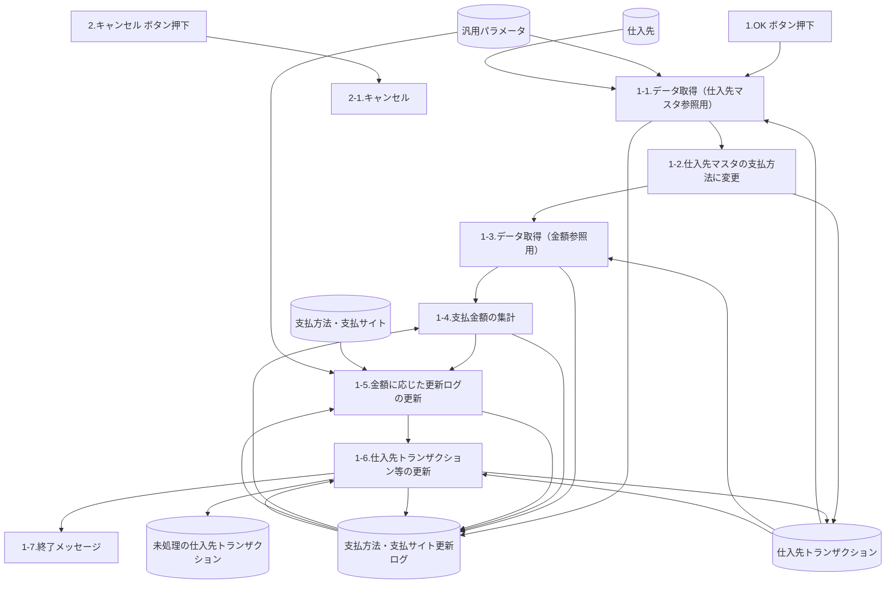
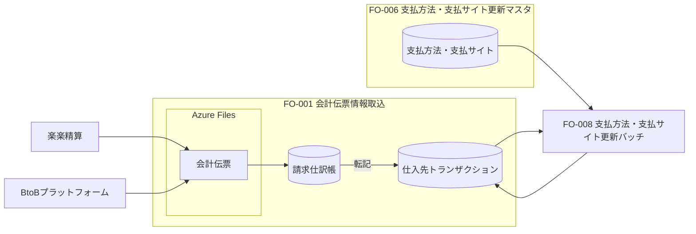
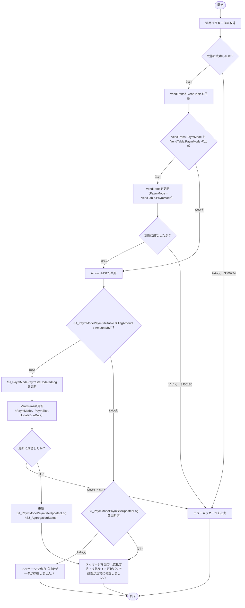

# FO-008 支払方法・支払サイト更新バッチ 詳細設計書

<a id="sheet-21"></a>
## 1. はじめに

### 1.1 文書情報・共通ヘッダー

| 項目 | 内容 |
| --- | --- |
| 機能ID | FO-008 |
| 機能名称 | 支払方法・支払サイト更新バッチ |
| システム | Dynamics365 for Finance and Operations |
| 機能分類 | 債権・債務 |
| プロジェクト | 会計システム刷新プロジェクト（LIBRA） |
| 宛先 | サンスター株式会社 御中 |
| 版数 | 第1.7版 |
| 文書日付・共通更新日 | 2025-02-20 |
| 作成日・作成者 | 2024-07-04／JBS 秋信 |
| 共通更新者 | JBS秋信 |
| 作成会社 | 日本ビジネスシステムズ株式会社 |
| JBS承認日・承認者 | 2024-07-11／JBS加藤 |
| 基本設計部確認日・確認者 | 2024-08-26／サンスター藤田 |
| オブジェクト一覧の更新日 | 2024-11-05／JBS秋信 |

ファイル名と後半2シートは詳細設計書、ほかの共通ヘッダーは基本設計書と記載される。表記は統一せず保持する。[Q01](../../../../../../qa/doc/00_Source/02.Design/20.設計/13.バッチ/FO-008_詳細設計書_支払方法・支払サイト更新バッチ.md#q01)。

### 1.2 共通の適用条件

<a id="cr01"></a>
**CR01 実行時期・運用**：月次。基本的に支払予定の修正後（支払月6日ごろ）に手動実行する。再実行時は期日、支払方法・支払サイト更新フラグ、支払サイトを仕入先トランザクション画面で手動修正してから実行する。

<a id="cr02"></a>
**CR02 マスタ変更の順序**：仕入先マスタの支払方法を変更する前に本バッチを手動実行し、バッチ終了後にマスタを変更する。

<a id="cr03"></a>
**CR03 除外・通貨**：期日振込／電子記録債務からの変更・規定外支払に使う支払方法「2」は処理対象外。更新対象通貨はJPYとする。

<a id="sheet-5"></a>
## 2. 処理概要

### 2.1 開発目的

支払合計金額に応じて銀行振込、期日振込、電子記録債務を判定して支払う必要がある。銀行振込は支払基準日に支払う振込、期日振込は支払基準日に支払サイトを加算して支払う振込である。

仕入先の支払方法変更は月2～3件発生する。変更前に作成された債務データも、新しい支払方法で支払う必要がある。

### 2.2 前提条件・使用タイミング

[CR01](#cr01)・[CR02](#cr02)・[CR03](#cr03)を適用する。例えば7月計上8月払いから適用するマスタ変更は、7月分支払のバッチを実施した後に行う。使用タイミングは月次。

### 2.3 開発内容

仕入先トランザクションの支払方法を仕入先マスタの支払方法へ変更する。ただし支払方法「2」のデータは除外する。

FO-006（支払方法・支払サイトマスタ画面）に登録された支払方法の債務を対象とし、仕入先ごとの合計金額に応じて更新する。概要の記載は次のとおり。

| 区分 | 概要に記載された更新項目 |
|---|---|
| 振込（銀行振込、期日振込） | 期日、支払方法、支払サイト |
| 電子記録債務 | 支払方法、支払サイト |

電子記録債務の期日は、支払手形仕訳帳の振出時にFO-010で更新すると記載されている。後続のイベント説明にある本バッチでの期日設定との対応は、[Q11](../../../../../../qa/doc/00_Source/02.Design/20.設計/13.バッチ/FO-008_詳細設計書_支払方法・支払サイト更新バッチ.md#q11)。

### 2.4 制限事項

[CR03](#cr03)のJPY条件を適用する。未記入の番号行は追加要件とは扱わない。

<a id="sheet-23"></a>
## 3. テーブル一覧

| No. | 種別 | 論理名 | 物理名 | I/O | 備考 |
| --- | --- | --- | --- | --- | --- |
| 1 | テーブル | 仕入先トランザクション | VendTrans | I/O |  |
| 2 | テーブル | 支払方法・支払サイト | SJ_PaymModePaymSiteTable | I | アドオン |
| 3 | テーブル | 支払方法・支払サイト更新ログ | SJ_PaymModePaymSiteUpdatedLog | I/O | アドオン |
| 4 | テーブル | 汎用パラメータ | SJ_GeneralParameter | I | アドオン |
| 5 | テーブル | 未処理の仕入先トランザクション | VendTransOpen | O |  |

仕入先（VendTable）はイベントの参照先にも現れるが一覧には独立行がない。VendTransOpenは一覧上O、イベント上は結合参照も行う。[Q03](../../../../../../qa/doc/00_Source/02.Design/20.設計/13.バッチ/FO-008_詳細設計書_支払方法・支払サイト更新バッチ.md#q03)。

<a id="sheet-4"></a>
## 4. DFD

初期表示ではなく、OK／キャンセルのイベントと、データ取得・更新処理の関係を示す。DB群は意味の同じ参照先にまとめている。番号は原図の処理番号を保持し、細かな条件は第5章を参照する。



第5章の未取得時分岐・電子記録債務判定を省略して処理順と入出力を示すDFDであり、無条件で全処理を実施する意味ではない。原図の1-3-1／1-3-2、1-5-1／1-5-2、1-6-1～1-6-4は親処理の内部として次章に保持する。

<a id="sheet-44"></a>
## 5. イベント説明

### 5.1 OKボタン押下

#### 1-1-1. 処理対象外の支払方法を取得

汎用パラメータ（SJ_GeneralParameter）の値（Value）を取得する。**取得に失敗してもエラー出力は不要**と記載される。取得失敗時の除外値の扱いは [Q14](../../../../../../qa/doc/00_Source/02.Design/20.設計/13.バッチ/FO-008_詳細設計書_支払方法・支払サイト更新バッチ.md#q14)。

| 対象・式 | 比較 | 値 |
| --- | --- | --- |
| [汎用パラメータ.機能ID(FunctionId)] | = | SJ_FunctionIdEnum::FO-008(FO-008) |
| [汎用パラメータ.項目ID(ItemId)] | = | ”002” |
| [汎用パラメータ.Key(Key)] | = | ”1” |

#### 1-1-2. 電子記録債務対象の支払方法を取得

取得項目は汎用パラメータのValue。次の条件で取得し、取得できなければSJ00224を表示して処理を終了する。Keyによる絞り込みは記載されていない。

| 対象・式 | 比較 | 値 |
| --- | --- | --- |
| [汎用パラメータ.機能ID(FunctionId)] | = | SJ_FunctionIdEnum::COMMON(共通) |
| [汎用パラメータ.項目ID(ItemId)] | = | ”ElectronicDebit” |

補足のSSJ／SEJではKeyが1・2の複数行になる。値の比較方法とSLJに該当行がない場合は [Q04](../../../../../../qa/doc/00_Source/02.Design/20.設計/13.バッチ/FO-008_詳細設計書_支払方法・支払サイト更新バッチ.md#q04) を参照。メッセージ引数欄の不一致は [Q05](../../../../../../qa/doc/00_Source/02.Design/20.設計/13.バッチ/FO-008_詳細設計書_支払方法・支払サイト更新バッチ.md#q05)。

#### 1-1-3. 仕入先トランザクションを取得・仕入先参照ログを登録

未処理の仕入先トランザクションのうち、仕入先マスタと支払方法が異なるデータを取得する。1件も取得できない場合は、1-3へ進む。

**取得項目**

- `[仕入先トランザクション.支払方法(PaymMode)]`
- `[仕入先トランザクション.仕入先(AccountNum)]`
- `[仕入先トランザクション.支払サイト(SJ_PaymSite)]`
- `[仕入先トランザクション.期日(DueDate)]`
- `[仕入先トランザクション.支払基準日(SJ_PaymtBaseDate)]`
- `[仕入先トランザクション.レコードID(RecId)]`
- `[仕入先.支払方法(PaymMode)]`

**取得テーブル欄**：VendTrans、VendTable。結合条件にはVendTransOpenも現れる。テーブル一覧との対応は [Q03](../../../../../../qa/doc/00_Source/02.Design/20.設計/13.バッチ/FO-008_詳細設計書_支払方法・支払サイト更新バッチ.md#q03)。

| 対象・式 | 比較 | 値 |
| --- | --- | --- |
| [仕入先トランザクション.仕入先(AccountNum)]　 | = | [仕入先.仕入先(AccountNum)] |
| [仕入先トランザクション.レコードID(RecId)]　 | = | [未処理の仕入先トランザクション.参照(RefRecId)] |

2条件はいずれもInner結合。第2条件の参照先は未処理の仕入先トランザクションのRefRecId。

**抽出条件**

| 対象・式 | 比較 | 値 |
| --- | --- | --- |
| [仕入先トランザクション.支払方法(PaymMode)] | != | [仕入先.支払方法(PaymMode)] |
| [仕入先トランザクション.トランザクションタイプ(TransType)] | = | LedgerTransType::Vend(仕入先) |
| [仕入先トランザクション.請求書支払リリース日(InvoiceReleaseDate)] | <= | システム日付 |
| [仕入先トランザクション.支払方法(PaymMode)] | != | 1-1-1.で取得した[汎用パラメータ.値] |
| MONTH[仕入先トランザクション.日付(TransDate)] | != | MONTH[画面].[支払基準日] |
| [仕入先トランザクション.支払方法・支払サイト更新フラグ(SJ_PaymModePaymSiteUpdatedFlag)] | = | NoYes::No |
| [仕入先トランザクション.仕入先(AccountNum)] | = | [画面].[仕入先] |

| 対象・式 | 比較 | 値 |
| --- | --- | --- |
| [仕入先トランザクション.支払基準日(SJ_PaymtBaseDate)] | = | [画面].[支払基準日] |

保存された取り消し線の「LastSettleDate＝NULL」は現行の抽出条件に含めない。画面の任意仕入先・複数／範囲条件の解釈は [Q02](../../../../../../qa/doc/00_Source/02.Design/20.設計/13.バッチ/FO-008_詳細設計書_支払方法・支払サイト更新バッチ.md#q02)、月のみの比較は [Q06](../../../../../../qa/doc/00_Source/02.Design/20.設計/13.バッチ/FO-008_詳細設計書_支払方法・支払サイト更新バッチ.md#q06)。ログの設定内容は[第8章](#sheet-40)を参照する。

#### 1-2. 債務データの支払方法を変更

1-1-3で取得したVendTrans.PaymModeをVendTable.PaymModeに更新する。[第10章・仕入先参照時](#sheet-19)に従う。

#### 1-3-1. 金額参照用データを取得

取得できなかった場合は次の表に従う。

| 仕入先参照ログの登録 | 処理 |
|---|---|
| 1-1-3で登録済み | 1-7を実施する。 |
| 1-1-3で未登録 | 「対象データが存在しません。」（SJ00181、Info）を表示し終了する。 |

原表の条件名は「支払方法・支払方法更新ログ」。取得件数0だけを理由に、登録済みケースまで同じ終了経路にまとめない。

**取得項目**

- `[仕入先トランザクション.支払方法(PaymMode)]`
- `[仕入先トランザクション.仕入先(AccountNum)]`
- `[仕入先トランザクション.支払サイト(SJ_PaymSite)]`
- `[仕入先トランザクション.期日(DueDate)]`
- `[仕入先トランザクション.支払基準日(SJ_PaymtBaseDate)]`
- `[仕入先トランザクション.レコードID(RecId)]`
- `[仕入先トランザクション.金額(AmountMST)]`
- `[仕入先トランザクション.為替レートの調整金額(ExchAdjustment)]`
- `[仕入先トランザクション.標準通貨の決済金額(SettleAmountMST)]`

取得テーブル欄はVendTrans。次のInner結合を行う。

| 対象・式 | 比較 | 値 |
| --- | --- | --- |
| [仕入先トランザクション.レコードID(RecId)]　 | = | [未処理の仕入先トランザクション.参照(RefRecId)] |

**抽出条件**

| 対象・式 | 比較 | 値 |
| --- | --- | --- |
| [仕入先トランザクション.トランザクションタイプ(TransType)] | = | LedgerTransType::Vend(仕入先) |
| [仕入先トランザクション.請求書支払リリース日(InvoiceReleaseDate)] | <= | システム日付 |
| [仕入先トランザクション.支払方法(PaymMode)] | != | 1-1-1.で取得した[汎用パラメータ.値] |
| MONTH[仕入先トランザクション.日付(TransDate)] | != | MONTH[画面].[支払基準日] |
| [仕入先トランザクション.支払方法・支払サイト更新フラグ(SJ_PaymModePaymSiteUpdatedFlag)] | = | NoYes::No |
| [仕入先トランザクション.仕入先(AccountNum)] | = | [画面].[仕入先] |
| [仕入先トランザクション.支払基準日(SJ_PaymtBaseDate)] | = | [画面].[支払基準日] |

取り消し線のLastSettleDate＝NULLは採用しない。仕入先と月比較の解釈は1-1-3と同じくQAへ分離する。

#### 1-3-2. 金額参照ログを登録

取得したデータを支払方法・支払サイト更新ログへ登録する。[第9章・登録時](#sheet-43)を参照。ログの金額は、取得した金額＋為替レートの調整金額－標準通貨の決済金額である。

```text
AmountMST（更新ログ） = VendTrans.AmountMST + VendTrans.ExchAdjustment - VendTrans.SettleAmountMST
```

#### 1-4. 支払金額を集計

1-3-2で登録したログについて、1-4～1-5をループ処理する。取得する値はSum(金額)、仕入先、支払方法。集計前のログのうち、処理中の仕入先と支払方法が一致するものを対象とする。

| 対象・式 | 比較 | 値 |
| --- | --- | --- |
| [支払方法・支払サイト更新ログ.集計ステータス(AggregationStatus)] | = | SJ_AggregationStatusEnum::Pre-Aggregation(集計前) |
| [支払方法・支払サイト更新ログ.仕入先(AccountNum)] | = | 処理中の[支払方法・支払サイト更新ログ.仕入先(AccountNum)] |
| [支払方法・支払サイト更新ログ.支払方法(PaymMode)] | = | 処理中の[支払方法・支払サイト更新ログ.支払方法(PaymMode)] |

集約キーはAccountNumとPaymMode。Sum(AmountMST)をTotalAmount（集計金額）へ設定する。実行単位・法人の分離条件は [Q07](../../../../../../qa/doc/00_Source/02.Design/20.設計/13.バッチ/FO-008_詳細設計書_支払方法・支払サイト更新バッチ.md#q07)。

#### 1-5-1. 電子記録債務に該当する支払方法の判定・更新

**① マスタ取得**：次の条件でソートした先頭1件を取得する。取得できない場合は1-5-2へ進む。取得項目はUpdatedPaymModeとPaymSite。

| 対象・式 | 比較 | 値 |
| --- | --- | --- |
| [支払方法・支払サイト.請求金額(BillingAmount)] | =< | 処理中の[支払方法・支払サイト更新ログ.集計金額] |
| [支払方法・支払サイト.支払方法(PayｍMode)] | = | 処理中の[支払方法・支払サイト更新ログ.支払方法] |
| [支払方法・支払サイト.支払方法(更新後)(UpdatedPaymMode)] | = | 1-1-2.で取得した[汎用パラメータ.値] |

| ソート項目 | 順序 |
| --- | --- |
| [支払方法・支払サイト.支払方法(PayｍMode)] | asc |
| [支払方法・支払サイト.請求金額(BillingAmount)] | desc |

原資料の比較記号「=<」を保持する。実装上の比較表現とプログラム図の「><」は [Q12](../../../../../../qa/doc/00_Source/02.Design/20.設計/13.バッチ/FO-008_詳細設計書_支払方法・支払サイト更新バッチ.md#q12) で確認する。PayｍModeの全角ｍも勝手に半角へ変更しない。

**② 支払条件取得**：汎用パラメータから、電子記録債務の振出日計算用の支払条件を取得する。取得できなければSJ00224を表示して終了する。

| 対象・式 | 比較 | 値 |
| --- | --- | --- |
| [汎用パラメータ.機能ID(FunctionId)] | = | SJ_FunctionIdEnum::FO-008(FO-008) |
| [汎用パラメータ.項目ID(ItemId)] | = | ”001” |
| [汎用パラメータ.Key(Key)] | = | ”1” |

支払方法・支払サイトに登録された支払条件は決済日計算用であり、本段階の振出日計算用パラメータと混同しない。

**③ ログ更新**

| 項目 | 物理名 | 設定 |
| --- | --- | --- |
| 支払方法(更新後) | UpdatePayｍMode | 1-5-1. ①で取得した[支払方法・支払サイト.支払方法(更新後)] |
| 支払サイト(更新後) | UpdatePaymSite | 1-5-1. ①で取得した[支払方法・支払サイト.支払サイト] |
| 期日(更新後) | UpdateDueDate | 処理中の[支払方法・支払サイト更新ログ.支払基準日]と 1-5-1. ②で取得した[汎用パラメータ.値]（支払条件）をもとに期日を算出し設定 ※期日設定時に、支払カレンダーを考慮する |

期日は支払基準日と②の支払条件で算出し、支払カレンダーを考慮する。更新後は次のレコードを処理する。

#### 1-5-2. 振込（銀行振込・期日振込）の判定・更新

**① マスタ取得**：UpdatedPaymMode、PaymSite、PaymTermIdを取得する。

| 対象・式 | 比較 | 値 |
| --- | --- | --- |
| [支払方法・支払サイト.請求金額(BillingAmount)] | =< | 処理中の[支払方法・支払サイト更新ログ.集計金額] |
| [支払方法・支払サイト.支払方法(PayｍMode)] | = | 処理中の[支払方法・支払サイト更新ログ.支払方法] |

| ソート項目 | 順序 |
| --- | --- |
| [支払方法・支払サイト.支払方法(PayｍMode)] | asc |
| [支払方法・支払サイト.請求金額(BillingAmount)] | desc |

先頭1件を取得できない場合は、更新ログのAggregationStatusをSJ_AggregationStatusEnum::Excluded（対象外）として、次のレコードを処理する。

**② ログ更新**

| 項目 | 物理名 | 設定 |
| --- | --- | --- |
| 支払方法(更新後) | UpdatePayｍMode | 1-5-2. ①で取得した[支払方法・支払サイト.支払方法(更新後)] |
| 支払サイト(更新後) | UpdatePaymSite | 1-5-2. ①で取得した[支払方法・支払サイト.支払サイト] |
| 期日(更新後) | UpdateDueDate | 処理中の[支払方法・支払サイト更新ログ.支払基準日]と 1-5-2. ①で取得した[支払方法・支払サイト.支払条件]をもとに期日を算出し設定 ※期日設定時に、支払カレンダーを考慮する |

電子記録債務と異なり、期日計算の支払条件はマスタのPaymTermIdから取得する。支払カレンダーを考慮する。

#### 1-6. トランザクションとログを更新

**1-6-1. データ取得**：VendTransと更新ログをInner結合する。

| 対象・式 | 比較 | 値 |
| --- | --- | --- |
| [仕入先トランザクション.レコードID(RecId)]　 | = | [支払方法・支払サイト更新ログ.参照(VendTransRecId)] |

| 対象・式 | 比較 | 値 |
| --- | --- | --- |
| [支払方法・支払サイト更新ログ.集計ステータス(AggregationStatus)] | = | SJ_AggregationStatusEnum::Pre-Aggregation(集計前) |

取得項目はUpdatePayｍMode、UpdatePaymSite、UpdateDueDate、VendTransRecId。

**1-6-2. VendTrans更新**

| 項目 | 物理名 | 設定 |
| --- | --- | --- |
| 支払方法 | PaymMode | 1-6-1.で取得した[支払方法・支払サイト更新ログ.支払方法(更新後)(UpdatePayｍMode)] |
| 支払サイト | SJ_PaymSite | 1-6-1.で取得した[支払方法・支払サイト更新ログ.支払サイト(更新後)(UpdatePaymSite)] |
| 期日 | DueDate | 1-6-1.で取得した[支払方法・支払サイト更新ログ.期日(更新後)(UpdateDueDate)] |
| 支払方法・支払サイト更新フラグ | SJ_PaymModePaymSiteUpdatedFlag | NoYes::Yes |

**1-6-3. VendTransOpen更新**

| 項目 | 物理名 | 設定 |
| --- | --- | --- |
| 期日 | DueDate | 1-6-1.で取得した[支払方法・支払サイト更新ログ.期日(更新後)(UpdateDueDate)] |

未処理の仕入先トランザクションの期日も更新する。対象レコードを選択する詳細条件は [Q13](../../../../../../qa/doc/00_Source/02.Design/20.設計/13.バッチ/FO-008_詳細設計書_支払方法・支払サイト更新バッチ.md#q13)。

**1-6-4. 更新ログの更新**：集計ステータスがPre-Aggregation（集計前）のログを取得し、Post-Aggregation（集計済）へ更新する。抽出条件に本実行を識別する条件は明示されていないため、[Q07](../../../../../../qa/doc/00_Source/02.Design/20.設計/13.バッチ/FO-008_詳細設計書_支払方法・支払サイト更新バッチ.md#q07) を参照する。

#### 1-7. 終了メッセージ

| 条件 | 種別 | メッセージID | 内容 | 置換値 |
| --- | --- | --- | --- | --- |
| パラメータなし | Error | SJ00224 | 汎用パラメータに該当データが存在しません。機能ID 「%1」、項目ID 「%2」、Key 「%3」 | 1-1-2／1-5-1②の値。相違はQ05 |
| 金額対象なし・仕入先参照ログ未登録 | Info | SJ00181 | 対象データが存在しません。 | なし |
| 正常終了 | Info | SJ00185 | %1処理が正常に終了しました。 | %1：支払方法・支払サイト更新バッチ（SJ00412） |
| 異常終了 | Error | SJ00186 | %1処理が異常終了しました。 | %1：支払方法・支払サイト更新バッチ（SJ00412） |

物理名の全角ｍ・オブジェクト属性の対応は [Q08](../../../../../../qa/doc/00_Source/02.Design/20.設計/13.バッチ/FO-008_詳細設計書_支払方法・支払サイト更新バッチ.md#q08)。プログラム画像との表現差は [Q12](../../../../../../qa/doc/00_Source/02.Design/20.設計/13.バッチ/FO-008_詳細設計書_支払方法・支払サイト更新バッチ.md#q12) を参照する。

### 5.2 キャンセルボタン押下

**2-1. キャンセル**：処理をキャンセルする（FO標準処理）。

<a id="sheet-9"></a>
## 6. 画面レイアウト

### 6.1 起動情報

| 項目 | 内容 |
| --- | --- |
| パス | 買掛金管理 ＞ 定期処理のタスク ＞ 支払方法・支払サイト更新 |
| フォーム名 | 原資料空欄 |
| タブ名 | 原資料空欄 |

### 6.2 パラメーターダイアログ（HTML）

<section id="fo008-dialog" aria-labelledby="fo008-title" aria-describedby="fo008-dialog-note" style="border:1px solid #777;box-sizing:border-box;max-width:780px;background:white;padding:24px;overflow:hidden">
<form aria-label="支払方法・支払サイト更新の静的例" style="margin:0">
<h3 id="fo008-title" style="font-size:24px">支払方法・支払サイト更新</h3>
<fieldset style="border:0;border-top:1px solid #bbb;margin-top:32px;padding-top:16px"><legend>パラメーター</legend><div style="display:flex;gap:64px;flex-wrap:wrap">
<label>支払基準日<br><input id="fo008-base-date" type="text" value="2024/07/20" required disabled aria-describedby="fo008-dialog-note"></label>
<label>仕入先<br><input id="fo008-vendor" type="text" value="1111111" disabled aria-describedby="fo008-vendor-note"></label>
</div></fieldset>
<div style="min-height:240px"></div>
<div style="display:flex;justify-content:flex-end;gap:12px"><button type="button" disabled style="background:#2563eb;color:white;padding:8px 24px">OK</button><button type="button" disabled>キャンセル</button></div>
</form>
</section>

<div id="fo008-dialog-note">静的な画面例。支払基準日2024/07/20と仕入先1111111は原図の例示であり、初期値ではない。モックアップのdisabledは実画面の入力不可要件を意味しない。</div>

<div id="fo008-vendor-note">仕入先は任意入力。カンマで複数、二点リーダー「..」で範囲を指定できる。</div>

### 6.3 バックグラウンド実行の参考表示（HTML）

<section id="fo008-background" aria-labelledby="fo008-background-title" aria-describedby="fo008-background-note" style="border:1px solid #777;box-sizing:border-box;max-width:560px;padding:16px;overflow:hidden">
<form aria-label="バックグラウンド実行の静的例" style="margin:0">
<h3 id="fo008-background-title">バックグラウンドで実行</h3><p>反復　警告</p>
<div style="display:flex;gap:32px;flex-wrap:wrap"><label><input type="checkbox" disabled>バッチ処理：いいえ</label><div>
<label>タスクの説明<br><input type="text" value="支払方法・支払サイト更新" disabled></label><br>
<label>バッチグループ<br><select disabled><option></option></select></label><br>
<label><input type="checkbox" disabled>プライベート：いいえ</label><br>
<label><input type="checkbox" disabled>重要なジョブ：いいえ</label><br>
<label>監視カテゴリ<br><select disabled><option>未定義</option></select></label></div></div>
<p>開始日: 2/3/2025 1:00:00 AM (GMT) Coordinated Universal Time</p>
</form>
</section>

<div id="fo008-background-note">原資料にある追加スクリーンショットの保存済み表示。チェック状態、日時、タスク説明は例示であり、運用スケジュールや既定設定の指定ではない。</div>

<a id="sheet-11"></a>
## 7. 画面項目説明

| コントロール | 項目 | 種類 | 入力 | 必須 | 内容・初期値 |
| --- | --- | --- | --- | --- | --- |
| タイトル | 支払方法・支払サイト更新 | 文字列 | 不可 | 任意 | Caption：支払方法・支払サイト更新 |
| パラメーター | 支払基準日 | 日付 | 可 | 必須 | YYYY/MM/DD。初期値：空欄（明記あり） |
| パラメーター | 仕入先 | テキスト | 可 | 任意 | 仕入先コードを入力。ルックアップ。カンマで複数、「..」で範囲指定。初期値：空欄（明記あり） |
| ボタン | OK | ボタン | 対象外 | 対象外 | 画面を閉じる。処理はイベント説明に従う。 |
| ボタン | キャンセル | ボタン | 対象外 | 対象外 | 画面を閉じる。FO標準キャンセル。 |

仕入先を空欄で実行する場合と、複数／範囲指定をイベント条件へ渡す方法は [Q02](../../../../../../qa/doc/00_Source/02.Design/20.設計/13.バッチ/FO-008_詳細設計書_支払方法・支払サイト更新バッチ.md#q02)。

<a id="sheet-40"></a>
## 8. テーブル出力仕様（支払方法・支払サイト更新ログ_仕入先参照）

| 項目 | 内容 |
| --- | --- |
| テーブル名 | SJ_PaymModePaymSiteUpdatedLog |
| ラベル | 支払方法・支払サイト更新ログ |
| 拡張名 | 原資料空欄 |

| No. | 論理名 | 物理名 | 説明 |
| --- | --- | --- | --- |
| 1 | 仕入先 | AccountNum | 1-1-3.で取得した[仕入先トランザクション].[仕入先]を設定 |
| 2 | 金額 | AmountMST | - |
| 3 | 集計金額 | TotalAmount | - |
| 4 | 支払方法 | PaymMode | 1-1-3.で取得した[仕入先トランザクション].[支払方法]を設定 |
| 5 | 支払方法(更新後) | UpdatePayｍMode | 1-1-3.で取得した[仕入先].[支払方法]を設定 |
| 6 | 支払サイト | PaymSite | - |
| 7 | 支払サイト(更新後) | UpdatePaymSite | - |
| 8 | 期日 | DueDate | - |
| 9 | 期日(更新後) | UpdateDueDate | - |
| 10 | 支払基準日 | PaymBaseDate | 1-1-3.で取得した[仕入先トランザクション].[支払基準日]を設定 |
| 11 | 参照 | VendTransRecId | 1-1-3.で取得した[仕入先トランザクション].[レコードID]を設定 |
| 12 | 集計ステータス | AggregationStatus | SJ_AggregationStatusEnum::Excluded(対象外)　を設定 |

全角ｍを含むUpdatePayｍModeの表記は原資料どおり。[Q08](../../../../../../qa/doc/00_Source/02.Design/20.設計/13.バッチ/FO-008_詳細設計書_支払方法・支払サイト更新バッチ.md#q08)。

<a id="sheet-43"></a>
## 9. テーブル出力仕様（支払方法・支払サイト更新ログ_金額参照）

| 項目 | 内容 |
| --- | --- |
| テーブル名 | SJ_PaymModePaymSiteUpdatedLog |
| ラベル | 支払方法・支払サイト更新ログ |
| 拡張名 | 原資料空欄 |

| No. | 論理名 | 物理名 | 説明（登録時） | 説明（更新時） |
| --- | --- | --- | --- | --- |
| 1 | 仕入先 | AccountNum | 1-3-1.で取得した[仕入先トランザクション].[仕入先]を設定 | - |
| 2 | 金額 | AmountMST | 1-3-1.で取得した[仕入先トランザクション].[金額]<br>+1-3-1.で取得した[仕入先トランザクション].[為替レートの調整金額]<br>-1-3-1.で取得した[仕入先トランザクション].[標準通貨の決済金額]を設定 | - |
| 3 | 集計金額 | TotalAmount | - | 1-4.で取得したSum([支払方法・支払サイト更新ログ].[金額])を設定 |
| 4 | 支払方法 | PaymMode | 1-3-1.で取得した[仕入先トランザクション].[支払方法]を設定 | - |
| 5 | 支払方法(更新後) | UpdatePayｍMode | - | 振込（銀行振込、期日振込）の場合：<br>1-5-2. ①で取得した[支払方法・支払サイト.支払方法(更新後)]<br><br>電子記録債務の場合：<br>1-5-1. ①で取得した[支払方法・支払サイト.支払方法(更新後)]<br><br>上記以外の場合：<br>設定なし |
| 6 | 支払サイト | PaymSite | 1-3-1.で取得した[仕入先トランザクション].[支払サイト]を設定 | - |
| 7 | 支払サイト(更新後) | UpdatePaymSite | - | 振込（銀行振込、期日振込）の場合：<br>1-5-2. ①で取得した[支払方法・支払サイト.支払サイト]<br><br>電子記録債務の場合：<br>1-5-1. ①で取得した[支払方法・支払サイト.支払サイト]<br><br>上記以外の場合：<br>設定なし |
| 8 | 期日 | DueDate | 1-3-1.で取得した[仕入先トランザクション].[期日]を設定 | - |
| 9 | 期日(更新後) | UpdateDueDate | - | 振込（銀行振込、期日振込）の場合：<br>処理中の[支払方法・支払サイト更新ログ.支払基準日]と<br>1-5-2. ①で取得した[支払方法・支払サイト.支払条件]をもとに期日を算出し設定<br><br>電子記録債務の場合：<br>処理中の[支払方法・支払サイト更新ログ.支払基準日]と<br>1-5-1. ②で取得した[汎用パラメータ.値]（支払条件）をもとに期日を算出し設定<br><br>上記以外の場合：<br>設定なし |
| 10 | 支払基準日 | PaymBaseDate | 1-3-1.で取得した[仕入先トランザクション].[支払基準日]を設定 | - |
| 11 | 参照 | VendTransRecId | 1-3-1.で取得した[仕入先トランザクション].[レコードID]を設定 | - |
| 12 | 集計ステータス | AggregationStatus | SJ_AggregationStatusEnum::Pre-Aggregation(集計前)　を設定 | SJ_AggregationStatusEnum::Post-Aggregation(集計済)　を設定 |

全角ｍを含むUpdatePayｍModeの表記は原資料どおり。[Q08](../../../../../../qa/doc/00_Source/02.Design/20.設計/13.バッチ/FO-008_詳細設計書_支払方法・支払サイト更新バッチ.md#q08)。

1-5-2で対象マスタがない場合は対象外（Excluded）に設定するという条件も第5章にある。登録時・更新時の表を無条件に上書きする意味ではない。

<a id="sheet-19"></a>
## 10. テーブル出力仕様（仕入先トランザクション）

| 項目 | 内容 |
| --- | --- |
| テーブル名 | VendTrans |
| ラベル | 仕入先トランザクション |
| 拡張名 | 原資料空欄 |

| No. | 論理名 | 物理名 | 説明（仕入先参照時） | 説明（金額参照時） |
| --- | --- | --- | --- | --- |
| 1 | 支払方法 | PaymMode | 1-1-3.で取得した[仕入先].[支払方法]を設定 | 1-6-1.で取得した[支払方法・支払サイト更新ログ.支払方法(更新後)(UpdatePayｍMode)] |
| 2 | 支払サイト | SJ_PaymSite | - | 1-6-1.で取得した[支払方法・支払サイト更新ログ.支払サイト(更新後)(UpdatePaymSite)] |
| 3 | 期日 | DueDate | - | 1-6-1.で取得した[支払方法・支払サイト更新ログ.期日(更新後)(UpdateDueDate)] |
| 4 | 支払方法・支払サイト更新フラグ | SJ_PaymModePaymSiteUpdatedFlag | - | NoYes::Yes |

<a id="sheet-46"></a>
## 11. テーブル出力仕様（未処理の仕入先トランザクション）

| 項目 | 内容 |
| --- | --- |
| テーブル名 | VendTransOpen |
| ラベル | 未処理の仕入先トランザクション |
| 拡張名 | 原資料空欄 |

| No. | 論理名 | 物理名 | 説明 |
| --- | --- | --- | --- |
| 1 | 期日 | DueDate | 1-6-1.で取得した[支払方法・支払サイト更新ログ.期日(更新後)(UpdateDueDate)] |

対象の選択・結合方法は [Q13](../../../../../../qa/doc/00_Source/02.Design/20.設計/13.バッチ/FO-008_詳細設計書_支払方法・支払サイト更新バッチ.md#q13)。

<a id="sheet-17"></a>
## 12. 補足説明



原図の囲みをsubgraphで表し、Azure Filesを独立した処理ステップにはしない。楽楽精算／BtoBプラットフォームから会計伝票、請求仕訳帳、転記、仕入先トランザクションへの接続を保持する。FO-006のマスタから本バッチへの参照、トランザクションの参照と更新を示す。FO-006の名称は原図の「支払方法・支払サイト更新マスタ」という表記を用いる。

<a id="sheet-41"></a>
## 13. 補足説明 (汎用パラメータ)

事前に本機能で使用する次の汎用パラメータを設定する。法人をまたいだ既定値を推定しない。

### 13.1 SSJ

| 機能ID | 項目ID | Key | 値 | 説明 |
| --- | --- | --- | --- | --- |
| COMMON | ElectronicDebit | 1 | 9-1 | 支払方法：でんさい(三井住友/95) |
| COMMON | ElectronicDebit | 2 | 8-1 | 支払方法：でんさい(三井住友/60) |
| FO-008 | 001 | 1 | PTXX | 支払条件：【システム利用】非営業日考慮用 |
| FO-008 | 002 | 1 | 2 | 処理対象外の支払方法 |

### 13.2 SEJ

| 機能ID | 項目ID | Key | 値 | 説明 |
| --- | --- | --- | --- | --- |
| COMMON | ElectronicDebit | 1 | 9-2 | 支払方法：電債95(三菱UFJ/95) |
| COMMON | ElectronicDebit | 2 | 8-2 | 支払方法：電債(三菱UFJ/60) |
| FO-008 | 001 | 1 | PTXX | 支払条件：【システム利用】非営業日考慮用 |
| FO-008 | 002 | 1 | 2 | 処理対象外の支払方法 |

### 13.3 SLJ

| 機能ID | 項目ID | Key | 値 | 説明 |
| --- | --- | --- | --- | --- |
| FO-008 | 001 | 1 | PTXX | 支払条件：【システム利用】非営業日考慮用 |
| FO-008 | 002 | 1 | 2 | 処理対象外の支払方法 |

SLJにはCOMMON/ElectronicDebitの行が記載されていない。複数値の比較は [Q04](../../../../../../qa/doc/00_Source/02.Design/20.設計/13.バッチ/FO-008_詳細設計書_支払方法・支払サイト更新バッチ.md#q04)、SLJで未取得の場合は [Q15](../../../../../../qa/doc/00_Source/02.Design/20.設計/13.バッチ/FO-008_詳細設計書_支払方法・支払サイト更新バッチ.md#q15)。

<a id="sheet-36"></a>
## 14. 補足説明 (支払方法マスタ)

対象：SSJ。以下は貼り付けられた支払方法マスタの検討表であり、例示・確認中の値を確定した全法人共通設定へ変えない。空欄は原図の空欄。

### 14.1 コード・設定先・支払条件

| コード | 説明 | 銀行口座設定 | 仕入先マスタ設定 | 支払条件（仕入先） | 支払基準日 | memo |
| --- | --- | --- | --- | --- | --- | --- |
| TU | 50万円以上期日振込(サイト95)、50万円未満振込 | - | Yes(21～) | 末締翌20日（土日考慮なし） | 20日 |  |
| TQ | 50万円以上期日振込(サイト60)、50万円未満振込 | - | Yes(21～) | 末締翌20日（土日考慮なし） | 20日 |  |
| TP | 50万円以上期日振込(サイト40)、50万円未満振込 | - | Yes(21～) | 末締翌20日（土日考慮なし） | 20日 |  |
| 9T | 50万円以上でんさい(サイト95)、50万円未満振込 | - | Yes(21～) | 末締翌20日（土日考慮なし） | 20日 |  |
| 8T | 50万円以上でんさい(サイト60)、50万円未満振込 | - | Yes(21～) | 末締翌20日（土日考慮なし） | 20日 |  |
| T | 国内銀行振込／三菱UFJ | 1020101 | No |  |  | 50万未満と判定された際に使用 |
| W | 国内期日振込／三井住友 | 1020111 | No |  |  | 50万以上と判定された際に使用 |
| 9-1 | でんさい(三井住友／95) | 1020111 | No |  |  | 50万以上と判定された際に使用 |
| 8-1 | でんさい(三井住友／60) | 1020111 | No |  |  | 50万以上と判定された際に使用 |
| 2-1 | 銀行振込(上限なし)／三菱UFJ（仕入先マスタ用） | 1020101 | Yes(21～) | 末締翌20日（土日考慮なし） | 20日 |  |
| 2 | 全額銀行振込(上限なし)／三菱UFJ | 1020101 | No | - | 支払基準日 | FO-008の対象外とする。 |
| 2-3 | 全額銀行振込(上限なし)／みずほ | 1020109 | Yes(11～) | - | 支払基準日 | 販促費リベート支払いの判断は？ |
| 1 | 社員経費／三菱UFJ | 1020131 | Yes(31～) | - |  |  |
| 3-1 | 海外送金／三菱UFJ | 1020101 | Yes(21～) | 末締翌20日（土日考慮なし） | 20日 |  |
| 3-2 | 海外送金／三菱UFJ／USD | 1025101 | Yes(21～) | 末締翌20日（土日考慮なし） | 20日 |  |
| 3-3 | 海外送金／三井住友 | 1020111 | Yes(21～) | 末締翌20日（土日考慮なし） | 20日 |  |
| 3-4 | 海外送金／みずほ | 1020109 | Yes(21～) | 末締翌20日（土日考慮なし） | 20日 |  |
| C | 小切手・郵便振込 |  | Yes? |  |  |  |
| D | 自動引落 |  | Yes? |  |  |  |

### 14.2 IF設定・全額振込への変更

| コード | 支払条件（IF） | 規定の変更（翌20日） | 規定外の変更（当月計上・当月払い） |
| --- | --- | --- | --- |
| TU |  | Yes：全額銀行振込／三菱UFJへ変更 | Yes：全額銀行振込／三菱UFJへ変更。日付＋支払基準日で判断 |
| TQ |  | Yes：全額銀行振込／三菱UFJへ変更 | Yes：全額銀行振込／三菱UFJへ変更。日付＋支払基準日で判断 |
| TP |  | Yes：全額銀行振込／三菱UFJへ変更 | Yes：全額銀行振込／三菱UFJへ変更。日付＋支払基準日で判断 |
| 9T |  | Yes：全額銀行振込／三菱UFJへ変更 | Yes：全額銀行振込／三菱UFJへ変更。日付＋支払基準日で判断 |
| 8T |  | Yes：全額銀行振込／三菱UFJへ変更 | Yes：全額銀行振込／三菱UFJへ変更。日付＋支払基準日で判断 |
| T |  |  |  |
| W |  |  |  |
| 9-1 |  |  |  |
| 8-1 |  |  |  |
| 2-1 |  | No | Yes：日付＋支払基準日で判断（支払方法は同じ） |
| 2 | - |  |  |
| 2-3 | QA確認中 | No | Yes：日付＋支払基準日で判断（支払方法は同じ） |
| 1 | 10日締め20日払／末日翌月10日払 | No | No |
| 3-1 |  | No | Yes：日付＋支払基準日で判断（支払方法は同じ） |
| 3-2 |  | No | Yes：日付＋支払基準日で判断（支払方法は同じ） |
| 3-3 |  | No | Yes：日付＋支払基準日で判断（支払方法は同じ） |
| 3-4 |  | No | Yes：日付＋支払基準日で判断（支払方法は同じ） |
| C |  | No | No |
| D |  | No | No |

C／Dの「Yes?」、2-3の「QA確認中」・判断メモは未確定のまま保持する。原図上部にはIFで全額振込を識別して受け取れるかという確認メモがある。[Q10](../../../../../../qa/doc/00_Source/02.Design/20.設計/13.バッチ/FO-008_詳細設計書_支払方法・支払サイト更新バッチ.md#q10)。コード1のIF欄は「10日締め20日払／末日翌月10日払」と記載され、原図上部には「10日払い、前月末締め」の注記もある。統一した条件へ自動修正しない。

<a id="sheet-35"></a>
## 15. 補足説明 (処理イメージ)

### 15.1 参照マスタの例

| 支払方法 | 請求金額 | 支払方法（更新後） | 支払サイト | 支払条件 |
| --- | --- | --- | --- | --- |
| 9T | 0 | T | 0 | 【システム利用】非営業日考慮用 |
| 9T | 500000 | 9-1 | 95 | 【システム使用】サイト95日 |
| TU | 0 | T | 0 | 【システム利用】非営業日考慮用 |
| TU | 500000 | W | 95 | 【システム使用】サイト95日 |
| 2-1 | 0 | 2-1 | 0 | 【システム利用】非営業日考慮用 |

| コード | 位置付け |
| --- | --- |
| 支払方法：2 | ⇒期日振込/電子記録債務からの全額振込の変更、規定外の全額振込　に該当（仕入先に設定しない、本機能の更新対象外） |
| 支払方法：T | ⇒本機能で設定される支払方法（銀行振込、仕入先には設定しない。） |
| 支払方法：W | ⇒本機能で設定される支払方法（期日振込、仕入先には設定しない。） |
| 支払方法：2-1 | ⇒仕入先に設定する支払方法 |


### 15.2 処理の例示

以下は原資料の計13段階の表。日付・金額・方法は説明用の例であり、固定の登録データや初期値ではない。

例1は6/15に9T（電子記録債務・サイト95）から2-1（全額振込）へ変更。例2は9TからTU（期日振込・サイト95）へ変更し、50万以上／未満を分ける。例3は2-1で規定外支払が発生した場合。

#### 15.2.1 例1：処理前

| 日付 | 支払方法 | 支払基準日 | 期日 | 支払サイト |
| --- | --- | --- | --- | --- |
| 2024/6/1 | 9T | 2024/7/20 | 2024/7/20 | 0 |
| 2024/6/1 | 9T | 2024/7/20 | 2024/7/20 | 0 |
| 2024/6/1 | 2 | 2024/6/20 | 2024/6/20 | 0 |
| 2024/6/1 | 9T | 2024/7/20 | 2024/7/20 | 0 |
| 2024/6/15 | 2-1 | 2024/7/20 | 2024/7/20 | 0 |
| 2024/6/15 | 2-1 | 2024/7/20 | 2024/7/20 | 0 |
| 2024/6/15 | 2-1 | 2024/7/20 | 2024/7/20 | 0 |

#### 15.2.2 例1：7/6バッチ処理①後

| 日付 | 支払方法 | 支払基準日 | 期日 | 支払サイト |
| --- | --- | --- | --- | --- |
| 2024/6/1 | 2-1 | 2024/7/20 | 2024/7/20 | 0 |
| 2024/6/1 | 2-1 | 2024/7/20 | 2024/7/20 | 0 |
| 2024/6/1 | 2 | 2024/6/20 | 2024/6/20 | 0 |
| 2024/6/1 | 2-1 | 2024/7/20 | 2024/7/20 | 0 |
| 2024/6/15 | 2-1 | 2024/7/20 | 2024/7/20 | 0 |
| 2024/6/15 | 2-1 | 2024/7/20 | 2024/7/20 | 0 |
| 2024/6/15 | 2-1 | 2024/7/20 | 2024/7/20 | 0 |

#### 15.2.3 例1：処理②後

| 日付 | 支払方法 | 支払基準日 | 期日 | 支払サイト |
| --- | --- | --- | --- | --- |
| 2024/6/1 | 2-1 | 2024/7/20 | 2024/7/22 | 0 |
| 2024/6/1 | 2-1 | 2024/7/20 | 2024/7/22 | 0 |
| 2024/6/1 | 2 | 2024/6/20 | 2024/6/20 | 0 |
| 2024/6/1 | 2-1 | 2024/7/20 | 2024/7/22 | 0 |
| 2024/6/15 | 2-1 | 2024/7/20 | 2024/7/22 | 0 |
| 2024/6/15 | 2-1 | 2024/7/20 | 2024/7/22 | 0 |
| 2024/6/15 | 2-1 | 2024/7/20 | 2024/7/22 | 0 |

#### 15.2.4 例2・50万以上：処理前

| 日付 | 支払方法 | 支払基準日 | 期日 | 支払サイト |
| --- | --- | --- | --- | --- |
| 2024/6/1 | 9T | 2024/7/20 | 2024/7/20 | 0 |
| 2024/6/1 | 9T | 2024/7/20 | 2024/7/20 | 0 |
| 2024/6/1 | 2 | 2024/6/20 | 2024/6/20 | 0 |
| 2024/6/1 | 9T | 2024/7/20 | 2024/7/20 | 0 |
| 2024/6/15 | TU | 2024/7/20 | 2024/7/20 | 0 |
| 2024/6/15 | TU | 2024/7/20 | 2024/7/20 | 0 |
| 2024/6/15 | TU | 2024/7/20 | 2024/7/20 | 0 |

#### 15.2.5 例2・50万以上：7/6処理①後

| 日付 | 支払方法 | 支払基準日 | 期日 | 支払サイト |
| --- | --- | --- | --- | --- |
| 2024/6/1 | TU | 2024/7/20 | 2024/7/20 | 0 |
| 2024/6/1 | TU | 2024/7/20 | 2024/7/20 | 0 |
| 2024/6/1 | 2 | 2024/6/20 | 2024/6/20 | 0 |
| 2024/6/1 | TU | 2024/7/20 | 2024/7/20 | 0 |
| 2024/6/15 | TU | 2024/7/20 | 2024/7/20 | 0 |
| 2024/6/15 | TU | 2024/7/20 | 2024/7/20 | 0 |
| 2024/6/15 | TU | 2024/7/20 | 2024/7/20 | 0 |

#### 15.2.6 例2・50万以上：処理②後

| 日付 | 支払方法 | 支払基準日 | 期日 | 支払サイト |
| --- | --- | --- | --- | --- |
| 2024/6/1 | W | 2024/7/20 | 2024/10/20 | 95 |
| 2024/6/1 | W | 2024/7/20 | 2024/10/20 | 95 |
| 2024/6/1 | 2 | 2024/6/20 | 2024/6/20 | 0 |
| 2024/6/1 | W | 2024/7/20 | 2024/10/20 | 95 |
| 2024/6/15 | W | 2024/7/20 | 2024/10/20 | 95 |
| 2024/6/15 | W | 2024/7/20 | 2024/10/20 | 95 |
| 2024/6/15 | W | 2024/7/20 | 2024/10/20 | 95 |

#### 15.2.7 例2・50万未満：処理前

| 日付 | 支払方法 | 支払基準日 | 期日 | 支払サイト |
| --- | --- | --- | --- | --- |
| 2024/6/1 | 9T | 2024/7/20 | 2024/7/20 | 0 |
| 2024/6/1 | 9T | 2024/7/20 | 2024/7/20 | 0 |
| 2024/6/1 | 2 | 2024/6/20 | 2024/6/20 | 0 |
| 2024/6/1 | 9T | 2024/7/20 | 2024/7/20 | 0 |
| 2024/6/15 | TU | 2024/7/20 | 2024/7/20 | 0 |
| 2024/6/15 | TU | 2024/7/20 | 2024/7/20 | 0 |
| 2024/6/15 | TU | 2024/7/20 | 2024/7/20 | 0 |

#### 15.2.8 例2・50万未満：7/6処理①後

| 日付 | 支払方法 | 支払基準日 | 期日 | 支払サイト |
| --- | --- | --- | --- | --- |
| 2024/6/1 | TU | 2024/7/20 | 2024/7/20 | 0 |
| 2024/6/1 | TU | 2024/7/20 | 2024/7/20 | 0 |
| 2024/6/1 | 2 | 2024/6/20 | 2024/6/20 | 0 |
| 2024/6/1 | TU | 2024/7/20 | 2024/7/20 | 0 |
| 2024/6/15 | TU | 2024/7/20 | 2024/7/20 | 0 |
| 2024/6/15 | TU | 2024/7/20 | 2024/7/20 | 0 |
| 2024/6/15 | TU | 2024/7/20 | 2024/7/20 | 0 |

#### 15.2.9 例2・50万未満：処理②後

| 日付 | 支払方法 | 支払基準日 | 期日 | 支払サイト |
| --- | --- | --- | --- | --- |
| 2024/6/1 | T | 2024/7/20 | 2024/7/22 | 0 |
| 2024/6/1 | T | 2024/7/20 | 2024/7/22 | 0 |
| 2024/6/1 | 2 | 2024/6/20 | 2024/6/20 | 0 |
| 2024/6/1 | T | 2024/7/20 | 2024/7/22 | 0 |
| 2024/6/15 | T | 2024/7/20 | 2024/7/22 | 0 |
| 2024/6/15 | T | 2024/7/20 | 2024/7/22 | 0 |
| 2024/6/15 | T | 2024/7/20 | 2024/7/22 | 0 |

#### 15.2.10 例3：処理前

| 日付 | 支払方法 | 支払基準日 | 期日 | 支払サイト |
| --- | --- | --- | --- | --- |
| 2024/6/1 | 2-1 | 2024/7/20 | 2024/7/20 | 0 |
| 2024/6/1 | 2-1 | 2024/7/20 | 2024/7/20 | 0 |
| 2024/6/2 | 2-1 | 2024/6/20 | 2024/6/20 | 0 |
| 2024/7/2 | 2-1 | 2024/7/20 | 2024/7/20 | 0 |

#### 15.2.11 例3：6/20支払実行後

| 日付 | 支払方法 | 支払基準日 | 期日 | 支払サイト |
| --- | --- | --- | --- | --- |
| 2024/6/1 | 2-1 | 2024/7/20 | 2024/7/20 | 0 |
| 2024/6/1 | 2-1 | 2024/7/20 | 2024/7/20 | 0 |
| 2024/6/2 | 2-1 | 2024/6/20 | 2024/6/20 | 0 |
| 2024/7/2 | 2-1 | 2024/7/20 | 2024/7/20 | 0 |

#### 15.2.12 例3：7/6処理①後

| 日付 | 支払方法 | 支払基準日 | 期日 | 支払サイト |
| --- | --- | --- | --- | --- |
| 2024/6/1 | 2-1 | 2024/7/20 | 2024/7/20 | 0 |
| 2024/6/1 | 2-1 | 2024/7/20 | 2024/7/20 | 0 |
| 2024/6/2 | 2-1 | 2024/6/20 | 2024/6/20 | 0 |
| 2024/7/2 | 2-1 | 2024/7/20 | 2024/7/20 | 0 |

#### 15.2.13 例3：処理②後

| 日付 | 支払方法 | 支払基準日 | 期日 | 支払サイト |
| --- | --- | --- | --- | --- |
| 2024/6/1 | 2-1 | 2024/7/20 | 2024/7/22 | 0 |
| 2024/6/1 | 2-1 | 2024/7/20 | 2024/7/22 | 0 |
| 2024/6/2 | 2-1 | 2024/6/20 | 2024/6/20 | 0 |
| 2024/7/2 | 2-1 | 2024/7/20 | 2024/7/20 | 0 |

### 15.3 例示の注記

| 対象 | 注記 |
| --- | --- |
| 例1～2の支払方法2 | 対象外。 |
| 例1の取込時 | IFで仕入先マスタの支払条件を見て設定。基本の支払条件は非営業日を考慮しない末締め翌20日。 |
| 例1の処理② | 非営業日を計算して設定。 |
| 例3の6/2データ | 6/20に支払済。 |
| 例3の7/2データ | 対象外（規定外、当月計上当月払いを除外）。 |

例示の対象外行の期日表記や、参考方針との2-1の扱いの差は [Q09](../../../../../../qa/doc/00_Source/02.Design/20.設計/13.バッチ/FO-008_詳細設計書_支払方法・支払サイト更新バッチ.md#q09)。

<a id="sheet-37"></a>
## 16. 参考_支払基準日の方針

原資料の可視方針は「①支払基準日が考慮されてない場合（すべて20日）」。規定支払の支払基準日を空欄でもらう方針とし、「本方針で決定」と記載される。2024/7/20は土曜との注記がある。

### 16.1 取込からFOへの設定例

| 取込支払方法 | FO支払方法 | 支払基準日 | 期日 | サイト |
| --- | --- | --- | --- | --- |
| TU（期日振込、サイト95） | TU（期日振込、サイト95） | 2024/7/20（元は空欄） | 2024-07-20 | 0 |
| 8T（でんさい、サイト60） | 8T（でんさい、サイト60） | 2024/7/20（元は空欄） | 2024-07-20 | 0 |
| 2-1 | 2-1 | 2024/7/20（元は空欄） | 2024-07-22 | 0 |
| 2 | 2 | 2024-07-22 | 2024-07-22 | 0 |

### 16.2 更新バッチと振出時

| 対象 | 条件 | 方法 | 基準日 | 期日 | サイト |
| --- | --- | --- | --- | --- | --- |
| TU | 50万未満の場合 | T | 2024-07-20 | 2024-07-22 | 0 |
| TU | 50万以上の場合 | W | 2024-07-20 | 2024-10-25 | 95 |
| 8T | 50万未満の場合 | T | 2024-07-20 | 2024-07-22 | 0 |
| 8T | 50万以上の場合 | 8-1 | 2024-07-20 | 2024-07-22 | 60 |
| 2-1 | 対象外 |  |  |  |  |
| 2（楽楽精算など） | 対象外 |  |  |  |  |
| 8T・振出時 | 50万以上 | 8-1 | 2024-07-20 | 2024-09-20 | 60 |

電子記録債務の振出用支払条件は汎用パラメータで保持する。

| ポイント | 処理・条件 |
| --- | --- |
| 1 | 更新バッチは単一の支払基準日で取得する。 |
| 2 | 更新バッチ：期日振込以外。支払基準日から土日考慮ありの期日を計算。支払条件は支払方法・支払サイトマスタから取得。 |
| 3 | 更新バッチ：でんさいの場合。支払基準日から土日考慮ありの期日を計算。支払条件は汎用パラメータから取得。 |
| 4 | でんさい振出時。支払基準日から土日考慮ありの期日を計算。支払条件は支払方法・支払サイトマスタから取得。 |

例示の2-1を対象外とする記述と、処理イメージで非営業日調整をする記述の整合は [Q09](../../../../../../qa/doc/00_Source/02.Design/20.設計/13.バッチ/FO-008_詳細設計書_支払方法・支払サイト更新バッチ.md#q09)。非表示にされた別方針は展開しない。

<a id="sheet-31"></a>
## 17. レビュー指摘事項

原資料の指摘・対応・確認の4記録は[QAのレビュー記録](../../../../../../qa/doc/00_Source/02.Design/20.設計/13.バッチ/FO-008_詳細設計書_支払方法・支払サイト更新バッチ.md#review-records)に分離する。対応済み記録に再回答を求めない。

支払基準日のFrom/To指定は後続のR04で削除し、単一の支払基準日へ変更済み。古いR02だけを根拠に範囲指定を復活させない。

<a id="sheet-45"></a>
## 18. オブジェクト一覧

| No. | オブジェクト名 | 属性 | 概要 | 備考 |
| --- | --- | --- | --- | --- |
| 1 | SJ_BatchPaymUpdate | Menu Items(Action) | 買掛金メニューでBatchPaymUpdateメニューを作成する |  |
| 2 | SJ_BatchPaymUpdateContract | Class | BatchPaymUpdateのgets/setsを定義する。 |  |
| 3 | SJ_BatchPaymUpdateController | Class | SJ_BatchPaymUpdateServiceクラスを実行するクラス |  |
| 4 | SJ_BatchPaymUpdateService | Class | BatchPaymentUpdateを実行するクラス |  |
| 5 | SJ_BatchPaymUpdateUIBuilder | Class | ダイアログ制御を変更するクラス |  |
| 6 | SJ_BatchPaymUpdateqQuery | Queries | SJ_BatchPaymUpdateUIBuilderで複数の値ルークアップを実行するクラス |  |
| 7 | AccountsPayable.SJ_Extension | Menus | 買掛金メニューを拡張し、BatchPaymentUpdate実行用ボタンを作成する。 |  |
| 8 | SJ_PaymModePaymSiteUpdatedLog | Table | BatchPaymentUpdateのログを格納するテーブル |  |
| 9 | SJ_HelperClass | Class | refreshCaller メソッドを使用してレコードから通話フォームを更新します | refreshCaller() |
| 10 | SJ_AggregationStatusEnum | EDT | SJ_PaymModePaymSiteUpdatedLog フィールドの EDT |  |
| 11 | SJ_PaymBaseDate | EDT | SJ_PaymModePaymSiteUpdatedLog フィールドの EDT |  |
| 12 | SJ_UpdateDueDate | EDT | SJ_PaymModePaymSiteUpdatedLog フィールドの EDT |  |
| 13 | SJ_VendTransRecId | EDT | SJ_PaymModePaymSiteUpdatedLog フィールドの EDT |  |
| 14 | SJ_UpdatePaymSite | EDT | SJ_PaymModePaymSiteUpdatedLog フィールドの EDT |  |
| 15 | SJ_TotalAmount | EDT | SJ_PaymModePaymSiteUpdatedLog フィールドの EDT |  |
| 16 | SJ_UpdatePaymMode | EDT | SJ_PaymModePaymSiteUpdatedLog フィールドの EDT |  |

原資料のSJ_BatchPaymUpdateqQueryや、SJ_AggregationStatusEnumの属性EDTという表記を保持する。正式な属性の確認は [Q16](../../../../../../qa/doc/00_Source/02.Design/20.設計/13.バッチ/FO-008_詳細設計書_支払方法・支払サイト更新バッチ.md#q16)。このシートの更新日は2024-11-05であり、ほかの共通更新日と区別する。

<a id="sheet-29"></a>
## 19. プログラムフロー図

原資料のプログラムフロー画像を以下に展開する。「><」「Vendtrans」「PaymSite」「UpdateDueDate」「SJ_AggregationStatus」は原図の表記であり、イベント説明の物理名へ勝手に統一しない。



支払方法判定の原図の式は `VendTrans.PaymMode >< VendTable.PaymMode`。図内は記号を省略して比較対象を示し、正式な演算子はQ12に残す。金額判定の原図は `SJ_PaymModePaymSiteTable.BillingAmount < = AmountMST` で、図内のみ同じ大小関係を表す「≤」で表示する。これにより文字参照がSVG上にそのまま表示される問題を避ける。

原図の正常終了メッセージは「正常に修理しました。」と見える。正式なメッセージと詳細な更新条件は第5章に分離して保持する。図にはVendTransOpen更新や電子記録債務別の支払条件、金額の調整・決済差額計算が個別ノードとして記載されていないため、図だけを完全な実装手順と扱わない。[Q12](../../../../../../qa/doc/00_Source/02.Design/20.設計/13.バッチ/FO-008_詳細設計書_支払方法・支払サイト更新バッチ.md#q12)。
