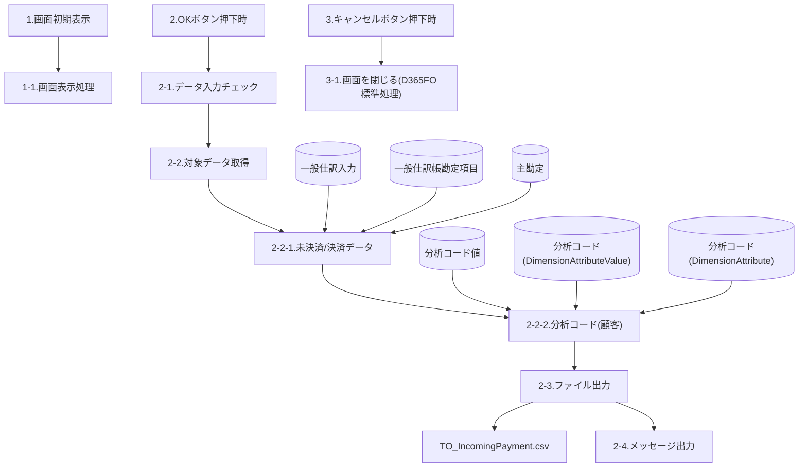
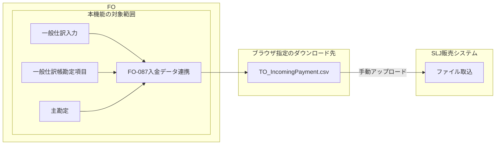

# FO-087 入金データ連携 設計書

<a id="sheet-21"></a>
## 1. はじめに

### 1.1 文書情報・共通ヘッダー

| 項目 | 内容 |
| --- | --- |
| 機能ID | FO-087 |
| 機能名称 | 入金データ連携 |
| システム | Dynamics365 for Finance and Operations |
| 機能分類 | 債権・債務 |
| プロジェクト | 会計システム刷新プロジェクト（LIBRA） |
| 宛先 | サンスター株式会社 御中 |
| 版数 | 第1.3版 |
| 文書日付・更新日 | 2024-11-28 |
| 作成日・作成者 | 2024-07-19／JBS石岡 |
| 更新者 | JBS加藤 |
| 作成会社 | 日本ビジネスシステムズ株式会社 |
| JBS承認日・承認者 | 2024-08-01／JBS加藤 |
| 基本設計部確認日・確認者 | 2024-08-05／サンスター佐保 |

文書名は「設計書」、多くの共通ヘッダーは「基本設計書」、オブジェクト一覧とプログラムフロー図は「詳細設計書」。原表記を統一しない。[Q01](../../../../../../qa/doc/00_Source/02.Design/20.設計/14.IF/FO-087_設計書_入金データ連携.md#q01)。

### 1.2 共通の適用条件

<a id="cr01"></a>
**CR01 法人の範囲**：出力単位はログインしている法人ごと。手動実行時は、事前にFO画面右上部で法人を「SLJ」に切り替えて本機能を実行する。

<a id="cr02"></a>
**CR02 ファイルの受渡し**：ファイルの格納先はブラウザ指定先。SLJ販売システムへの取込は手動アップロードで行う。自動連携へ変更したものではない。

<a id="sheet-5"></a>
## 2. 処理概要

### 2.1 開発目的

連携先システム（SLJ販売システム）にて、今回入金額や請求残高を含めた請求書を出力するため。

### 2.2 前提条件

法人の出力単位・SLJへの切替は[CR01](#cr01)、ファイルの格納先は[CR02](#cr02)に従う。

原資料の第3条件は「決済データについて、文書=DZ(得意先入金)となる仕訳データを抽出対象とする」。注記は「(現:伝票タイプ)」。イベント説明の未決済側の条件との対応は[Q02](../../../../../../qa/doc/00_Source/02.Design/20.設計/14.IF/FO-087_設計書_入金データ連携.md#q02)で確認する。

### 2.3 使用タイミング

月次。

### 2.4 開発内容

1. SLJ販売システムへ連携する入金（未決済／決済）情報の出力指示画面を新設する。
2. 指定した会計年度や会計期間をもとに未決済／決済データを取得し、ファイル出力を行う。

### 2.5 制限事項

特になし。

<a id="sheet-23"></a>
## 3. テーブル一覧

| No. | 種別 | 論理名 | 物理名 | I/O |
| --- | --- | --- | --- | --- |
| 1 | テーブル | 一般仕訳入力 | GeneralJournalEntry | I |
| 2 | テーブル | 一般仕訳帳勘定項目 | GeneralJournalAccountEntry | I |
| 3 | テーブル | 主勘定 | MainAccount | I |
| 4 | テーブル | 分析コード値 | DimensionAttributeLevelValueView | I |
| 5 | テーブル | 分析コード | DimensionAttributeValue | I |
| 6 | テーブル | 分析コード | DimensionAttribute | I |

原資料はビュー名を含む行も種別「テーブル」としているため、表記を保持する。画面参照とCSV出力の処理であり、この一覧の6件はすべて入力（I）。

<a id="sheet-4"></a>
## 4. DFD

### 4.1 イベントと処理・参照関係



原図のDB群から処理へ向かう参照線を、群内の各テーブルからの線へ展開した。個々の読込順序・SQLを定義したものではない。原DFDにない警告・データなし・異常終了の分岐は図へ推測追加せず、第5章の原記述に従う。

<a id="sheet-8"></a>
## 5. イベント説明

### 5.1 画面初期表示

**1-1. 画面表示処理**：`Classes/SJ_ARCashApplicationOutput` の `dialog()` で「画面レイアウト」シート通りに表示する。

### 5.2 OKボタン押下時：データ入力チェック

**2-1. データ入力チェック**：対象モジュールは `Classes/SJ_ARCashApplicationOutput`、対象メソッドは `validate()`。

| 処理番号 | チェック | 条件・処理 | 種別 | メッセージID | メッセージと引数 |
| --- | --- | --- | --- | --- | --- |
| 2-1-1 | 会計年度の必須チェック | [画面.会計年度]が空欄の場合、警告メッセージを出力する。 | 情報ログ／warning | SYS321809 | %1 が指定されていません。／%1："会計年度"（SJ00647） |
| 2-1-2 | 会計期間の必須チェック | [画面.会計期間]が空欄の場合、警告メッセージを出力する。 | 情報ログ／warning | SYS321809 | %1 が指定されていません。／%1："会計期間"（SJ00648） |

### 5.3 対象データ取得：未決済／決済データ

**2-2. 対象データ取得**：`Classes/SJ_ARCashApplicationOutput` の `run()`。

**2-2-1. 未決済/決済データ**：対象モジュールは同クラス。下位メソッド名は原資料で「実装時に記載」。以下の条件で取得・保持し、取得内容は第8章「ファイルレイアウト(区切り)」に従う。

#### 対象テーブルと結合条件

対象は `GeneralJournalEntry`（一般仕訳入力）、`GeneralJournalAccountEntry`（一般仕訳帳勘定項目）、`MainAccount`（主勘定）。

| 左辺 | 演算子 | 右辺 |
| --- | --- | --- |
| 一般仕訳入力.レコードID（GeneralJournalEntry.RecId） | = | 一般仕訳帳勘定項目.参照（GeneralJournalAccountEntry.GeneralJournalEntry） |
| 一般仕訳帳勘定項目.主勘定（GeneralJournalAccountEntry.MainAccount） | = | 主勘定.レコードID（MainAccount.RecId） |

#### 抽出条件の原記述

以下は原資料の条件列と括弧・接続語を保持した記述であり、実行可能なSQLではない。`or`の後にも`and`があるため、全体の論理結合を自動補正していない。

```text
([一般仕訳入力.日付(AccountingDate)] >= [画面.会計期間]の1日
and [一般仕訳入力.日付(AccountingDate)] <= [画面.会計期間]の末日)
※未決済データを抽出するための条件
and ([一般仕訳入力.トランザクション タイプ(JournalCategory)] = LedgerTransType::Payment(15:支払)
and [一般仕訳入力.文書(DocumentNumber)] = "DZ"(得意先入金)
and [一般仕訳帳勘定項目.転記タイプ(PostingType)] = LedgerPostingType::CustBalance(31:顧客残高))
or
※決済データを抽出するための条件
and (([一般仕訳入力.トランザクション タイプ(JournalCategory)] = LedgerTransType::Cust(8:顧客)
or [一般仕訳入力.トランザクション タイプ(JournalCategory)] = LedgerTransType::CustVendNetting(188:相殺決済))
and [一般仕訳帳勘定項目.転記タイプ(PostingType)] = LedgerPostingType::CustBalance(31:顧客残高))
```

未決済側にはPayment・DZ・CustBalance、決済側にはCustまたはCustVendNettingとCustBalanceが書かれている。前提条件のDZの適用先は[Q02](../../../../../../qa/doc/00_Source/02.Design/20.設計/14.IF/FO-087_設計書_入金データ連携.md#q02)、期間条件と二つの枝の結び方は[Q03](../../../../../../qa/doc/00_Source/02.Design/20.設計/14.IF/FO-087_設計書_入金データ連携.md#q03)、会計年度と期間の境界の決定方法は[Q06](../../../../../../qa/doc/00_Source/02.Design/20.設計/14.IF/FO-087_設計書_入金データ連携.md#q06)を参照。

#### ソートと0件時の処理

| 優先順（イベント説明の記載順） | フィールド | 順序 |
| --- | --- | --- |
| 1 | 一般仕訳入力.日付（AccountingDate） | 昇順 |
| 2 | 一般仕訳入力.伝票（SubledgerVoucher） | 昇順 |

ファイルレイアウトの「伝票番号、転記日付」と優先順が異なるため、どちらかに統一しない。[Q04](../../../../../../qa/doc/00_Source/02.Design/20.設計/14.IF/FO-087_設計書_入金データ連携.md#q04)。

対象データが存在しない場合、情報ログ（`info`）「対象データは存在しません。」（`SJ00181`）を出力し、処理を終了する。

### 5.4 分析コード（顧客）の取得

**2-2-2. 分析コード(顧客)**：`Classes/SJ_ARCashApplicationOutput`。下位メソッドは「実装時に記載」。

**2-2-2-1. 分析コード名を取得**：`DimensionAttribute`から、`Name = "Customer"`を条件に`RecId`を取得する。

**2-2-2-2. 分析コード値を取得**：分析コードの組み合わせ情報と分析コード名をもとに値を取得する。

| 呼出し | 内容 |
| --- | --- |
| 対象モジュール | Classes/SJ_CommonUtil |
| 対象メソッド | getLedgerDimensionValue() |
| 引数1 | 一般仕訳帳勘定項目.勘定科目（LedgerDimension） |
| 引数2 | 2-2-2-1で取得したレコードID |

| 順序 | 処理 | 対象モジュール | メソッド | 引数の原記述 |
| --- | --- | --- | --- | --- |
| 1) | 主勘定以外の分析コードの組み合わせ（分析コード セット）を取得 | Classes/DimensionAttributeValueSetStorage | getDefaultDimensionFromDimensionCombination() | [2-2-2-2.引数1] |
| 2) | 分析コードの組み合わせ情報をインスタンス化 | Classes/DimensionAttributeValueSetStorage | find() | 2-2-2-1-1)で取得した分析コード セット情報 |
| 3) | 分析コード値を取得 | Classes/DimensionAttributeValueSetStorage | getDisplayValueByDimensionAttribute() | [2-2-2-2.引数2] |

`find()`引数の参照番号は原文のまま保持する。[Q08](../../../../../../qa/doc/00_Source/02.Design/20.設計/14.IF/FO-087_設計書_入金データ連携.md#q08)。Customer定義や値が存在しない場合の扱いは[Q07](../../../../../../qa/doc/00_Source/02.Design/20.設計/14.IF/FO-087_設計書_入金データ連携.md#q07)。

### 5.5 ファイル出力

**2-3. ファイル出力**：`Classes/SJ_ARCashApplicationOutput`。対象メソッドは「実装時に記載」。2-2で保持したデータをもとにCSVファイルを出力し、出力内容は第8章に従う。

### 5.6 メッセージ出力

**2-4. メッセージ出力**：正常終了の場合は正常メッセージを出力して終了する。異常終了の場合はエラーメッセージを出力して終了する。

| 条件 | 種別 | メッセージID | メッセージ | %1 |
| --- | --- | --- | --- | --- |
| 正常終了・ファイル出力通知 | 情報ログ／info | SJ00187 | %1が出力されました。 | [2-3.ファイル名] |
| 正常終了・処理完了通知 | 情報ログ／info | SJ00185 | %1処理が正常に終了しました。 | "入金データ連携"（SJ00278） |
| 異常終了 | 情報ログ／error | SJ00186 | %1処理が異常終了しました。 | "入金データ連携"（SJ00278） |

### 5.7 キャンセルボタン押下時

**3-1. 画面を閉じる(D365FO標準処理)**：ダイアログ画面を閉じる。

<a id="sheet-9"></a>
## 6. 画面レイアウト

### 6.1 起動情報

| 項目 | 内容 |
| --- | --- |
| パス | [売掛金管理] > [定期処理] > [入金データ連携] |
| フォーム名欄の記載 | Class/SJ_ARCashApplicationOutput |
| タブ名 | パラメータータブ |

### 6.2 ダイアログ（HTML）

<section id="fo087-dialog" aria-labelledby="fo087-title" aria-describedby="fo087-dialog-note" style="border:1px solid #777;max-width:700px;box-sizing:border-box;background:white;padding:24px">
<form aria-label="入金データ連携の静的画面例" style="margin:0;min-height:640px;display:flex;flex-direction:column">
<h3 id="fo087-title" style="margin:0 0 30px;font-size:24px">入金データ連携</h3>
<fieldset style="border:0;border-top:1px solid #ccc;margin:0;padding:16px 0"><legend>パラメーター</legend>
<p><label for="fo087-year">会計年度</label><br><select id="fo087-year" required disabled style="min-width:180px;padding:8px"><option>2024</option></select></p>
<p><label for="fo087-month">会計期間</label><br><select id="fo087-month" required disabled style="min-width:180px;padding:8px"><option>1</option><option>2</option><option>3</option><option>4</option><option>5</option><option>6</option><option>7</option><option selected>8</option><option>9</option><option>10</option><option>11</option><option>12</option></select></p>
</fieldset>
<div role="group" aria-label="ボタン" style="margin-top:auto;display:flex;justify-content:flex-end;gap:12px"><button id="fo087-ok" type="button" disabled style="padding:8px 24px;background:#2365d9;color:white;border:1px solid #2365d9">OK</button><button id="fo087-cancel" type="button" disabled style="padding:8px 24px">キャンセル</button></div>
</form>
</section>

### 6.3 レイアウト外の説明

<div id="fo087-dialog-note">画像の会計年度2024、会計期間8は表示例であり、固定の初期値ではない。初期値の規則は第7章。部品の無効化は静的プレビューのためであり、実画面の入力不可要件ではない。入力・出力や外部システムへの送信は実行しない。</div>

<a id="sheet-11"></a>
## 7. 画面項目説明

### 7.1 項目定義

| 項目 | 種類 | 入力 | 必須 | 入力内容・後処理 |
| --- | --- | --- | --- | --- |
| タイトル | タイトル | 不可 | 対象外 | Caption：入金データ連携 |
| 会計年度 | ListBox | 可 | 必須 | 出力対象とする会計年度を指定 |
| 会計期間 | コンボボックス | 可 | 必須 | 出力対象とする会計期間（月）を指定 |
| OK | ボタン | 可 | 対象外（原欄×） | イベント説明「2.OKボタン押下時」を参照 |
| キャンセル | ボタン | 可 | 対象外（原欄×） | 画面を閉じる（D365FO標準処理） |

### 7.2 初期値・標準参照

| 項目 | 初期値 | ルックアップ・実装指定 | チェック内容 |
| --- | --- | --- | --- |
| 会計年度 | システム日付が該当する[会計暦年.名前] | 標準の会計年度ルックアップ。標準EDT：FiscalYearName。第11章を参照 | ルックアップと同じ |
| 会計期間 | システム日付(MM) | 標準の月のコンボボックス。標準BaseEnum：FiscalPeriodMonth | 原資料に独立した追記なし |

会計期間の選択肢は「1」「2」「3」「4」「5」「6」「7」「8」「9」「10」「11」「12」。保存された非表示領域の内容を補足していない。

<a id="sheet-48"></a>
## 8. ファイルレイアウト(区切り)

### 8.1 ファイル属性

| 属性 | 原資料の指定 |
| --- | --- |
| ファイル名称 | TO_IncomingPayment.csv |
| 文字コード | UTF-8 |
| 区切り文字 | コンマ |
| 文字列 | 囲い文字無し |
| 改行コード | CRLF |
| ソート | 伝票番号、転記日付 |
| タイトル行 | なし |

本章のUTF-8・CRLFは業務CSVの仕様であり、納品MarkdownのUTF-8・LFと混同しない。囲い文字無しの場合の特殊文字は[Q05](../../../../../../qa/doc/00_Source/02.Design/20.設計/14.IF/FO-087_設計書_入金データ連携.md#q05)、実際の出力順は[Q04](../../../../../../qa/doc/00_Source/02.Design/20.設計/14.IF/FO-087_設計書_入金データ連携.md#q04)、列値の未指定の書式は[Q09](../../../../../../qa/doc/00_Source/02.Design/20.設計/14.IF/FO-087_設計書_入金データ連携.md#q09)。

### 8.2 出力項目（順序固定）

| No. | フィールド名 | 説明・設定元 | 属性 | 桁数 | 備考 |
| --- | --- | --- | --- | --- | --- |
| 1 | 会社コード | ログインしている会社コード | STRING | 4 |  |
| 2 | 顧客 | [一般仕訳帳勘定項目.勘定科目(LedgerDimension)]の顧客 | STRING | 20 |  |
| 3 | 会計年度 | [画面.会計年度] | STRING | 4 |  |
| 4 | 伝票番号 | [一般仕訳入力.伝票(SubledgerVoucher)] | STRING | 20 |  |
| 5 | 会計期間 | [画面.会計期間] | ENUM | ー |  |
| 6 | 借方/貸方フラグ | ■[一般仕訳帳勘定項目.貸方]=「いいえ」の場合<br>　固定値「借方」<br><br>■[一般仕訳帳勘定項目.貸方]=「はい」の場合<br>　固定値「貸方」 | ENUM | ー |  |
| 7 | 主勘定 | [一般仕訳帳勘定項目.主勘定(MainAccount)]に紐づく[主勘定.主勘定(MainAccountId)] | STRING | 20 |  |
| 8 | 金額 | [一般仕訳帳勘定項目.金額(AccountingCurrencyAmount)] | REAL | ー |  |
| 9 | 転記日付 | [一般仕訳入力.日付(AccountingDate)] | DATE | ー | YYYYMMDD |
| 10 | 明細テキスト | [一般仕訳帳勘定項目.説明(Text)] | STRING | 60 |  |

桁数欄の「ー」は原表記。0桁、無制限、小数精度などへ読み替えない。CSVのタイトル行を追加しない。貸方フラグの「いいえ→借方」「はい→貸方」は固定文字列の対応として保持する。

<a id="sheet-42"></a>
## 9. 補足説明(画面マッピング)

### 9.1 伝票トランザクションの参照画面（HTML）

<section id="fo087-map-frame" aria-label="伝票トランザクションの参照画面" style="border:1px solid #777;max-width:100%;box-sizing:border-box;overflow:hidden;padding:12px">
<div style="background:#171717;color:white;padding:10px">Finance and Operations　一般会計 ＞ 照会およびレポート ＞ 伝票トランザクション　SLJ</div>
<h3>伝票トランザクション</h3><h4>自分のビュー</h4><p>概要　一般</p>
<div style="overflow-x:auto;max-width:100%"><table id="fo087-map-grid" aria-describedby="fo087-map-note" border="1" cellpadding="6" style="border-collapse:collapse;width:100%;white-space:nowrap"><thead><tr><th scope="col">伝票</th><th scope="col">日付</th><th scope="col">勘定科目（省略表示を保持）</th><th scope="col">勘定科目名</th><th scope="col">説明</th><th scope="col">金額</th><th scope="col">会社コード ID</th><th scope="col">月</th></tr></thead><tbody>
<tr><td>SLJ-30000000</td><td>2024/04/22</td><td>1030401-…</td><td>電子記録債権</td><td>ｘｘｘ売上</td><td>22,000.00</td><td>slj</td><td>4</td></tr>
<tr><td>SLJ-30000001</td><td>2024/07/18</td><td>1030401-…</td><td>電子記録債権</td><td>自由書式の請...</td><td>165.00</td><td>slj</td><td>7</td></tr>
<tr><td>SLJ-30000002</td><td>2024/07/18</td><td>1030401-…</td><td>電子記録債権</td><td>自由書式の請...</td><td>182.00</td><td>slj</td><td>7</td></tr>
<tr><td>GNLJ1000001</td><td>2024/07/16</td><td>1030401-…</td><td>電子記録債権</td><td></td><td>1,000.00</td><td>slj</td><td>7</td></tr>
<tr><td>GNLJ1000002</td><td>2024/07/18</td><td>1140101-…</td><td>未収入金</td><td></td><td>10,000.00</td><td>slj</td><td>7</td></tr>
</tbody></table></div>
</section>

### 9.2 画面外の対応表・注記

<div id="fo087-map-note">原画像の5行から、図形に覆われていない列を参照用に抜粋した。勘定科目欄の「…」はこの抜粋で省略した部分を示し、元の顧客コードの確定値ではない。空欄・省略された説明は補完しない。これは全行をCSVへ出力する指定や初期値の定義ではない。</div>

| 原吹き出し番号（CSVのNo.） | CSV項目 | 画面上の対応先 |
| --- | --- | --- |
| 1 | 会社コード | 会社コード ID |
| 2 | 顧客 | 勘定科目（LedgerDimension）に含まれる顧客 |
| 4 | 伝票番号 | 伝票 |
| 5 | 会計期間 | 月 |
| 6 | 借方/貸方フラグ | 貸方 |
| 7 | 主勘定 | 主勘定 |
| 8 | 金額 | 金額 |
| 9 | 転記日付 | 日付 |
| 10 | 明細テキスト | 説明 |

No.3「会計年度」はファイル定義で[画面.会計年度]を使用する。原画像にNo.3の吹き出しはないため、新しい吹き出しとして追加しない。文書欄には「DZ」を示す4つの上書き図形がある。覆われた旧文書番号を現行条件として復活させず、DZの適用範囲はQ02で確認する。

<a id="map-1"></a>
<!-- source-callout MAP-1 | target=fo087-map-grid: 1 -->
> **MAP-1（原吹き出し「1」）**：会社コード ← 画面の「会社コード ID」。

<a id="map-2"></a>
<!-- source-callout MAP-2 | target=fo087-map-grid: 2 -->
> **MAP-2（原吹き出し「2」）**：顧客 ← 画面の「勘定科目（LedgerDimension）に含まれる顧客」。

<a id="map-4"></a>
<!-- source-callout MAP-4 | target=fo087-map-grid: 4 -->
> **MAP-4（原吹き出し「4」）**：伝票番号 ← 画面の「伝票」。

<a id="map-5"></a>
<!-- source-callout MAP-5 | target=fo087-map-grid: 5 -->
> **MAP-5（原吹き出し「5」）**：会計期間 ← 画面の「月」。

<a id="map-6"></a>
<!-- source-callout MAP-6 | target=fo087-map-grid: 6 -->
> **MAP-6（原吹き出し「6」）**：借方/貸方フラグ ← 画面の「貸方」。

<a id="map-7"></a>
<!-- source-callout MAP-7 | target=fo087-map-grid: 7 -->
> **MAP-7（原吹き出し「7」）**：主勘定 ← 画面の「主勘定」。

<a id="map-8"></a>
<!-- source-callout MAP-8 | target=fo087-map-grid: 8 -->
> **MAP-8（原吹き出し「8」）**：金額 ← 画面の「金額」。

<a id="map-9"></a>
<!-- source-callout MAP-9 | target=fo087-map-grid: 9 -->
> **MAP-9（原吹き出し「9」）**：転記日付 ← 画面の「日付」。

<a id="map-10"></a>
<!-- source-callout MAP-10 | target=fo087-map-grid: 10 -->
> **MAP-10（原吹き出し「10」）**：明細テキスト ← 画面の「説明」。

<a id="sheet-41"></a>
## 10. 補足説明(機能関連図)

### 10.1 機能とファイルの受渡し



枠はシステム・保存先・本機能の範囲を示し、独立した処理ステップではない。原図の「...」は参照情報の省略表示であり、未記載テーブルを追加定義しない。ファイルの受渡しは[CR02](#cr02)を適用する。

### 10.2 図外の注記

<a id="relation-download"></a>
<!-- source-callout REL-01 | target=relation-download: ブラウザ指定となるダウンロード先にファイルがダウンロードされる -->
> **REL-01（CSV出力先）**：ブラウザ指定となるダウンロード先にファイルがダウンロードされる

<a id="relation-upload"></a>
<!-- source-callout REL-02 | target=relation-upload: 手動アップロード -->
> **REL-02（SLJ販売システムへの受渡し）**：手動アップロード

機能の取下げ可能性を示す原吹き出しは、未確定事項として[Q10](../../../../../../qa/doc/00_Source/02.Design/20.設計/14.IF/FO-087_設計書_入金データ連携.md#q10)およびQAのレビューR01へ分離する。これを取下げ決定として扱わない。

<a id="sheet-49"></a>
## 11. 補足説明(画面項目イメージ)

### 11.1 会計カレンダーと会計年度

ログインしている法人に紐づく[元帳.会計カレンダー]として登録されているデータが表示される。

<section id="fo087-ledger-frame" aria-label="元帳の会計カレンダー参照" style="border:1px solid #777;max-width:900px;box-sizing:border-box;overflow:hidden;padding:12px">
<div style="background:#171717;color:white;padding:10px">一般会計 ＞ 元帳の設定 ＞ 元帳</div><h3>元帳</h3>
<table border="1" cellpadding="6" style="border-collapse:collapse;width:100%"><thead><tr><th>説明</th><th>勘定科目表</th><th>会計カレンダー</th></tr></thead><tbody><tr><td>サンスター株式会社</td><td>SUNSTAR_Group</td><td>Fiscal</td></tr></tbody></table>
</section>

<section id="fo087-calendar-frame" aria-label="会計年度ルックアップの参照例" aria-describedby="fo087-calendar-note" style="border:1px solid #777;max-width:900px;box-sizing:border-box;overflow:hidden;padding:12px;margin-top:16px">
<h3>元帳カレンダー</h3><p>カレンダー：Fiscal</p>
<form aria-label="会計年度ルックアップ参考" style="margin:0"><label for="lookup-year">会計年度</label> <select id="lookup-year" disabled><option>2024</option></select></form>
<div style="overflow-x:auto;max-width:100%"><table id="fo087-year-grid" aria-describedby="fo087-calendar-note" border="1" cellpadding="6" style="border-collapse:collapse;width:100%;white-space:nowrap"><thead><tr><th scope="col">会計年度</th><th scope="col">開始日</th><th scope="col">終了日</th></tr></thead><tbody>
<tr><td>2023</td><td>2023/01/01</td><td>2023/12/31</td></tr>
<tr><td>2024</td><td>2024/01/01</td><td>2024/12/31</td></tr>
<tr><td>2025</td><td>2025/01/01</td><td>2025/12/31</td></tr>
<tr><td>2026</td><td>2026/01/01</td><td>2026/12/31</td></tr>
<tr><td>2027</td><td>2027/01/01</td><td>2027/12/31</td></tr>
<tr><td>2028</td><td>2028/01/01</td><td>2028/12/31</td></tr>
</tbody></table></div>
</section>

<div id="fo087-calendar-note">元帳画像はSSJ法人の参考表示であり、本機能をSLJへ切り替えて実行する前提を変更しない。Fiscalと2023～2028の年度・開始日・終了日は画像の表示例。固定の選択肢・将来の年度制限・全法人の会計暦を意味しない。標準画面の本件と無関係な勘定構造・通貨再評価明細は参照画面の再現対象にしない。</div>

### 11.2 参考ソースコード

原画像は `LedgerCalendar.xpp` の `Control:YearFilter`、`[Control("String")] class YearFilter` の参照である。以下は可読の `lookup()` 部分の転記。画面の上下で切れているコードは補完していない。

```xpp
public void lookup()
{
    FiscalCalendarYear::lookupFiscalCalendarYear(this, fiscalCalendar.RecId);
}
```

参考ソースであり、FO-087に新しく実装済みのコードとして扱わない。

<a id="sheet-31"></a>
## 12. レビュー指摘事項

原資料の3件の指摘・対応・確認記録は[QAのレビュー記録](../../../../../../qa/doc/00_Source/02.Design/20.設計/14.IF/FO-087_設計書_入金データ連携.md#review-records)に集約する。確認済み記録に再回答を求めない。

本機能は基本設計時点では現行仕様をもとに設計を進めるとの回答がある。項目名は会計年度・会計期間へ統一済み。インターフェース件数管理の管理対象は、Azure Filesを介した自動連携のIF機能のみとするとの対応が記録されている。この手動出力機能へその管理処理を追加しない。

<a id="sheet-27"></a>
## 13. オブジェクト一覧

<a id="placeholder-13"></a>
<!-- source-callout PLACEHOLDER-13 | target=placeholder-13: 詳細設計・開発時に記載 -->
> **原資料の表示**：詳細設計・開発時に記載

この版には具体的なオブジェクト一覧が記載されていない。別版の詳細設計書やイベント説明から推測した内容を、この章へ追加しない。

<a id="sheet-29"></a>
## 14. プログラムフロー図

<a id="placeholder-14"></a>
<!-- source-callout PLACEHOLDER-14 | target=placeholder-14: 詳細設計・開発時に記載 -->
> **原資料の表示**：詳細設計・開発時に記載

この版には具体的なプログラムフローが記載されていない。別版の詳細設計書やイベント説明から推測した内容を、この章へ追加しない。
