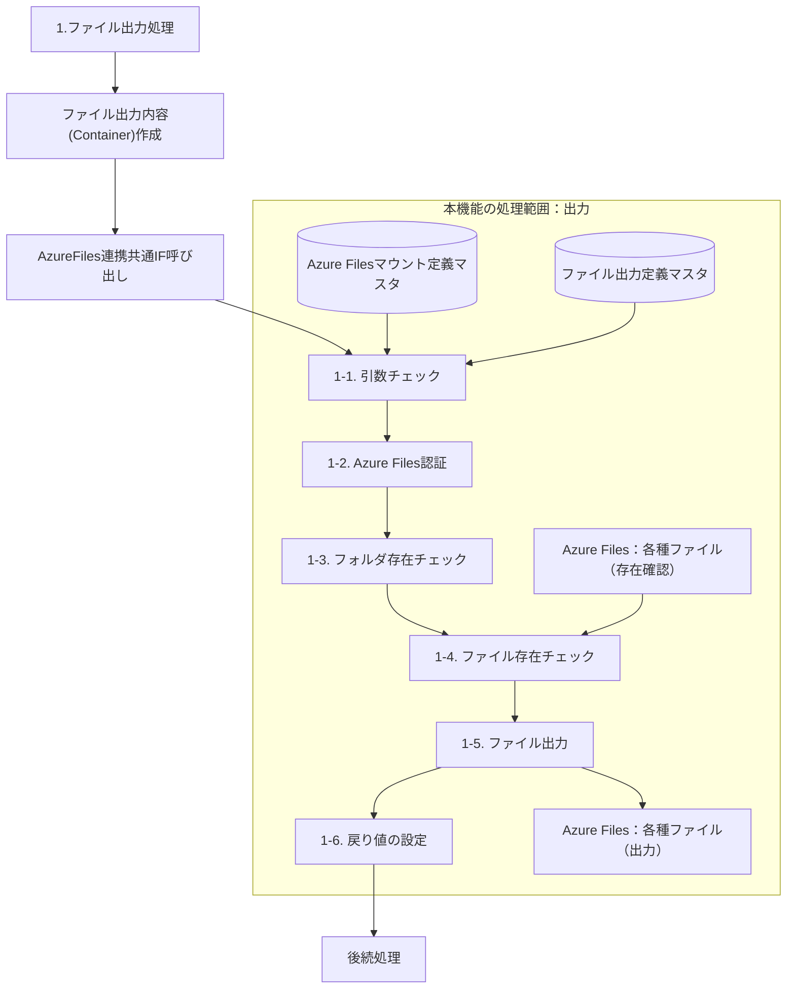
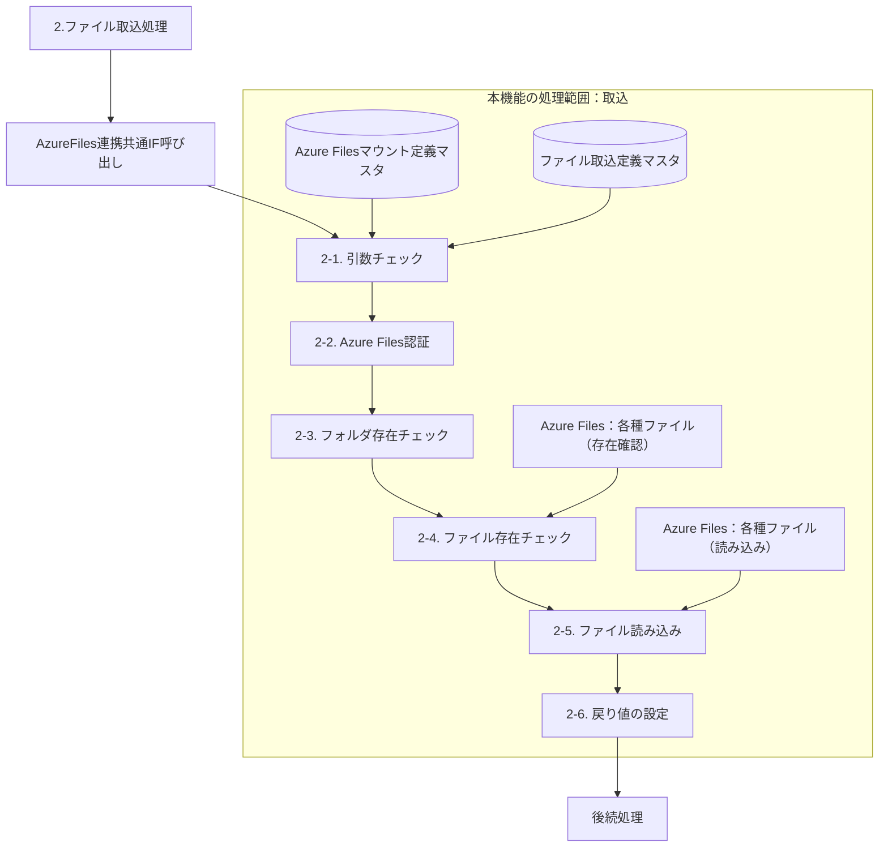
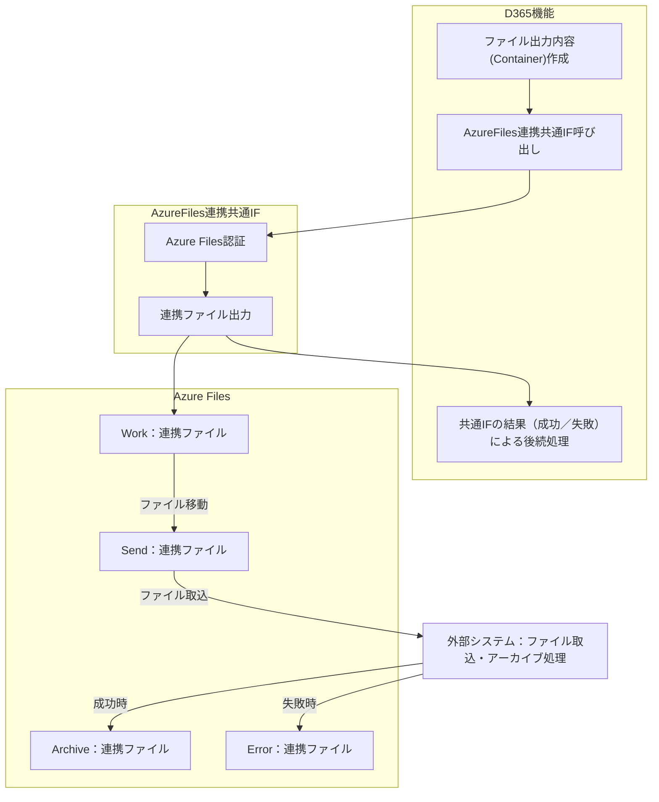
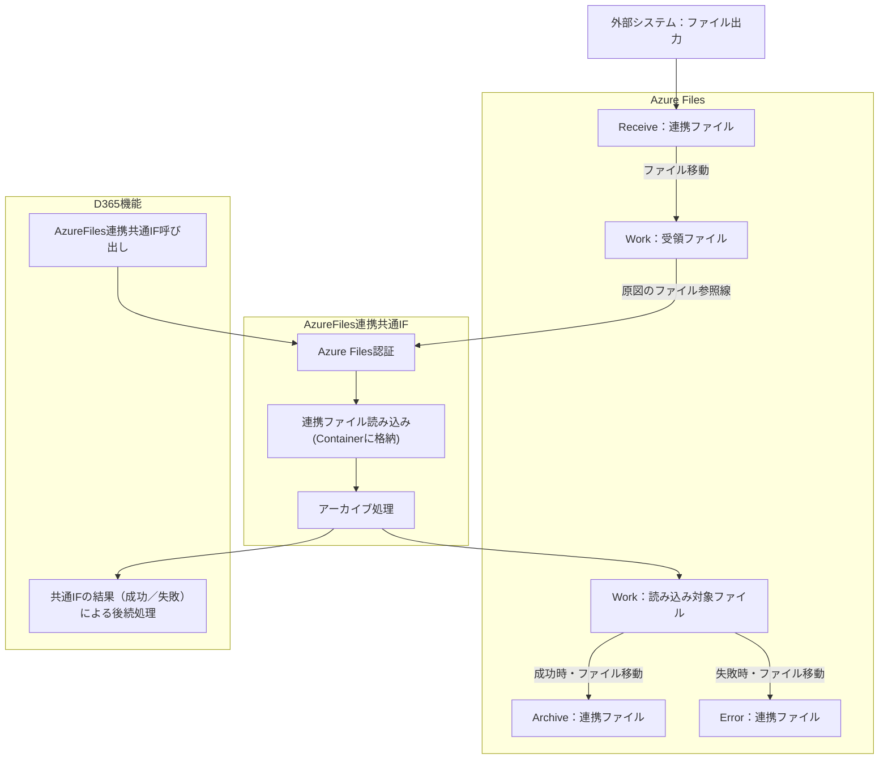

# FO-088 AzureFiles連携共通インターフェース 設計書

<a id="sheet-21"></a>
## 1. はじめに

### 1.1 文書情報・共通ヘッダー

| 項目 | 内容 |
| --- | --- |
| 機能ID | FO-088 |
| 機能名称 | AzureFiles連携共通インターフェース |
| システム | Dynamics365 for Finance and Operations |
| 機能分類 | システム共通 |
| プロジェクト | 会計システム刷新プロジェクト（LIBRA） |
| 宛先 | サンスター株式会社 御中 |
| 版数 | 第1.0版 |
| 文書日付・更新日 | 2024-06-10 |
| 作成日・作成者 | 2024-06-10／JBS石岡 |
| 更新者 | JBS石岡 |
| 作成会社 | 日本ビジネスシステムズ株式会社 |
| JBS承認日・承認者 | 2024-06-14／JBS加藤 |
| 基本設計部確認日・確認者 | 2024-07-16／サンスター佐保 |

ファイル名・表紙の文書名は「設計書」、共通ヘッダーの多くは「基本設計書」、オブジェクト一覧とプログラムフロー図のヘッダーは「詳細設計書」。原表記を統一しない。[Q01](../../../../../../qa/doc/00_Source/02.Design/20.設計/14.IF/FO-088_設計書_AzureFiles連携共通インターフェース.md#q01)。

### 1.2 共通の適用条件

<a id="cr01"></a>
**CR01 対象ファイル**：Azure Filesへ出力するファイル、Azure Filesから取り込むファイルは、いずれもテキスト形式を対象とする。

<a id="cr02"></a>
**CR02 定義マスタの保守**：AzureFilesマウント定義マスタ、ファイル取込定義マスタ、ファイル出力定義マスタはDIXFにてメンテナンスする。

<a id="cr03"></a>
**CR03 アーカイブの責任**：連携用ファイルのアーカイブ処理は受領側のシステムが実施する。D365から出力する場合は外部システム側、D365へ取り込む場合はD365側の処理として、補足説明に図示されている。

<a id="sheet-5"></a>
## 2. 処理概要

### 2.1 開発目的

外部システムに対する連携用ファイルを所定のAzure Filesへ格納する。また、外部システムから連携されるD365向けのファイルを、所定のAzure Filesから取り込む。

### 2.2 前提条件

対象形式は[CR01](#cr01)、3マスタのメンテナンスは[CR02](#cr02)、アーカイブの責任は[CR03](#cr03)に従う。

### 2.3 使用タイミング

本機能を呼び出す各機能側にて定義する。

### 2.4 開発内容

**ファイルデータ出力処理**：各機能から渡された引数を基に、Azure Filesへファイル出力する。

**ファイルデータ取込処理**：各機能から渡された引数を基に、Azure Filesに受領したファイルを読み取り、呼び出し元の各機能へ返す。受領したファイルのアーカイブ処理も実施する。

### 2.5 制限事項

特になし。

<a id="sheet-23"></a>
## 3. テーブル一覧

| No. | 種別 | 論理名 | 物理名 | I/O | 備考 |
| --- | --- | --- | --- | --- | --- |
| 1 | テーブル | AzureFilesマウント定義マスタ | `SJ_AzureFilesDefineTable` | I | 新規 |
| 2 | テーブル | ファイル取込定義マスタ | `SJ_FileInDefineTable` | I | 新規 |
| 3 | テーブル | ファイル出力定義マスタ | `SJ_FileOutDefineTable` | I | 新規 |

<a id="sheet-4"></a>
## 4. DFD

### 4.1 ファイル出力処理



### 4.2 ファイル取込処理



DB群から引数チェックへの参照を、各マスタからの2本の参照線として表した。DBへの更新や読み込み順を指定するものではない。両図は原DFDの処理のつながりであり、後続へ進まず終了する条件・リトライ・戻り値は第5章に従う。

<a id="sheet-8"></a>
## 5. イベント説明

### 5.1 ファイル出力処理の呼出定義

| 区分 | 項目・型 | 必須／デフォルト |
| --- | --- | --- |
| 対象モジュール | `Classes/SJ_AzureFilesUtils` | — |
| 対象メソッド | `outPutTextFile()` | — |
| 引数1 | ファイル出力機能ID（SJ_FileOutFunctionId） | 必須 |
| 引数2 | コンテナ（container [[ファイル内容]]） | 必須 |
| 引数3 | ファイル名（String） | デフォルト：`""`（ブランク） |
| 引数4 | 起動回（SJ_RunTiming） | デフォルト：【Once:1回目】 |
| 戻り値 | 結果（Boolean） | True：正常終了／False：異常終了 |

引数チェック・メッセージ・出力例にある引数番号の差異は[Q02](../../../../../../qa/doc/00_Source/02.Design/20.設計/14.IF/FO-088_設計書_AzureFiles連携共通インターフェース.md#q02)。呼出定義と異なる参照を、同じ引数と決めつけない。

### 5.2 ファイル出力処理の手順

<a id="out-1-1"></a>
#### 1-1. 引数チェック

引数を条件に「ファイル出力定義マスタ」と「AzureFilesマウント定義マスタ」を取得する。後者は原資料で`Outer`と指定される。

| 区分 | 左辺 | 関係 | 右辺 |
| --- | --- | --- | --- |
| 結合条件 | [ファイル出力定義マスタ.共有コンテナID] | = | [AzureFilesマウント定義マスタ.共有コンテナID] |
| 検索条件 | [ファイル出力定義マスタ.ファイル出力機能ID] | ＝ | 引数1.ファイル出力機能ID |
| 検索条件 | [ファイル出力定義マスタ.起動回] | ＝ | 引数4.起動タイミング |

取得できない場合は次のメッセージを表示し、戻り値`false`で終了する。

| メッセージID | 種別 | 文言 |
| --- | --- | --- |
| SJ00041 | 情報ログ／warning | %1の設定がされていません。%2を確認してください。%3：%4 |

| 引数 | 設定値（原資料） | ラベルID |
| --- | --- | --- |
| %1 | ファイル出力 | SJ00045 |
| %2 | ファイル出力定義マスタ | SJ00039 |
| %3 | ファイル出力機能ID | SJ00046 |
| %4 | [引数2.ファイル出力機能ID] | 原資料空欄 |

`%4`の引数番号は原文のまま。[Q02](../../../../../../qa/doc/00_Source/02.Design/20.設計/14.IF/FO-088_設計書_AzureFiles連携共通インターフェース.md#q02)。

<a id="out-1-2"></a>
#### 1-2. Azure Files認証

`[AzureFilesマウント定義マスタ.共有ルートパス]`にアクセス可能な場合は、手順1-3へ進む。

`netUse`コマンドを使用し、AzureFilesのRootディレクトリをネット作業ドライブとしてマウントする。すでにマウント済みの場合は処理を行わない。

| 認証項目 | 設定値 |
| --- | --- |
| デバイス | [AzureFilesマウント定義マスタ.共有ルートパス] |
| ユーザー | [AzureFilesマウント定義マスタ.共有パス接続ユーザーID] |
| パスワード | [AzureFilesマウント定義マスタ.共有パス接続パスワード] |

認証でエラーが発生した場合は次のメッセージを表示し、戻り値`false`で終了する。

| メッセージID | 種別 | 文言 |
| --- | --- | --- |
| SJ00042 | 情報ログ／warning | Azure Files認証に失敗しました。%1を確認してください。%2：%3 |

| 引数 | 設定値（原資料） | ラベルID |
| --- | --- | --- |
| %1 | AzureFilesマウント定義マスタ | SJ00037 |
| %2 | 共有コンテナ | SJ00047 |
| %3 | [ファイル出力定義マスタ.共有コンテナID] | 原資料空欄 |


#### 1-3. フォルダ存在チェック

本処理で使用する次の各フォルダが存在するかチェックする。存在しない場合はメッセージを表示し、戻り値`false`で終了する。

| フォルダ | パス式（原資料） | メッセージID | %1 |
| --- | --- | --- | --- |
| 送信フォルダ | [AzureFilesマウント定義マスタ.共有ルートパス] + [ファイル出力定義マスタ.送信フォルダパス] | SJ00043 | [1-3.送信フォルダ] |
| 作業フォルダ | [AzureFilesマウント定義マスタ.共有ルートパス] + [ファイル出力定義マスタ.作業フォルダパス] | SJ00043 | [1-3.作業フォルダ] |

メッセージは情報ログ／warning：**「ファイルの格納先が存在しません。フォルダ：%1」**。存在しないフォルダを自動作成する指示はない。

#### 1-4. ファイル存在チェック

原資料は`[ファイル出力定義マスタ.読み込み種別]＝【NonUpdate:上書き禁止】`の場合を記載する。補足説明の「上書き種別」との対応は[Q06](../../../../../../qa/doc/00_Source/02.Design/20.設計/14.IF/FO-088_設計書_AzureFiles連携共通インターフェース.md#q06)。

送信フォルダ`[AzureFilesマウント定義マスタ.共有ルートパス] + [ファイル出力定義マスタ.送信フォルダパス]`内を検索する。

| 引数3.ファイル名 | 検索ファイル名 |
| --- | --- |
| ＝""（ブランク） | `"*" + [ファイル出力定義マスタ.固定ファイル名] + "*." + [ファイル出力定義マスタ.ファイル名拡張子]` |
| ≠""（ブランク） | `"*" + 引数3.ファイル名 + "*." + [ファイル出力定義マスタ.ファイル名拡張子]` |


| 読み込み種別（原表記） | ファイル存在 | チェック評価 |
| --- | --- | --- |
| NonUpdate:上書き禁止 | なし | 正常（後続処理） |
| NonUpdate:上書き禁止 | あり | 異常終了 |

チェック評価が異常終了の場合、情報ログ／warning `SJ00044`：**「出力先フォルダに同一ファイルが存在します。ファイル名：%1」**を表示して終了する。`%1=[1-4.検索ファイル名]`、戻り値`false`。

NonUpdate以外の区分・未設定時の分岐は[Q07](../../../../../../qa/doc/00_Source/02.Design/20.設計/14.IF/FO-088_設計書_AzureFiles連携共通インターフェース.md#q07)。検索式のワイルドカードを、完全一致に置き換えない。

#### 1-5. ファイル出力

**1-5-1. ファイル出力**

原資料の記載：**「引数3.コンテナを[ファイル出力定義マスタ]の設定に従いストリームに出力する。」** 呼出定義のコンテナは引数2であるため、差異は[Q02](../../../../../../qa/doc/00_Source/02.Design/20.設計/14.IF/FO-088_設計書_AzureFiles連携共通インターフェース.md#q02)に残す。

文字コードは`[ファイル出力定義マスタ.文字コード]`。

原資料の出力イメージ（例示）：

```text
引数3.コンテナ＝[
  [ 0001, "品目A", 1000.00, … ]
 ,[ 0002, "品目B", 1000.00, … ]
]
ストリーム (1行目)：0001, "品目A", 1000.00, …
ストリーム (2行目)：0002, "品目B", 1000.00, …
```

作成したストリームを作業フォルダへ出力する。**ファイルをストリームで完全に作成してから、実ファイルを出力する。**

作業フォルダ：`[AzureFilesマウント定義マスタ.共有ルートパス] + [ファイル出力定義マスタ.作業フォルダパス]`。

| 引数3.ファイル名 | 送信ファイル名（原資料の結合式） |
| --- | --- |
| ＝""（ブランク） | [ファイル出力定義マスタ.固定ファイル名] + "_" +  [ファイル出力定義マスタ.ファイル名拡張子] |
| ≠""（ブランク） | 引数3.ファイル名 +  [ファイル出力定義マスタ.ファイル名拡張子] |

拡張子のドットやアンダースコアを追加・削除せず保持する。検索式と出力ファイル名の整合性は[Q05](../../../../../../qa/doc/00_Source/02.Design/20.設計/14.IF/FO-088_設計書_AzureFiles連携共通インターフェース.md#q05)。

**1-5-2. ファイル移動（作業フォルダ→送信フォルダ）**

作業フォルダから送信フォルダへ、送信ファイルを移動する。

| 区分 | パス式 |
| --- | --- |
| 移動元 | [AzureFilesマウント定義マスタ.共有ルートパス] + [ファイル出力定義マスタ.作業フォルダパス] |
| 移動先 | [AzureFilesマウント定義マスタ.共有ルートパス] + [ファイル出力定義マスタ.送信フォルダパス] |


#### 1-6. 戻り値の設定

戻り値`true`をセットする。途中のSTEPでエラーが発生した場合、本STEPまで処理が継続されることはない。

### 5.3 ファイル取込処理の呼出定義

| 区分 | 項目・型 | 必須／デフォルト |
| --- | --- | --- |
| 対象モジュール | `Classes/SJ_AzureFilesUtils` | — |
| 対象メソッド | `loadTextFile()` | — |
| 引数1 | ファイル取込機能ID（SJ_FileInFunctionId） | 必須 |
| 引数2 | 起動回（SJ_RunTiming） | デフォルト：【Once:1回目】 |
| 戻り値1 | 結果（Boolean） | True：正常終了／False：異常終了 |
| 戻り値2 | コンテナ（container [[ファイル名,[ファイル内容]]]） | ファイルごとの名前と内容 |


### 5.4 ファイル取込処理の手順

#### 2-1. 引数チェック

引数を条件に「ファイル取込定義マスタ」と「AzureFilesマウント定義マスタ」を取得する。後者は原資料で`Outer`と指定される。

| 区分 | 左辺（原資料） | 関係 | 右辺（原資料） |
| --- | --- | --- | --- |
| 結合条件 | [ファイル取込定義マスタ.共有コンテナID] | = | [AzureFilesマウント定義マスタ.共有コンテナID] |
| 検索条件 | [ファイル取込定義マスタ.ファイル出力機能ID] | ＝ | 引数1.ファイル取込機能ID |
| 検索条件 | [ファイル取込定義マスタ.起動回] | ＝ | 引数4.起動タイミング |

「ファイル出力機能ID」と「引数4」は原表記。取込処理の呼出定義との対応は[Q03](../../../../../../qa/doc/00_Source/02.Design/20.設計/14.IF/FO-088_設計書_AzureFiles連携共通インターフェース.md#q03)。

取得できない場合は次のメッセージを表示し、戻り値`false`で終了する。

| メッセージID | 種別 | 文言 |
| --- | --- | --- |
| SJ00041 | 情報ログ／warning | %1の設定がされていません。%2を確認してください。%3：%4 |

| 引数 | 設定値（原資料） | ラベルID |
| --- | --- | --- |
| %1 | ファイル取込 | SJ00048 |
| %2 | ファイル取込定義マスタ | SJ00038 |
| %3 | ファイル取込機能ID | SJ00049 |
| %4 | [引数2.ファイル取込機能ID] | 原資料空欄 |


#### 2-2. Azure Files認証

原資料の記載は**「※1-2と同様の処理となる」**。[出力側の認証処理](#out-1-2)を参照する。認証エラーの共有コンテナID参照先を、取込側へ読み替えるかは[Q04](../../../../../../qa/doc/00_Source/02.Design/20.設計/14.IF/FO-088_設計書_AzureFiles連携共通インターフェース.md#q04)。

#### 2-3. フォルダ存在チェック

次の各フォルダが存在するかをチェックする。存在しない場合はメッセージを表示して終了する（戻り値`false`）。

| フォルダ | パス式（原資料） | メッセージID | %1 |
| --- | --- | --- | --- |
| 受信フォルダ | [AzureFilesマウント定義マスタ.共有ルートパス] + [ファイル出力定義マスタ.受信フォルダパス] | SJ00043 | [2-3.受信フォルダ] |
| 作業フォルダ | [AzureFilesマウント定義マスタ.共有ルートパス] + [ファイル出力定義マスタ.作業フォルダパス] | SJ00043 | [2-3.作業フォルダ] |
| アーカイブフォルダ | [AzureFilesマウント定義マスタ.共有ルートパス] + [ファイル出力定義マスタ.アーカイブフォルダパス] | SJ00043 | [2-3.アーカイブフォルダ] |
| エラーフォルダ | [AzureFilesマウント定義マスタ.共有ルートパス] + [ファイル出力定義マスタ.エラーフォルダパス] | SJ00043 | [2-3.エラーフォルダ] |

メッセージは情報ログ／warning：**「ファイルの格納先が存在しません。フォルダ：%1」**。

この箇所は4式とも「ファイル出力定義マスタ」を参照しており、後続の「ファイル取込定義マスタ」と異なる。自動修正せず[Q04](../../../../../../qa/doc/00_Source/02.Design/20.設計/14.IF/FO-088_設計書_AzureFiles連携共通インターフェース.md#q04)へ分離する。

#### 2-4. ファイル存在チェック

受信フォルダ内に検索ファイルが存在するか確認する。

| 項目 | 式 |
| --- | --- |
| フォルダ | [AzureFilesマウント定義マスタ.共有ルートパス] + [ファイル取込定義マスタ.受信フォルダパス] |
| 検索ファイル名 | `"*" + [ファイル取込定義マスタ.固定ファイル名] + "*." + [ファイル取込定義マスタ.ファイル名拡張子]` |


| 読み込み種別 | ファイル存在 | チェック評価 |
| --- | --- | --- |
| NonNormal:ファイル存在任意 | なし | 正常終了 |
| NonNormal:ファイル存在任意 | あり | 正常（後続処理） |
| NonError:ファイル存在必須 | なし | 異常終了 |
| NonError:ファイル存在必須 | あり | 正常（後続処理） |

正常終了の場合は、その場で処理を終了する（戻り値1：`true`）。この早期終了で返す戻り値2の指定は[Q09](../../../../../../qa/doc/00_Source/02.Design/20.設計/14.IF/FO-088_設計書_AzureFiles連携共通インターフェース.md#q09)。

異常終了の場合は情報ログ／warning `SJ00050`：**「ファイルが存在しません。ファイル名：%1」**を表示し、戻り値1：`false`で終了する。`%1=[2-4.検索ファイル名]`。

#### 2-5. ファイル読み込み

手順2-4で検知した**すべての受領ファイル**に対して、以下の読み込み処理をループする。処理順序の指定は[Q11](../../../../../../qa/doc/00_Source/02.Design/20.設計/14.IF/FO-088_設計書_AzureFiles連携共通インターフェース.md#q11)。

**2-5-1. ファイル移動（受信フォルダ→作業フォルダ）**

受領ファイルをリネームして作業フォルダへ移動する。

```text
移動元：
[AzureFilesマウント定義マスタ.共有ルートパス]
+ [ファイル取込定義マスタ.受信フォルダパス] + 受領ファイル名

移動先：
[AzureFilesマウント定義マスタ.共有ルートパス]
+ [ファイル取込定義マスタ.作業フォルダパス]
+ 受領ファイル名 (※拡張子無し)
+ "_" + タイムスタンプ(YYYYMMDDHHMMSS)
+ [ファイル取込定義マスタ.ファイル名拡張子]
```

受領ファイルが出力中で操作不可の場合はリトライする。

| 項目 | 設定値 |
| --- | --- |
| リトライ回数 | [AzureFilesマウント定義マスタ.リトライ回数] |
| ウェイトタイム | [AzureFilesマウント定義マスタ.ウェイト(秒)] |

リトライ回数を超えた場合の原記載は**「メッセージを表示して手順[2-5]へ。（ループのbreak）」**。情報ログ／warning `SJ00484`：**「ファイルは出力中のため操作できません。ファイル名：%1」**、`%1=[2-5-1.受領ファイル名]`。

終了するループと次の処理は[Q08](../../../../../../qa/doc/00_Source/02.Design/20.設計/14.IF/FO-088_設計書_AzureFiles連携共通インターフェース.md#q08)。タイムスタンプ名が衝突する場合の扱いは[Q13](../../../../../../qa/doc/00_Source/02.Design/20.設計/14.IF/FO-088_設計書_AzureFiles連携共通インターフェース.md#q13)。

**2-5-2. データ読み込み**

作業フォルダへ移動した受領ファイルの内容を、ファイル取込定義マスタの設定に従いストリームへ読み込み、コンテナへ格納する。格納時に**「"(ダブルクォーテーション)」を除去する**。引用符の除去範囲は[Q12](../../../../../../qa/doc/00_Source/02.Design/20.設計/14.IF/FO-088_設計書_AzureFiles連携共通インターフェース.md#q12)。

| 項目 | 設定 |
| --- | --- |
| ファイルの文字コード | [ファイル取込定義マスタ.文字コード] |
| 読み込み開始行 | [ファイル取込定義マスタ.読み込み開始行] |
| 開始行が0または未設定 | 先頭行から読み込む（読み込み開始行＝1と同様） |

原資料の格納イメージ（受領ファイルが2本の場合の例）：

```text
戻り値2.コンテナ＝[
  [ 品目_20201201.csv,
    [ [ 0001, 品目A, 1000.00, … ],
      [ 0002, 品目B, 1000.00, … ] ]
  ],
  [ 品目_20201202.csv,
    [ [ 1001, 品目AA, 1000.00, … ],
      [ 1002, 品目BB, 1000.00, … ] ]
  ]
]
```

ファイル名・品目・数値は例示であり、固定の取込対象や初期値ではない。

**2-5-3. アーカイブ処理**

読み込み処理が正常終了した受領ファイルを、アーカイブフォルダへ移動する。

| 区分 | 原資料のパス記載 |
| --- | --- |
| 移動元 | [ファイル取込定義マスタ.作業フォルダパス] |
| 移動先 | [ファイル取込定義マスタ.アーカイブフォルダパス] |

次の受領ファイルの読み込みへ進む（Loopのコンテニュー）。上表には共有ルートパスの連結が書かれていないため、ほかの式から補っていない。[Q04](../../../../../../qa/doc/00_Source/02.Design/20.設計/14.IF/FO-088_設計書_AzureFiles連携共通インターフェース.md#q04)。

**2-5-4. エラー処理**

読み込み処理が異常終了した受領ファイルをエラーフォルダへ移動する。

| 区分 | パス式 |
| --- | --- |
| 移動元 | [AzureFilesマウント定義マスタ.共有ルートパス] + [ファイル取込定義マスタ.作業フォルダパス] |
| 移動先 | [AzureFilesマウント定義マスタ.共有ルートパス] + [ファイル取込定義マスタ.エラーフォルダパス] |

処理を中断する（戻り値1：`false`）。先に正常に読んだファイルがある場合の戻り値2は[Q10](../../../../../../qa/doc/00_Source/02.Design/20.設計/14.IF/FO-088_設計書_AzureFiles連携共通インターフェース.md#q10)。呼出元の業務チェックでエラーになる場合との違いは第7章の確認済みレビューを参照する。

#### 2-6. 戻り値の設定

取込みしたファイルの件数によりチェック評価を行う。

| 読み込み種別 | 取込みファイル件数 | チェック評価 |
| --- | --- | --- |
| NonNormal:ファイル存在任意 | 0件 | 正常終了 |
| NonNormal:ファイル存在任意 | 1件以上 | 正常終了 |
| NonError:ファイル存在必須 | 0件 | 異常終了 |
| NonError:ファイル存在必須 | 1件以上 | 正常終了 |

正常終了なら戻り値1に`true`、異常終了なら`false`をセットする。戻り値2には手順2-5で作成したコンテナをセットする。

途中のSTEPでエラーが発生した場合、本STEPまで処理が継続されることはない。

<a id="sheet-17"></a>
## 6. 補足説明

<a id="layout-output"></a>
### 6.1 ファイルデータ出力（D365 → Azure Files → 外部システム）



<a id="note-work-output"></a>
<!-- source-note C01 | target=layout-output | element=Work: Azure Files⇔D365は ワークフォルダを介する運用 -->
> **C01（出力側のWork）**：Azure Files⇔D365はワークフォルダを介する運用。

<a id="note-receiver-archive"></a>
<!-- source-note N01 | target=layout-output | element=外部システム: アーカイブ処理は受信側が行う -->
> **N01（外部システム側）**：アーカイブ処理は受信側が行う。

<a id="layout-input"></a>
### 6.2 ファイルデータ取込（外部システム → Azure Files → D365）



<a id="note-work-input"></a>
<!-- source-note C02 | target=layout-input | element=Work: Azure Files⇔D365は ワークフォルダを介する運用 -->
> **C02（取込側のWork）**：Azure Files⇔D365はワークフォルダを介する運用。

原図のWorkからAzure Files認証へのファイル参照線を保持している。これを「ファイルを先に移動しなければ認証できない」という新しい実行順の要件にはしない。詳細な移動・読み込み順は第5章の2-2～2-5に従う。両図の成功時／失敗時は各受領側の処理結果を示し、別システムの実装や再送方法を追加したものではない。

### 6.3 D365機能側で必要となる設計

**ファイルデータ出力**

| 設定項目 | 指定内容・注記 |
| --- | --- |
| [ファイル出力定義マスタ.ファイル出力機能ID] | ※D365機能毎にファイル出力機能IDを登録 |
| [ファイル出力定義マスタ.起動回] | ※ファイル出力機能ID内で処理を分ける場合に使用。通常【Once:1回目】とする。 |
| [ファイル出力定義マスタ.文字コード] | 原資料の追加指定なし |
| [ファイル出力定義マスタ.ファイル名拡張子] | 原資料の追加指定なし |
| [ファイル出力定義マスタ.固定ファイル名] | 原資料の追加指定なし |
| [ファイル出力定義マスタ.上書き種別] | ※Azure Filesに同一ファイルの存在を許可しない場合【NonUpdate:上書き禁止】とする。 |

**ファイルデータ取込**

| 設定項目 | 指定内容・注記 |
| --- | --- |
| [ファイル取込定義マスタ.ファイル取込機能ID] | ※D365機能毎にファイル取込機能IDを登録 |
| [ファイル取込定義マスタ.起動回] | ※ファイル取込機能ID内で処理を分ける場合に使用。通常【Once:1回目】とする。 |
| [ファイル取込定義マスタ.文字コード] | 原資料の追加指定なし |
| [ファイル取込定義マスタ.ファイル名拡張子] | 原資料の追加指定なし |
| [ファイル取込定義マスタ.固定ファイル名] | 原資料の追加指定なし |
| [ファイル取込定義マスタ.読み込み種別] | ※受領ファイルを必須とする場合に【NonError:ファイル存在必須】とする。 |
| [ファイル取込定義マスタ.読み込み開始行] | ※受領ファイルに対し、ファイル内容を何行目から読み込みするかの設定。通常「1」(1行目)とする。 |

<a id="sheet-31"></a>
## 7. レビュー指摘事項

4件の指摘・回答・確認記録は[QAのレビュー記録](../../../../../../qa/doc/00_Source/02.Design/20.設計/14.IF/FO-088_設計書_AzureFiles連携共通インターフェース.md#review-records)へ分離する。確認済みの回答について再回答は求めない。

### 7.1 確認済み回答の要点

**R01 手動実行**：本機能自体は共通部品であり、直接手動実行する仕組みではない。再送・再取込は各機能側で手動実行する。

**R02 データチェック**：共通IFは受領データをコンテナ（動的リスト）として各機能へ渡す。桁数・必須などの整合性チェックは各機能側で行う。データ不備とは異なる理由でファイル読み込みが異常終了した場合は、WorkからErrorへ対象ファイルを移動する。

**R03 エラーファイルの単位**：Errorへ格納するファイルはエラー行だけでなく、正常行も含む受領時のファイル全体（100件中1件エラーの例なら100件）と回答されている。共通IFのファイル読み込み時にシステムエラーが起きた場合はFOに受領データは保持されず、Errorに対象ファイルが残る。読み込み後に各機能のデータチェックでエラーになる場合は、機能要件次第でFOにデータを保持しつつ、ArchiveからErrorへ対象ファイルを移す。

**R04 一部正常データの取込可否**：制御するのは共通IFではなく各取込機能。機能要件次第だが、基本的にはエラーデータを除外し正常データのみ取り込む想定と回答されている。これを全機能一律の保証にはしない。

<a id="sheet-27"></a>
## 8. オブジェクト一覧

オブジェクト名・属性・概要・備考の具体的な記入はない。番号だけの未使用行をオブジェクトとして扱わない。

第5章の呼出定義に記載される`Classes/SJ_AzureFilesUtils`と、本シートの未記入の一覧は区別する。別版のオブジェクト一覧を補わない。

<a id="sheet-29"></a>
## 9. プログラムフロー図

本シートには具体的なプログラムフローの記載がない。第4章のDFD・第6章の処理イメージとは区別し、別版のフローや推測した図を追加しない。
