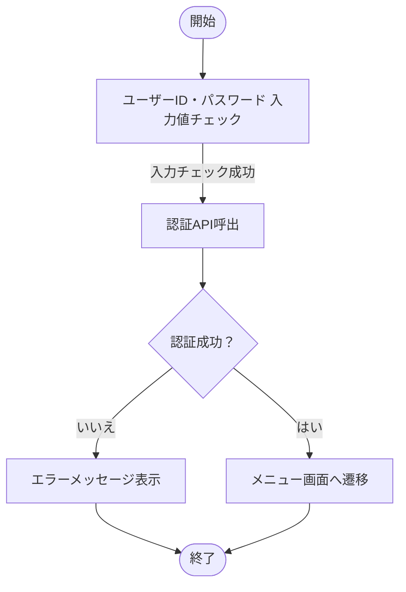

# ログイン機能 詳細設計・プログラム仕様書

## 文書情報

| 項目 | 内容 |
|---|---|
| 文書名 | ログイン機能 詳細設計・プログラム仕様書 |
| システム名 | 販売管理システム |
| 機能ID | AUTH-LOGIN-001 |
| 版数 | 1.0 |
| 作成者 | 山田 太郎 |
| 作成日 | 2026-09-28 |
| 承認者 | 佐藤 花子 |

## 改訂履歴

| 版 | 日付 | 作成者 | 内容 |
| --- | --- | --- | --- |
| 0.1 | 2026-09-20 | 山田 太郎 | 初版作成 |
| 1.0 | 2026-09-28 | 山田 太郎 | 承認版 |

## 関連機能 — 認証機能一覧

| 機能ID | 機能名 | 種別 | 担当 | 状態 | 備考 |
| --- | --- | --- | --- | --- | --- |
| AUTH-001 | ログイン | 画面 | 山田 | 完了 | ID/パスワード認証 |
| AUTH-002 | ログアウト | 処理 | 山田 | 完了 | セッション破棄 |
| AUTH-003 | パスワード変更 | 画面 | 佐藤 | 作成中 | 8文字以上 |
| AUTH-004 | アカウントロック解除 | 管理 | 鈴木 | 未着手 | 管理者のみ |

- **機能数**: 4（参照範囲の空でない項目を検算。Excel全体の再計算ではない）

## 画面・入力仕様 — ログイン

### 画面上のメッセージ

- エラー時: メッセージを画面上部に表示

### 画面項目

| No. | 項目名 | 項目ID | 種別 | 必須 | 桁数 | 初期値 | 備考 |
| --- | --- | --- | --- | --- | --- | --- | --- |
| 1 | ユーザーID | userId | text | ○ | 50 |  | 半角英数字 |
| 2 | パスワード | password | password | ○ | 128 |  | マスク表示 |
| 3 | ログイン | loginButton | button |  |  |  | 押下で認証 |
| 4 | クリア | clearButton | button |  |  |  | 入力値を消去 |

初期値の空欄は「原本記載なし」を意味する。空文字を設定する仕様とは断定しない。
必須欄の○は必須。ボタン行の必須・桁数の空欄から入力制約を推定しない。

## 処理フロー — ログイン認証処理

> 参考図：接続は原本の配置から再構成したもの。分岐ラベルは原本から転記し、明記された条件は本文を優先する。原本で明示されない接続・失敗経路は要確認。

- 補足: 認証失敗が5回連続した場合はアカウントをロックする。

## 動作仕様 — ログイン認証処理

### 1. 概要

ユーザーIDとパスワードを用いて利用者を認証し、成功時にメニュー画面へ遷移する。

### 2. 入力チェック

ユーザーIDは必須かつ50文字以内。パスワードは必須かつ128文字以内とする。

### 3. 認証処理

入力チェック成功後、認証APIを呼び出す。APIの戻り値がSUCCESSの場合は認証成功とする。

### 4. エラー処理

認証失敗時はエラーコードに対応するメッセージを画面上部に表示する。

### 5. セキュリティ

パスワードはログへ出力しない。認証失敗回数を記録し、5回連続失敗でアカウントをロックする。

### 6. メッセージ一覧

| コード | 条件 | メッセージ |
| --- | --- | --- |
| E001 | ユーザーID未入力 | ユーザーIDを入力してください。 |
| E002 | パスワード未入力 | パスワードを入力してください。 |
| E003 | 認証失敗 | ユーザーIDまたはパスワードが正しくありません。 |
| E004 | アカウントロック | アカウントがロックされています。管理者へ連絡してください。 |

## 確認事項（変換時レビュー）

以下は未記載・不明点の指摘であり、新しい要求や決定事項ではない。

- APIのエンドポイント・HTTPメソッド・タイムアウト・再試行は原本記載なし。実装前に確認する。
- 入力チェック不成功時の後続処理・遷移先は要確認。未入力のメッセージ定義だけで、桁数超過時のコードや遷移を補完しない。
- 失敗回数のリセット条件・ロック解除条件の詳細は原本記載なし。管理者向け解除機能の存在と解除条件は区別する。
- 表紙の機能ID `AUTH-LOGIN-001` と機能一覧のID（`AUTH-001`、`AUTH-002`、`AUTH-003`、`AUTH-004`）の対応は明記されていない。同一IDとして統合しない。

## 出典対応

原本: `japanese_program_spec_test.xlsx`。 共通文書種別: プログラム仕様書。

| 原本シート | 原本の機能名・範囲 | 本文の対応セクション |
|---|---|---|
| 表紙 | 文書全体 | 文書情報・改訂履歴 |
| 機能一覧 | 認証機能一覧 | 関連機能 — 認証機能一覧 |
| 画面仕様_ログイン | ログイン | 画面・入力仕様 — ログイン |
| 処理フロー_ログイン | ログイン認証処理 | 処理フロー — ログイン認証処理 |
| 詳細仕様_ログイン | ログイン認証処理 | 動作仕様 — ログイン認証処理 |
