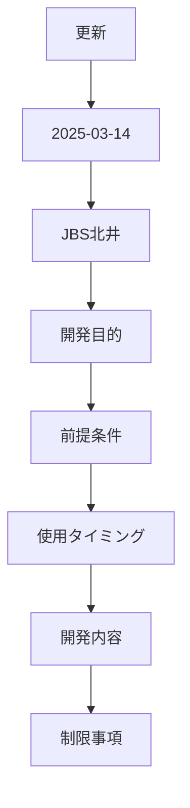
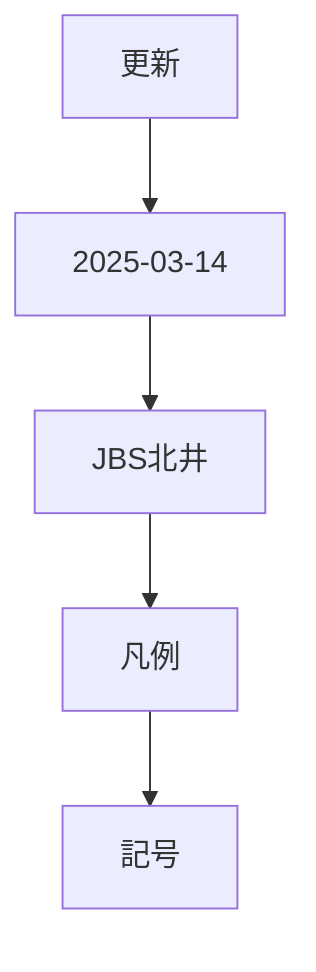

# FO-006_詳細設計書_支払方法・支払サイトマスタ画面

## 文書情報

| 項目 | 内容 |
|---|---|

## 処理フロー — 処理概要

- **システム名**: 機能分類
- **機能名称**: 日付

> 参考図：接続は原本の配置から再構成したもの。分岐ラベルは原本から転記し、明記された条件は本文を優先する。原本で明示されない接続・失敗経路は要確認。

## 関連機能 — テーブル一覧

- **システム名**: 機能分類
- **機能名称**: 日付

| 更新 | 2025-03-14 | JBS北井 |
| --- | --- | --- |

| No. | 種別 | 論理名 | 物理名 | I/O | 備考 |
| --- | --- | --- | --- | --- | --- |
| 1（原本の保存済み計算値。鮮度は未検証） | テーブル | 支払方法・支払サイト | SJ_PaymModePaymSiteTable | I/O |  |
| 2（原本の保存済み計算値。鮮度は未検証） | テーブル | 支払方法 - 仕入先 | VendPaymModeTable | I |  |

3（原本の保存済み計算値。鮮度は未検証）

4（原本の保存済み計算値。鮮度は未検証）

5（原本の保存済み計算値。鮮度は未検証）

6（原本の保存済み計算値。鮮度は未検証）

7（原本の保存済み計算値。鮮度は未検証）

8（原本の保存済み計算値。鮮度は未検証）

9（原本の保存済み計算値。鮮度は未検証）

10（原本の保存済み計算値。鮮度は未検証）

11（原本の保存済み計算値。鮮度は未検証）

12（原本の保存済み計算値。鮮度は未検証）

13（原本の保存済み計算値。鮮度は未検証）

14（原本の保存済み計算値。鮮度は未検証）

15（原本の保存済み計算値。鮮度は未検証）

16（原本の保存済み計算値。鮮度は未検証）

17（原本の保存済み計算値。鮮度は未検証）

18（原本の保存済み計算値。鮮度は未検証）

19（原本の保存済み計算値。鮮度は未検証）

20（原本の保存済み計算値。鮮度は未検証）

21（原本の保存済み計算値。鮮度は未検証）

22（原本の保存済み計算値。鮮度は未検証）

23（原本の保存済み計算値。鮮度は未検証）

24（原本の保存済み計算値。鮮度は未検証）

25（原本の保存済み計算値。鮮度は未検証）

26（原本の保存済み計算値。鮮度は未検証）

27（原本の保存済み計算値。鮮度は未検証）

28（原本の保存済み計算値。鮮度は未検証）

29（原本の保存済み計算値。鮮度は未検証）

30（原本の保存済み計算値。鮮度は未検証）

31（原本の保存済み計算値。鮮度は未検証）

32（原本の保存済み計算値。鮮度は未検証）

33（原本の保存済み計算値。鮮度は未検証）

## DFD — DFD

- **システム名**: 機能分類
- **機能名称**: 日付

| 更新 | 2025-03-14 | JBS北井 |
| --- | --- | --- |

| イベント | 機能 | DB |
| --- | --- | --- |

### 凡例

記号

※DBが複数ある場合は複数DBをまとめるために使用

## 動作仕様 — イベント説明

- **システム名**: 機能分類
- **機能名称**: 日付

| 更新 | 2025-03-14 | JBS北井 |
| --- | --- | --- |

| No. | イベント名 | 処理内容 | 種別 | メッセージ | ID |
| --- | --- | --- | --- | --- | --- |
| 1. | 画面初期表示 |  |  |  |  |

- **1-1.**: 画面初期処理

「画面レイアウト」シート通りに表示する。

| 2. | 値入力時 | 2-1. | 登録処理 |
| --- | --- | --- | --- |

入力された値を[支払方法・支払サイト]に登録する。

※詳細は、「テーブル出力仕様」シートを参照

## 画面・入力仕様 — 画面レイアウト

- **システム名**: 機能分類
- **機能名称**: 日付

| 更新 | 2025-03-14 | JBS北井 |
| --- | --- | --- |

- **パス**: 買掛金管理＞支払の設定＞支払方法・支払サイト

- **フォーム名**: SJ_PaymModePaymSiteForm

- **タブ名**: -

## 動作仕様 — 画面項目説明

- **システム名**: 機能分類
- **機能名称**: 日付

| 更新 | 2025-03-14 | JBS北井 |
| --- | --- | --- |

| コントロール | 項目名 | 種類 | 入力 | 必須 | 項目説明（概要） | 備考 |
| --- | --- | --- | --- | --- | --- | --- |
| タイトル |  | タイトル | × | × | ＜タイトル＞ |  |

・Caption：支払方法・支払サイト

アクションペイン

| 保存 | ボタン | × | × | コマンドボタン：保存 |
| --- | --- | --- | --- | --- |
| 新規 | ボタン | × | × | コマンドボタン：レコードの新規追加 |
| 削除 | ボタン | × | × | コマンドボタン：レコードの削除 |

カスタムフィルターグループ

| クィックフィルター | フィルター | ○ | × |
| --- | --- | --- | --- |

ボディ

| 支払方法 | ListBox | 〇 | 〇 | <表示内容/入力内容＞ |
| --- | --- | --- | --- | --- |

[支払方法・支払サイト.支払方法]

＜ルックアップ＞

- **テーブル:**: [支払方法 - 仕入先]

- **表示項目:**: [支払方法 - 仕入先.支払方法]

[支払方法 - 仕入先.説明(Name)]

| 請求金額 | 数値 | 〇 | × | <表示内容/入力内容＞ |
| --- | --- | --- | --- | --- |

[支払方法・支払サイト.請求金額]

※マイナス入力不可(テーブルのプロパティ設定で対応)

※支払方法に登録される請求金額は重複不可(テーブルのプロパティ設定で対応)

| 支払方法(更新後) | ListBox | 〇 | 〇 | <表示内容/入力内容＞ |
| --- | --- | --- | --- | --- |

[支払方法・支払サイト.支払方法(更新後)]

＜ルックアップ＞

- **テーブル:**: [支払方法 - 仕入先]

- **表示項目:**: [支払方法 - 仕入先.支払方法]

[支払方法 - 仕入先.説明(Name)]

| 支払サイト | 数値 | 〇 | × | <表示内容/入力内容＞ |
| --- | --- | --- | --- | --- |

[支払方法・支払サイト.支払サイト]

※マイナス入力不可(テーブルのプロパティ設定で対応)

| 支払条件 | ListBox | 〇 | 〇 | <表示内容/入力内容＞ |
| --- | --- | --- | --- | --- |

[支払方法・支払サイト.支払条件]

＜ルックアップ＞

- **テーブル:**: [支払条件 - 支払条件]

- **表示項目:**: [支払条件.支払条件]

[支払条件.説明]

## 関連機能 — テーブル出力仕様

- **システム名**: 機能分類
- **機能名称**: 日付

| 更新 | 2025-03-14 | JBS北井 |
| --- | --- | --- |

- **テーブル名**: SJ_PaymModePaymSiteTable

- **ラベル**: 支払方法・支払サイト

- **拡張名**: -

| No. | 論理名 | 物理名 | 説明 | 備考 |
| --- | --- | --- | --- | --- |
| 1（原本の保存済み計算値。鮮度は未検証） | 支払方法 | PayｍMode | 入力された[支払方法・支払サイト更新.支払方法]を設定 |  |
| 2（原本の保存済み計算値。鮮度は未検証） | 請求金額 | BillingAmount | 入力された[支払方法・支払サイト更新.請求金額]を設定 |  |
| 3（原本の保存済み計算値。鮮度は未検証） | 支払方法(更新後) | UpdatedPaymMode | 入力された[支払方法・支払サイト更新.支払方法(更新後)]を設定 |  |
| 4（原本の保存済み計算値。鮮度は未検証） | 支払サイト | PaymSite | 入力された[支払方法・支払サイト更新.支払サイト]を設定 |  |
| 5（原本の保存済み計算値。鮮度は未検証） | 支払条件 | PaymTermId | 入力された[支払方法・支払サイト更新.支払条件]を設定 |  |

6（原本の保存済み計算値。鮮度は未検証）

7（原本の保存済み計算値。鮮度は未検証）

8（原本の保存済み計算値。鮮度は未検証）

9（原本の保存済み計算値。鮮度は未検証）

10（原本の保存済み計算値。鮮度は未検証）

11（原本の保存済み計算値。鮮度は未検証）

12（原本の保存済み計算値。鮮度は未検証）

13（原本の保存済み計算値。鮮度は未検証）

14（原本の保存済み計算値。鮮度は未検証）

15（原本の保存済み計算値。鮮度は未検証）

16（原本の保存済み計算値。鮮度は未検証）

17（原本の保存済み計算値。鮮度は未検証）

18（原本の保存済み計算値。鮮度は未検証）

19（原本の保存済み計算値。鮮度は未検証）

20（原本の保存済み計算値。鮮度は未検証）

21（原本の保存済み計算値。鮮度は未検証）

22（原本の保存済み計算値。鮮度は未検証）

23（原本の保存済み計算値。鮮度は未検証）

24（原本の保存済み計算値。鮮度は未検証）

25（原本の保存済み計算値。鮮度は未検証）

26（原本の保存済み計算値。鮮度は未検証）

27（原本の保存済み計算値。鮮度は未検証）

28（原本の保存済み計算値。鮮度は未検証）

29（原本の保存済み計算値。鮮度は未検証）

30（原本の保存済み計算値。鮮度は未検証）

31（原本の保存済み計算値。鮮度は未検証）

32（原本の保存済み計算値。鮮度は未検証）

## 動作仕様 — 補足説明 

- **システム名**: 機能分類
- **機能名称**: 日付

| 更新 | 2025-03-14 | JBS北井 |
| --- | --- | --- |

### 補足

●同一支払方法と請求金額のチェック処理について

| 支払方法 | 請求金額 | 支払方法(変更後) | 支払サイト | 支払条件 |
| --- | --- | --- | --- | --- |
| TU | 0 | T | 0 | PTXX |
| TU | 500000 | W | 95 | PTXX |
| TU | 500000 |  | 60 | PTXX |
| TQ | 0 | T | 0 | PTXX |
| TQ | 500000 | W | 60 | PTXX |
| 2-1 | 0 | 2-1 | 0 | PTXX |

●【テーブル定義書】SJ_PaymModePaymSiteTable.xlsx

## 動作仕様 — 補足説明(機能関連図) 

- **システム名**: 機能分類
- **機能名称**: 日付

| 更新 | 2025-03-14 | JBS北井 |
| --- | --- | --- |

### 補足

＜機能関連図＞

## 処理フロー — レビュー指摘事項

- **システム名**: 機能分類
- **機能名称**: 日付

> 参考図：接続は原本の配置から再構成したもの。分岐ラベルは原本から転記し、明記された条件は本文を優先する。原本で明示されない接続・失敗経路は要確認。

```mermaid
flowchart TD
    N1["更新"]
    N2["2025-03-14"]
    N3["JBS北井"]
    N4["No."]
    N5["レビュー事項"]
    N6["対応内容"]
    N7["指摘日"]
    N8["指摘者"]
    N9["対応日"]
    N10["対応者"]
    N11{"確認日"}
    N12{"確認者"}
    N13["1"]
    N14["支払方法と支払方法(更新後)が同じ値が入らないよう、チェック処理を追加。"]
    N15["処理概要：前提条件の4追加 画面項目説明：概要を追記。"]
    N16["2024-08-13"]
    N17["JBS"]
    N18["2024-08-13"]
    N19["JBS井田"]
    N20["2024-08-19"]
    N21["サンスター藤田"]
    N22["2"]
    N23{"支払基準日を「20日」で連携される方針で、本機能に支払条件を追加し、以下の場合で使用する。 ・FO-008（支払方法・支払サイト更新バッチ）で期日振込の期日更新 ・FO-010（支払手形仕訳帳の振出）で電子記録債務の期日更新"}
    N24["以下シートに支払条件を追加しました。 ・画面レイアウト ・画面項目説明 ・テーブル出力仕様"]
    N25["2024-08-27"]
    N26["JBS 秋信"]
    N27["2024-08-28"]
    N28["JBS井田"]
    N29["2024-08-28"]
    N30["サンスター藤田"]
    N31["3"]
    N32["①支払基準日を規定払いについては、末締翌20日を固定で設定する方針で決定した。それに伴い、支払基準日を使用する機能の修正を行う。 ②支払方法マスタのコード値を文字列から英数字にする方針に決定した。それに伴い、支払方法を使用する機能の修正を行う。 ※2024/09/17の債務チームの定例会で説明済"]
    N33["2024-09-18"]
    N34["JBS 秋信"]
    N35["2024-09-26"]
    N36["JBS 秋信"]
    N37["2024-10-03"]
    N38["サンスター藤田"]
    N39["4"]
    N40["5"]
    N41["6"]
    N42["7"]
    N43["8"]
    N44["9"]
    N45["10"]
    N46["11"]
    N47["12"]
    N48["13"]
    N49["14"]
    N50["15"]
    N51["16"]
    N52["17"]
    N53["18"]
    N54["19"]
    N55["20"]
    N56["21"]
    N57["22"]
    N58["23"]
    N59["24"]
    N60["25"]
    N61["26"]
    N62["27"]
    N63["28"]
    N64["29"]
    N65["30"]
    N66["31"]
    N67["32"]
    N68["33"]
    N69["34"]
    N70["35"]
    N1 --> N2
    N2 --> N3
    N3 --> N4
    N4 --> N5
    N5 --> N6
    N6 --> N7
    N7 --> N8
    N8 --> N9
    N9 --> N10
    N10 --> N11
    N11 --> N12
    N12 -->|原本ラベル要確認| N13
    N12 -->|原本ラベル要確認| N14
    N13 --> N15
    N14 --> N15
    N15 --> N16
    N16 --> N17
    N17 --> N18
    N18 --> N19
    N19 --> N20
    N20 --> N21
    N21 --> N22
    N22 --> N23
    N23 -->|原本ラベル要確認| N24
    N23 -->|原本ラベル要確認| N25
    N24 --> N26
    N25 --> N26
    N26 --> N27
    N27 --> N28
    N28 --> N29
    N29 --> N30
    N30 --> N31
    N31 --> N32
    N32 --> N33
    N33 --> N34
    N34 --> N35
    N35 --> N36
    N36 --> N37
    N37 --> N38
    N38 --> N39
    N39 --> N40
    N40 --> N41
    N41 --> N42
    N42 --> N43
    N43 --> N44
    N44 --> N45
    N45 --> N46
    N46 --> N47
    N47 --> N48
    N48 --> N49
    N49 --> N50
    N50 --> N51
    N51 --> N52
    N52 --> N53
    N53 --> N54
    N54 --> N55
    N55 --> N56
    N56 --> N57
    N57 --> N58
    N58 --> N59
    N59 --> N60
    N60 --> N61
    N61 --> N62
    N62 --> N63
    N63 --> N64
    N64 --> N65
    N65 --> N66
    N66 --> N67
    N67 --> N68
    N68 --> N69
    N69 --> N70
```

## 関連機能 — オブジェクト一覧

- **システム名**: 機能分類
- **機能名称**: 日付

| 更新 | 2025-03-14 | JBS北井 |
| --- | --- | --- |

| No. | オブジェクト名 | 属性 | 概要 | 備考 |
| --- | --- | --- | --- | --- |
| 1（原本の保存済み計算値。鮮度は未検証） | SJ_PaymModePaymSiteTable | Menu Items(Display) | 支払方法・支払サイトマスタ画面起動用のメニューアイテム |  |
| 2（原本の保存済み計算値。鮮度は未検証） | SJ_PaymModePaymSiteTable | Forms | 支払方法・支払サイトマスタ画面 |  |
| 3（原本の保存済み計算値。鮮度は未検証） | AccountsPayable.SJ_Extension | Menus | 買掛金管理モジュール |  |

4（原本の保存済み計算値。鮮度は未検証）

5（原本の保存済み計算値。鮮度は未検証）

6（原本の保存済み計算値。鮮度は未検証）

7（原本の保存済み計算値。鮮度は未検証）

8（原本の保存済み計算値。鮮度は未検証）

9（原本の保存済み計算値。鮮度は未検証）

10（原本の保存済み計算値。鮮度は未検証）

11（原本の保存済み計算値。鮮度は未検証）

12（原本の保存済み計算値。鮮度は未検証）

13（原本の保存済み計算値。鮮度は未検証）

14（原本の保存済み計算値。鮮度は未検証）

15（原本の保存済み計算値。鮮度は未検証）

16（原本の保存済み計算値。鮮度は未検証）

17（原本の保存済み計算値。鮮度は未検証）

18（原本の保存済み計算値。鮮度は未検証）

19（原本の保存済み計算値。鮮度は未検証）

20（原本の保存済み計算値。鮮度は未検証）

21（原本の保存済み計算値。鮮度は未検証）

22（原本の保存済み計算値。鮮度は未検証）

23（原本の保存済み計算値。鮮度は未検証）

24（原本の保存済み計算値。鮮度は未検証）

25（原本の保存済み計算値。鮮度は未検証）

26（原本の保存済み計算値。鮮度は未検証）

27（原本の保存済み計算値。鮮度は未検証）

28（原本の保存済み計算値。鮮度は未検証）

29（原本の保存済み計算値。鮮度は未検証）

30（原本の保存済み計算値。鮮度は未検証）

31（原本の保存済み計算値。鮮度は未検証）

32（原本の保存済み計算値。鮮度は未検証）

33（原本の保存済み計算値。鮮度は未検証）

## 処理フロー — プログラムフロー図

- **システム名**: 機能分類
- **機能名称**: 日付

> 参考図：接続は原本の配置から再構成したもの。分岐ラベルは原本から転記し、明記された条件は本文を優先する。原本で明示されない接続・失敗経路は要確認。

## 確認事項（変換時レビュー）

以下は未記載・不明点の指摘であり、新しい要求や決定事項ではない。

- 画像・グラフ内の情報はこのテキスト変換で検証していない。原本の目視レビューが必要。

## 出典対応

原本: `FO-006_詳細設計書_支払方法・支払サイトマスタ画面.xlsx`。

| 原本シート | 原本の機能名・範囲 | 本文の対応セクション |
|---|---|---|
| 表紙 | 文書全体 | 文書情報・改訂履歴 |
| 処理概要 | 処理概要 | 処理フロー — 処理概要 |
| テーブル一覧 | テーブル一覧 | 関連機能 — テーブル一覧 |
| DFD | DFD | DFD — DFD |
| イベント説明 | イベント説明 | 動作仕様 — イベント説明 |
| 画面レイアウト | 画面レイアウト | 画面・入力仕様 — 画面レイアウト |
| 画面項目説明 | 画面項目説明 | 動作仕様 — 画面項目説明 |
| テーブル出力仕様 | テーブル出力仕様 | 関連機能 — テーブル出力仕様 |
| 補足説明  | 補足説明  | 動作仕様 — 補足説明  |
| 補足説明(機能関連図)  | 補足説明(機能関連図)  | 動作仕様 — 補足説明(機能関連図)  |
| レビュー指摘事項 | レビュー指摘事項 | 処理フロー — レビュー指摘事項 |
| オブジェクト一覧 | オブジェクト一覧 | 関連機能 — オブジェクト一覧 |
| プログラムフロー図 | プログラムフロー図 | 処理フロー — プログラムフロー図 |
